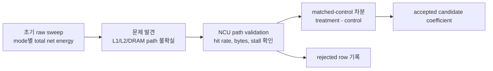
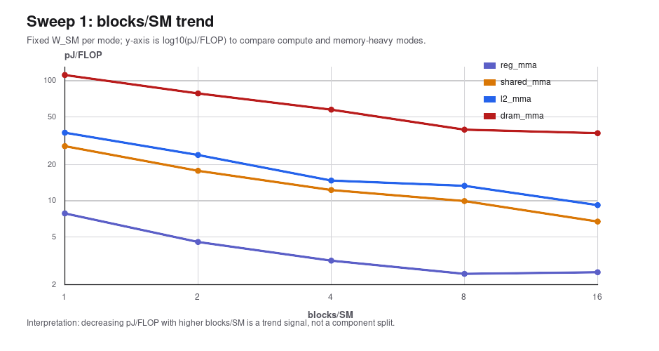
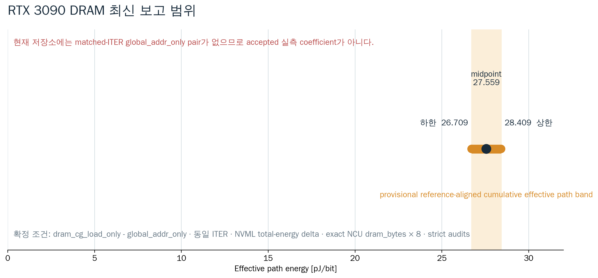
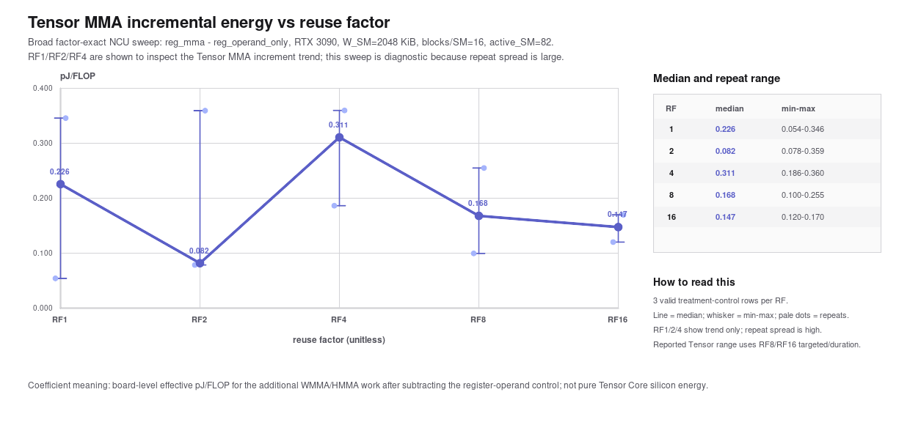
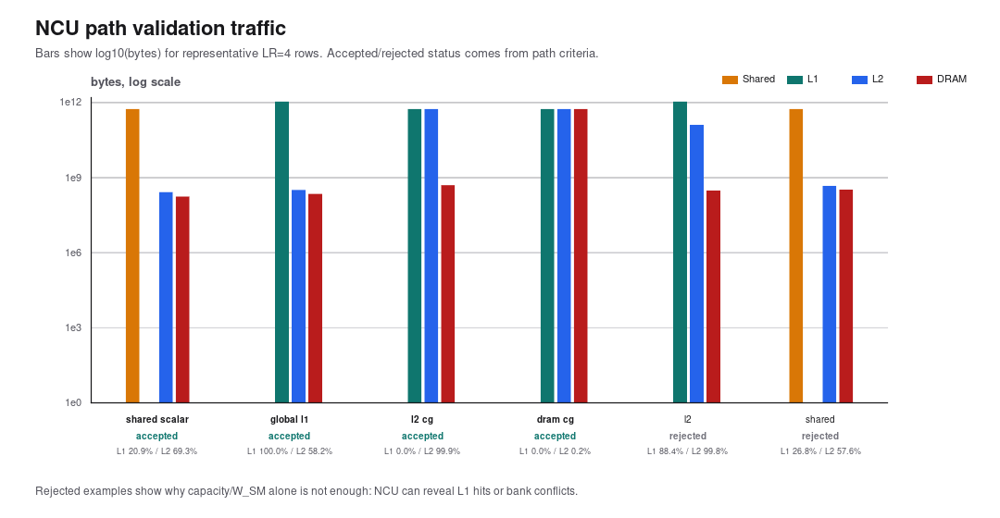

# Component Energy 실험 방법 비교와 해석 가이드

작성일: 2026-07-06
현행 protocol 정합성 갱신: 2026-07-12

이 문서는 RTX 3090 component-energy 실험에서 사용한 방법을 초보자도 따라갈 수 있도록 비교 정리한 별도 설명 문서다. 핵심은 결과 요약이 아니라, **각 실험 방법이 무엇을 의미하고 왜 그런 sweep을 했는지**를 설명하는 것이다.

참조 문서와 결과:

| 구분 | 파일 |
|---|---|
| 최종 실험 계획 | `docs/methodology/component_energy_final_experiment_plan_ko.md` |
| 구현 동작 설명 | `docs/methodology/howitworks.md` |
| NCU 검증과 pJ 계산 | `docs/methodology/ncu_validation_energy_calculation_ko.md` |
| 자가비판 | `docs/audits/component_energy_self_critique_ko.md` |
| RTX 3090 과거 결과 | `results/summary/rtx3090_finalplan_component_energy_report_20260705_ko.md` |
| 과거 matched-control 결과 | `results/summary/rtx3090_finalplan_matched_control_report_20260705.md` |
| 과거 NCU acceptance 결과 | `results/summary/rtx3090_finalplan_ncu_lr4_acceptance_tensor200m_20260705.md` |

위 2026-07-05/08 RTX 3090 산출물은 실험 발전 과정을 설명하는 **과거
protocol 결과**다. 현행 protocol은 Global L1/L2/DRAM control을
`global_addr_only`로 바꾸고, Tensor/L2 CG/DRAM CG 동일 ITER 및 treatment/control 동일 좌표
NCU acceptance를 요구한다. 따라서 과거 `clocked_empty` 기반 memory coefficient를
새 cross-platform strict final 값으로 재사용하면 안 된다.

## 1. 전체 목적

이 실험의 목적은 GPU 전체 에너지 측정값에서 다음 경로의 에너지 성분을 최대한 분리해서 추정하는 것이다.

| 목표 성분 | 목표 단위 | 이 실험에서 가능한 해석 |
|---|---:|---|
| Tensor MMA incremental | pJ/FLOP | no-MMA register/control 대비 FP16 WMMA 추가 에너지 |
| Shared/L1 path | pJ/bit | shared 또는 L1 hit 중심 load path의 effective traffic coefficient |
| L2 path | pJ/bit | L1을 배제하고 L2 hit가 지배적인 path의 effective traffic coefficient |
| DRAM path | pJ/bit | RTX 3090에서는 GDDR6X streaming sanity check |
| Register | pJ/reg-op 또는 진단값 | 현재 구현에서는 순수 register file energy가 아니라 register/control proxy |

중요한 점은 이 값들이 GPU 회로 내부의 순수 에너지값이 아니라는 것이다. NVML은 GPU 보드 또는 디바이스 전체 에너지를 측정한다. 그래서 Tensor Core, register file, scheduler, warp issue, LSU, cache controller, memory controller, stall, clock 변화가 같이 섞인다.

따라서 최종 보고서에서는 다음 표현을 사용해야 한다.

```text
NCU로 path가 검증된 board-level effective microbenchmark coefficient
```

피해야 할 표현은 다음이다.

```text
순수 Tensor Core energy
순수 L1 SRAM bitcell energy
순수 L2 SRAM bitcell energy
순수 DRAM device energy
```

## 2. 실험 방법 변화: 초기 Raw Sweep vs 최종 Component 실험

초기 실험은 “어떤 mode가 얼마나 큰 에너지를 쓰는지”를 넓게 보는 탐색이었다. 최종 실험은 “NCU로 실제 path를 확인하고, control과 차분해서 coefficient를 계산하는 방식”으로 바뀌었다.

| 항목 | 초기 raw sweep | 최종 component 실험 |
|---|---|---|
| 주 목적 | 실행 가능 범위와 대략적 추세 확인 | Tensor/L1/shared/L2/DRAM path별 effective coefficient 후보 추정 |
| 주요 mode | `reg_mma`, `shared_mma`, `l2_mma`, `dram_mma`, `store_path` | `reg_mma`, `reg_operand_only`, `shared_scalar_load_only`, `global_l1_load_only`, `l2_cg_load_only`, `dram_cg_load_only`, `clocked_empty` |
| 계산 방식 | mode별 `net_E_J / FLOP` 중심 | treatment-control 차분 후 FLOP 또는 NCU actual bytes로 나눔 |
| NCU 사용 | 초기에는 권한 문제로 불완전 | path acceptance 필터로 사용 |
| 결과 해석 | 추세 후보 | accepted candidate 또는 rejected |
| 가장 큰 한계 | raw `*_mma` 값만으로 component 분리 불가 | 여전히 board-level effective coefficient이며 pure circuit energy는 아님 |

핵심 변화는 다음이다.



## 3. Parameter Sweep 내용

### 3.1 초기 전체 sweep

초기 sweep은 실험 공간을 넓게 훑는 목적이었다.

| Sweep | 조절한 파라미터 | 요청/설정 범위 | 실제 처리 | 측정값 | 해석 |
|---|---|---|---|---|---|
| Sweep 1 | `blocks_per_SM` | `1,2,4,8,16,32` blocks/SM | RTX 3090에서는 `1,2,4,8,16`만 실행, `32`는 resident block 한계로 invalid | pJ/FLOP, net_E_J, elapsed_s | resident block 수가 에너지 효율에 미치는 영향 탐색 |
| Sweep 2 | `W_SM` | `1 KiB`부터 `128 MiB`까지 2배 증가 | shared/L2/DRAM 가능 조건만 실행 | pJ/FLOP, 실행 가능 여부, regime | working set 크기에 따라 shared/L2/DRAM 후보 영역 탐색 |

초기 전체 sweep 조건:

| 항목 | 값 |
|---|---:|
| GPU | RTX 3090, 82 active SM |
| 측정 시간 | 1 s |
| repeats | 1 |
| mode | `idle`, `empty`, `reg_mma`, `shared_mma`, `l2_mma`, `dram_mma`, `store_path` |
| energy source | NVML total-energy counter |

초기 fixed-W blocks/SM sweep 조건:

| mode | 고정 W_SM | blocks/SM sweep | seconds | repeats | 당시 의도 | 현재 해석 |
|---|---:|---|---:|---:|---|---|
| `reg_mma` | 32 KiB | `1,2,4,8,16` | 약 10 s | 5 | Tensor/register baseline | `W_SM=32 KiB`는 register working set이 아니라 표 정렬용 좌표 |
| `shared_mma` | 64 KiB | `1,2,4,8,16` | 약 10 s | 5 | shared-resident MMA | shared load, barrier, MMA, stall이 섞인 raw mode |
| `l2_mma` | 64 KiB | `1,2,4,8,16` | 약 10 s | 5 | L2 candidate MMA | NCU 없이 L2 hit라고 단정 불가 |
| `dram_mma` | 8192 KiB | `1,2,4,8,16` | 약 10 s | 5 | DRAM-dominant MMA | L2를 초과하는 streaming 후보 |

초기 sweep에서 얻은 중요한 교훈:

| 관찰 | 의미 | 주의 |
|---|---|---|
| blocks/SM이 증가하면 pJ/FLOP가 대체로 감소 | 더 많은 resident block이 고정 오버헤드와 stall을 일부 amortize할 수 있음 | occupancy, scheduler pressure, memory pressure가 같이 변하므로 단일 원인으로 해석 금지 |
| W_SM이 커질수록 shared/L2/DRAM regime이 갈림 | working set 크기로 memory hierarchy 후보를 만들 수 있음 | 후보일 뿐이며 NCU hit/access 검증 전에는 확정 불가 |
| raw `dram_mma`가 훨씬 큼 | DRAM streaming 후보가 비싸다는 방향성 확인 | raw pJ/FLOP만으로 DRAM pJ/bit를 계산하면 안 됨 |



## 4. 실험에서 선택된 조건과 현행 변경점

아래 첫 표는 2026-07-05 RTX 3090 결과를 만든 당시 조건이다. raw `*_mma` 값을
그대로 쓰지 않고 treatment-control을 사용한 점은 유효하지만, global-memory
control은 현행 기준보다 덜 matched했다.

| Component | treatment | control | 선택 W_SM | blocks/SM | active_SM | sweep factor | seconds | repeats | denominator |
|---|---|---|---:|---:|---:|---|---:|---:|---|
| Tensor MMA incremental | `reg_mma` | `reg_operand_only` | 2048 KiB | 16 | 82 | `reuse_factor=1,2,4,8,16` | 5 s | 3 | FLOP |
| Shared scalar path | `shared_scalar_load_only` | `clocked_empty` | 64 KiB | 16 | 82 | `load_repeat=1,2,4,8,16` | 5 s | 3 | NCU shared bytes |
| Global L1 hit path | `global_l1_load_only` | `clocked_empty` | 16, 64 KiB | 16 | 82 | `load_repeat=1,2,4,8,16` | 5 s | 3 | NCU L1 bytes |
| L2 CG hit path | `l2_cg_load_only` | `clocked_empty` | 64 KiB | 16 | 82 | `load_repeat=1,2,4,8,16` | 5 s | 3 | NCU L2 bytes |
| DRAM CG streaming path | `dram_cg_load_only` | `clocked_empty` | 8192 KiB | 16 | 82 | `load_repeat=1,4,16` | 5 s | 3 | NCU DRAM bytes |

현행 final protocol의 pair와 추가 gate는 다음과 같다.

| Component | 현행 treatment | 현행 control | energy 차분 | NCU acceptance |
|---|---|---|---|---|
| Tensor MMA incremental | `reg_mma` | `reg_operand_only` | RF별 pair-locked 동일 ITER의 net energy 직접 차분 | treatment/control 모두 동일 좌표 accepted |
| Shared scalar path | `shared_scalar_load_only` | `clocked_empty` | elapsed-aware control-power 차분 | shared treatment accepted |
| Global L1 hit path | `global_l1_load_only` | `global_addr_only` | elapsed-aware control-power 차분 | treatment/control 모두 동일 좌표 accepted |
| L2 CG hit path | `l2_cg_load_only` | `global_addr_only` | elapsed-aware control-power 차분 | treatment/control 모두 동일 좌표 accepted |
| DRAM CG streaming path | `dram_cg_load_only` | `global_addr_only` | treatment/control-floor dual calibration 후 동일 ITER net energy 직접 차분 | treatment/control 모두 동일 좌표 accepted |

선택 이유:

| 선택 | 이유 |
|---|---|
| `reg_mma - reg_operand_only` | 같은 register-fragment 반복 구조에서 MMA만 추가된 차이를 보기 위함 |
| `shared_scalar_load_only` | 기존 `shared_load_only`는 bank conflict가 높아 clean shared path로 쓰기 어려웠음 |
| `global_l1_load_only` W=16 KiB | NCU denominator가 있고 L1 hit path가 확인된 조건 |
| `l2_cg_load_only` | RTX 3090에서 일반 `l2_load_only`는 L1 hit가 높아 L2-only가 아니었음 |
| `dram_cg_load_only` | 핵심 목표라기보다 L2 < DRAM 계층 순서 sanity check |

당시 채택/제외와 현행 재판정:

| 항목 | 판정 | 이유 |
|---|---|---|
| `reg_mma`, `reg_operand_only` | 조건부 accepted | HMMA/spill 여부는 확인됐으나 tensor/register memory threshold 완화가 있어 pure Tensor claim 금지 |
| `shared_scalar_load_only` | accepted | shared bytes가 크고 bank conflict가 낮음 |
| `global_l1_load_only`, W=16 KiB | 당시 accepted, 현행 provisional | treatment path는 명확하지만 과거 energy pair가 `clocked_empty` control임 |
| `global_l1_load_only`, W=64 KiB | rejected | NCU denominator가 없고 일부 negative coefficient |
| `l2_load_only` | rejected | NCU에서 L1 hit가 높아 L2-only가 아님 |
| `l2_cg_load_only` | 당시 accepted, 현행 provisional | treatment path는 명확하지만 과거 energy pair가 `clocked_empty` control임 |
| `dram_cg_load_only` | 과거 sanity superseded, 현행 재실행 필요 | 과거 `clocked_empty` 차분은 동일 ITER `global_addr_only` 정책이 아니므로 폐기한다. 최신 26.709-28.409 pJ/bit는 provisional cumulative-path band다. |
| `shared_load_only` | rejected | shared bank conflict가 높음 |
| register direct pJ/update | rejected | scalar ALU, scheduler, active power가 섞여 pure register file energy가 아님 |

## 5. Effective Microbenchmark Coefficient의 의미

계산은 다음처럼 한다.

```text
delta_E_J = E_treatment_J - (E_control_J / t_control_s) * t_treatment_s
coefficient = delta_E_J / denominator
```

분자는 “control 대비 추가 에너지”다. 분모는 component에 따라 다르다.

| Component | 분모 | 단위 | 의미 |
|---|---|---:|---|
| Tensor | logical FLOP | pJ/FLOP | no-MMA control 대비 WMMA 추가 에너지 |
| Shared | NCU shared bytes 또는 bits | pJ/bit | shared instruction path traffic당 추가 에너지 |
| L1 | NCU L1 bytes 또는 bits | pJ/bit | L1 hit path traffic당 추가 에너지 |
| L2 | NCU L2 bytes 또는 bits | pJ/bit | L2 hit path traffic당 추가 에너지 |
| DRAM | NCU DRAM bytes 또는 bits | pJ/bit | streaming path sanity coefficient |

이 값이 의미하는 것:

```text
특정 microbenchmark에서
의도한 path가 NCU로 확인되었고,
그 path를 강조한 treatment가 control보다 더 쓴 에너지를
실제 traffic 또는 FLOP로 나눈 값
```

이 값이 의미하지 않는 것:

```text
GPU 내부 회로의 순수 SRAM bitcell energy
DRAM device 단독 access energy
Tensor Core transistor-level energy
register file access energy
```

장단점:

| 구분 | 장점 | 단점 |
|---|---|---|
| 실제 GPU/NVML 기반 | simulator가 아니라 실제 하드웨어에서 측정 | component별 전력계가 아니므로 다른 비용이 섞임 |
| NCU path 검증 | L1/L2/DRAM/shared traffic을 확인할 수 있음 | 모든 energy row를 1:1로 NCU profiling하지 않으면 대표값 가정이 남음 |
| matched-control 차분 | 공통 오버헤드를 일부 제거 | treatment/control instruction mix가 다르면 음수 또는 큰 분산 발생 |
| pJ/bit, pJ/FLOP | 다른 경로와 비교하기 쉬움 | denominator 정의가 다르면 문헌값과 직접 비교하면 안 됨 |

오해하기 쉬운 부분:

| 오해 | 왜 틀렸나 | 올바른 표현 |
|---|---|---|
| `L1 = 0.150 pJ/bit`는 L1 SRAM bitcell energy다 | NVML board-level energy에서 나온 path coefficient다 | `global L1 hit path effective coefficient` |
| `DRAM = 26.709-28.409 pJ/bit`는 accepted GDDR6X device energy다 | 현재는 실측 raw pair가 없는 provisional cumulative-path 범위이며 controller/interconnect/stall이 포함될 수 있다 | `DRAM cumulative effective path provisional band` |
| `reg_mma W_SM=32 KiB`는 register 32 KiB를 쓴 것이다 | register footprint는 ptxas register/thread와 blocks/SM로 결정된다 | `W_SM은 register mode에서 sweep 좌표` |
| `shared_mma - reg_mma`를 하면 shared energy가 남는다 | barrier, load instruction, stall pattern, instruction mix가 함께 바뀐다 | `matched load-only control을 사용해야 함` |
| NCU 없이 W_SM만 맞추면 L2 실험이다 | RTX 3090에서 `l2_load_only`는 실제 L1 hit가 높았다 | `NCU hit/access로 path accepted된 row만 사용` |

## 6. 최종 결과 시각화

2026-07-08 historical coefficient 그림은 현행 control/NCU gate를 만족하지 않고 옛
DRAM 숫자를 포함하므로 active 문서에서 제거했다. 과거 해석은 archive 문서에서만
확인한다. 현재 DRAM 보고에는 아래 그림을 사용한다.



Tensor는 RF=8/16 targeted와 duration-scaling 결과를 현재 보고 anchor로 사용하지만,
RF=1/2/4까지 포함한 broad sweep의 증분 추세도 별도 그림으로 남긴다. 이 그림은
Tensor MMA reuse factor에 따른 board-level 차분 계수가 안정적으로 단조 변화한다고
단정하기 위한 것이 아니라, RF 선택이 결과에 영향을 준다는 것을 확인하는 diagnostic이다.



이 그림은 x축을 `reuse factor`, y축을 `reg_mma - reg_operand_only`의 `pJ/FLOP`
coefficient로 둔다. 진한 선은 RF별 median, 세로선은 min-max 반복 범위, 연한 점은
개별 반복 row다. RF1/RF2/RF4까지 포함했을 때 단조적인 Tensor energy scaling이
보이지 않고 반복 범위가 크므로, 이 그래프는 “RF 선택이 Tensor effective coefficient에
영향을 준다”는 증거로 읽어야 한다. 반대로 “RF1 또는 RF4 median이 곧 Tensor Core
순수 회로 에너지다”라고 읽으면 안 된다. 현재 보고 anchor는 반복 안정도가 더 좋은
RF8/RF16 targeted 및 duration-scaling 결과다.

과거 protocol 후보값:

| Component/path | median | unit | bootstrap median 95% CI | confidence | 상태 |
|---|---:|---|---:|---|---|
| Tensor MMA incremental, RF=8/16 targeted + fixed-ITER/RF8/RF16 duration auxiliary | RF16 0.077, RF8 0.143 | pJ/FLOP | RF-dependent range | medium-high | accepted candidates + auxiliary, RF/policy dependence is real |
| Shared scalar path, W_SM=64 KiB | 0.152 | pJ/bit | 0.114-0.204 | medium | targeted rerun primary, accepted with caution |
| Shared scalar path LR4 paired 30초 auxiliary | 0.236 | pJ/bit | 0.212-0.297 | medium | clean LR4 paired high-side auxiliary |
| Shared scalar path LR8 paired 30초 combined auxiliary | 0.177 | pJ/bit | 0.150-0.181 | medium-high | clean LR8 paired combined middle auxiliary, close to primary |
| Shared scalar path LR4 30초 auxiliary | 0.216 | pJ/bit | 0.190-0.235 | medium-high | LR4 single-condition auxiliary, shows method sensitivity |
| Shared scalar path LR16 paired 30초 combined auxiliary | 0.064 | pJ/bit | 0.0457-0.104 | medium | LR16 paired combined auxiliary, lower-side/method sensitivity |
| Shared scalar path LR16 paired 60초 auxiliary | 0.077 | pJ/bit | 0.0420-0.106 | low | LR16 lower-side persists at 60초, but accepted_low_stability only |
| Shared scalar path LR4/LR8/LR16 interleaved 30초 auxiliary | 0.145 | pJ/bit | 0.0769-0.188 | medium | aggregate supports primary; factor split LR4 0.199, LR8 0.145, LR16 0.0618 pJ/bit |
| Shared scalar path LR4/LR8/LR16 fixed-ITER auxiliary | 0.140 | pJ/bit | 0.0937-0.193 | medium | treatment ITER=17,000,000, bytes 1x/2x/4x, LR16 weak row 1개로 caution 유지 |
| Shared scalar path LR16 fixed-ITER focus auxiliary | 0.117 | pJ/bit | 0.109-0.122 | medium | LR16 focus rerun, 6/6 valid, prior weak row not persistent |
| Shared scalar path LR4/LR8 fixed-ITER focus auxiliary | 0.149 | pJ/bit | 0.124-0.179 | medium-high | LR4/LR8 focus rerun, 10/10 valid, primary 0.152 pJ/bit를 직접 지지 |
| Global L1 hit path, W_SM=16 KiB | 0.148 | pJ/bit | 0.143-0.170 | medium-high | C-T-C paired 30초 combined primary, accepted |
| Global L1 hit path duration-scaling auxiliary | 0.156 | pJ/bit | 0.130-0.185 | medium-high | slope/duration support, invalid detail 1개 |
| Global L1 hit path 60초 auxiliary | 0.119 | pJ/bit | 0.109-0.122 | medium | power-state reject 1개를 filtered 분석에서 pairing 전 제외, drift sensitivity evidence, not replacement |
| Global L1 hit path LR8 paired 30초 auxiliary | 0.109 | pJ/bit | 0.0879-0.129 | medium | C-T-C paired LR8, 6/6 valid, lower-side method-sensitivity evidence |
| L2 CG hit path, W_SM=64 KiB | 1.017 | pJ/bit | 0.947-1.071 | medium-high | C-T-C paired LR4/LR8 30초 combined primary, reliability accepted |
| L2 CG hit path targeted mixed-LR auxiliary | 0.978 | pJ/bit | 0.935-1.139 | medium-high | targeted rerun auxiliary, reliability accepted, temperature caution metadata |
| L2 CG hit path LR4 paired 30초 auxiliary | 1.027 | pJ/bit | 0.984-1.129 | medium | C-T-C paired LR4 auxiliary, supports primary range |
| L2 CG hit path LR8 paired 30초 auxiliary | 0.960 | pJ/bit | 0.898-1.100 | medium | C-T-C paired LR8 auxiliary, supports primary range |
| L2 CG hit path LR4 30초 non-paired auxiliary | 1.298 | pJ/bit | 1.123-1.338 | medium-high | drift/order-sensitive high-side auxiliary |
| DRAM cumulative effective path, W_SM=8192 KiB | 26.709-28.409 | pJ/bit | 아직 측정 CI 없음 | provisional | matched-ITER `global_addr_only` pair로 검증 전 |

이 그림의 올바른 결론:

| 결론 가능 | 결론 불가 |
|---|---|
| 최종 accepted path에서는 L1/shared < L2 < DRAM 순서가 논리적으로 나왔다. | RTX 3090의 물리 L1 SRAM bitcell이 0.150 pJ/bit라고 단정할 수 없다. |
| L2 CG path는 L1보다 큰 effective coefficient를 보인다. | L2 SRAM array만의 에너지라고 주장할 수 없다. |
| Shared LR4/LR8/LR16 paired auxiliary가 0.236/0.177/0.064 pJ/bit로 갈라졌고, LR16 60초도 0.077 pJ/bit로 낮은 쪽을 재현했다. Interleaved 30초 run도 aggregate 0.145 pJ/bit와 LR4/LR8/LR16 0.199/0.145/0.0618 pJ/bit split을 보였다. LR4/LR8 fixed-ITER focus는 aggregate 0.149 pJ/bit로 primary를 지지하지만 LR4 0.179/LR8 0.142 split은 남았다. | Shared scalar path를 하나의 순수 shared-memory 회로 상수로 주장할 수 없다. LR16은 lower-bound/method-sensitivity evidence다. |
| L2 LR4/LR8 paired 30초 combined primary가 1.017 pJ/bit이고, targeted 0.978 pJ/bit 및 LR4/LR8 auxiliary와 정합했다. | 기존 non-paired L2 LR4 1.298 pJ/bit를 clean LR4 constant로 주장할 수 없다. |
| L2 LR8 paired 30초 auxiliary도 0.960 pJ/bit로 당시 primary 1.017 pJ/bit와 같은 order였다. | L2 SRAM array 단독 energy가 0.96-1.03 pJ/bit라고 주장할 수 없다. |
| Shared/L2 LR4 30초 non-paired auxiliary는 high-side/method sensitivity를 보여준다. | Mixed-LR primary median 하나가 모든 load_repeat/control-order 조건을 대표한다고 주장할 수 없다. |
| L1 60초 auxiliary가 0.119 pJ/bit로 낮고 원본 row에서 power-state reject가 발견됐다. | L1 caution은 단순 duration 부족이 아니라 control/treatment order와 thermal/power drift 문제를 포함한다. |
| L1 paired 30초 combined run이 0.148 pJ/bit, 12/12 valid로 안정화되어 당시 primary로 승격됐다. | drift-sensitive path에는 factor sweep보다 paired/bracketed control 설계가 더 적합하다. |
| L1 LR8 paired 30초 auxiliary가 0.109 pJ/bit로 LR4 paired보다 낮게 나왔다. | Global L1은 `0.15 pJ/bit` 단일 상수보다 `0.11-0.16 pJ/bit` method-sensitive range로 보고해야 한다. |
| DRAM sanity path는 L2보다 크다. | HBM2 3.9 pJ/bit 문헌값과 직접 비교해 맞다/틀리다를 말할 수 없다. |

## 7. NCU Path Validation 시각화

아래 그림은 representative LR=4 NCU row에서 shared/L1/L2/DRAM bytes가 어느 계층에 집중되는지 보여준다. y축은 log scale이다.



NCU validation에서 봐야 할 지표:

| Path | 봐야 할 것 | 채택 기준의 의미 |
|---|---|---|
| Tensor | HMMA instruction, spill/local memory | Tensor Core가 실제 동작했고 register spill이 없는지 확인 |
| Shared | shared bytes, bank conflict | shared path가 충분히 발생했고 conflict로 오염되지 않았는지 확인 |
| L1 | L1 hit rate, L2/L1 byte ratio, DRAM/L1 byte ratio | global load가 L1에서 주로 끝났는지 확인 |
| L2 | L1 hit rate, L2 hit rate, DRAM/L2 byte ratio | L1을 배제하고 L2 hit가 지배적인지 확인 |
| DRAM | DRAM bytes, L2 hit rate, long scoreboard | streaming path가 DRAM까지 내려가는지 확인 |

주의: NCU의 stall percentage는 metric 정의와 normalization에 따라 100%를 넘는 것처럼 보일 수 있다. 따라서 단순히 “시간 비율”로 읽지 말고, NCU metric 이름과 normalization을 함께 확인해야 한다.

## 8. 보고서에 반영해야 할 문장

최종 보고서에는 아래 문장을 명시하는 것이 좋다.

```text
본 실험의 component energy 값은 GPU 내부 순수 회로 에너지가 아니라,
NCU로 memory/Tensor path가 검증된 microbenchmark에서 treatment-control 차분으로 얻은
board-level effective coefficient이다.
```

또한 sweep 표에는 반드시 단위를 넣어야 한다.

| 표 | 반드시 포함할 열 |
|---|---|
| sweep 조건 | mode, treatment, control, W_SM (KiB), blocks/SM, active_SM, reuse_factor, load_repeat, seconds (s), repeats |
| NCU validation | L1 hit (%), L2 hit (%), shared bytes (B), L1 bytes (B), L2 bytes (B), DRAM bytes (B), stall_long_scoreboard (%) |
| coefficient | component/path, median, unit, min, max, rows used, invalid rows, status |
| rejected rows | mode, rejection reason, final decision |

## 9. 남은 개선점

| 개선점 | 이유 |
|---|---|
| 모든 load_repeat/reuse 좌표에 대해 NCU sidecar 재실행 | `run_ncu_validation.sh`는 factor list를 지원한다. 기존 RTX 3090 final run은 representative LR=4 중심이라 결과 재생성이 필요하다. |
| Tensor/register acceptance에 bytes/HMMA, bytes/register-op ratio를 함께 사용 | 구현 반영. GPU별 SM 수, reuse factor, cache traffic 차이를 더 공정하게 비교하기 위해서다. |
| Global L1/L2/DRAM control을 `global_addr_only`로 변경 | 구현 완료. 새 결과는 treatment/control 동일 좌표 NCU acceptance까지 통과해야 함 |
| RTX 3090을 현행 protocol로 재측정 | 기존 L1/L2와 legacy DRAM 값은 `clocked_empty` 기반 과거 결과다. DRAM은 26.709-28.409 pJ/bit provisional band를 사용하되 새 final 값으로 승격하지 않음 |
| Register 결과는 계속 `diagnostic only`로 유지 | 현재 방식으로는 pure register file pJ/access를 분리하기 어렵다. |
| A100에서는 `l2_cg_load_only`를 strict L2 path로 검증하고 `l2_load_only`는 진단으로만 남김 | A100은 L2가 40 MiB여도 normal global load는 L1과 섞일 수 있으므로 capacity만으로 L2-only를 주장할 수 없다. |

## 10. 한 문장 요약

이 실험은 raw energy sweep만으로 component를 단정하지 않고, NCU로 경로를 확인한 뒤 matched-control 차분을 통해 Tensor, shared/L1, L2, DRAM의 **effective microbenchmark coefficient**를 추정하는 방식으로 정리해야 한다.
