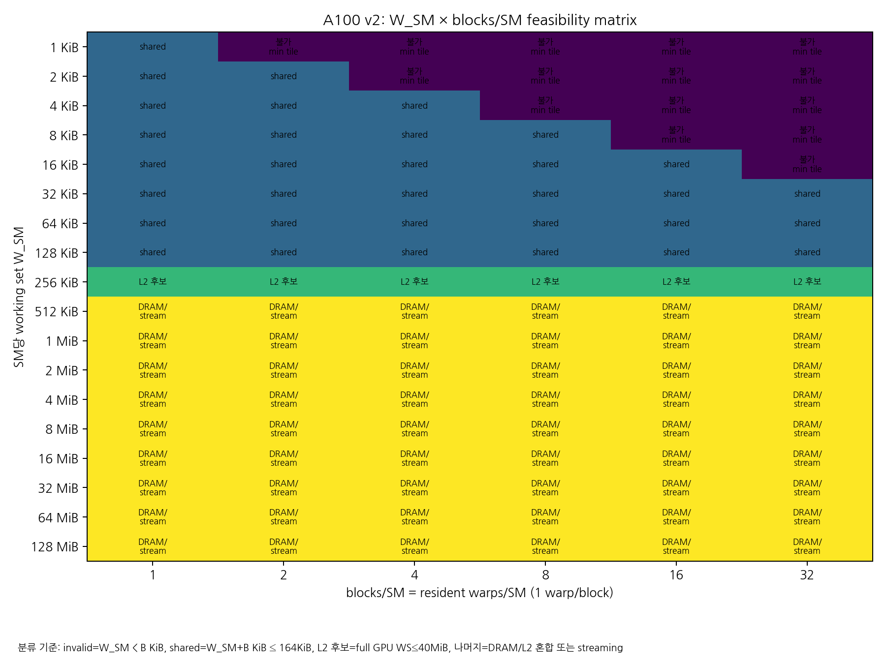
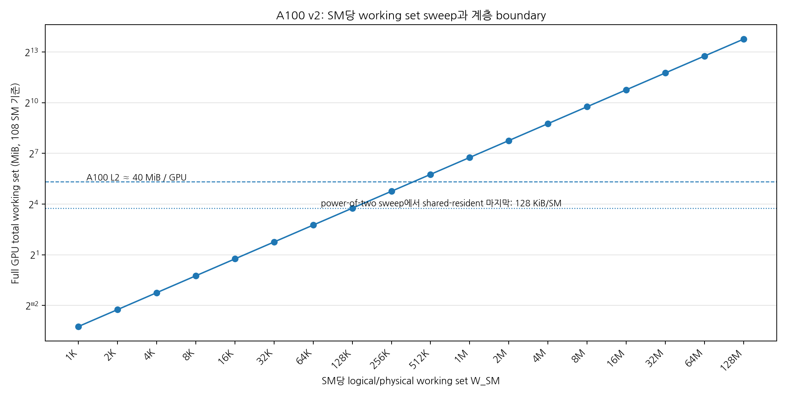
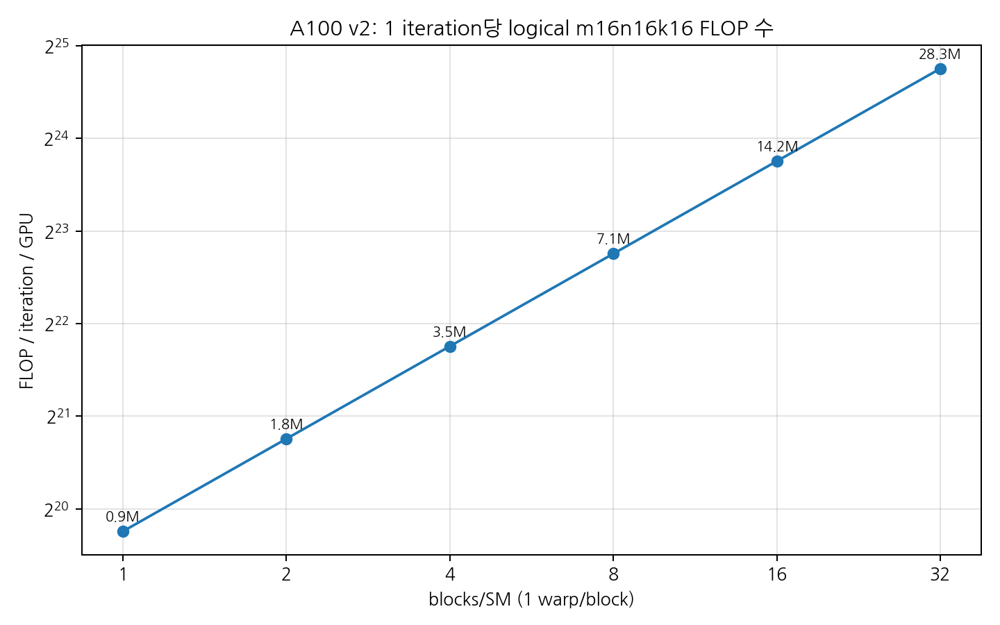

# A100 FP16 Tensor Core 에너지 측정 상세설계서 v2

**변경 목적:** 기존의 `1 thread = 1KiB` working set 가정은 `m16n16k16` MMA의 자연스러운 operand 단위와 맞지 않는다. 본 v2 설계서는 **1 warp가 logical `fp16 m16n16k16` MMA 1개를 수행**하는 것을 operation 단위로 고정하고, **1 warp/block** 조건에서 **blocks/SM**과 **SM당 working set**을 독립 변수로 sweep하여 Tensor Engine + register, shared/L1, L2, DRAM 경로의 effective energy를 추정한다.

---

## 1. 핵심 변경 사항

| 항목 | v1 | v2 변경안 |
|---|---:|---:|
| operation 단위 | thread당 1KiB working set 중심 | **warp당 logical `m16n16k16` MMA 1개** |
| threads/block | 128 threads = 4 warps | **32 threads = 1 warp** |
| warps/block | 4 | **1 고정** |
| blocks/SM | 1 또는 별도 sweep | **1, 2, 4, 8, 16, 32 sweep** |
| working set | thread당 기준 | **SM당 `W_SM`: 1KiB → 128MiB, 2배 증가** |
| 최소 operand footprint | 모호함 | **logical `m16n16k16` A+B = 1KiB/warp/op** |

본 문서에서 `128MB` sweep은 powers-of-two sweep과 일관성을 위해 **128MiB = 131,072KiB**로 표기한다. 십진수 128MB가 필요하면 메모리 할당량만 별도 변환하면 된다.

---

## 2. Operation 정의

본 실험의 기본 operation은 다음과 같이 정의한다.

```text
1 logical operation = 1 warp-level fp16 m16n16k16 MMA
```

FP16 입력 A/B 기준 logical `m16n16k16` 한 개의 operand footprint는 다음과 같다.

```text
A = 16 × 16 × 2 bytes = 512 bytes
B = 16 × 16 × 2 bytes = 512 bytes
A + B = 1024 bytes = 1KiB = 8192 bits
```

연산량은 다음과 같다.

```text
FMA / op  = 16 × 16 × 16 = 4096 FMA
FLOP / op = 4096 × 2 = 8192 FLOP
input bits / op = 8192 bits, A+B FP16 input 기준
```

A100 low-level PTX에서는 logical `m16n16k16`을 보통 `m16n8k16` 두 개로 구성하는 방식이 자연스럽다. 따라서 보고서에서는 두 카운트를 분리한다.

| 카운트 | 의미 | logical op 1개당 |
|---|---:|---:|
| logical MMA op | `m16n16k16` 기준 정규화 단위 | 1 |
| low-level tensor instruction | `m16n8k16` 기준 | 약 2 |
| FMA | matrix multiply-accumulate | 4096 |
| FLOP | 1 FMA = 2 FLOP | 8192 |
| FP16 A+B input bit | pJ/input-bit 기준 | 8192 bits |

Primary kernel은 현실적인 A100 Tensor Core 경로인 **FP16 input + FP32 accumulate**를 사용한다.

```ptx
mma.sync.aligned.m16n8k16.row.col.f32.f16.f16.f32
```

필요하면 sensitivity run으로 FP16 accumulate 버전도 별도로 둔다.

---

## 3. A100 제약 및 boundary

A100/compute capability 8.0 기준으로 본 설계에 직접 영향을 주는 제약은 다음과 같다.

| 제약 | 값 | 실험 영향 |
|---|---:|---|
| SM 수 | 108 | full-GPU operation count의 기본 배수 |
| warp size | 32 threads | 변경 불가 |
| threads/block | 32 | 1 warp/block 고정 |
| max resident blocks/SM | 32 | 1 warp/block에서 blocks/SM 최대 32 |
| max resident warps/SM | 64 | 본 설계는 block limit 때문에 최대 32 warps/SM |
| max resident threads/SM | 2048 | 본 설계에서는 block limit이 먼저 걸림 |
| shared memory/SM | 최대 164KiB | shared-resident working set 상한 |
| max shared/block | 최대 163KiB | block별 shared allocation 상한 |
| CUDA reserved shared | 약 1KiB/block | `B` blocks/SM이면 `B KiB` 예약분 반영 |
| A100 L2 | 약 40MB | full-GPU working set이 이보다 작으면 L2-hit 후보 |

1 warp/block 조건에서는 `blocks/SM = B`가 곧 `resident warps/SM = B`이다. A100은 최대 64 resident warps/SM가 가능하지만, 본 설계는 **1 warp/block**을 고정하므로 **max resident blocks/SM = 32**가 먼저 걸린다. 즉 본 설계의 최대 resident warp 수는 **32 warps/SM**이다. Tensor Core saturation 확인이 목적이라면 supplementary run으로 2 warps/block도 추가할 수 있지만, v2 primary 설계에서는 제외한다.

---

## 4. Working set 정의와 자가점검

본 설계의 `W_SM`은 **SM당 physical working set**으로 정의한다. 즉 한 SM에 resident한 모든 block이 사용하는 unique user payload의 합이다.

```text
W_SM = SM당 user working set, KiB 단위
B    = blocks/SM = resident warps/SM, 1 warp/block 조건
W_block = W_SM / B
```

logical `m16n16k16` op 1개에는 A+B 1KiB가 필요하므로, 각 active warp/block은 최소 1KiB tile을 가져야 한다. 따라서 물리적으로 일관된 unique working set을 유지하려면 다음 조건이 필요하다.

```text
W_block ≥ 1KiB
W_SM / B ≥ 1KiB
따라서 B ≤ W_SM[KiB]
```

예를 들어 `W_SM = 1KiB`에서 `B = 4`를 실행하면, block당 0.25KiB만 할당되어 logical `m16n16k16` 한 개의 A+B operand 1KiB를 담을 수 없다. 이 조합은 다음 중 하나로 처리해야 한다.

1. **권장:** 해당 조합을 invalid로 분류한다.
2. **비권장:** 모든 block이 같은 1KiB tile을 중복 복사해서 사용한다. 이 경우 physical shared footprint는 최소 `B KiB`가 되므로 더 이상 `W_SM = 1KiB` 실험이 아니다.
3. **대안:** shared를 쓰지 않고 global/L2의 동일 1KiB tile을 모든 warp가 읽도록 한다. 이 경우 shared-resident 실험이 아니라 cache-hit/reuse 실험이다.

본 설계는 1번을 기본으로 한다.

---

## 5. Shared-resident 가능 조건

Shared memory는 block-private이다. 여러 block이 같은 SM에 있더라도 shared memory를 서로 직접 공유하지 못한다. 따라서 `B`개 block이 한 SM에 resident할 때 shared-memory footprint는 다음처럼 계산한다.

```text
physical shared footprint / SM = W_SM + B KiB reserved
```

A100 shared memory 상한을 만족하려면:

```text
W_SM + B KiB ≤ 164KiB
W_SM / B ≤ 163KiB/block
W_SM / B ≥ 1KiB/block
B ≤ 32
```

powers-of-two sweep에서는 `W_SM = 128KiB`가 shared-resident 구간의 마지막 주요 점이다. 예를 들어 `B=32`이면:

```text
W_block = 128KiB / 32 = 4KiB/block
reserved = 32KiB/SM
총 footprint = 128KiB + 32KiB = 160KiB/SM ≤ 164KiB
```

`W_SM = 256KiB`부터는 어떤 `B`에서도 shared-resident가 불가능하다.

---

## 6. L2/DRAM boundary

Full A100 1개를 사용하고 모든 108 SM이 active라고 하면:

```text
GPU_total_working_set = 108 × W_SM
```

A100 L2가 약 40MB이므로, full-GPU working set이 L2 안에 들어가는 대략적 boundary는:

```text
W_SM ≈ 40MiB / 108 ≈ 379KiB/SM
```

powers-of-two sweep에서는:

| W_SM | full GPU WS, 108 SM | 계층 해석 |
|---:|---:|---|
| 128KiB/SM | 13.5MiB | shared-resident 가능 |
| 256KiB/SM | 27.0MiB | shared 불가, L2-hit 후보 |
| 512KiB/SM | 54.0MiB | L2 초과 시작, L2/DRAM 혼합 |
| 1MiB/SM | 108MiB | DRAM streaming 후보 |
| 128MiB/SM | 13.5GiB | DRAM-dominant 후보, A100 40GB 메모리에는 수용 가능 |

정확한 L2/DRAM 분리는 working set 크기만으로 보장되지 않는다. L2-hit 실험은 warm-up과 cache-control을 이용해 검증하고, DRAM 실험은 reuse를 줄인 streaming pattern과 NCU DRAM counter로 검증한다.

---

## 7. 실험 행렬

### 7.1 blocks/SM sweep

Primary sweep은 다음 값만 사용한다.

```text
B = blocks/SM = 1, 2, 4, 8, 16, 32
threads/block = 32
warps/block = 1
```

`B`가 커질수록 같은 iteration 수에서 operation 수가 선형 증가한다.

```text
N_MMA_per_iteration_per_GPU = 108 × B
FLOP_per_iteration_per_GPU = 108 × B × 8192
input_bits_per_iteration_per_GPU = 108 × B × 8192
```

| B, blocks/SM | resident warps/SM | logical MMA/iteration/GPU | FLOP/iteration/GPU |
|---:|---:|---:|---:|
| 1 | 1 | 108 | 884,736 |
| 2 | 2 | 216 | 1,769,472 |
| 4 | 4 | 432 | 3,538,944 |
| 8 | 8 | 864 | 7,077,888 |
| 16 | 16 | 1,728 | 14,155,776 |
| 32 | 32 | 3,456 | 28,311,552 |

### 7.2 working set sweep

`W_SM`은 다음 powers-of-two 값을 사용한다.

```text
1KiB, 2KiB, 4KiB, 8KiB, 16KiB, 32KiB, 64KiB, 128KiB,
256KiB, 512KiB, 1MiB, 2MiB, 4MiB, 8MiB, 16MiB, 32MiB, 64MiB, 128MiB
```

아래 표는 `W_SM`별 대표 regime이다. 세부 `B`별 feasibility는 첨부 CSV와 heatmap을 사용한다.

| W_SM | full GPU WS | 대표 regime |
|---:|---:|---|
| 1 KiB | 0.105 MiB | shared-resident 가능 |
| 2 KiB | 0.211 MiB | shared-resident 가능 |
| 4 KiB | 0.422 MiB | shared-resident 가능 |
| 8 KiB | 0.844 MiB | shared-resident 가능 |
| 16 KiB | 1.69 MiB | shared-resident 가능 |
| 32 KiB | 3.38 MiB | shared-resident 가능 |
| 64 KiB | 6.75 MiB | shared-resident 가능 |
| 128 KiB | 13.5 MiB | shared-resident 가능 |
| 256 KiB | 27.0 MiB | L2-hit 후보 |
| 512 KiB | 54.0 MiB | DRAM/L2 혼합 또는 streaming |
| 1 MiB | 108 MiB | DRAM/L2 혼합 또는 streaming |
| 2 MiB | 216 MiB | DRAM/L2 혼합 또는 streaming |
| 4 MiB | 432 MiB | DRAM/L2 혼합 또는 streaming |
| 8 MiB | 864 MiB | DRAM/L2 혼합 또는 streaming |
| 16 MiB | 1.69 GiB | DRAM/L2 혼합 또는 streaming |
| 32 MiB | 3.38 GiB | DRAM/L2 혼합 또는 streaming |
| 64 MiB | 6.75 GiB | DRAM/L2 혼합 또는 streaming |
| 128 MiB | 13.50 GiB | DRAM/L2 혼합 또는 streaming |


### 7.3 feasibility heatmap

아래 그림은 `W_SM × blocks/SM` 조합별 유효성을 나타낸다.



분류 기준은 다음과 같다.

| 분류 | 의미 |
|---|---|
| `invalid_min_tile` | `W_SM < B KiB`; 각 block/warp가 1KiB MMA tile을 가질 수 없음 |
| `shared_resident` | `W_SM + B KiB ≤ 164KiB`; shared-resident 가능 |
| `l2_candidate` | shared에는 못 들어가지만 full-GPU WS가 약 40MiB 이하 |
| `dram_mixed_streaming` | full-GPU WS가 L2보다 큼; DRAM/L2 혼합 또는 streaming 실험 |

---

## 8. Kernel 설계

### 8.1 공통 launch 구조

```text
threads/block = 32
warps/block   = 1
blocks/SM     = B
full GPU grid = 108 × B blocks per GPU
```

CUDA는 block을 특정 SM에 pinning하는 public launch API를 제공하지 않으므로, 다음 두 방식을 구분한다.

#### Soft control, 권장 기본값

```text
gridDim.x = number_of_active_SM × B
```

각 block은 long-running persistent block으로 동작한다. 실제로 각 SM에 `B`개 block이 배치되었는지 확인하기 위해 kernel 시작 시 `%smid`를 기록한다.

```cpp
__device__ __forceinline__ unsigned get_smid() {
    unsigned smid;
    asm volatile("mov.u32 %0, %smid;" : "=r"(smid));
    return smid;
}
```

각 block은 시작 시 다음 정보를 기록한다.

```text
smid
rank_on_smid = atomicAdd(&sm_block_counter[smid], 1)
```

`rank_on_smid`가 `0..B-1` 범위를 벗어나면 해당 run은 폐기한다.

#### Hard control, occupancy throttle

정확히 `B` blocks/SM 이상이 resident하지 못하게 하려면 dummy shared allocation을 사용한다.

```text
S_alloc_block + 1KiB reserved ≈ floor(164KiB / B)
```

이 방식은 더 결정적이지만, shared/L1 carveout과 unused shared allocation이 실험 조건을 바꿀 수 있다. 따라서 occupancy calibration에는 좋지만, memory-hierarchy energy 실험에서는 soft control + SMID 검증을 우선한다.

### 8.2 shared-resident path

조건:

```text
W_SM + B KiB ≤ 164KiB
W_SM ≥ B KiB
```

각 block의 user working set:

```text
W_block = W_SM / B
```

각 block/warp는 `W_block / 1KiB`개의 logical `m16n16k16` tile을 담당한다. Timed inner loop는 다음 경로를 반복한다.

```text
shared → ldmatrix/shared load → register fragment → mma.sync → accumulator register
```

### 8.3 L2-hit candidate path

조건:

```text
W_SM > shared-resident limit
108 × W_SM ≤ 약 40MiB
```

대표값:

```text
W_SM = 256KiB/SM → full GPU WS = 27MiB
```

구조:

```text
warm-up kernel: global working set을 1회 이상 read
measured kernel: global/L2 → register 또는 global/L2 → shared staging → MMA
```

NCU 검증 시 L2 hit 중심인지 `dram__bytes`와 L2 counter로 확인한다.

### 8.4 DRAM streaming path

조건:

```text
108 × W_SM > 40MiB
```

대표값:

```text
W_SM = 512KiB/SM 이상; 권장 DRAM-dominant 시작점은 1MiB/SM 이상
```

구조:

```text
global/HBM → L2 → register/shared staging → MMA
```

DRAM energy를 분명히 보기 위해서는 반복 reuse를 줄이고, working set을 L2보다 충분히 크게 유지한다. `W_SM = 8MiB/SM`이면 full GPU working set은 864MiB로, L2보다 훨씬 크다.

---

## 9. Operation count와 pJ 계산식

### 9.1 Generic iteration 기준

각 iteration에서 각 resident warp가 logical `m16n16k16` 1개를 수행하면:

```text
N_MMA = N_GPU × active_SM × B × ITER
FLOP  = N_MMA × 8192
input_bits = N_MMA × 8192, A+B FP16 input 기준
```

따라서:

```text
pJ/FLOP = ΔE[J] × 1e12 / FLOP
pJ/input-bit = ΔE[J] × 1e12 / input_bits
```

A+B FP16 input 기준에서는 logical op당 `8192 FLOP`과 `8192 input bits`가 숫자로 같다. 하지만 의미는 다르므로 지표 이름을 반드시 구분한다.

### 9.2 Full-sweep 기준

`W_SM` 안의 모든 1KiB tile을 한 번씩 소비하는 것을 1 sweep이라고 정의하면:

```text
logical_ops_per_sweep_per_SM = W_SM / 1KiB
logical_ops_per_sweep_per_GPU = 108 × W_SM[KiB]
```

`R`번 sweep하면:

```text
N_MMA = N_GPU × 108 × W_SM[KiB] × R
FLOP  = N_MMA × 8192
input_bits = N_MMA × 8192
```

이 정의는 working set 크기별 pJ/bit 분석에 특히 적합하다. 단, shared-resident 구간에서는 같은 shared tile을 여러 번 재사용할 수 있으므로, `capacity bit`과 `accessed bit`을 혼동하지 않아야 한다.

---

## 10. 에너지 측정 방법

### 10.1 NVML 기반 측정

NVML의 `nvmlDeviceGetTotalEnergyConsumption()`을 사용해 GPU별 누적 energy counter를 측정한다. 값은 mJ 단위이므로 kernel 전후 차이를 사용한다.

```text
E_before_mJ = nvmlDeviceGetTotalEnergyConsumption(gpu)
run kernel
cudaDeviceSynchronize()
E_after_mJ = nvmlDeviceGetTotalEnergyConsumption(gpu)
ΔE[J] = (E_after_mJ - E_before_mJ) / 1000
```

권장 절차:

1. persistence mode 활성화.
2. application clocks 또는 graphics/memory clocks 고정.
3. GPU별 idle baseline 측정.
4. warm-up kernel 실행.
5. 본 측정 kernel은 10초 이상 실행.
6. 각 조합은 최소 5회 반복하고 median과 MAD를 기록.
7. GPU 온도, clock, power limit, ECC 상태를 함께 저장.

### 10.2 idle power 분류

GPU 0~3개 실험은 다음처럼 분류한다.

| 분류 | 의미 | 측정 |
|---|---|---|
| `idle_0gpu_active` | 어떤 GPU도 kernel 실행 안 함 | 10초 sleep 동안 모든 GPU energy counter 차분 |
| `single_gpu_active` | GPU i 하나만 active | active GPU와 inactive GPU energy를 모두 기록 |
| `multi_gpu_active` | GPU 0..N-1 동시 active | 모든 GPU별 energy를 독립 기록 |
| `net_active_energy` | active GPU의 net dynamic energy | active ΔE − 해당 GPU idle baseline |
| `system_side_effect` | inactive GPU power 변화 | inactive ΔE가 idle baseline과 다르면 별도 기록 |

권장 sweep:

```text
N_GPU = 0, 1, 2, 3    # 사용 가능한 GPU가 4개이면 4도 추가 가능
```

각 GPU의 device ID는 실험 전에 `nvidia-smi -L`과 CUDA device property로 확인한다. Multi-GPU 실험은 GPU 간 통신을 하지 않는 독립 kernel로 실행한다. NVLink/PCIe transfer를 포함하면 DRAM/Tensor Core 에너지 분해가 오염된다.

### 10.3 10초 runtime calibration

초기에는 작은 `ITER_test` 또는 `R_test`로 실행 시간을 측정한 뒤, 10초 목표에 맞춘다.

```text
ITER_10s = ITER_test × 10 / measured_time_seconds
```

실제 measurement run에서는 `ITER_10s`보다 5~10% 크게 잡아 NVML counter 해상도와 CPU scheduling jitter의 영향을 줄인다.

---

## 11. NCU를 통한 검증

NCU run은 energy run과 분리한다. NCU는 profiling replay와 cache control 때문에 실행 조건이 변할 수 있으므로, NVML energy 측정값과 직접 섞지 않는다.

### 11.1 검증 목표

| 검증 항목 | 목적 |
|---|---|
| actual active SM | grid와 SMID histogram이 의도한 active SM 수와 맞는지 확인 |
| resident blocks/SM | `B`가 의도대로 유지되는지 확인 |
| tensor instruction count | logical op 수와 tensor pipe instruction 수가 맞는지 확인 |
| shared traffic | shared-resident run에서 expected shared read/write가 발생하는지 확인 |
| L2 traffic | L2-hit candidate run에서 L2 hit 중심인지 확인 |
| DRAM traffic | DRAM streaming run에서 DRAM byte가 충분히 발생하는지 확인 |
| spills/local memory | register spill로 L2/DRAM이 오염되지 않았는지 확인 |
| bank conflict/replay | shared-memory conflict가 energy를 왜곡하지 않는지 확인 |

### 11.2 NCU 명령 예시

정확한 metric 이름은 CUDA/NCU 버전에 따라 다르므로 먼저 query한다.

```bash
ncu --query-metrics-mode suffix --query-metrics | grep -E "tensor|dram|lts|l1tex|shared|warps|occupancy"
```

대표 실행:

```bash
ncu --set full     --target-processes all     --replay-mode application     --cache-control none     -o ncu_a100_v2_W${W}_B${B}     ./a100_fp16_energy_v2 --gpu 0 --w-sm-kib ${W} --blocks-per-sm ${B} --mode shared
```

L2-hit을 검증할 때는 측정 kernel 전에 warm-up을 실행하고, NCU에서는 `--cache-control none`을 사용하여 replay pass 사이 cache flush를 피하는 run을 추가한다. DRAM streaming 검증에서는 cache flush를 허용하거나, working set을 L2보다 충분히 크게 만들어 reuse 영향을 줄인다.

---

## 12. Visualization 계획

### 12.1 기본 visualization

본 설계서에 포함된 기본 그림은 다음과 같다.





### 12.2 실측 후 생성할 그래프

| 그래프 | x축 | y축 | 목적 |
|---|---|---|---|
| Energy vs active GPU count | N_GPU | Joule / 10s | multi-GPU 선형성 확인 |
| Energy vs blocks/SM | B | net Joule 또는 pJ/FLOP | occupancy 효과 확인 |
| pJ/FLOP vs W_SM | log2 W_SM | pJ/FLOP | 계층 전환점 관찰 |
| pJ/input-bit vs W_SM | log2 W_SM | pJ/input-bit | operand 공급 비용 추정 |
| DRAM/L2/shared bytes vs W_SM | log2 W_SM | bytes/op | NCU counter 기반 경로 검증 |
| regression residual | predicted energy | residual | 선형 모델 적합성 확인 |

---

## 13. 해석 방법

### 13.1 차분 해석

권장 차분 순서는 다음과 같다.

```text
E0 = idle baseline
E1 = empty persistent kernel baseline
E2 = register/Tensor Core 중심 MMA
E3 = shared-resident MMA
E4 = L2-hit candidate MMA
E5 = DRAM streaming MMA
```

해석:

```text
E1 - E0  → active SM + scheduler/control baseline
E2 - E1  → Tensor Engine + register file + issue effective energy
E3 - E2  → shared/L1 + ldmatrix effective energy
E4 - E3  → L2-hit path effective energy
E5 - E4  → DRAM/HBM path effective energy
```

주의: 이 값들은 물리적으로 완전히 순수한 component energy가 아니라 **microbenchmark 조건에서의 effective energy coefficient**이다.

### 13.2 회귀 해석

최종 모델은 다음 형태로 둔다.

```text
E_j - E_idle_j
= α_TC   × N_MMA_j
+ α_SMEM × B_SMEM_j
+ α_L2   × B_L2_j
+ α_DRAM × B_DRAM_j
+ α_INST × N_INST_j
+ α_SM   × active_SM_j × time_j
+ ε_j
```

계수는 다음처럼 해석한다.

| 계수 | 해석 |
|---|---|
| `α_TC` | logical MMA 1개당 Tensor Engine + RF effective energy |
| `α_SMEM` | shared path byte당 effective energy |
| `α_L2` | L2 path byte당 effective energy |
| `α_DRAM` | HBM/DRAM path byte당 effective energy |
| `α_INST` | instruction issue/control overhead |
| `α_SM` | active SM baseline power |

NCU counter로 `B_SMEM`, `B_L2`, `B_DRAM`, `N_INST`를 검증하지 않으면 회귀 계수가 의미를 잃는다.

---

## 14. 자가점검 체크리스트

| 점검 항목 | 상태 | 보완책 |
|---|---|---|
| `1 thread = 1KiB` 가정 제거 | 반영 | operation을 warp-level `m16n16k16`으로 재정의 |
| 1 warp/block 고정 | 반영 | `threads/block=32` |
| blocks/SM control | 반영 | soft control + SMID histogram, 필요 시 dummy shared hard control |
| W_SM=1KiB에서 B>1 충돌 | 발견 | `W_SM ≥ B KiB` 조건 추가; 작은 W에서는 B 제한 |
| shared memory가 block-private인 점 | 반영 | `W_SM+B KiB≤164KiB`로 계산 |
| A100 64 warps/SM 미달 | 발견 | 1 warp/block 조건에서는 최대 32 warps/SM; saturation 확인용 supplementary 2 warps/block 권장 |
| 128MiB/SM shared 불가 | 반영 | global/DRAM streaming 모드로 전환 |
| L2 boundary | 반영 | 256KiB/SM은 L2 후보, 512KiB/SM부터 L2 초과 |
| operation count와 bit count 분리 | 반영 | logical op, FLOP, input bit 식 명시 |
| NVML energy와 NCU profiling 분리 | 반영 | NCU는 검증 run, NVML은 energy run |
| idle power 분류 | 반영 | 0 GPU active baseline과 active/inactive GPU별 counter 기록 |
| multi-GPU scaling | 반영 | N_GPU=0,1,2,3 sweep |

---

## 15. 권장 실험 순서

1. **단일 GPU sanity check**
   - GPU 0에서 `B=1`, `W_SM=1KiB`, shared mode 실행.
   - SMID histogram, tensor instruction count, no spill 확인.

2. **blocks/SM occupancy sweep**
   - `B=1,2,4,8,16,32`.
   - `W_SM`은 각 B에서 최소 `B KiB` 이상으로 설정.
   - pJ/FLOP이 어느 B부터 안정되는지 확인.

3. **shared-resident working set sweep**
   - `W_SM=1KiB..128KiB`.
   - 각 W에서 feasible한 B만 실행.
   - shared traffic과 tensor op count 확인.

4. **L2-hit candidate sweep**
   - `W_SM=256KiB` 중심.
   - warm-up 후 측정.
   - NCU로 DRAM byte가 낮고 L2 byte가 높은지 검증.

5. **DRAM streaming sweep**
   - `W_SM=512KiB..128MiB`.
   - reuse를 낮추고 streaming access 사용.
   - NCU로 DRAM byte/op 증가 확인.

6. **active SM scaling**
   - active SM 수 `1,2,4,8,16,32,64,108`.
   - `grid = active_SM × B`.
   - energy vs active SM 선형성 확인.

7. **multi-GPU scaling**
   - `N_GPU=0,1,2,3`.
   - 각 GPU별 NVML energy counter 별도 기록.
   - active GPU net energy와 inactive GPU idle drift 분리.

8. **회귀/차분 분석**
   - idle 제거, empty-kernel 제거, component traffic counter 결합.
   - pJ/FLOP, pJ/input-bit, pJ/shared-bit, pJ/L2-bit, pJ/DRAM-bit 산출.

---

## 16. 산출물 형식

실험 결과는 다음 CSV schema로 저장한다.

```text
run_id,gpu_id,n_gpu_active,mode,W_SM_KiB,blocks_per_SM,threads_per_block,
active_SM,ITER,sweeps,elapsed_s,E_before_mJ,E_after_mJ,delta_E_J,
idle_baseline_J,net_E_J,N_MMA,FLOP,input_bits,pJ_per_FLOP,pJ_per_input_bit,
ncu_tensor_inst,ncu_shared_bytes,ncu_l2_bytes,ncu_dram_bytes,ncu_spill_bytes,
smid_histogram_ok,clock_sm_mhz,clock_mem_mhz,temp_C,notes
```

Visualization notebook/script는 이 CSV를 입력으로 사용해 12장의 그래프를 생성한다.


## References

1. NVIDIA, *NVIDIA Ampere GPU Architecture Tuning Guide*. A100 compute capability 8.0 shared-memory capacity, asynchronous copy, and occupancy-relevant behavior. <https://docs.nvidia.com/cuda/ampere-tuning-guide/index.html>
2. NVIDIA, *CUDA C++ Programming Guide — Compute Capabilities*. Warp size, resident block/warp/thread limits, register and shared-memory limits. <https://docs.nvidia.com/cuda/cuda-programming-guide/05-appendices/compute-capabilities.html>
3. NVIDIA, *Parallel Thread Execution ISA*. `mma`, `wmma`, and `ldmatrix` instruction semantics. <https://docs.nvidia.com/cuda/parallel-thread-execution/index.html>
4. NVIDIA, *NVML API Reference*. `nvmlDeviceGetTotalEnergyConsumption()` reports total energy consumption in millijoules since driver reload on Volta-or-newer fully supported devices. <https://docs.nvidia.com/deploy/nvml-api/group__nvmlDeviceQueries.html>
5. NVIDIA, *Nsight Compute Profiling Guide*. NCU metric collection, replay, and cache-control behavior. <https://docs.nvidia.com/nsight-compute/ProfilingGuide/index.html>
6. NVIDIA, *A100 Tensor Core GPU Architecture Whitepaper*. A100 SM/Tensor Core organization and 40 MB L2 cache. <https://images.nvidia.com/aem-dam/en-zz/Solutions/data-center/nvidia-ampere-architecture-whitepaper.pdf>
