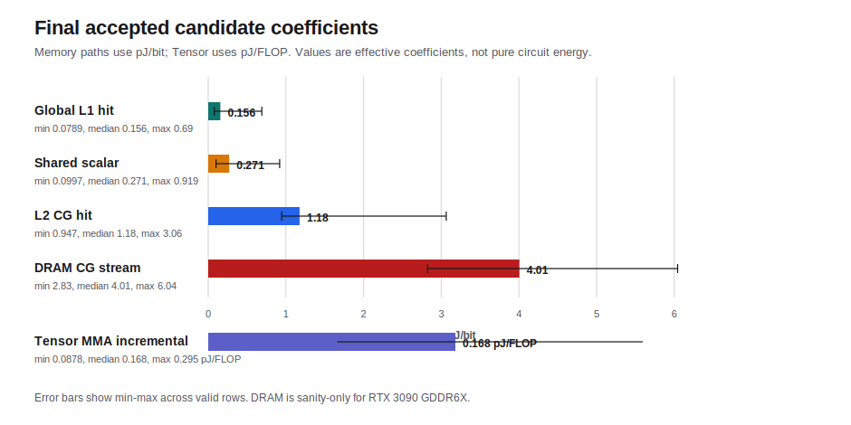
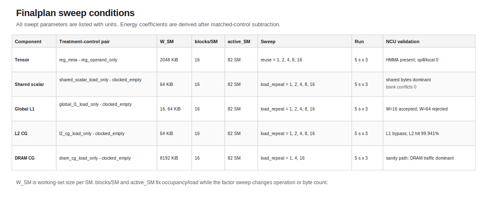
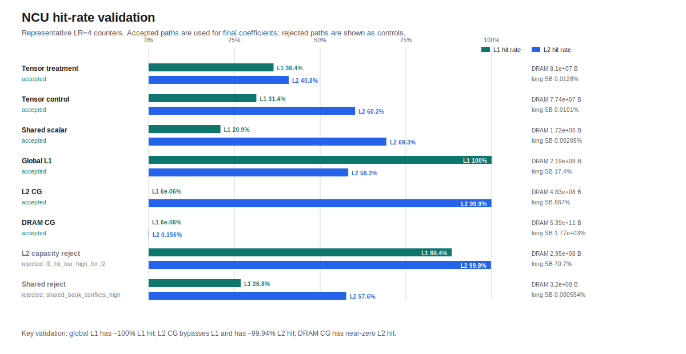
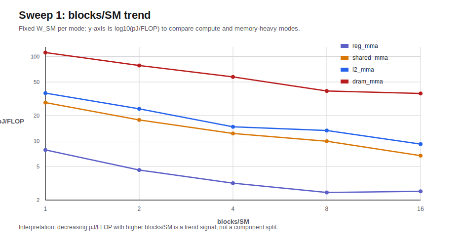
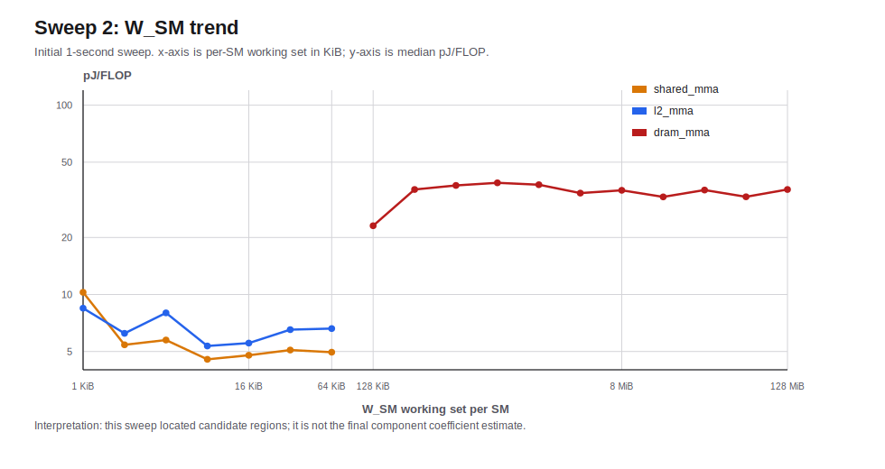

# GPU Power Modeling 실험 결과 정리

작성일: 2026-07-07
대상 결과: RTX 3090 finalplan 결과, 2026-07-05 실행분 중심

이 문서는 방법론 설명이 아니라, 실제 실험 결과를 바로 확인하기 위한 정리 문서다. 모든 sweep 조건은 표로 정리했고, 단위가 필요한 값에는 단위를 명시했다.

## 1. 결과 한눈에 보기

아래 값은 순수 회로/bitcell energy가 아니다. NVML board-level energy에서 control kernel을 뺀 뒤, NCU counter로 경로가 맞는지 검증한 effective microbenchmark coefficient다.

| Component/path | 대표 mode pair | median | unit | min | max | rows used | 결과 상태 |
|---|---|---:|---|---:|---:|---:|---|
| Tensor MMA incremental | `reg_mma - reg_operand_only` | 0.168 | pJ/FLOP | 0.0878 | 0.295 | 5 | accepted candidate |
| Global L1 hit path, W_SM=16 KiB | `global_l1_load_only - clocked_empty` | 0.156 | pJ/bit | 0.0789 | 0.690 | 5 | accepted candidate, variance high |
| Shared scalar path, W_SM=64 KiB | `shared_scalar_load_only - clocked_empty` | 0.271 | pJ/bit | 0.0997 | 0.919 | 5 | accepted candidate, variance high |
| L2 CG hit path, W_SM=64 KiB | `l2_cg_load_only - clocked_empty` | 1.176 | pJ/bit | 0.947 | 3.064 | 5 | accepted candidate, stall-heavy |
| DRAM CG streaming path, W_SM=8192 KiB | `dram_cg_load_only - clocked_empty` | 4.006 | pJ/bit | 2.825 | 6.044 | 3 | sanity candidate only |

해석 순서는 `Global L1 < Shared scalar < L2 CG < DRAM CG sanity`로 나와 reference order와는 대체로 맞는다. 다만 L1/shared의 분산이 크고, L2/DRAM은 stall-heavy라서 “물리적 component energy”로 단정하면 안 된다.

## 2. 결과 이미지

| 그림 | 파일 | 보여주는 내용 |
|---|---|---|
| 최종 component coefficient | `docs/component_energy_method_assets/final_component_coefficients.svg` | 최종 median, min, max 계수 |
| finalplan factor sweep | `docs/component_energy_method_assets/finalplan_factor_sweep_coefficients.svg` | reuse/load_repeat 변화에 따른 coefficient 변화 |
| finalplan sweep 조건 | `docs/component_energy_method_assets/finalplan_sweep_design_matrix.svg` | component별 W_SM, blocks/SM, active_SM, factor sweep 조건 |
| NCU hit-rate 검증 | `docs/component_energy_method_assets/ncu_hit_rate_validation.svg` | L1/L2 hit rate와 accepted/rejected path |
| NCU traffic 검증 | `docs/component_energy_method_assets/ncu_path_validation_bytes.svg` | shared/L1/L2/DRAM byte traffic |
| 초기 Sweep 1 blocks/SM | `docs/component_energy_method_assets/sweep1_blocks_trend.svg` | blocks/SM 변화에 따른 pJ/FLOP 추세 |
| 초기 Sweep 2 W_SM | `docs/component_energy_method_assets/sweep2_wsm_trend.svg` | W_SM 변화에 따른 pJ/FLOP 추세 |

## 3. Finalplan Sweep 조건

Finalplan은 초기 sweep에서 찾은 후보 조건을 바탕으로, component별 treatment-control pair를 고정하고 factor만 바꿔 차분 계수를 계산한 실험이다.

| Component | treatment mode | control mode | W_SM (KiB) | blocks/SM (blocks/SM) | active_SM (SM) | sweep parameter | sweep values | run time (s) | repeats (count) |
|---|---|---|---:|---:|---:|---|---|---:|---:|
| Tensor | `reg_mma` | `reg_operand_only` | 2048 | 16 | 82 | reuse factor | 1, 2, 4, 8, 16 | 5 | 3 |
| Shared scalar | `shared_scalar_load_only` | `clocked_empty` | 64 | 16 | 82 | load_repeat | 1, 2, 4, 8, 16 | 5 | 3 |
| Global L1 | `global_l1_load_only` | `clocked_empty` | 16, 64 | 16 | 82 | load_repeat | 1, 2, 4, 8, 16 | 5 | 3 |
| L2 CG | `l2_cg_load_only` | `clocked_empty` | 64 | 16 | 82 | load_repeat | 1, 2, 4, 8, 16 | 5 | 3 |
| DRAM CG | `dram_cg_load_only` | `clocked_empty` | 8192 | 16 | 82 | load_repeat | 1, 4, 16 | 5 | 3 |

W_SM은 SM 하나당 working set 크기다. blocks/SM과 active_SM은 GPU에 일을 얼마나 퍼뜨릴지 정하는 조건이고, reuse/load_repeat는 같은 경로의 operation 또는 byte 수를 얼마나 늘릴지 정하는 sweep 축이다.

## 4. Shared와 Global L1을 분리해서 보는 이유

RTX 3090 GA102에서 L1 data cache와 shared memory는 같은 SM 내부의 combined/unified L1/shared subsystem을 공유한다. 따라서 물리 구조만 보면 둘은 가까운 자원이다.

하지만 이 실험에서는 둘을 같은 coefficient로 합치지 않는다. 이유는 다음과 같다.

| 구분 | Shared scalar path | Global L1-hit path |
|---|---|---|
| 대표 pair | `shared_scalar_load_only - clocked_empty` | `global_l1_load_only - clocked_empty` |
| CUDA 주소 공간 | `__shared__` memory | global memory |
| 데이터 관리 방식 | software-managed scratchpad | hardware-managed L1 cache |
| NCU denominator | shared bytes (B) | L1 bytes (B) |
| path 검증 | shared access, shared bytes, bank conflict | L1 hit rate, L2/DRAM leakage |
| 보고서 표현 | Shared scalar path effective coefficient | Global L1-hit path effective coefficient |

정리하면, `Shared scalar`와 `Global L1`은 같은 on-chip L1/shared subsystem과 관련은 있지만 같은 실험값으로 보면 안 된다. 보고서에서는 별도 coefficient로 제시하고, 상위 설명에서만 “on-chip L1/shared subsystem 관련 경로”라고 묶어 표현하는 것이 안전하다.

## 5. Energy Run 품질

Energy run은 NCU 없이 NVML total energy counter로 실행했다. NCU는 별도 대표 조건에서 경로 검증에 사용했다.

| raw result file | rows (count) | elapsed range (s) | non-positive net energy rows (count) | SMID bad rows (count) |
|---|---:|---:|---:|---:|
| `results/raw/rtx3090_finalplan_tensor_energy_20260705.csv` | 30 | 4.931-5.614 | 0 | 0 |
| `results/raw/rtx3090_finalplan_shared_energy_20260705.csv` | 30 | 4.783-5.754 | 0 | 0 |
| `results/raw/rtx3090_finalplan_l1_energy_20260705.csv` | 60 | 4.801-5.847 | 0 | 0 |
| `results/raw/rtx3090_finalplan_l2_energy_20260705.csv` | 30 | 4.770-5.657 | 0 | 0 |
| `results/raw/rtx3090_finalplan_dram_energy_20260705.csv` | 18 | 4.806-5.541 | 0 | 0 |

이 표 기준으로 실행 자체는 중간에 실패하지 않았다. 다만 실행이 성공했다는 것과 component 경로가 의도대로 분리됐다는 것은 별개라서 NCU 검증이 필요하다.

## 6. NCU 검증 결과

NCU 대표 조건은 LR=4 중심이다. final energy row 전체를 NCU로 1:1 프로파일링한 것은 아니며, 대표 row의 actual/expected ratio를 denominator 보정에 사용했다.

| mode | 목적 | acceptance | L1 hit (%) | L2 hit (%) | shared bytes (B) | L1 bytes (B) | L2 bytes (B) | DRAM bytes (B) | long SB (%) | 해석 |
|---|---|---|---:|---:|---:|---:|---:|---:|---:|---|
| `reg_mma` | Tensor treatment | accepted | 36.420 | 40.839 | 0 | 0 | 1.264e8 | 8.098e7 | 0.0128 | HMMA 있음, spill/local 0 |
| `reg_operand_only` | Tensor control | accepted | 31.405 | 60.183 | 0 | 0 | 1.212e8 | 7.737e7 | 0.0101 | HMMA 없음, spill/local 0 |
| `shared_scalar_load_only` | Shared scalar | accepted | 20.941 | 69.318 | 5.374e11 | 0 | 2.580e8 | 1.717e8 | 0.00208 | shared traffic 지배, bank conflict 0 |
| `global_l1_load_only` | Global L1 | accepted | 99.999 | 58.191 | 0 | 1.075e12 | 3.141e8 | 2.193e8 | 17.429 | L1 hit path로 인정 |
| `l2_cg_load_only` | L2 CG | accepted | 0.000006 | 99.941 | 0 | 5.374e11 | 5.380e11 | 4.830e8 | 866.815 | L1 bypass, L2 hit path로 인정 |
| `dram_cg_load_only` | DRAM sanity | accepted | 0.000006 | 0.156 | 0 | 5.374e11 | 5.389e11 | 5.385e11 | 1770.600 | DRAM streaming sanity |
| `l2_load_only` | L2 capacity 후보 | rejected | 88.369 | 99.794 | 0 | 1.075e12 | 1.254e11 | 2.955e8 | 70.728 | L1 hit가 너무 높아 L2 계수에서 제외 |
| `shared_load_only` | Shared WMMA load 후보 | rejected | 26.849 | 57.606 | 5.374e11 | 0 | 4.561e8 | 3.195e8 | 0.000554 | bank conflict가 높아 제외 |

NCU stall metric은 sampling/normalization 방식 때문에 100%를 넘는 값이 나올 수 있다. 여기서는 절대 비율이라기보다 “해당 path가 stall-heavy인지”를 보는 신호로 사용했다.

## 7. Finalplan Factor Sweep 결과

### 7.1 Tensor reuse sweep

| reuse factor (unitless) | W_SM (KiB) | blocks/SM (blocks/SM) | active_SM (SM) | delta_E (J) | denominator (FLOP) | coefficient (pJ/FLOP) | valid |
|---:|---:|---:|---:|---:|---:|---:|---|
| 1 | 2048 | 16 | 82 | 53.2879 | 3.63176e14 | 0.146727 | yes |
| 2 | 2048 | 16 | 82 | 45.3693 | 2.70023e14 | 0.168020 | yes |
| 4 | 2048 | 16 | 82 | 124.110 | 4.20190e14 | 0.295366 | yes |
| 8 | 2048 | 16 | 82 | 70.7121 | 4.12666e14 | 0.171354 | yes |
| 16 | 2048 | 16 | 82 | 37.4690 | 4.26609e14 | 0.0878299 | yes |

Tensor 최종 대표값은 median 0.168 pJ/FLOP다. 이는 `reg_mma`와 `reg_operand_only`의 board-level 차분이므로 Tensor Core transistor만의 물리 에너지가 아니다.

### 7.2 Shared scalar load_repeat sweep

| load_repeat (count) | W_SM (KiB) | blocks/SM (blocks/SM) | active_SM (SM) | delta_E (J) | denominator (B) | coefficient (pJ/byte) | coefficient (pJ/bit) | valid |
|---:|---:|---:|---:|---:|---:|---:|---:|---|
| 1 | 64 | 16 | 82 | 134.948 | 2.89970e13 | 4.65388 | 0.581735 | yes |
| 2 | 64 | 16 | 82 | 227.544 | 3.09399e13 | 7.35441 | 0.919301 | yes |
| 4 | 64 | 16 | 82 | 59.7455 | 3.28267e13 | 1.82003 | 0.227503 | yes |
| 8 | 64 | 16 | 82 | 74.5686 | 3.44549e13 | 2.16424 | 0.270530 | yes |
| 16 | 64 | 16 | 82 | 28.2121 | 3.53583e13 | 0.797892 | 0.0997365 | yes |

Shared scalar 최종 대표값은 median 0.271 pJ/bit다. min-max 폭이 크므로 최종값은 “후보 계수”로 보고해야 한다.

### 7.3 Global L1 W_SM=16 KiB load_repeat sweep

| load_repeat (count) | W_SM (KiB) | blocks/SM (blocks/SM) | active_SM (SM) | delta_E (J) | denominator (B) | coefficient (pJ/byte) | coefficient (pJ/bit) | valid |
|---:|---:|---:|---:|---:|---:|---:|---:|---|
| 1 | 16 | 16 | 82 | 84.0143 | 3.74857e13 | 2.24124 | 0.280155 | yes |
| 2 | 16 | 16 | 82 | 231.552 | 4.19647e13 | 5.51777 | 0.689722 | yes |
| 4 | 16 | 16 | 82 | 54.5318 | 4.35749e13 | 1.25145 | 0.156431 | yes |
| 8 | 16 | 16 | 82 | 51.3984 | 4.47857e13 | 1.14765 | 0.143456 | yes |
| 16 | 16 | 16 | 82 | 28.6159 | 4.53410e13 | 0.631125 | 0.0788907 | yes |

Global L1 최종 대표값은 W_SM=16 KiB에서 median 0.156 pJ/bit다. NCU에서 L1 hit rate 99.999%가 확인되어 path 자체는 가장 명확한 편이지만, coefficient 분산은 여전히 크다.

### 7.4 Global L1 W_SM=64 KiB rejected sweep

| load_repeat (count) | W_SM (KiB) | blocks/SM (blocks/SM) | active_SM (SM) | delta_E (J) | denominator source | coefficient (pJ/bit) | valid | reject reason |
|---:|---:|---:|---:|---:|---|---:|---|---|
| 1 | 64 | 16 | 82 | 40.9839 | expected_no_ncu_match | 0.316932 | no | missing_ncu_denominator |
| 2 | 64 | 16 | 82 | 151.805 | expected_no_ncu_match | 1.08197 | no | missing_ncu_denominator |
| 4 | 64 | 16 | 82 | -16.2790 | expected_no_ncu_match | -0.116360 | no | missing_ncu_denominator; negative_coefficient |
| 8 | 64 | 16 | 82 | -57.9885 | expected_no_ncu_match | -0.397775 | no | missing_ncu_denominator; negative_coefficient |
| 16 | 64 | 16 | 82 | -79.3804 | expected_no_ncu_match | -0.544647 | no | missing_ncu_denominator; negative_coefficient |

이 행들은 결과 표에서 제외했다. 이유는 NCU denominator가 없고 음수 coefficient가 포함되어 차분 측정이 안정적이지 않았기 때문이다.

### 7.5 L2 CG load_repeat sweep

| load_repeat (count) | W_SM (KiB) | blocks/SM (blocks/SM) | active_SM (SM) | delta_E (J) | denominator (B) | coefficient (pJ/byte) | coefficient (pJ/bit) | valid |
|---:|---:|---:|---:|---:|---:|---:|---:|---|
| 1 | 64 | 16 | 82 | 195.855 | 1.28267e13 | 15.2693 | 1.90867 | yes |
| 2 | 64 | 16 | 82 | 314.279 | 1.28198e13 | 24.5151 | 3.06439 | yes |
| 4 | 64 | 16 | 82 | 121.460 | 1.29138e13 | 9.40542 | 1.17568 | yes |
| 8 | 64 | 16 | 82 | 97.7656 | 1.29071e13 | 7.57453 | 0.946817 | yes |
| 16 | 64 | 16 | 82 | 98.4488 | 1.29773e13 | 7.58623 | 0.948278 | yes |

L2 CG 최종 대표값은 median 1.176 pJ/bit다. NCU에서 L1 bypass와 L2 hit가 확인됐지만, long scoreboard가 매우 커서 stall/control 성분이 계수에 섞였을 가능성이 크다.

### 7.6 DRAM CG streaming sanity sweep

| load_repeat (count) | W_SM (KiB) | blocks/SM (blocks/SM) | active_SM (SM) | delta_E (J) | denominator (B) | coefficient (pJ/byte) | coefficient (pJ/bit) | valid |
|---:|---:|---:|---:|---:|---:|---:|---:|---|
| 1 | 8192 | 16 | 82 | 227.927 | 4.71394e12 | 48.3517 | 6.04397 | yes |
| 4 | 8192 | 16 | 82 | 151.077 | 4.71415e12 | 32.0477 | 4.00596 | yes |
| 16 | 8192 | 16 | 82 | 106.626 | 4.71738e12 | 22.6027 | 2.82534 | yes |

DRAM 값은 RTX 3090 GDDR6X board-level streaming sanity다. HBM2 physical 3.9-4.0 pJ/bit 같은 device-level 값과 같은 의미로 비교하면 안 된다.

## 8. 초기 Sweep 1: blocks/SM sweep

초기 Sweep 1은 component 분리 실험이 아니라, 어떤 occupancy 조건에서 에너지/FLOP 추세가 안정적인지 찾기 위한 후보 탐색이었다.

| 조건 항목 | 값 |
|---|---|
| GPU | RTX 3090 |
| active_SM | 82 SM |
| sweep parameter | blocks/SM |
| requested sweep values | 1, 2, 4, 8, 16, 32 blocks/SM |
| actually executed values | 1, 2, 4, 8, 16 blocks/SM |
| excluded value | 32 blocks/SM, RTX 3090 resident block limit 때문에 제외 |
| fixed W_SM for `reg_mma` | 32 KiB |
| fixed W_SM for `shared_mma` | 64 KiB |
| fixed W_SM for `l2_mma` | 64 KiB |
| fixed W_SM for `dram_mma` | 8192 KiB |
| repeats | 5 count |
| elapsed per run | 약 10 s |
| unit of result | pJ/FLOP |

| mode | W_SM (KiB) | B=1 pJ/FLOP | B=2 pJ/FLOP | B=4 pJ/FLOP | B=8 pJ/FLOP | B=16 pJ/FLOP |
|---|---:|---:|---:|---:|---:|---:|
| `reg_mma` | 32 | 7.843 | 4.537 | 3.169 | 2.460 | 2.539 |
| `shared_mma` | 64 | 28.512 | 17.764 | 12.281 | 9.938 | 6.713 |
| `l2_mma` | 64 | 36.908 | 24.069 | 14.739 | 13.314 | 9.194 |
| `dram_mma` | 8192 | 111.449 | 78.365 | 57.406 | 39.133 | 36.567 |

이 결과는 blocks/SM이 증가할수록 pJ/FLOP가 낮아지는 경향을 보여준다. 하지만 이 mode들은 현재 finalplan의 `shared_scalar_load_only`, `global_l1_load_only`, `l2_cg_load_only`와 다르므로 최종 component coefficient로 사용하지 않는다.

## 9. 초기 Sweep 2: W_SM sweep

초기 Sweep 2는 working set 크기를 바꿔 shared/L2/DRAM 후보 영역을 찾기 위한 탐색이었다.

| 조건 항목 | 값 |
|---|---|
| GPU | RTX 3090 |
| active_SM | 82 SM |
| sweep parameter | W_SM |
| requested W_SM range | 1 KiB - 128 MiB, 2배씩 증가 |
| unit of W_SM | KiB 또는 MiB |
| elapsed per run | 1 s |
| repeats | 1 count |
| unit of result | pJ/FLOP |
| purpose | candidate capacity region 탐색 |

| mode | executed W_SM range | rows (count) | pJ/FLOP median range | 해석 |
|---|---|---:|---|---|
| `shared_mma` | 1 KiB - 64 KiB | 25 | 4.544 - 10.266 pJ/FLOP | shared-resident 후보 탐색 |
| `l2_mma` | 1 KiB - 64 KiB | 25 | 5.344 - 8.461 pJ/FLOP | full-GPU working set이 L2 후보 범위 안 |
| `dram_mma` | 128 KiB - 128 MiB | 55 | 23.081 - 38.891 pJ/FLOP | full-GPU working set이 L2를 초과하도록 구성 |

| mode | W_SM (KiB) | rows (count) | blocks range (blocks/SM) | median pJ/FLOP | median net_E (J) |
|---|---:|---:|---|---:|---:|
| `shared_mma` | 1 | 1 | 1-1 | 10.266 | 46.455 |
| `shared_mma` | 2 | 2 | 1-2 | 5.424 | 34.320 |
| `shared_mma` | 4 | 3 | 1-4 | 5.745 | 56.193 |
| `shared_mma` | 8 | 4 | 1-8 | 4.544 | 66.811 |
| `shared_mma` | 16 | 5 | 1-16 | 4.772 | 84.769 |
| `shared_mma` | 32 | 5 | 1-16 | 5.087 | 91.728 |
| `shared_mma` | 64 | 5 | 1-16 | 4.952 | 89.181 |
| `l2_mma` | 1 | 1 | 1-1 | 8.461 | 36.941 |
| `l2_mma` | 2 | 2 | 1-2 | 6.228 | 39.193 |
| `l2_mma` | 4 | 3 | 1-4 | 7.993 | 76.839 |
| `l2_mma` | 8 | 4 | 1-8 | 5.344 | 83.607 |
| `l2_mma` | 16 | 5 | 1-16 | 5.533 | 97.815 |
| `l2_mma` | 32 | 5 | 1-16 | 6.516 | 113.245 |
| `l2_mma` | 64 | 5 | 1-16 | 6.607 | 102.288 |
| `dram_mma` | 128 | 5 | 1-16 | 23.081 | 137.620 |
| `dram_mma` | 256 | 5 | 1-16 | 35.869 | 172.380 |
| `dram_mma` | 512 | 5 | 1-16 | 37.663 | 173.939 |
| `dram_mma` | 1024 | 5 | 1-16 | 38.891 | 179.389 |
| `dram_mma` | 2048 | 5 | 1-16 | 37.990 | 184.365 |
| `dram_mma` | 4096 | 5 | 1-16 | 34.335 | 161.053 |
| `dram_mma` | 8192 | 5 | 1-16 | 35.511 | 167.817 |
| `dram_mma` | 16384 | 5 | 1-16 | 32.786 | 124.759 |
| `dram_mma` | 32768 | 5 | 1-16 | 35.626 | 166.917 |
| `dram_mma` | 65536 | 5 | 1-16 | 32.799 | 155.410 |
| `dram_mma` | 131072 | 5 | 1-16 | 35.845 | 165.536 |

초기 Sweep 2는 `seconds=1`, `repeats=1` 기반이라 최종 수치가 아니라 후보 영역 탐색으로만 사용한다. 최종 보고에는 finalplan matched-control 결과를 우선 사용한다.

## 10. 결과로 말할 수 있는 것과 말하면 안 되는 것

| 구분 | 말할 수 있는 것 | 말하면 안 되는 것 |
|---|---|---|
| Tensor | RTX 3090에서 `reg_mma - reg_operand_only` 조건의 effective incremental cost는 median 0.168 pJ/FLOP | Tensor Core transistor-level energy가 0.168 pJ/FLOP라고 단정 |
| Global L1 | NCU상 L1 hit 99.999%인 global-load L1 hit path 후보는 median 0.156 pJ/bit | 모든 L1 access가 항상 0.156 pJ/bit라고 일반화 |
| Shared scalar | shared traffic dominant scalar path 후보는 median 0.271 pJ/bit | shared memory bitcell energy라고 단정 |
| L2 CG | L1 bypass + L2 hit path는 median 1.176 pJ/bit | stall/control 영향을 완전히 제거했다고 주장 |
| DRAM CG | DRAM streaming sanity는 L2보다 큰 4.006 pJ/bit order를 보여줌 | RTX 3090 GDDR6X 물리 DRAM device energy라고 주장 |

## 11. 개선이 필요한 부분

| 우선순위 | 개선 항목 | 이유 |
|---:|---|---|
| 1 | finalplan의 모든 load_repeat/reuse row를 NCU로 1:1 검증 | 현재는 LR=4 대표 row 기반 denominator 보정이므로 factor별 path drift를 완전히 제거하지 못함 |
| 2 | L1 W_SM=16 조건을 더 긴 시간과 더 많은 repeat로 재측정 | L1 coefficient 분산이 큼 |
| 3 | L2/DRAM stall-heavy 조건을 별도 보고 | long scoreboard가 커서 pJ/bit가 순수 movement보다 크게 보일 수 있음 |
| 4 | A100/H100/V100에서는 architecture별 W_SM 재선정 | L1/shared, L2, HBM, Tensor 지원 구조가 RTX 3090과 다름 |
| 5 | 결과 표에는 항상 unit, treatment-control pair, NCU acceptance를 함께 표시 | 숫자만 쓰면 순수 회로 에너지로 오해하기 쉬움 |

## 12. 데이터 출처

| 파일 | 역할 |
|---|---|
| `results/summary/rtx3090_finalplan_component_energy_report_20260705_ko.md` | 최종 component energy 결과 보고서 |
| `results/summary/rtx3090_finalplan_matched_control_summary_20260705.csv` | 최종 coefficient summary |
| `results/summary/rtx3090_finalplan_matched_control_detail_20260705.csv` | factor별 detail coefficient |
| `results/summary/rtx3090_finalplan_ncu_lr4_acceptance_tensor200m_20260705.csv` | NCU acceptance 및 counter table |
| `results/summary/rtx3090_sweep1_blocks_fixedw_20260702_summary.csv` | 초기 blocks/SM sweep summary |
| `results/summary/rtx3090_full_sweep_20260701_by_w_summary.csv` | 초기 W_SM sweep summary |
| `scripts/plot_component_method_visuals.py` | 결과 SVG 생성 스크립트 |
