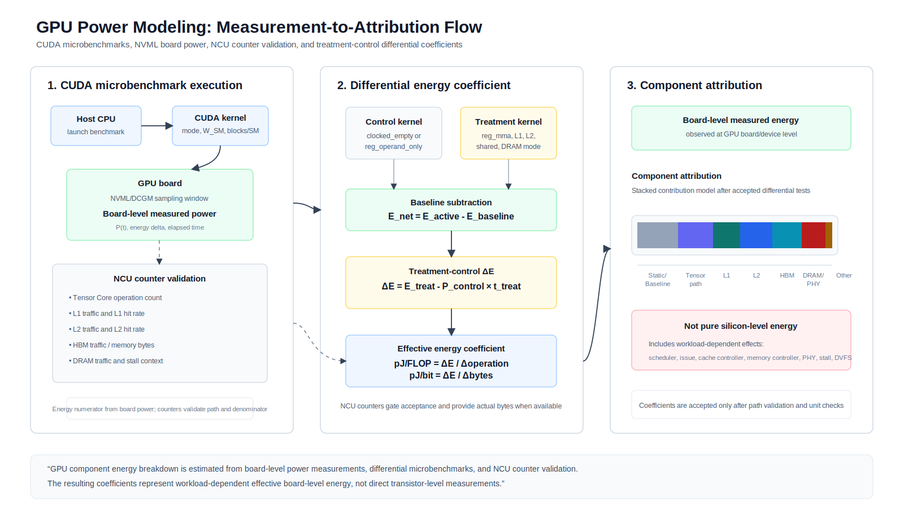
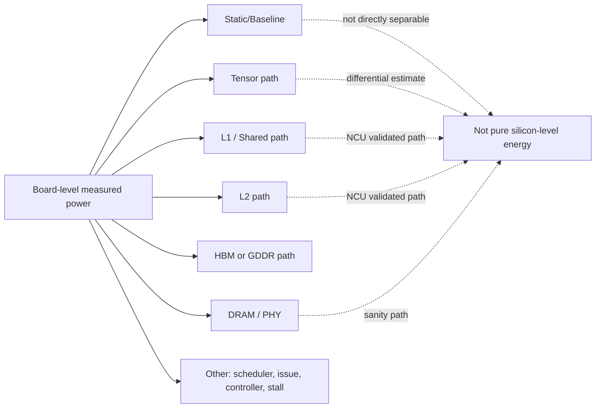
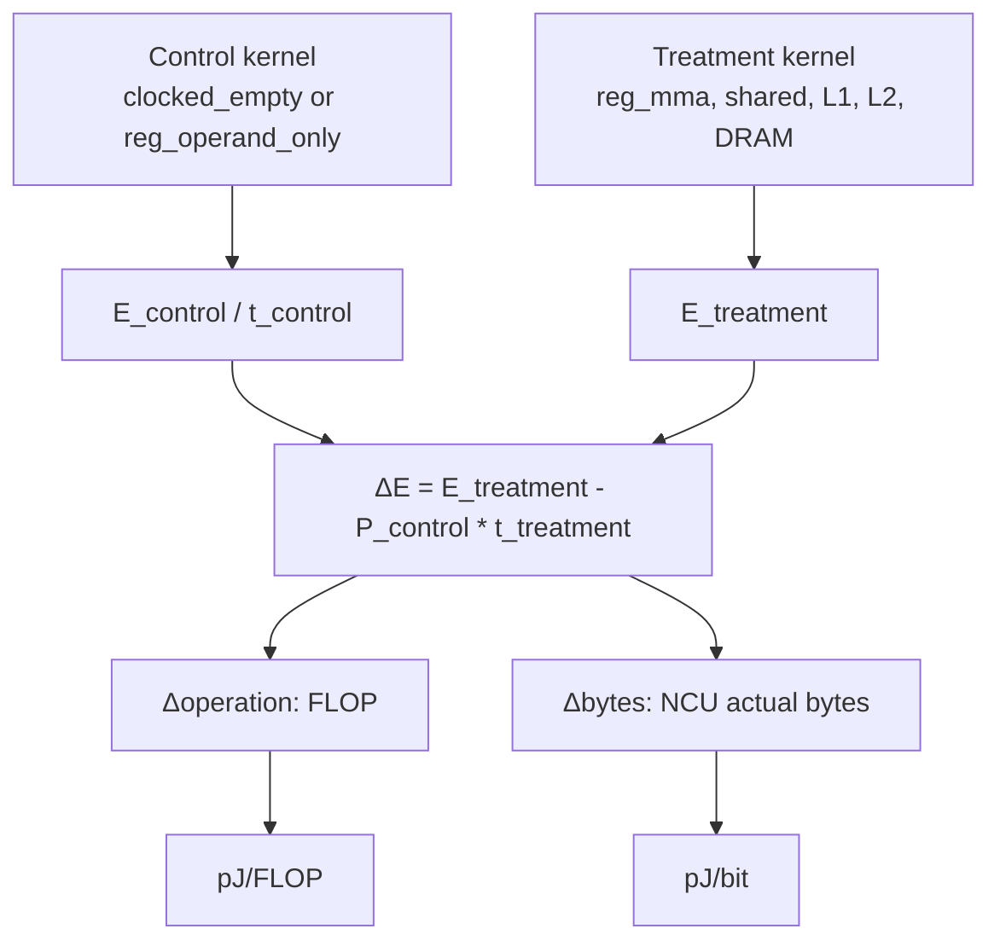
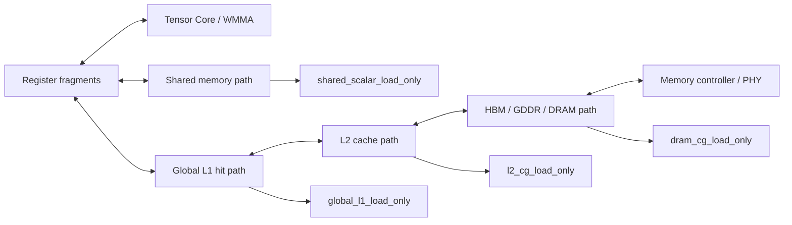
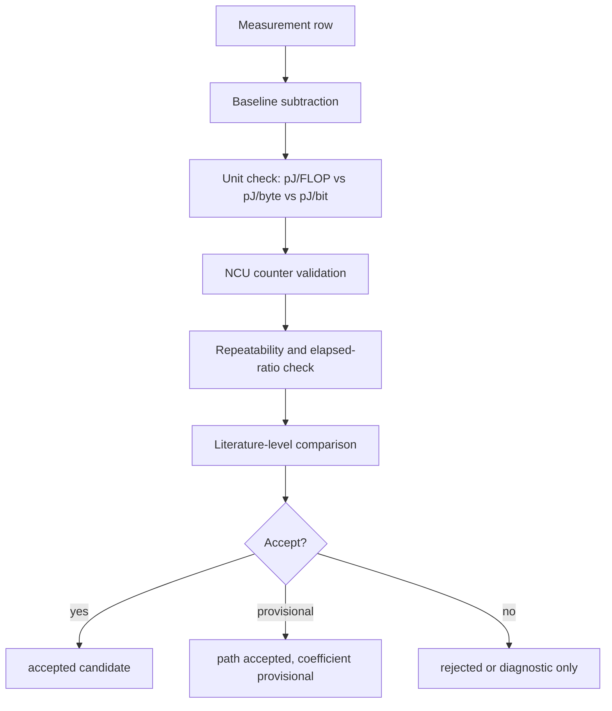

# GPU Power Modeling 실험 백서용 종합 정리

작성일: 2026-07-07

이 문서는 현재 저장소의 코드, 문서, 결과 요약을 기반으로 GPU power modeling 실험의 목적, 방법, 결과 해석, component breakdown, 유효성 검토, 백서 주장 가능 범위를 정리한 백서용 초안이다. 자료에 없는 내용은 “자료상 확인 불가”로 표시한다.

참조한 주요 자료:

| 구분 | 파일 |
|---|---|
| 구현 동작 설명 | `docs/howitworks.md` |
| 최종 실험 계획 | `docs/component_energy_final_experiment_plan_ko.md` |
| NCU 검증과 pJ 계산 | `docs/ncu_validation_energy_calculation_ko.md` |
| 실험 방법 비교 | `docs/component_energy_method_comparison_ko.md` |
| 자가비판 | `docs/component_energy_self_critique_ko.md` |
| 문헌값 감사 | `docs/literature_energy_values_audit_ko.md` |
| 실험 결과 전용 정리 | `docs/gpu_power_modeling_experiment_results_ko.md` |
| RTX 3090 최종 결과 | `results/summary/rtx3090_finalplan_component_energy_report_20260705_ko.md` |
| matched-control 결과 | `results/summary/rtx3090_finalplan_matched_control_report_20260705.md` |
| NCU acceptance 결과 | `results/summary/rtx3090_finalplan_ncu_lr4_acceptance_tensor200m_20260705.md` |

## 1. 전체 실험 목적 복원

이 실험의 궁극적 목적은 GPU board-level power/energy 측정값에서 특정 microbenchmark가 강조하는 Tensor, shared/L1, L2, DRAM 경로의 **workload-dependent effective energy coefficient**를 추정하는 것이다. 측정 대상은 GPU 내부의 순수 회로 에너지나 bitcell energy가 아니다. NVML/DCGM 또는 NVML 기반 harness가 제공하는 값은 GPU board 또는 device level에서 관측되는 전력/에너지이고, 그 안에는 Tensor Core, register file, scheduler, issue logic, cache controller, memory controller, interconnect, PHY, stall, DVFS 상태 변화가 함께 포함된다.

따라서 백서에서 가장 안전한 주장은 다음이다.

```text
본 실험은 CUDA microbenchmark와 treatment-control 차분, NCU counter validation을 결합해
board-level effective microbenchmark coefficient를 추정한다.
```

반대로 다음 주장은 현재 자료 기준으로는 성립하지 않는다.

```text
본 실험은 NVIDIA GPU 내부 component의 순수 회로 에너지를 직접 측정했다.
```

분리하려는 component와 현재 자료상 상태는 다음과 같다.

| Component | 현재 목표 | 현재 자료상 상태 |
|---|---|---|
| Tensor Core / FP16 WMMA | `reg_mma - reg_operand_only`로 no-MMA control 대비 incremental pJ/FLOP 추정 | RTX 3090 finalplan 후보값 있음 |
| Register file | pure RF pJ/access 분리 | 자료상 신뢰 불가. register/control proxy만 존재 |
| Shared memory path | `shared_scalar_load_only - clocked_empty`로 shared scalar load path 추정 | RTX 3090 finalplan 후보값 있음 |
| Global L1 hit path | `global_l1_load_only - clocked_empty`로 L1-hit global load path 추정 | RTX 3090 finalplan 후보값 있음 |
| L2 hit path | `l2_cg_load_only - clocked_empty`로 L1-bypassed L2-hit path 추정 | RTX 3090 finalplan 후보값 있음 |
| DRAM / memory streaming | `dram_cg_load_only - clocked_empty`로 streaming sanity path 추정 | RTX 3090에서는 GDDR6X sanity 후보. physical DRAM energy 아님 |
| HBM | A100/H100/V100 플랫폼에서 확인 대상 | 현재 최종 수치는 RTX 3090 중심이므로 HBM component 수치는 자료상 확인 불가 |
| Memory controller / SoC PHY | board-level path에 포함될 수 있음 | 별도 분리 수치는 자료상 확인 불가 |
| CUDA core / scalar ALU | register pressure 실험에 일부 섞임 | 별도 component로 분리하지 않음 |

단위의 의미는 다음과 같다.

| 단위 | 의미 | 이 실험에서의 사용 |
|---|---|---|
| W | 순간 또는 평균 power | NVML/DCGM sampling 또는 energy delta/elapsed에서 해석 |
| J | 일정 시간 동안 소비한 energy | NVML energy delta와 idle/baseline subtraction 후 `net_E_J` |
| pJ/FLOP | floating-point operation 하나당 effective energy | Tensor `reg_mma - reg_operand_only` 차분을 FLOP로 나눔 |
| pJ/byte | traffic byte 하나당 effective energy | memory path 차분을 NCU actual bytes로 나눔 |
| pJ/bit | traffic bit 하나당 effective energy | `pJ/byte / 8` |
| energy per operation | operation count당 energy | Tensor는 FLOP, 일부 register/control은 logical reg-op 진단값 |

논문/특허/백서 관점에서 이 실험은 “GPU component를 직접 계량했다”는 주장이 아니라, “board-level power measurement와 counter-validated differential microbenchmark로 component-like effective coefficient를 추정하는 실험 절차와 검증 기준”을 뒷받침한다.

## 2. 실험 진행 흐름

아래 표는 현재 자료에서 복원 가능한 시간순 흐름이다.

| 단계 | 시점 또는 파일 | 실험명 | 목적 | 사용한 benchmark/kernel | control 조건 | treatment 조건 | 측정값 | 산출값 | 이 단계에서 알게 된 것 | 한계 |
|---:|---|---|---|---|---|---|---|---|---|---|
| 1 | 초기 sweep, `docs/component_energy_method_comparison_ko.md` | raw mode sweep | 실행 가능 범위와 에너지 추세 탐색 | `reg_mma`, `shared_mma`, `l2_mma`, `dram_mma`, `store_path` | `idle`, `empty` 일부 | mode별 독립 실행 | `net_E_J`, `pJ/FLOP`, elapsed | blocks/SM, W_SM별 경향 | W_SM과 blocks/SM에 따라 성능/에너지 경향이 변함 | raw mode만으로 component 분리 불가 |
| 2 | `docs/howitworks.md` | idle/baseline subtraction | active kernel energy에서 idle 성분 제거 | 모든 non-idle kernel | idle sleep 또는 baseline | active kernel | NVML energy delta, elapsed | `net_E_J` | board-level active energy를 계산하는 기본식 정리 | baseline이 static/dynamic을 완전히 분리하지는 못함 |
| 3 | `scripts/run_component_pairs.py`, 관련 결과 | 초기 treatment-control pair | 같은 좌표의 load-only/MMA pair 차분 시도 | `*_load_only`, `*_mma`, `reg_mma`, `reg_operand_only` | `empty`, `*_load_only` | `*_mma` 등 | energy, elapsed | pair difference | raw total보다 나은 분해 가능성 확인 | elapsed mismatch와 instruction mix 차이 |
| 4 | `docs/register_footprint_experiment_design_ko.md`, 자가비판 | register pressure 검토 | register-only 또는 register+Tensor 분리 가능성 검토 | `reg_pressure`, `reg_mma`, `reg_operand_only` | `empty`, `reg_operand_only` | `reg_pressure`, `reg_mma` | ptxas registers/thread, spill, energy | pJ/update 후보 | `W_SM`은 register footprint가 아님 | direct pJ/update는 pure RF energy로 부적절 |
| 5 | `results/ncu/rtx3090_component_sep_ncu_20260705/` | NCU sidecar 검증 | mode가 실제 어떤 path를 타는지 확인 | global/shared/tensor kernels | sidecar only | representative mode | L1/L2 hit, bytes, stall, HMMA, spill | path acceptance 판단 | 일반 `l2_load_only`는 RTX 3090에서 L1 hit 지배 | NCU replay는 energy run과 분리 필요 |
| 6 | `docs/component_energy_final_experiment_plan_ko.md` | finalplan 설계 | NCU accepted row와 matched-control 차분으로 재설계 | `reg_mma`, `shared_scalar_load_only`, `global_l1_load_only`, `l2_cg_load_only`, `dram_cg_load_only` | `reg_operand_only`, `clocked_empty` | 각 treatment mode | energy CSV, NCU sidecar | accepted candidate coefficient | final 해석 기준 확립 | 순수 회로 에너지가 아니라 effective coefficient |
| 7 | `results/summary/rtx3090_finalplan_*` | RTX 3090 finalplan 결과 | 최종 후보값 산출 | finalplan mode set | matched control | treatment | `net_E_J`, NCU actual bytes, HMMA, spill | pJ/FLOP, pJ/byte, pJ/bit | L1/shared < L2 < DRAM 순서가 논리적으로 정합 | variance, representative NCU, stall 포함 |
| 8 | `docs/cross_platform_component_experiment_guide_ko.md` | A100/V100/H100 확장 계획 | GPU별 구조 차이를 반영한 재실험 가이드 | 같은 harness, profile별 build | 플랫폼별 control | 플랫폼별 treatment | 자료상 실행 전 | 계획/가이드 | RTX 3090 좌표를 그대로 이식하면 안 됨 | A100/V100/H100 실측 결과는 자료상 확인 불가 |

요청에서 언급한 실험별 상태는 다음과 같다.

| 실험 종류 | 자료상 상태 |
|---|---|
| 초기 단순 측정 실험 | 확인됨. raw sweep과 blocks/SM, W_SM sweep 문서화 |
| idle power subtraction 실험 | 확인됨. `net_E_J = delta_E_J - idle_baseline_scaled_J` |
| treatment-control 차분 실험 | 확인됨. final matched-control 분석 사용 |
| NCU counter 기반 검증 실험 | 확인됨. path acceptance와 NCU actual denominator 사용 |
| memory read/write 실험 | read path는 확인됨. store는 보조/과거 진단 수준 |
| Tensor Core FP16 실험 | 확인됨. FP16 WMMA `m16n16k16` 중심 |
| FP8 실험 | 자료상 확인 불가. H100-native FP8/WGMMA/TMA는 미구현으로 문서화 |
| L1/L2/HBM data movement 실험 | L1/L2/DRAM sanity는 RTX 3090에서 확인됨. HBM 실측 수치는 자료상 확인 불가 |
| ECC on/off | 자료상 확인 불가 |
| frequency scaling | 자료상 통제 실험 확인 불가 |
| power limit 변화 | 자료상 통제 실험 확인 불가 |

## 3. 이론 배경

Power는 특정 순간 또는 짧은 sampling window에서의 소비전력이다. Energy는 power를 시간에 대해 적분한 값이다.

```text
E_total = ∫ P(t) dt
```

평균 전력 기반 계산에서는 실행 시간 동안의 평균 power에 elapsed time을 곱해 energy를 근사한다. sampling 기반 적분에서는 시간별 power sample을 누적해 energy를 구한다. 현재 결과 문서에서는 NVML energy delta 또는 power semantics를 사용하며, 최종 보고에서는 `energy_source`와 `nvml_power_usage_semantics`를 함께 기록해야 한다.

Baseline, idle, static, dynamic은 다음처럼 구분한다.

| 용어 | 의미 | 이 실험에서의 사용 |
|---|---|---|
| Idle power | 커널 없이 GPU가 대기할 때의 power | idle/baseline subtraction의 기준 |
| Baseline energy | control kernel 또는 idle에서 측정한 기준 energy | `clocked_empty`, `reg_operand_only`, idle baseline |
| Static power | workload와 무관하게 유지되는 누설/기본 전력 성분 | board-level에서 직접 완전 분리하지 않음 |
| Dynamic power | workload 변화에 따라 증가하는 전력 성분 | `E_active - E_baseline`으로 근사 |

실험 계산식은 다음과 같이 연결된다.

```text
E_dynamic = E_active - E_baseline
Energy coefficient = ΔE / ΔN
pJ/bit = energy / moved bits
pJ/FLOP = energy / floating-point operations
```

최종 matched-control에서는 elapsed가 약간 다를 수 있으므로 control을 power rate로 환산한다.

```text
control_power_W = E_control_J / t_control_s
control_energy_scaled_J = control_power_W * t_treatment_s
delta_E_J = E_treatment_J - control_energy_scaled_J
```

Tensor의 경우:

```text
N_MMA = active_SM * blocks_per_SM * ITER * reuse_factor
FLOP = N_MMA * 8192
pJ/FLOP = delta_E_J * 1e12 / FLOP
```

Memory path의 경우:

```text
expected_bytes = active_SM * blocks_per_SM * ITER * load_repeat * 1024 bytes
NCU scale = NCU actual bytes / expected bytes
denominator_bytes = energy-run expected bytes * NCU scale
pJ/byte = delta_E_J * 1e12 / denominator_bytes
pJ/bit = pJ/byte / 8
```

GPU board power와 내부 component energy가 다른 이유는 계량 위치 때문이다. 이 실험의 계량기는 GPU 내부의 L1 SRAM array나 Tensor Core transistor에 붙어 있지 않고, board/device level의 총 power를 본다. 따라서 component별 값은 직접 측정값이 아니라 “특정 workload가 특정 path를 더 많이 사용하도록 설계한 뒤 control과 차분해 추정한 effective coefficient”다.

## 4. Component breakdown 계산 복원

현재 finalplan의 breakdown은 전체 board energy를 물리적으로 완전히 분해한 것이 아니라, accepted microbenchmark pair에서 얻은 component-like coefficient 표다.

| Component | 의미 | 근거 counter 또는 benchmark | coefficient 단위 | coefficient 값 | 계산 방식 | 직접 측정/추정/가정 | 신뢰도 | 주요 한계 |
|---|---|---|---|---:|---|---|---|---|
| Tensor MMA incremental | no-MMA register/control 대비 WMMA 추가분 | `reg_mma`, `reg_operand_only`, HMMA > 0/0, spill 0 | pJ/FLOP | median 0.168, min 0.0878, max 0.295 | `reg_mma - reg_operand_only` 차분 / FLOP | 추정 | 중간 | threshold 완화, pure Tensor Core 아님 |
| Shared scalar path | shared-memory scalar load path | `shared_scalar_load_only`, shared bytes, bank conflict 0 | pJ/bit | median 0.271, min 0.0997, max 0.919 | treatment-control / NCU shared bytes | 추정 | 중간 이상 | variance high, board-level overhead 포함 |
| Global L1 hit path | global load가 L1 hit로 끝나는 path | `global_l1_load_only`, L1 hit 99.999%, L2/L1 낮음 | pJ/bit | median 0.156, min 0.0789, max 0.690 | treatment-control / NCU L1 bytes | 추정 | 중간 | variance high, W=64 rejected |
| L2 CG hit path | L1 우회 L2-hit path | `l2_cg_load_only`, L1 hit ~0%, L2 hit ~99.94% | pJ/bit | median 1.176, min 0.947, max 3.064 | treatment-control / NCU L2 bytes | 추정 | 중간 이상 | long scoreboard/stall-heavy |
| DRAM CG streaming path | DRAM streaming sanity path | `dram_cg_load_only`, DRAM bytes dominant, L2 hit 낮음 | pJ/bit | median 4.006, min 2.825, max 6.044 | treatment-control / NCU DRAM bytes | sanity 추정 | 중간 이하 | RTX 3090 GDDR6X path, physical DRAM energy 아님 |
| Register/control | no-MMA register-fragment/control proxy | `reg_operand_only`, `reg_pressure`, ptxas spill 확인 | pJ/reg-op 또는 진단값 | 최종값으로 채택 안 함 | direct division 또는 control proxy | 진단 | 낮음 | scalar ALU/scheduler/control 포함 |
| HBM | HBM data movement | 자료상 최종 실측 없음 | pJ/bit | 자료상 확인 불가 | 자료상 확인 불가 | 자료상 확인 불가 | 낮음 | A100/H100/V100 실험 필요 |
| Memory controller / PHY | memory path 일부 | board-level path에 포함 가능 | 별도 단위 없음 | 자료상 확인 불가 | 분리 모델 없음 | 자료상 확인 불가 | 낮음 | L2/DRAM coefficient 안에 섞임 |

중복 계산 가능성은 있다. 예를 들어 DRAM streaming path는 DRAM device만이 아니라 L2 lookup, memory controller, interconnect, PHY, stall을 포함할 수 있다. 따라서 이 표를 “Static + Tensor + L1 + L2 + DRAM을 더하면 정확한 board energy가 된다”는 물리 분해로 쓰면 안 된다. 백서에서는 “component attribution candidate” 또는 “effective path coefficient”로 표현해야 한다.

상수 operand, cache hit, register reuse, compiler optimization, clock gating, DVFS 영향은 다음처럼 다뤄야 한다.

| 요인 | 자료상 처리 | 남은 위험 |
|---|---|---|
| 상수 operand | checksum/anti-optimization 경로와 NCU instruction 확인 | switching activity 과소평가 가능성은 남음 |
| cache hit/reuse | NCU hit rate와 bytes로 검증 | representative NCU row 가정 |
| register reuse | `reuse_factor` sweep으로 amortization 확인 | pure RF 분리 불가 |
| compiler optimization | ptxas spill, HMMA count, checksum 사용 | SASS 수준 완전 감사는 자료상 제한 |
| clock gating/DVFS | energy run과 NCU run 분리, elapsed 기록 | clock 고정/주파수 sweep은 자료상 확인 불가 |

## 5. 실험 결과 타당성 평가

| 평가 항목 | 판단 | 근거 |
|---|---|---|
| 단위 일관성 | 개선됨 | Tensor는 pJ/FLOP, memory는 pJ/byte 및 pJ/bit로 분리 |
| pJ/bit와 pJ/FLOP 혼용 | 주의 필요 | 최종 문서에서는 분리했지만 과거 raw pJ/FLOP 해석은 위험 |
| idle/baseline subtraction | 기본 구조는 있음 | board-level baseline을 완전 static/dynamic 분리로 보면 안 됨 |
| control/treatment 실행시간 | 개선됨 | elapsed-aware control scaling, max elapsed ratio 사용 |
| 동일 occupancy 조건 | 대체로 맞춤 | blocks/SM, active_SM 고정 finalplan |
| 동일 memory traffic 조건 | component별로 다름 | treatment-control의 instruction mix 차이 남음 |
| 반복 횟수/실행 시간 | finalplan은 5 s, repeats 3 | 백서 최종 정량값으로는 10 s 이상, repeats 5 이상 권장 |
| clock/temperature/power limit/ECC 통제 | 자료상 불충분 | preflight 기록은 있으나 통제 실험은 확인 불가 |
| NCU counter 대표성 | path 판정에는 유용 | 모든 energy row 1:1 NCU가 아니라 representative scale |
| compiler optimization 제거 | 일부 확인 | HMMA/spill/bytes로 검증하지만 완전한 SASS audit은 제한 |
| 문헌 범위 비교 | 해석 레벨 분리 필요 | literature audit에서 device/circuit vs transaction path vs board coefficient를 구분 |

등급 평가는 주장 수준에 따라 달라진다.

| 주장 수준 | 등급 | 이유 |
|---|---|---|
| RTX 3090에서 NCU accepted microbenchmark의 board-level effective coefficient 후보 | B | path 검증, NCU denominator, matched-control이 있으나 representative NCU와 variance가 남음 |
| 경향성 설명: L1/shared < L2 < DRAM sanity | B | 최종 결과의 계층 순서가 논리적이고 NCU path와 정합 |
| 논문/백서의 방법론 설명 | B | 제한과 reject rule을 명시하면 사용 가능 |
| 물리 component energy 또는 silicon-level bitcell energy 주장 | D | board-level 계량과 path overhead가 섞여 직접 측정이 아님 |
| A100/V100/H100 수치 일반화 | D | 현재 final numeric result는 RTX 3090 중심이고 플랫폼별 실측이 필요 |

## 6. 쉬운 설명

GPU 전체 board power는 건물 전체 전기요금과 같다. Tensor Core, L1, L2, HBM, DRAM은 건물 안의 부서들이다. 그런데 계량기가 건물 전체에 하나만 있으면 각 부서의 전기 사용량을 직접 읽을 수 없다.

그래서 이 실험은 특정 부서만 더 많이 일하게 하는 microbenchmark를 만든다. 예를 들어 Tensor Core를 많이 쓰는 treatment kernel과 Tensor Core만 뺀 control kernel을 비교한다. 두 실행의 차이 `ΔE`를 Tensor FLOP 수로 나누면 “이 조건에서 Tensor path가 추가로 만든 board-level energy per FLOP”을 얻는다.

같은 방식으로 L1, L2, DRAM path도 각각 강조한 kernel을 만들고, NCU counter로 실제로 그 부서가 일했는지 확인한다. 따라서 결과는 “부서 내부 회로 하나하나의 순수 전력”이 아니라 “이 건물, 이 workload, 이 측정 방식에서 관찰된 effective coefficient”다.

## 7. 백서용 그림

### Figure 1. GPU power modeling 전체 개념도



Caption: GPU component energy breakdown is estimated from board-level power measurements, differential microbenchmarks, and NCU counter validation. The resulting coefficients represent workload-dependent effective board-level energy, not direct transistor-level measurements.

### Figure 2. Board-level power와 component-level energy의 차이



Caption: Board-level power contains static baseline, compute path, memory hierarchy path, controller, PHY, and stall effects. The experiment estimates effective path coefficients, not isolated transistor-level component energy.

### Figure 3. Treatment-control 차분 실험 구조



Caption: The differential method subtracts a time-scaled control energy from the treatment energy and normalizes the result by operations or counter-validated traffic bytes.

### Figure 4. GPU memory hierarchy 기반 data movement breakdown



Caption: Different microbenchmarks emphasize different paths through the GPU memory hierarchy. Shared memory and global L1 are separated because they use different programming models and instruction paths even when they share SM-local resources.

### Figure 5. 실험 신뢰도 검증 flow



Caption: A coefficient is reported only after energy subtraction, unit consistency, counter validation, repeatability checks, and interpretation-level comparison. Rejected rows remain documented.

## 8. 최종 백서 구조 제안

### 1. Executive Summary

이 장은 실험의 결론을 짧게 제시한다. 본 실험은 GPU 내부 회로 에너지를 직접 측정한 것이 아니라, CUDA microbenchmark와 board-level power measurement, NCU counter validation을 결합해 effective board-level energy coefficient를 추정한 것이라고 명시한다. RTX 3090 finalplan에서 Tensor, shared scalar, global L1, L2 CG, DRAM CG streaming path 후보값을 얻었으며, 이 값은 workload-dependent coefficient라는 제한을 함께 제시한다.

### 2. Motivation

이 장은 GPU workload의 에너지 모델링에서 component-level 해석이 필요한 이유를 설명한다. 단순히 전체 GPU power만 보면 Tensor 연산과 data movement 중 무엇이 에너지를 지배하는지 알기 어렵다. 하지만 GPU 내부 component별 전력계가 없기 때문에 microbenchmark와 차분 실험을 통해 attribution을 추정해야 한다.

### 3. GPU Power and Energy Modeling Background

이 장은 power와 energy의 관계, baseline/static/dynamic power의 차이, pJ/FLOP와 pJ/bit의 의미를 설명한다. 또한 board-level energy와 silicon-level component energy가 다르다는 점을 수식과 비유로 정리한다.

### 4. Measurement Methodology

이 장은 NVML/DCGM 또는 NVML 기반 energy run이 어떻게 수행되는지 설명한다. Energy run은 NCU 없이 수행하고, NCU는 별도 sidecar로 path와 denominator를 검증한다는 분리를 명확히 한다.

### 5. Microbenchmark Design

이 장은 `reg_mma`, `reg_operand_only`, `shared_scalar_load_only`, `global_l1_load_only`, `l2_cg_load_only`, `dram_cg_load_only`의 의미를 설명한다. `shared_mma`, `l2_mma`, `dram_mma`는 보조 또는 과거 탐색 mode이며 현재 final coefficient의 primary pair가 아니라고 정리한다.

### 6. Treatment-Control Differential Method

이 장은 treatment와 control의 차분 계산식을 설명한다. Control energy를 power rate로 환산하고 treatment elapsed time에 맞춰 빼는 이유를 설명하며, denominator가 Tensor에서는 FLOP, memory에서는 NCU actual bytes라는 점을 분리한다.

### 7. NCU Counter Validation

이 장은 NCU가 energy를 직접 측정하지 않고 path validation과 denominator validation을 수행한다는 점을 설명한다. L1/L2 hit rate, shared bytes, DRAM bytes, stall, HMMA, spill/local memory를 어떤 기준으로 보는지 표로 제시한다.

### 8. Component Energy Breakdown

이 장은 최종 candidate coefficient 표를 제시한다. Tensor는 pJ/FLOP, shared/L1/L2/DRAM은 pJ/bit로 분리해 보고하고, DRAM은 streaming sanity path라고 명시한다.

### 9. Experimental Results

이 장은 RTX 3090 finalplan 결과, rejected row, NCU acceptance 결과를 함께 제시한다. Global L1 W=64, 일반 `l2_load_only`, `shared_load_only`, register direct pJ/update가 왜 제외되었는지도 기록한다.

### 10. Validity Check and Limitations

이 장은 representative NCU, variance, clock/temperature/power limit 통제 부족, Tensor threshold 완화, H100-native path 미구현 같은 한계를 논의한다. 문헌값과 비교할 때 device/circuit energy, transaction path, board-level coefficient를 구분해야 한다고 설명한다.

### 11. Interpretation: What We Can and Cannot Claim

이 장은 주장 가능/불가능 문장을 표로 정리한다. “board-level effective coefficient를 추정했다”는 가능하지만 “순수 silicon-level energy를 측정했다”는 불가능하다고 명확히 한다.

### 12. Recommendations for Next Experiments

이 장은 NCU sidecar를 모든 load_repeat/reuse 좌표로 확장하고, Tensor acceptance를 bytes/FLOP ratio로 바꾸며, A100/V100/H100에서 profile별 finalplan을 다시 실행하라는 제안을 담는다.

### 13. Appendix: Raw Tables, Equations, Scripts, Reproducibility Checklist

이 장은 raw CSV, NCU summary, matched-control summary, 실행 명령, 환경 preflight, 단위 표, acceptance/reject 기준을 재현성 체크리스트로 묶는다.

## 9. 백서에서 주장 가능한 것과 불가능한 것

| 주장 | 사용 가능 여부 | 근거 | 주의 문구 |
|---|---|---|---|
| “GPU 내부 component energy를 측정했다” | 불가 | board-level energy만 측정 | “직접 측정” 대신 “effective coefficient 추정” 사용 |
| “board-level effective energy coefficient를 추정했다” | 가능 | NVML energy, treatment-control, NCU validation | workload-dependent라고 명시 |
| “Tensor Core FP16 energy는 x pJ/bit이다” | 불가 | Tensor 결과 단위는 pJ/FLOP | `0.168 pJ/FLOP effective MMA incremental`로 표현 |
| “이 값은 NVIDIA A100 GPU의 일반적인 물리적 에너지이다” | 불가 | 현재 final 수치는 RTX 3090 중심 | A100은 별도 실험 필요 |
| “특정 benchmark 조건에서 FP16 Tensor path의 incremental board energy를 추정했다” | 가능 | `reg_mma - reg_operand_only`, HMMA/spill 검증 | pure Tensor Core energy 아님 |
| “L1/L2/HBM data movement energy breakdown을 얻었다” | 부분 가능 | L1/L2는 RTX 3090 path coefficient 있음. HBM은 없음 | “HBM”은 A100/H100/V100 실험 전에는 제외 |
| “NCU counter로 memory path가 검증되었다” | 가능 | L1/L2/DRAM/shared bytes와 hit rate 사용 | representative NCU row 가정 명시 |
| “DRAM 4.006 pJ/bit는 physical DRAM energy다” | 불가 | board-level GDDR6X streaming sanity path | physical DRAM/HBM device 값과 직접 비교 금지 |
| “L2 CG path는 Global L1 path보다 높은 effective coefficient를 보였다” | 가능 | RTX 3090 finalplan median L1 0.156, L2 1.176 pJ/bit | accepted microbenchmark 조건으로 제한 |

## 10. 바로 사용할 수 있는 요약

### 짧은 버전: 5문장

이 실험은 GPU 내부 회로 에너지를 직접 측정한 것이 아니라, CUDA microbenchmark와 board-level power 측정으로 workload-dependent effective energy coefficient를 추정한 것이다. NVML energy run에서 얻은 `J`를 treatment-control 방식으로 차분하고, Tensor는 FLOP, memory path는 NCU actual bytes로 나누어 pJ/FLOP 또는 pJ/bit를 계산했다. RTX 3090 finalplan에서는 Tensor 0.168 pJ/FLOP, Global L1 0.156 pJ/bit, Shared scalar 0.271 pJ/bit, L2 CG 1.176 pJ/bit, DRAM CG streaming 4.006 pJ/bit 후보를 얻었다. 이 값은 NCU로 path가 검증된 microbenchmark coefficient이며, 순수 SRAM/HBM/DRAM bitcell energy가 아니다. A100/V100/H100에 대해서는 같은 acceptance-first 절차를 다시 수행해야 하며 RTX 3090 수치를 그대로 일반화하면 안 된다.

### 백서용 버전: 2~3문단

본 실험은 GPU power modeling에서 component별 에너지 기여도를 해석하기 위한 microbenchmark 기반 방법론을 제시한다. GPU board-level power는 Tensor Core, register file, cache hierarchy, memory controller, PHY, scheduler, stall, clock state가 모두 합쳐진 값이므로, 내부 component의 순수 회로 에너지를 직접 제공하지 않는다. 따라서 본 연구는 CUDA microbenchmark를 통해 특정 path를 강조한 treatment kernel과 control kernel을 구성하고, 두 실행의 board-level energy 차이를 operation count 또는 NCU actual traffic bytes로 정규화해 effective energy coefficient를 추정한다.

RTX 3090 finalplan 결과에서 accepted candidate는 Tensor MMA incremental 0.168 pJ/FLOP, Global L1 hit path 0.156 pJ/bit, Shared scalar path 0.271 pJ/bit, L2 CG hit path 1.176 pJ/bit, DRAM CG streaming sanity path 4.006 pJ/bit로 정리된다. 이 순서는 NCU counter validation에서 확인된 L1/L2/DRAM hit/access behavior와 대체로 정합하지만, 모든 값은 board-level effective microbenchmark coefficient로 제한해서 해석해야 한다. 특히 DRAM 수치는 physical DRAM device energy가 아니라 RTX 3090 GDDR6X streaming path sanity coefficient이며, HBM2/HBM3 device energy 문헌값과 직접 비교하면 안 된다.

방법론적으로 중요한 점은 energy run과 NCU run을 분리했다는 것이다. Energy numerator는 NCU가 아니라 NVML board-level energy에서 얻고, NCU는 path acceptance와 denominator validation에 사용한다. 이 분리는 NCU replay가 energy measurement 자체를 바꿀 수 있다는 문제를 피하면서도, mode 이름만으로는 보장되지 않는 L1/L2/DRAM/shared 경로를 counter로 검증하기 위한 설계다.

### 발표용 버전: 쉬운 설명 중심 1분 스크립트

GPU 전체 전력은 건물 전체 전기요금과 비슷합니다. Tensor Core, L1 cache, L2 cache, DRAM은 건물 안의 부서들인데, 우리에게 있는 계량기는 부서별 계량기가 아니라 건물 전체 계량기입니다. 그래서 이 실험은 한 번에는 Tensor 부서가 더 많이 일하게 하고, 다른 한 번에는 거의 같은 일을 하지만 Tensor 일을 뺀 control을 실행합니다. 두 전기요금의 차이를 계산하고, 그 차이를 FLOP 수나 NCU가 확인한 memory traffic byte 수로 나누면 특정 workload 조건에서의 effective energy coefficient를 얻을 수 있습니다. 다만 이 값은 부서 안의 개별 회로가 쓴 순수 에너지가 아니라, 이 GPU board와 이 microbenchmark 조건에서 관찰된 board-level 추정값이라는 점을 반드시 같이 말해야 합니다.
