# How It Works: FP16 MMA Energy Microbenchmark

작성일: 2026-07-02
최종 업데이트: 2026-07-06

이 문서는 현재 코드가 각 mode별 실험을 실제로 어떻게 실행하고, 어떤 값을 CSV에 저장하며, component-like energy coefficient를 어떻게 해석해야 하는지 설명한다.

핵심 결론부터 정리하면 다음과 같다.

| 질문 | 현재 구현의 답 |
|---|---|
| `reg_mma`는 무엇인가? | memory operand 공급 비용을 최대한 줄이고, register fragment 기반 `mma_sync`를 반복하는 Tensor Core baseline mode다. |
| register와 tensor를 분리할 control이 있는가? | `reg_operand_only`가 추가됐다. `reg_mma`와 같은 반복 구조에서 sampled register fragment 값을 소비하지만 `mma_sync`는 수행하지 않는다. |
| `shared_mma`, `l2_mma`, `dram_mma` raw 값은 이미 `reg_mma`를 뺀 값인가? | 아니다. 각 mode는 독립 실행한 total energy에서 idle baseline만 뺀 `net_E_J`를 기록한다. |
| component 분해는 어디서 하는가? | `scripts/analyze_component_pairs.py`가 `*_load_only`, `*_mma`, `empty` row를 이용해 paired-difference를 계산한다. |
| `W_SM`은 모든 mode에서 실제 working set인가? | 아니다. `shared_*`, `l2_*`, `dram_*`에서는 실제 working set에 쓰이고, register/control/store 계열에서는 비교 좌표에 가깝다. |
| 최종 주장은 무엇으로 제한해야 하는가? | 물리적 순수 component energy가 아니라, 이 microbenchmark 구조에서 관측되는 effective component coefficient다. |
| parameter sweep은 왜 하는가? | blocks/SM, W_SM, reuse, load_repeat를 바꿔 어떤 조건에서 Tensor/Shared/L1/L2/DRAM 경로가 분리되는지 찾기 위해서다. |
| 최종 coefficient는 어떻게 채택하는가? | energy 차분이 양수이고, NCU hit/access/stall 검증으로 의도한 path가 확인된 row만 후보로 사용한다. |

## 이 문서의 읽는 법

이 문서는 두 종류의 결과를 구분해서 읽어야 한다.

| 구분 | 무엇인가 | 어디에 쓰는가 | 주의 |
|---|---|---|---|
| Raw sweep result | 각 mode를 독립 실행해서 얻은 `net_E_J`, `pJ/FLOP`, expected bytes | workload가 커질 때 전체 에너지가 어떻게 변하는지 보는 1차 탐색 | component별 에너지로 바로 해석하면 안 된다. |
| NCU path validation | Nsight Compute로 L1/L2/DRAM/shared bytes, hit rate, stall, Tensor instruction을 확인한 결과 | 해당 mode가 의도한 memory hierarchy를 실제로 탔는지 판정 | NCU replay가 energy 측정 자체를 바꿀 수 있으므로 energy run과 분리한다. |
| Matched-control coefficient | 같은 조건의 treatment와 control을 차분한 뒤 FLOP 또는 NCU actual bytes로 나눈 값 | Tensor, L1/shared, L2, DRAM 경로의 effective coefficient 후보 | 순수 회로 energy가 아니라 board-level microbenchmark coefficient다. |

따라서 문서를 읽는 순서는 다음이 안전하다.

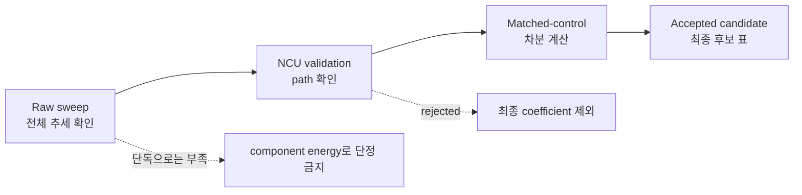

## Effective Microbenchmark Coefficient의 의미

이 실험에서 말하는 `Tensor`, `L1`, `L2`, `DRAM` 값은 GPU 회로 내부의 순수 bitcell energy가 아니다. NVML은 GPU 보드 또는 디바이스 전체 에너지를 측정한다. 그래서 측정값에는 Tensor Core, register file, scheduler, warp issue, LSU, cache tag/data, memory controller, clock 변화, stall에 의한 대기 비용이 함께 들어간다.

이 문서에서 채택하는 표현은 다음이다.

```text
effective microbenchmark coefficient
  = NCU로 의도한 path가 확인된 microbenchmark에서
    treatment-control 추가 에너지를
    FLOP 또는 실제 traffic bytes/bits로 나눈 값
```

예를 들어 `L2 CG hit path = 1.176 pJ/bit`는 "RTX 3090의 L2 SRAM bitcell 하나를 읽는 데 1.176 pJ가 든다"는 뜻이 아니다. 더 정확히는 "이 microbenchmark에서 L1을 우회하고 L2 hit가 지배적인 global load path를 만들었을 때, `clocked_empty` 대비 추가 board-level energy를 NCU L2 traffic bit로 나누면 median 1.176 pJ/bit가 나왔다"는 뜻이다.

| 항목 | 장점 | 한계 | 오해하기 쉬운 표현 | 권장 표현 |
|---|---|---|---|---|
| NVML energy | 실제 GPU에서 관측된 에너지라 현실성이 있다. | component별 전력계를 직접 읽는 것이 아니다. | `L1 순수 에너지` | `L1-hit path effective coefficient` |
| NCU path 검증 | L1/L2/DRAM/shared traffic과 hit rate를 확인할 수 있다. | 모든 energy row를 1:1로 profiling하지 않으면 대표값 가정이 남는다. | `W_SM만 맞으면 L2 실험` | `NCU에서 L2 hit가 확인된 row` |
| matched-control 차분 | 공통 오버헤드를 일부 제거할 수 있다. | control instruction mix가 완전히 같지 않으면 음수/분산이 생긴다. | `차분하면 순수 component만 남는다` | `control 대비 추가 effective energy` |
| pJ/bit, pJ/FLOP | 계층/연산 간 비교가 쉽다. | denominator 정의가 다르면 직접 비교하면 안 된다. | `HBM 3.9 pJ/bit와 직접 비교` | `device energy와 path coefficient는 별도 비교` |

최종 보고서에서 쓸 수 있는 안전한 문장은 다음과 같다.

```text
본 값은 NCU로 path가 검증된 microbenchmark에서 얻은
board-level effective coefficient이며, 순수 회로/bitcell energy가 아니다.
```

## Parameter Sweep 개요

Sweep은 실험자가 한 조건을 바꿔 보면서 결과가 어떻게 변하는지 보는 절차다. 이 실험에서는 GPU 구조상 어느 계층이 쓰이는지를 의도적으로 바꾸기 위해 sweep을 사용한다.

| 실험자가 조절한 파라미터 | 단위 | 의미 | 주로 적용되는 mode | 관찰한 값 |
|---|---:|---|---|---|
| `blocks_per_SM` | blocks/SM | SM 하나에 동시에 올릴 block 수 | 모든 non-idle mode | `pJ/FLOP`, `net_E_J`, elapsed, SMID 분포 |
| `W_SM` | KiB 또는 MiB per SM | SM당 logical working set | shared/L2/DRAM 계열 | cache/shared/L2/DRAM regime, pJ/FLOP, pJ/bit |
| `reuse_factor` | count | 한 번 준비한 operand로 MMA를 반복하는 횟수 | `*_mma`, `reg_mma`, `reg_operand_only` | Tensor FLOP 대비 energy |
| `load_repeat` | count | iteration당 operand load 반복 횟수 | shared/L1/L2/DRAM load-only mode | memory traffic 대비 energy |
| `seconds` | s | 각 실행의 목표 측정 시간 | 전체 | NVML noise와 thermal drift |
| `repeats` | count | 같은 조건 반복 횟수 | 전체 | median, min, max, variance |

실험자가 바꾼 것과 관찰한 것을 분리하면 다음과 같다.

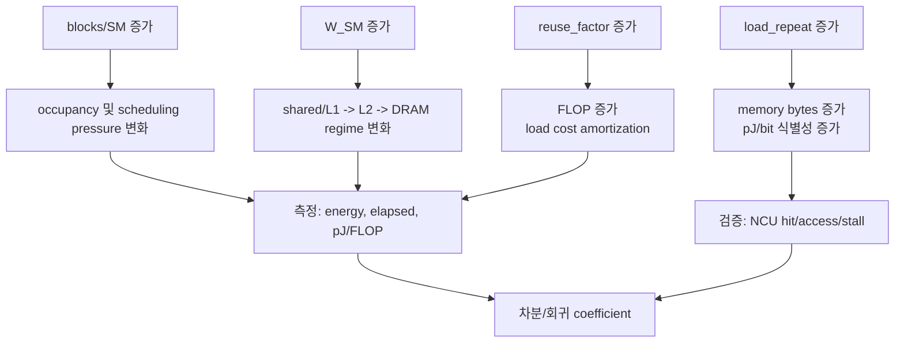

### 초기 탐색 sweep

초기 sweep은 component coefficient를 확정하기 위한 실험이 아니라, 어떤 범위에서 실행 가능하고 어떤 mode가 에너지를 크게 쓰는지 보는 탐색이다.

| Sweep | 변경한 조건 | 실행/선택 조건 | 측정값 | 얻은 정보 | 주의 |
|---|---|---|---|---|---|
| Sweep 1, blocks/SM | `1,2,4,8,16,32` 요청 | RTX 3090에서는 `1,2,4,8,16` 실행, `32`는 resident block 한계로 invalid | `pJ/FLOP`, `net_E_J`, elapsed | blocks/SM 증가 시 pJ/FLOP가 대체로 감소하는 경향 | scheduling, occupancy, memory pressure가 함께 바뀌므로 단일 원인으로 해석 금지 |
| Sweep 2, W_SM | `1 KiB`부터 `128 MiB`까지 2배 증가 | shared/L2/DRAM 가능 범위만 실행 | mode별 pJ/FLOP, 실행 가능 여부 | shared-resident, L2-candidate, DRAM-candidate 범위 탐색 | `reg_mma`의 `W_SM`은 register working set이 아님 |

초기 탐색에서 사용한 대표 고정 working set은 다음과 같다.

| mode | W_SM | 당시 의도 | 현재 해석 |
|---|---:|---|---|
| `reg_mma` | 32 KiB | register/Tensor baseline 좌표 | register file 32 KiB 사용이 아니라 표 정렬용 좌표 |
| `shared_mma` | 64 KiB | shared-resident 조건 | NCU 없이 shared path 확정 불가 |
| `l2_mma` | 64 KiB | full-GPU working set이 L2 후보 범위 | RTX 3090에서는 일반 `l2_load_only`가 L1 hit 지배로 나중에 제외 |
| `dram_mma` | 8192 KiB | L2를 크게 초과하는 DRAM-dominant 조건 | DRAM streaming sanity 후보 |

### 최종 component 실험에서 선택한 sweep

최종 실험은 raw `*_mma` 비교가 아니라 NCU path 검증과 matched-control 차분을 전제로 설계했다.

| Component | treatment/control modes | 선택 W_SM | blocks/SM | active_SM | sweep factor | seconds | repeats | 선택 이유 |
|---|---|---:|---:|---:|---|---:|---:|---|
| Tensor | `reg_mma` / `reg_operand_only` | 2048 KiB | 16 | 82 | `reuse_factor=1,2,4,8,16` | 5 s | 3 | no-MMA register/control 대비 WMMA 추가분 추정 |
| Shared scalar | `shared_scalar_load_only` / `clocked_empty` | 64 KiB | 16 | 82 | `load_repeat=1,2,4,8,16` | 5 s | 3 | bank conflict가 낮은 shared scalar path 사용 |
| Global L1 | `global_l1_load_only` / `clocked_empty` | 16, 64 KiB | 16 | 82 | `load_repeat=1,2,4,8,16` | 5 s | 3 | L1 hit path 확인. 최종값은 NCU denominator가 있는 W=16만 사용 |
| L2 CG | `l2_cg_load_only` / `clocked_empty` | 64 KiB | 16 | 82 | `load_repeat=1,2,4,8,16` | 5 s | 3 | RTX 3090에서 L1을 우회해 L2 hit path를 만들기 위해 `.cg` 사용 |
| DRAM CG | `dram_cg_load_only` / `clocked_empty` | 8192 KiB | 16 | 82 | `load_repeat=1,4,16` | 5 s | 3 | 필수 목표가 아니라 L2/DRAM 순서 sanity check |

최종 채택/제외 기준은 다음이다.

| 기준 | 채택 | 제외 |
|---|---|---|
| Energy coefficient | 양수이고 반복 간 해석 가능 | 음수 coefficient 또는 분산이 너무 커서 control 실패가 의심되는 경우 |
| NCU denominator | NCU actual bytes가 있거나 같은 working set 대표 row로 보정 가능 | byte path인데 NCU denominator가 없는 경우 |
| L1 path | L1 hit가 높고 L2/L1, DRAM/L1 ratio가 낮음 | L1 hit가 낮거나 실제 traffic이 다른 계층으로 새는 경우 |
| L2 path | L1 hit가 낮고 L2 hit가 높으며 DRAM/L2 ratio가 낮음 | RTX 3090 일반 `l2_load_only`처럼 L1 hit가 높은 경우 |
| Shared path | shared bytes가 충분하고 bank conflict가 낮음 | bank conflict가 높아 path가 오염된 경우 |
| Tensor path | HMMA > 0, spill/local 0, memory traffic이 작음 | spill/local 또는 과도한 memory traffic |

## Component 분해 시각화

최종 component 후보는 아래처럼 raw mode를 그대로 비교하지 않고, control과 treatment를 맞춰 차분한다.

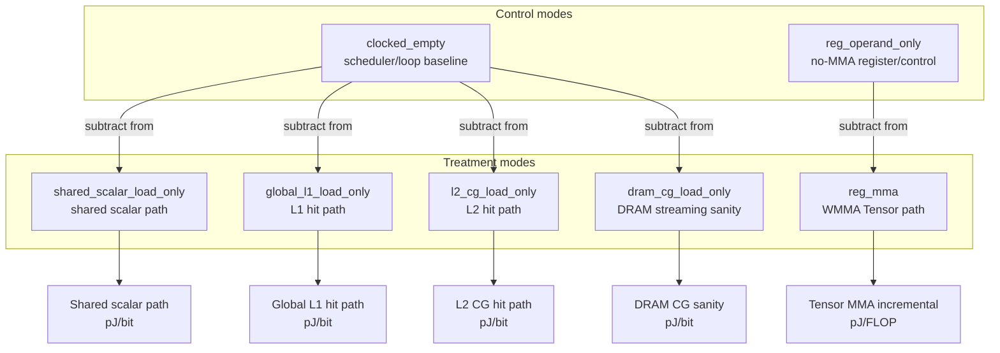

Memory hierarchy 관점에서는 다음처럼 이해한다.

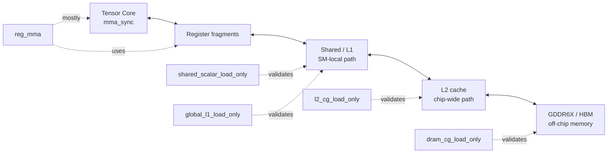

이 그림의 핵심은 `DRAM path`도 DRAM만 의미하지 않는다는 점이다. GPU의 global load는 일반적으로 L2/cache/memory controller를 지나므로, DRAM coefficient에는 path 전체의 stall/control 비용이 섞일 수 있다.

## 전체 구조

현재 실험은 두 단계로 나뉜다.

1. **Raw energy run**: 각 mode를 독립적으로 실행하고 `net_E_J`, `pJ_per_FLOP`, expected byte count 등을 CSV에 저장한다.
2. **Paired-difference analysis**: 같은 좌표의 control mode와 treatment mode를 차분해 effective coefficient를 계산한다.

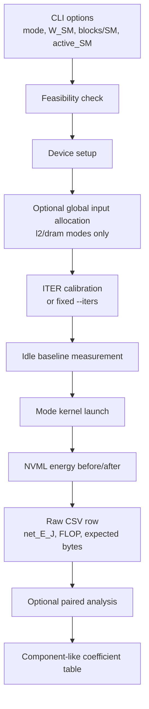

Raw CSV의 `net_E_J`는 다음과 같이 계산된다.

```text
delta_E_J = NVML energy after - NVML energy before
idle_baseline_scaled_J = idle energy measured for same seconds, scaled to kernel elapsed time
net_E_J = delta_E_J - idle_baseline_scaled_J
```

즉 raw row는 **mode 자체의 측정값**이다. `shared_mma` row에 `reg_mma` 차분이 미리 들어가 있지 않다.

## 공통 실행 geometry

모든 non-idle kernel은 같은 기본 geometry를 쓴다.

| 항목 | 값 |
|---|---:|
| threads/block | 32 |
| warps/block | 1 |
| grid blocks | `active_SM * blocks_per_SM` |
| logical MMA op | warp-level `m16n16k16` |
| FLOP/op | 8192 FLOP |
| input bytes/op | 1024 B |

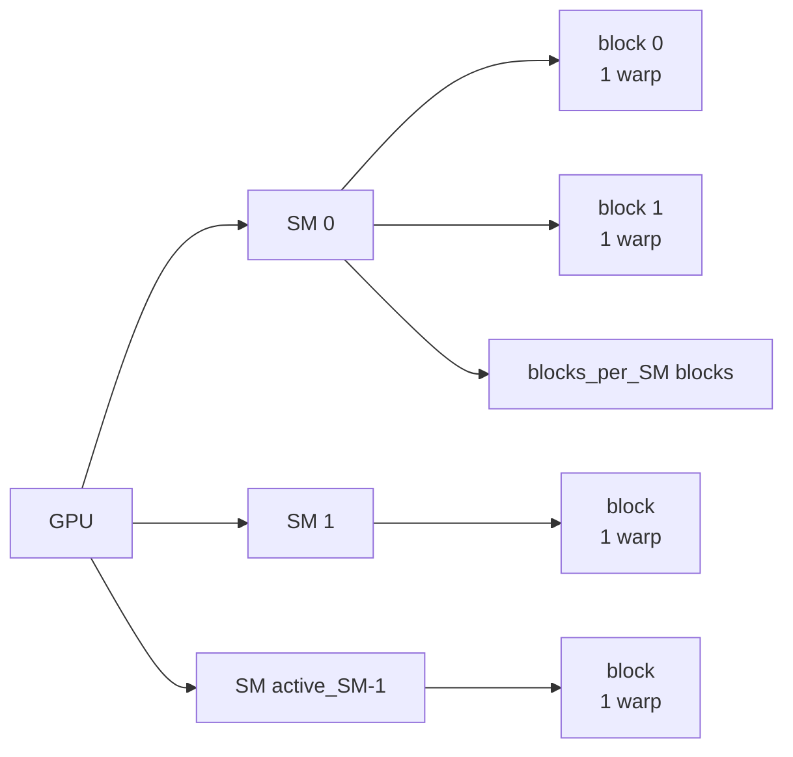

각 block은 실행 시작 시 `%smid`를 읽어 자기 block이 어느 SM에 배치됐는지 기록한다. 실행 후 `smid_histogram_ok`는 다음 조건을 확인한다.

| 조건 | 의미 |
|---|---|
| unique SM 수 = `active_SM` | 의도한 수의 SM에 배치됐는가 |
| total block 수 = `active_SM * blocks_per_SM` | 전체 block이 모두 실행됐는가 |
| 각 active SM의 block 수 = `blocks_per_SM` | SM별 block 배치가 균등한가 |

따라서 사용자가 이해한 **“GPU 전역에 workload를 퍼뜨려서 측정한다”**는 부분은 맞다. 다만 퍼뜨린 workload의 내용은 mode마다 다르다.

## `W_SM`의 의미

`W_SM`은 원래 SM당 logical working set 좌표다. 하지만 현재 구현에서 실제로 memory allocation에 쓰이는 mode와 그렇지 않은 mode가 나뉜다.

| mode 계열 | `W_SM` 사용 방식 |
|---|---|
| `shared_load_only`, `shared_mma` | block당 dynamic shared memory 크기 `W_block = W_SM / blocks_per_SM`에 직접 반영된다. |
| `l2_load_only`, `l2_mma` | 실제 allocation은 `active_SM * W_SM` 크기의 global input buffer다. 다만 L2 candidate 판정은 재현성을 위해 `profile.full_sm_count * W_SM <= profile.L2` 기준으로 보수적으로 한다. |
| `dram_load_only`, `dram_mma` | 실제 allocation은 `active_SM * W_SM` 크기의 global input buffer다. 다만 DRAM candidate 판정은 `profile.full_sm_count * W_SM > profile.L2` 기준으로 한다. |
| `reg_mma`, `reg_operand_only`, `reg_fragment_only`, `empty`, `store_only`, `store_path` | 실제 operand working set으로 쓰이지 않는다. 같은 sweep table에 놓기 위한 좌표값에 가깝다. |

Feasibility 분류는 다음 기준을 쓴다.

```text
W_block = W_SM / blocks_per_SM
tiles_per_block = max(1, W_block_bytes / 1024)

shared_resident:
  W_SM + blocks_per_SM KiB <= shared_capacity_per_SM
  W_block <= max_shared_per_block

l2_candidate:
  profile.full_sm_count * W_SM <= profile L2 size

dram_candidate:
  profile.full_sm_count * W_SM > profile L2 size
```

즉 allocation 크기와 regime 판정 기준은 다르다. 실제 global buffer는 `active_SM * W_SM`만큼 잡지만, `l2_candidate`와 `dram_candidate` 분류는 full-SM 실행으로 확장했을 때의 working set을 기준으로 한다. 일반적인 full-SM 실험에서는 두 값이 일치한다.

주의: `reg_mma W_SM=32 KiB`는 register file 32 KiB를 쓴다는 뜻이 아니다.

## mode별 동작

### `idle`

CUDA kernel을 실행하지 않고 지정한 시간 동안 sleep하면서 NVML energy delta만 측정한다.

| 포함되는 것 | 제외되는 것 |
|---|---|
| system/GPU idle energy | CUDA kernel work |

이 값은 non-idle mode의 `idle_baseline_J` 계산에 사용된다.

### `empty`

`empty`는 persistent grid와 loop overhead의 control이다.

동작:

1. block별 SMID를 기록한다.
2. 각 thread가 dependent integer add loop를 `ITER`번 수행한다.
3. block당 작은 scalar output을 한 번 store한다.

의미:

```text
empty ~= scheduler + warp loop + minimal integer dependency + minimal store
```

`empty`는 모든 paired-difference에서 기본 baseline으로 자주 쓰인다.

### `reg_fragment_only`

`reg_fragment_only`는 WMMA fragment setup control이다. MMA는 수행하지 않는다.

동작:

1. WMMA A/B/C fragment를 선언한다.
2. loop마다 A/B fragment를 `fill_fragment`로 채운다.
3. fragment 값을 checksum으로 소비한다.
4. checksum을 C fragment에 채우고 final matrix store를 한다.

의미:

```text
reg_fragment_only ~= WMMA fragment/register setup + checksum + final store
```

이 mode는 `reg_mma`에서 MMA 자체를 제외한 register/fragment setup 비용을 보는 control이다.

### `reg_operand_only`

`reg_operand_only`는 `reg_mma`와 최대한 같은 register-fragment 반복 구조를 만들되 `mma_sync`만 제거한 no-MMA matched control이다.

동작:

1. WMMA A/B/C fragment를 register fragment로 선언한다.
2. A/B fragment를 `reg_mma`와 같은 상수 패턴으로 한 번 채운다.
3. C accumulator fragment를 0으로 초기화한다.
4. `ITER`번 loop를 돌면서 `reuse_factor`만큼 sampled A/B fragment 값을 checksum으로 소비한다.
5. checksum을 C fragment에 채우고 final matrix store를 한다.

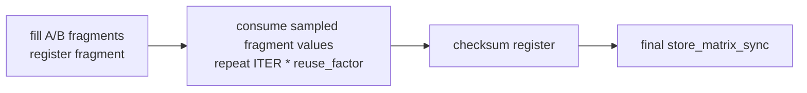

raw row의 의미:

```text
reg_operand_only net_E_J
  ~= scheduler
   + warp issue
   + register fragment liveness/sample-consume loop
   + scalar checksum/anti-optimization work
   + final output store
   + measurement residual
```

중요한 한계:

```text
reg_operand_only != pure register energy
```

이 mode는 Tensor Core를 쓰지 않는 matched control이다. 하지만 sampled fragment checksum과 compiler 최적화 방지용 소비 경로가 포함되므로, 순수 register file energy가 아니라 **no-MMA register-fragment/control baseline**으로 해석해야 한다.

### `reg_mma`

`reg_mma`는 memory-backed operand 공급을 최대한 줄인 Tensor Core baseline이다.

동작:

1. WMMA A/B/C fragment를 register fragment로 선언한다.
2. A/B fragment를 상수 패턴으로 한 번 채운다.
3. C accumulator fragment를 0으로 초기화한다.
4. `ITER`번 loop를 돌면서 `reuse_factor`만큼 `mma_sync(c, a, b, c)`를 반복한다.
5. 최종 C fragment를 output buffer에 matrix store한다.

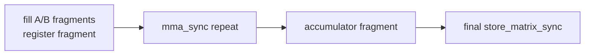

raw row의 의미:

```text
reg_mma net_E_J
  ~= scheduler
   + warp issue
   + register fragment read/write
   + Tensor Core mma_sync
   + accumulator update
   + final output store
   + measurement residual
```

따라서 `reg_mma`는 사용자가 생각한 것처럼 **Tensor Core + register 중심 baseline**이 맞다. 다만 순수 Tensor Core 에너지는 아니다. scheduler, issue, accumulator, final store가 같이 들어간다.

#### `reg_mma` register footprint와 `W_SM` 주의점

`reg_mma`의 실제 register footprint는 `W_SM`으로 정해지지 않는다. `W_SM=1 KiB` 또는 `W_SM=32 KiB`를 지정해도 A/B/C fragment가 그 크기로 줄거나 커지지 않는다. `reg_mma`에서 `W_SM`은 shared/L2/DRAM mode와 같은 sweep table에 놓기 위한 좌표값에 가깝고, 실제 register 사용량은 compiler가 할당한 `registers/thread`와 resident block 수로 계산해야 한다.

RTX 3090 sm_86 빌드에서 확인한 값:

```text
reg_mma_kernel:          26 registers/thread, spill stores=0, spill loads=0
reg_operand_only_kernel: 26 registers/thread, spill stores=0, spill loads=0
reg_fragment_only_kernel:17 registers/thread, spill stores=0, spill loads=0
empty_kernel:            16 registers/thread, spill stores=0, spill loads=0
```

현재 block은 1 warp, 즉 32 threads/block이다. 따라서 `reg_mma`의 compiler-visible register footprint는 대략 다음과 같다.

```text
26 registers/thread * 32 threads/block * 4 bytes/register
  = 3,328 bytes/block
  ~= 3.25 KiB/block

blocks/SM=16이면:
3.25 KiB/block * 16 blocks/SM ~= 52 KiB/SM
```

여기서 흔히 말하는 64K register/SM은 64 KiB가 아니라 64K개의 32-bit register entry를 뜻한다. 바이트로 환산하면 64K * 4 B = 256 KiB/SM이다. 즉 현재 `reg_mma`는 SM register file 전체를 채우는 실험이 아니라, 작은 WMMA fragment를 register-resident 상태로 두고 반복 재사용하는 실험이다.

WMMA logical fragment 크기도 작다.

| fragment | logical 크기 |
|---|---:|
| A, FP16 16x16 | 512 B/warp |
| B, FP16 16x16 | 512 B/warp |
| C, FP32 16x16 accumulator | 1024 B/warp |
| 합계 | 2048 B/warp |

따라서 더 precise한 `reg_mma` 결과를 얻기 위해 `W_SM`을 3.25 KiB 미만, 예를 들어 1 KiB로 잡는다는 해석은 현재 구현에는 맞지 않는다. `W_SM=1 KiB`는 register footprint를 줄이지 않는다. precision을 높이는 핵심은 다음 조건이다.

중요한 정정:

```text
이전 실험에서 W_SM=32 KiB부터 register/Tensor Core pair를 실행한 것은
register working set을 32 KiB로 설정했다는 뜻이 아니다.

그 값은 shared/L2/DRAM sweep과 같은 좌표계에 올려 둔 label이었고,
reg_mma의 실제 working set 또는 footprint로 해석하면 안 된다.
```

사용자가 제안한 256 B 출발점은 다음처럼 구분해서 봐야 한다.

| 설계 대상 | 256 B부터 sweep 가능 여부 | 이유 |
|---|---|---|
| WMMA `m16n16k16` `reg_mma` | 부적절 | A 또는 B 한쪽 logical tile만 512 B/warp이고, A+B는 1 KiB/warp다. C accumulator까지 포함하면 2 KiB/warp이며 ptxas footprint는 약 3.25 KiB/block이다. |
| scalar/register pressure microbenchmark | 가능 | Tensor Core를 쓰지 않고 live scalar register 개수를 template/inline PTX로 조절하면 256 B/block 같은 작은 footprint 축을 만들 수 있다. |
| 향후 stricter Tensor Core microbenchmark | `W_SM`이 아니라 ptxas footprint 축으로 설계 | 여러 kernel variant를 만들어 `registers/thread`, spill 여부, occupancy를 고정/기록해야 한다. |

따라서 register 실험의 축은 `W_SM`이 아니라 다음처럼 정의하는 편이 더 정확하다.

```text
register_footprint_B_per_block
  = ptxas_registers_per_thread * threads_per_block * 4

register_footprint_B_per_SM
  = register_footprint_B_per_block * resident_blocks_per_SM
```

| 조건 | 이유 |
|---|---|
| ptxas에서 spill stores/loads=0 확인 | register spill이 생기면 local memory가 L1/L2/DRAM을 오염시킨다. |
| loop 내부에 shared/global load가 없는지 SASS/NCU로 확인 | `reg_mma`가 memory-backed operand path로 바뀌지 않았는지 확인한다. |
| `ITER`와 `reuse_factor`를 충분히 크게 유지 | SMID 기록, prologue, final store 같은 고정 비용을 amortize한다. |
| `reg_operand_only`와 paired-difference로 해석 | register-fragment/control 비용을 뺀 MMA incremental 후보를 본다. |
| NCU counter로 L1/L2/DRAM access가 prologue/epilogue 수준인지 확인 | “register-fed MMA baseline” 주장을 뒷받침한다. |

계산되는 logical count:

```text
active_blocks = active_SM * blocks_per_SM
N_MMA = active_blocks * ITER * reuse_factor
FLOP = N_MMA * 8192
input_bits = N_MMA * 8192
pJ_per_FLOP = net_E_J * 1e12 / FLOP
```

### `reg_pressure`

`reg_pressure`는 WMMA/Tensor Core를 쓰지 않는 scalar register-pressure mode다. 사용자가 제안한 256 B 같은 작은 register payload 축은 이 mode에서 다룬다.

동작:

1. compile-time template variant가 thread당 payload register 수를 정한다.
2. `--reg-payload-bytes`로 block당 target payload를 선택한다.
3. loop 안에서 payload register들을 반복 갱신하고 checksum으로 소비한다.
4. block당 작은 scalar output을 final store한다.

지원 target payload:

| target payload (B/block) | payload regs/thread | 주의 |
|---:|---:|---|
| 256 | 2 | ptxas total footprint는 base overhead 때문에 더 큼 |
| 512 | 4 | ptxas 측정값으로 다시 해석 |
| 1024 | 8 | WMMA A+B logical tile 1 KiB와는 다른 scalar 실험 |
| 2048 | 16 | scalar register-pressure |
| 4096 | 32 | scalar register-pressure |
| 8192 | 64 | occupancy 제한 확인 필요 |
| 16384 | 128 | occupancy 제한 확인 필요 |

raw row의 의미:

```text
reg_pressure net_E_J
  ~= scheduler
   + warp issue
   + scalar register payload update
   + final scalar store
   + measurement residual
```

해석:

```text
reg_pressure - empty
  ~= scalar register-pressure/control coefficient
```

단위는 `pJ/reg-update`로 보고한다. 이 값은 pure register-file energy도 아니고, WMMA `reg_mma`의 Tensor Core incremental energy도 아니다.

### `shared_load_only`

`shared_load_only`는 shared/L1 operand load control이다. MMA는 수행하지 않는다.

동작:

1. block마다 dynamic shared memory를 `W_block_bytes`만큼 할당한다.
2. shared memory를 pattern value로 초기화한다.
3. `__syncthreads()`로 초기화 완료를 맞춘다.
4. SMID를 기록한다.
5. `ITER * load_repeat`번 A/B tile을 shared memory에서 WMMA fragment로 load한다.
6. fragment 값을 checksum으로 소비한다.
7. checksum을 output으로 store한다.

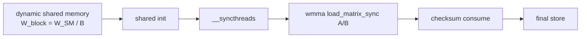

raw row의 의미:

```text
shared_load_only net_E_J
  ~= shared init
   + barrier
   + shared/L1 operand loads
   + checksum
   + final store
   + scheduler/residual
```

주의: shared memory 초기화와 barrier가 포함되어 있다. 그래서 이 mode를 순수 shared load energy로 부르면 안 된다.

### `shared_mma`

`shared_mma`는 shared memory에서 operand를 가져와 MMA를 수행하는 mode다.

동작:

1. block마다 dynamic shared memory를 `W_block_bytes`만큼 할당한다.
2. shared memory를 pattern value로 초기화한다.
3. `__syncthreads()`를 수행한다.
4. SMID를 기록한다.
5. loop마다 A/B tile을 shared memory에서 WMMA fragment로 load한다.
6. `reuse_factor`만큼 `mma_sync`를 수행한다.
7. 최종 accumulator를 output으로 store한다.


raw row의 의미:

```text
shared_mma net_E_J
  ~= shared init
   + barrier
   + shared/L1 operand loads
   + Tensor Core mma_sync
   + scheduler/stall
   + final store
   + residual
```

중요: 이 값은 `shared_mma - reg_mma`가 아니다. raw CSV에 저장되는 값은 독립 측정값이다.

### `l2_load_only`

`l2_load_only`는 L2-hit candidate global operand load control이다. MMA는 수행하지 않는다.

동작:

1. global input buffer를 `active_SM * W_SM` 크기로 할당한다.
2. input buffer를 half pattern으로 초기화한다.
3. repeat마다 측정 전 global warmup kernel을 실행해 cache residency 가능성을 높인다.
4. 각 block은 자기 block 전용 `W_block_bytes` 영역을 기준으로 tile을 순차적으로 순회한다.
5. A/B tile을 global memory에서 WMMA fragment로 load한다.
6. fragment checksum을 계산하고 final store를 수행한다.

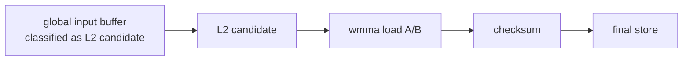

raw row의 의미:

```text
l2_load_only net_E_J
  ~= global load path under L2-candidate condition
   + checksum
   + final store
   + scheduler/stall/residual
```

이 mode가 실제로 L2 hit 중심인지 확정하려면 NCU의 L2 hit rate/access count 검증이 필요하다.

### `l2_mma`

`l2_mma`는 full-SM 기준 working set이 nominal L2 안에 들어갈 수 있다고 분류된 조건에서 operand를 load하고 MMA를 수행한다.

동작:

1. `l2_load_only`와 같은 global input buffer 및 warmup을 사용한다.
2. 각 block이 순차 tile pattern으로 A/B tile을 load한다.
3. load한 fragment로 `mma_sync`를 수행한다.
4. 최종 accumulator를 store한다.


raw row의 의미:

```text
l2_mma net_E_J
  ~= L2-candidate global load
   + Tensor Core mma_sync
   + scheduler/stall
   + final store
   + residual
```

이 값도 `l2_mma - reg_mma`가 아니다. 차분은 분석 단계에서 따로 한다.

### `dram_load_only`

`dram_load_only`는 DRAM streaming candidate global load control이다. MMA는 수행하지 않는다.

동작:

1. global input buffer를 `active_SM * W_SM` 크기로 할당한다.
2. full-SM 기준 working set이 nominal L2보다 크도록 `W_SM`을 잡는다.
3. 각 block이 hash/streaming tile pattern으로 tile을 선택한다.
4. A/B tile을 global memory에서 WMMA fragment로 load한다.
5. checksum을 계산하고 final store를 수행한다.

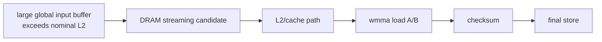

raw row의 의미:

```text
dram_load_only net_E_J
  ~= DRAM streaming candidate load
   + L2/cache traffic on the way
   + checksum
   + final store
   + scheduler/stall/residual
```

주의: GPU는 DRAM에서 바로 register로만 읽는 것이 아니라 cache hierarchy를 거친다. 따라서 이 값은 pure DRAM energy가 아니다.

### `dram_mma`

`dram_mma`는 DRAM streaming candidate 조건에서 global operand를 load하고 MMA를 수행한다.

동작:

1. `dram_load_only`와 같은 큰 global input buffer를 사용한다.
2. hash/streaming tile pattern으로 A/B tile을 load한다.
3. `reuse_factor`만큼 `mma_sync`를 수행한다.
4. 최종 accumulator를 store한다.

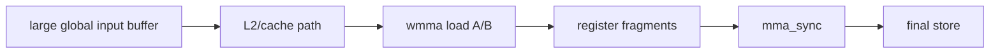

raw row의 의미:

```text
dram_mma net_E_J
  ~= DRAM streaming candidate load
   + L2/cache traffic
   + Tensor Core mma_sync
   + memory stall
   + scheduler
   + final store
   + residual
```

NCU 없이 이 mode를 “DRAM만 쓴다”고 단정하면 안 된다. NCU에서 DRAM access count, L2 hit rate, long scoreboard stall 등을 봐야 path 검증이 된다.

### `store_only`와 `store_path`

현재 `store_only`와 `store_path`는 같은 `store_path_kernel`을 사용한다.

동작:

1. SMID를 기록한다.
2. `ITER * store_repeat`번 output buffer에 float store를 반복한다.

의미:

```text
store_only ~= global store loop control
store_path ~= 현재 구현에서는 store_only와 거의 같은 경로
```

따라서 현재 상태에서는 `store_path - store_only` 차분은 큰 의미가 제한적이다. 더 엄밀히 하려면 `matched_store_only` 같은 별도 control mode가 필요하다.

## Raw measurement와 component 차분의 차이

사용자가 처음 기대한 모델은 다음과 비슷하다.

```text
reg_mma      = tensor + register + scheduler
shared_mma   = reg_mma + shared/L1 extra
l2_mma       = reg_mma + L2 extra
dram_mma     = reg_mma + DRAM extra
```

이 모델은 직관적이지만 현재 구현의 주 분석 모델은 아니다. 이유는 memory-backed MMA mode와 `reg_mma`의 instruction mix가 다르기 때문이다.

예를 들어:

```text
reg_mma:
  fill fragment once -> mma_sync repeat

reg_operand_only:
  fill fragment once -> consume fragment values without mma_sync

shared_mma:
  shared init -> barrier -> load_matrix_sync -> mma_sync

l2_mma/dram_mma:
  global buffer setup/warmup -> global load_matrix_sync -> mma_sync
```

따라서 `shared_mma - reg_mma`에는 shared load뿐 아니라 barrier, load instruction dependency, stall pattern, different issue mix가 함께 섞인다.

현재 설계는 대신 다음 paired-difference를 권장한다.

| pair | 계산 | 해석 |
|---|---|---|
| register/tensor baseline | `reg_mma - empty` | effective Tensor Engine + register path |
| fragment setup | `reg_fragment_only - empty` | fragment/register setup control |
| register operand/control | `reg_operand_only - empty` | no-MMA register-fragment/control baseline |
| Tensor Core incremental 후보 | `reg_mma - reg_operand_only` | register operand control을 뺀 effective MMA incremental cost |
| shared load | `shared_load_only - empty` | effective shared/L1 load path |
| shared MMA incremental | `shared_mma - shared_load_only` | shared operand 조건에서 MMA 추가 비용 |
| L2 load | `l2_load_only - empty` | effective L2 candidate load path |
| L2 MMA incremental | `l2_mma - l2_load_only` | L2 operand 조건에서 MMA 추가 비용 |
| DRAM load | `dram_load_only - empty` | effective DRAM streaming load path |
| DRAM MMA incremental | `dram_mma - dram_load_only` | DRAM operand 조건에서 MMA 추가 비용 |
| store | `store_only - empty` | effective store path |

이 계산은 `scripts/analyze_component_pairs.py`에서 수행한다.

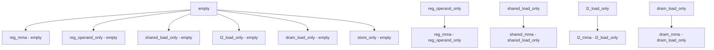

## `reuse_factor`, `load_repeat`, `store_repeat`

세 축은 component 분해의 식별성을 높이기 위해 추가되었다.

| 옵션 | 적용 mode | 의미 |
|---|---|---|
| `reuse_factor` | `*_mma` | 한 번 load한 operand로 MMA를 몇 번 반복할지 |
| `load_repeat` | `shared_*`, `l2_*`, `dram_*` | iteration당 operand load를 몇 번 반복할지 |
| `store_repeat` | `store_only`, `store_path` | iteration당 output store를 몇 번 반복할지 |

의도:

```text
reuse_factor 증가:
  FLOP 증가, operand bytes는 상대적으로 덜 증가

load_repeat 증가:
  operand load bytes 증가

store_repeat 증가:
  store bytes 증가
```

이 축들을 함께 sweep하면 `N_MMA`, expected memory bytes, elapsed time이 완전히 같은 비율로 움직이는 문제를 줄일 수 있다.

## CSV 주요 컬럼

| 컬럼 | 단위 | 의미 |
|---|---:|---|
| `mode` | - | 실행 mode |
| `W_SM_KiB` | KiB | SM당 working set 좌표 |
| `blocks_per_SM` | blocks/SM | 목표 resident block 수 |
| `active_SM` | SMs | 사용할 SM 수 |
| `ITER` | count | kernel loop 반복 수 |
| `elapsed_s` | s | 측정된 kernel 실행 시간 |
| `delta_E_J` | J | NVML before/after energy delta |
| `idle_baseline_J` | J | elapsed에 맞게 scaling한 idle baseline |
| `net_E_J` | J | `delta_E_J - idle_baseline_J` |
| `N_MMA` | ops | logical MMA 수 |
| `FLOP` | FLOP | `N_MMA * 8192` |
| `expected_shared_bytes` | B | static expected shared operand bytes |
| `expected_l2_bytes` | B | static expected L2 candidate operand bytes |
| `expected_dram_bytes` | B | static expected DRAM candidate operand bytes |
| `expected_store_bytes` | B | static expected output/store bytes |
| `expected_reg_operand_ops` | op-equivalent | `reg_operand_only`와 `reg_mma`의 `active_blocks * ITER * reuse_factor` 반복 수 |
| `pJ_per_FLOP` | pJ/FLOP | `net_E_J * 1e12 / FLOP` |
| `smid_histogram_ok` | bool | SM 배치 검증 통과 여부 |

`expected_*_bytes`는 static 계산값이다. 실제 L1/L2/DRAM access count가 아니다. 실제 counter 검증은 NCU가 필요하다.

## NCU 검증의 역할

Energy run과 NCU run은 분리한다. NCU replay는 kernel 실행 방식을 바꿀 수 있으므로 energy 값에 직접 합치지 않고, path 검증 sidecar로만 사용한다.

확인해야 할 대표 항목:

| 경로 | NCU에서 봐야 할 것 |
|---|---|
| Tensor Core | tensor instruction count, tensor utilization |
| shared/L1 | L1/shared hit rate, shared/L1 access count, short scoreboard stall |
| L2 | L2 hit rate, L2 sectors/access count |
| DRAM | DRAM sectors/bytes, DRAM throughput, long scoreboard stall |
| store | L2/DRAM write sectors |
| scheduling | achieved occupancy, eligible warps, not selected stall |

현재 RTX 3090 WSL 환경에서는 `ERR_NVGPUCTRPERM` 때문에 NCU performance counter 수집이 막힐 수 있다. 이 경우 보고서에 “NCU counter 검증 미완료”라고 명시해야 한다.

## 해석 가이드

보고서에서 안전한 표현:

| 피해야 할 표현 | 권장 표현 |
|---|---|
| pure Tensor Core energy | effective Tensor Engine + register path |
| shared memory energy | effective shared/L1 operand path coefficient |
| L2 energy | effective L2-hit candidate path coefficient |
| DRAM energy | effective DRAM streaming path coefficient |
| `reg_mma W_SM=32KiB` means 32 KiB registers | `W_SM` is a sweep coordinate for `reg_mma`, not register file usage |

가장 중요한 해석 원칙:

1. Raw `*_mma` row는 차분값이 아니라 독립 측정값이다.
2. Component-like 값은 paired-difference 분석에서 계산한다.
3. `reg_mma`는 좋은 Tensor/register baseline이지만 순수 Tensor Core만 의미하지 않는다.
4. `W_SM` 의존성은 memory-backed mode 중심으로만 해석한다.
5. NCU counter가 없으면 shared/L2/DRAM path는 static expected bytes 기반의 후보 해석이다.

## 실행 예시

### Raw mode 직접 실행

```bash
./build/a100_fp16_energy_v2 \
  --gpu-list 0 \
  --mode reg_mma \
  --w-sm-kib 32 \
  --blocks-per-sm 16 \
  --target-profile rtx3090 \
  --active-sm 82 \
  --seconds 10 \
  --repeats 5 \
  --output results/raw/reg_mma_raw.csv \
  --verify-smid 1
```

### Paired experiment 실행

```bash
python3 scripts/run_component_pairs.py \
  --binary ./build/a100_fp16_energy_v2 \
  --target-profile rtx3090 \
  --gpu-ids 0 \
  --groups register,shared,l2,dram,store \
  --w-sm-kib-values 32,64,8192 \
  --blocks-per-sm-values 1,2,4,8,16 \
  --active-sm-values 82 \
  --reuse-factors 1 \
  --load-repeats 1 \
  --store-repeats 1 \
  --seconds 10 \
  --repeats 5 \
  --output results/raw/component_pairs_raw.csv \
  --matrix-csv results/raw/component_pairs_matrix.csv \
  --execute
```

### Paired-difference 분석

```bash
python3 scripts/analyze_component_pairs.py \
  results/raw/component_pairs_raw.csv \
  --out-csv results/summary/component_pair_summary.csv \
  --out-md results/summary/component_pair_summary.md
```

## 현재 구현의 남은 한계

| 한계 | 영향 | 보강 방향 |
|---|---|---|
| `shared_load_only`에 shared init/barrier가 포함됨 | pure shared load로 볼 수 없음 | `shared_init_only` 추가 |
| `store_only`와 `store_path`가 거의 같은 kernel | store path 차분 해석 제한 | `matched_store_only` 또는 mode별 matched final store 구현 |
| `l2_*`, `dram_*` path가 NCU 없이 확정되지 않음 | L2/DRAM 해석은 후보 수준 | NCU hit/access/stall 검증 |
| raw `*_mma`는 memory + MMA + stall이 섞임 | mode별 raw pJ/FLOP만으로 component 분리 불가 | paired-difference 및 회귀 분석 사용 |
| `reg_operand_only`가 scalar checksum을 포함함 | `reg_mma - reg_operand_only`도 pure Tensor Core energy는 아님 | effective MMA incremental cost로 제한해서 표현 |
| `reg_mma`도 scheduler/final store 포함 | pure Tensor Core energy 아님 | `empty`, `reg_fragment_only`, `reg_operand_only`와 함께 해석 |

이 문서의 설명은 현재 코드 기준 구현을 반영한다. 실험 보고서에서는 항상 raw measurement와 paired-difference result를 분리해서 제시해야 한다.
