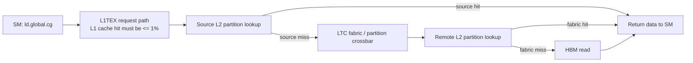

# A100 L2 Fabric-Aware 실험 설계

작성일: 2026-07-14
상태: 구현 반영 완료, A100 노드 재실행 필요

## 1. 결론

A100의 L2 실험은 `lts__t_sectors_srcunit_tex...lookup_hit/miss`만으로 최종 L2
hit를 판정하면 안 된다. 이 counter는 device global load가 **처음 도착한 L2
partition의 lookup**을 보여준다. 그 lookup이 miss여도 GA100의 LTC fabric을 거쳐 다른
L2 partition에서 hit할 수 있다.

따라서 A100 strict 판정은 다음 세 모집단을 같은 NCU replay에서 함께 수집한다.

1. TEX/device-aperture source lookup
2. `srcunit_ltcfabric` 원격 lookup
3. native all-op read hit rate와 실제 DRAM read

최종 L2 hit는 `source hit + fabric hit`를 원래 source request 수로 나눈
**logical final-service hit rate**로 판정한다. 이 값이 95% 이상이고 fabric counter
보존성, native counter 재구성, L1 bypass, DRAM read 누출 조건을 모두 통과한 좌표만
에너지 실험으로 전달한다.

이때 얻는 계수는 순수 L2 SRAM bitcell 에너지가 아니다. `ld.global.cg` 요청 발행,
L1TEX 통과, L2 tag/data lookup, partition 간 LTC fabric 이동, 응답 반환을 포함한
**NCU 경로 검증형 board-level effective L2 coefficient**다.

보고서 표기: **Not pure silicon-level energy.**

## 2. 기존 A100 결과의 재해석

아래 범위는 사용자가 외부 A100 실행에서 전달한 값이다. 같은 tag의 raw NCU report가
저장소에 반입되기 전까지는 독립 재계산값이 아니라 reported external evidence다.

| 관찰 지표 | 범위 | 과거 판정 | 현재 해석 |
|---|---:|---|---|
| source/TEX direct hit | 51-62 % | 95% 미달 reject | 첫 L2 partition lookup의 hit 비율 |
| native op-read hit | 67-72.5 % | 95% 미달 reject | source와 fabric lookup을 함께 센 lookup-level 비율일 가능성이 큼 |
| logical final-service hit | 문서상 미측정 | 판정 불가 | `srcunit_ltcfabric` hit/miss를 수집해 새로 계산해야 함 |

source request 수를 `S`, source hit/miss를 `H_s`, `M_s`, fabric hit/miss를 `H_f`,
`M_f`라고 두면 다음과 같다.

```text
S = H_s + M_s
direct hit rate = H_s / S
logical final-service hit rate = (H_s + H_f) / S
native lookup model = (H_s + H_f) / (S + F),  F = H_f + M_f
```

모든 source miss가 fabric으로 전달되고 거의 모두 원격 partition에서 hit한다면
`F ~= M_s`, `H_f ~= M_s`다. 이때 native lookup-level hit는 다음처럼 된다.

```text
native model ~= 1 / (2 - direct hit rate)
```

| direct source hit | 완전 fabric 회수 시 예상 native hit | 사용자 보고 native 범위와 비교 |
|---:|---:|---|
| 51 % | 67.11 % | 67% 하단과 일치 |
| 55 % | 68.97 % | 보고 범위 안 |
| 60 % | 71.43 % | 보고 범위 안 |
| 62 % | 72.46 % | 72.5% 상단과 일치 |

이 수치 정합성은 partition forwarding 가설을 강하게 지지하지만 그 자체가 증명은 아니다.
반드시 `srcunit_ltcfabric` read/hit/miss와 DRAM read를 같은 minimal replay bundle에서
수집해야 한다. source miss가 fabric hit로 보존되지 않거나 실제 DRAM read가 많으면
최종 L2 hit로 인정하지 않는다.

## 3. GA100에서 검증할 실제 경로



source lookup의 `miss`는 NCU 오분류가 아니다. **그 lookup 단계에서는 실제 miss**다.
오류는 이를 곧바로 logical request의 최종 L2 miss로 해석한 데 있었다. logical request가
HBM까지 갔는지는 fabric lookup과 DRAM read를 포함해 판단해야 한다.

관련 근거:

- [NVIDIA A100 Tensor Core GPU Architecture whitepaper](https://images.nvidia.com/aem-dam/en-zz/Solutions/data-center/nvidia-ampere-architecture-whitepaper.pdf)
- [Nsight Compute Profiling Guide: L2 Cache](https://docs.nvidia.com/nsight-compute/ProfilingGuide/index.html#l2-cache)
- [NVIDIA Developer Forums: `srcunit_ltcfabric` counter 설명](https://forums.developer.nvidia.com/t/whats-the-meaning-of-performance-counter-lts-t-sectors-srcunit-ltcfabric/228015)

## 4. Treatment-Control 설계

| 구분 | mode | 수행 내용 | 반드시 동일하게 고정할 조건 |
|---|---|---|---|
| control | `global_addr_only` | 주소 계산과 loop/checksum은 수행하되 global data load는 발행하지 않음 | W_SM, blocks/SM, active SM, ITER, load repeat, 주소 layout, residency policy |
| treatment | `l2_cg_load_only` | 같은 구조에서 `ld.global.cg.u32`를 발행하고 사전 CG warm-up 수행 | control과 같은 조건 및 동일 ITER |

에너지 numerator는 다음과 같다.

```text
Delta E = net_E_treatment(N) - net_E_control(N)
```

`N`은 두 mode에 잠근 동일 ITER다. control power를 treatment duration만큼 비례 확대하지
않는다. load dependency가 실행시간, issue 상태, clock activity를 바꾸므로 duration-scaled
차분은 다른 작업량을 비교하게 된다.

기본 coefficient denominator는 원래 logical source bytes다.

```text
source bits = source read sectors * 32 B/sector * 8 bit/B
effective L2 pJ/bit = Delta E [J] * 1e12 / source bits [bit]
```

분자는 board-level 추가 에너지이고, 분모는 SM이 요청한 logical payload다. 따라서 원격
fabric lookup이 많아지면 같은 source bit당 계수가 커질 수 있다. `source + fabric` bytes를
분모로 사용하면 실제 요청 payload를 이중 계수하므로 final coefficient에는 사용하지 않는다.

## 5. Parameter Sweep과 선택 순서

### 5.1 NCU-first 후보 sweep

| 우선순위 | residency policy | address layout | blocks/SM | anchor W_SM | load repeat | 목적 |
|---:|---|---|---:|---:|---:|---|
| 1 | normal | contiguous | 16, 8, 4, 2, 1 | 16, 128 KiB/SM | 4 회/ITER | 일반 경로에서 높은 동시성과 board-power 신호를 우선 탐색 |
| 2 | normal | sm_interleaved | 16, 8, 4 | 16, 128 KiB/SM | 4 회/ITER | 주소별 partition 집중 여부 진단 |
| 3 | persisting | contiguous | 16, 8, 4, 1 | 16, 128 KiB/SM | 4 회/ITER | 지원되는 full-GPU에서 residency set-aside 효과 확인 |
| 4 | persisting | sm_interleaved | 8, 4 | 16, 128 KiB/SM | 4 회/ITER | layout과 residency 결합 fallback |

`W_SM=16 KiB/SM`, blocks/SM=16이면 block당 tile은 정확히 1 KiB다. 현재 kernel의
최소 1 KiB/block 제약을 만족한다. blocks/SM=32는 0.5 KiB/block가 되어 이 anchor에서
실행할 수 없으므로 A100 L2 후보에서 제외한다.

blocks/SM=16을 먼저 시험하는 이유는 낮은 blocks/SM보다 동시에 발행되는 request와
board-level power 신호가 크기 때문이다. 단, fabric 회수와 DRAM gate를 통과하지 못하면
8, 4, 2, 1 순으로 concurrency/address conflict 민감도를 낮춰 진단한다.

### 5.2 선택 후 energy/NCU sweep

| 분류 | 변화시키는 값 | 단위 | 고정 조건 |
|---|---|---|---|
| working set | W_SM = 16, 32, 64, 128 | KiB/SM | 선택된 blocks/SM, layout, residency |
| energy load amplification | LR = 4, 8, 16 | load/ITER | 동일 ITER treatment-control, 10 s 기본 측정, 반복 5 회 |
| final NCU validation | LR = 1, 2, 4, 8, 16 | load/ITER | application replay, cache-control none, CG warm-up 4 회 |

A100 full GPU의 active SM을 108개로 둘 때 전체 logical working set은 다음과 같다.

| W_SM | full-GPU working set | 40 MiB L2 대비 |
|---:|---:|---:|
| 16 KiB/SM | 1.6875 MiB | 4.22 % |
| 32 KiB/SM | 3.375 MiB | 8.44 % |
| 64 KiB/SM | 6.75 MiB | 16.88 % |
| 128 KiB/SM | 13.5 MiB | 33.75 % |

MIG 또는 다른 A100 SKU에서는 108을 그대로 사용하지 않는다. preflight가 확인한
`active_SM`으로 전체 working set을 다시 계산하고, persisting L2 지원 여부도 별도로
판정한다.

## 6. NCU Counter와 계산 컬럼

| 계층 | 요청 metric | 산출 컬럼 | 단위/의미 |
|---|---|---|---|
| source lookup | `lts__t_sectors_srcunit_tex_aperture_device_op_read{,_lookup_hit,_lookup_miss}` | `l2_path_hit_rate_pct` | 첫 partition direct hit, % |
| source fallback | `lts__t_sectors_srcunit_tex_op_read{,_lookup_hit,_lookup_miss}` | 같은 컬럼 | device-aperture metric이 없을 때만 사용 |
| fabric lookup | `lts__t_sectors_srcunit_ltcfabric_aperture_device_op_read{,_lookup_hit,_lookup_miss}` | fabric read/hit/miss sectors | 원격 partition lookup, 32 B sector |
| fabric fallback | `lts__t_sectors_srcunit_ltcfabric_op_read{,_lookup_hit,_lookup_miss}` | 같은 컬럼 | aperture 하위 metric이 없을 때만 사용 |
| native cross-check | `lts__t_sector_op_read_hit_rate` | `l2_native_read_hit_rate_pct` | source+fabric 등 native lookup 모집단, % |
| L1 bypass | L1TEX global-load lookup hit/miss/bytes | `l1_path_hit_rate_pct`, hit/request bytes | `.cg` request가 L1TEX를 지나는 것과 L1 cache hit를 구분 |
| HBM leakage | `dram__bytes_read`, `dram__sectors_read` | `dram_read_bytes` | read refill만 판정, B |

주요 파생값은 다음과 같다.

| 컬럼 | 계산 | 허용 기준 |
|---|---|---:|
| `l2_read_sector_conservation_ratio` | `(H_s + M_s) / S` | 0.98-1.02 |
| `l2_fabric_read_sector_conservation_ratio` | `(H_f + M_f) / F` | 0.98-1.02 |
| `l2_fabric_read_to_source_miss_ratio` | `F / M_s` | 0-1.05 |
| `l2_fabric_read_fraction` | `F / (S + F)` | 보고/회귀용, hard threshold 없음 |
| `l2_logical_read_hit_rate_pct` | `100 * (H_s + H_f) / S` | 95-100.5 %; 상한은 counter tolerance |
| `l2_fabric_model_native_hit_rate_pct` | `100 * (H_s + H_f) / (S + F)` | native 재구성값 |
| `l2_native_vs_fabric_model_hit_delta_pct` | `abs(native - model)` | <=2 percentage points |
| `dram_read_to_l2_read_bytes_ratio` | `DRAM read B / source L2 read B` | <=0.02 |

## 7. Strict Acceptance

다음 조건을 **모두** 만족해야 한다.

| gate | 기준 | 실패 시 의미 |
|---|---:|---|
| NCU 실행 정책 | application replay, cache-control none, minimal L2 bundle | 서로 다른 replay 모집단 혼입 |
| source sector 보존 | 0.98-1.02 | source counter 누락/중복 |
| fabric sector 보존 | 0.98-1.02 | fabric counter 누락/중복 |
| fabric routing coherence | `F/M_s <=1.05`, `H_f/M_s <=1.05` | logical request보다 많은 recovery를 잘못 더함 |
| logical final L2 hit | 95-100.5 % | 낮으면 실제 HBM miss, 높으면 source/fabric 중복 계수 |
| native-model 오차 | <=2 percentage points | source/fabric 모델이 native 모집단을 설명하지 못함 |
| L1 path hit | <=1 % | Global L1 hit가 L2 treatment에 혼입 |
| L1 hit/request bytes | <=1 % | `.cg` request와 실제 L1 hit 구분 실패 |
| source bytes/expected | 0.95-1.05 | ITER/LR/active-SM denominator 오류 |
| DRAM read/source L2 read | <=2 % | HBM refill 혼입 |
| spill/local traffic | 0 B | local-memory traffic 혼입 |

direct source hit가 51-62%여도 위 fabric 증거가 logical hit 95% 이상을 만들고 native
counter까지 재구성하면 통과할 수 있다. 반대로 native 값이 67-72.5%라는 이유만으로는
통과하지 않는다. fabric metric이 누락되거나 logical hit가 95% 미만이면 reject한다.

## 8. 계수 보고 방식

필수 결과는 좌표별 effective coefficient다.

| 결과 | 단위 | 보고 내용 |
|---|---|---|
| effective L2 path | pJ/bit, pJ/B | median, min, max, 반복 수, W_SM, blocks/SM, LR |
| source direct hit | % | 첫 partition hit 비율 |
| fabric recovery | sectors, %, fraction | source miss 중 원격 partition에서 회수된 양 |
| final logical hit | % | 원래 request 중 L2 hierarchy에서 완료된 비율 |
| DRAM leakage | B, % | HBM read 혼입량 |
| stall | NCU per-issue-active signal | long scoreboard 진단값; elapsed-time 100% 비율로 해석 금지 |

여러 accepted layout/blocks 좌표에서 fabric fraction이 충분히 달라질 때만 다음 보조
회귀를 시도할 수 있다.

```text
Delta E [pJ] = beta_source * source_bits + beta_fabric * fabric_bits + intercept + error
```

`beta_source`와 `beta_fabric`은 비음수 제약과 bootstrap confidence interval을 사용한다.
두 predictor가 강하게 공선이면 분리 계수를 폐기하고 effective total만 보고한다. 회귀가
성공해도 beta는 pure SRAM/crossbar circuit energy가 아니라 이 microbenchmark에서의
board-level effective coefficient다.

## 9. 구현 위치와 실행

| 역할 | 파일 |
|---|---|
| A100 후보와 sweep 생성 | `scripts/plan_platform_component_experiment.py` |
| source/fabric/native/DRAM metric 수집 | `scripts/run_ncu_validation.sh` |
| logical hit와 native model 계산 | `scripts/summarize_ncu_cache_metrics.py` |
| 행별 acceptance | `scripts/analyze_ncu_path_acceptance.py` |
| 후보 선택 | `scripts/select_l2_path_configuration.py` |
| long-run 전 fail-fast | `scripts/audit_a100_ncu_precheck.py` |
| 최종 package 재감사 | `scripts/audit_platform_result_package.py` |

A100 노드에서는 기존 가이드대로 plan을 다시 생성한 뒤 생성된 command package를
실행한다. 과거에 생성한 shell script는 새 metric 목록과 gate를 포함하지 않으므로
재사용하지 않는다.

```bash
python3 scripts/plan_platform_component_experiment.py \
  --target-profile a100 \
  --gpu-ids 0 \
  --tag "$(date +%Y%m%d)"

bash results/summary/a100_component_finalplan_$(date +%Y%m%d)_commands.sh
```

NCU 권한이 관리자에게만 열려 있으면 다음처럼 실행한다.

```bash
NCU_USE_SUDO=1 \
  bash results/summary/a100_component_finalplan_$(date +%Y%m%d)_commands.sh
```

## 10. 자가점검과 남은 한계

- metric 이름은 GA100 NCU catalog에서 존재 여부를 먼저 query하고, 누락 시 acceptance가
  실패하도록 구현했다. 누락 metric을 95% 통과로 대체하지 않는다.
- source와 fabric을 서로 다른 NCU 실행에서 합치지 않는다. 둘은 같은 minimal replay
  bundle의 같은 좌표여야 한다.
- native hit는 95% gate가 아니다. lookup이 두 번 일어나면 logical hit가 100%여도 native
  lookup hit는 약 67-73%일 수 있다.
- direct source miss를 모두 remote hit로 가정하지 않는다. 실제 fabric hit/miss와 DRAM
  read로 검증한다.
- NVML energy run과 NCU profiling은 분리되어 있다. kernel revision, 좌표, ITER, LR,
  policy/layout을 동일하게 묶지만 온도와 clock 상태가 완전히 같다는 보장은 없다.
- A100 노드의 새 raw NCU report가 아직 이 저장소에 없으므로, 현 단계는 설계와 합성
  counter self-test까지 완료된 상태다. 실제 coefficient는 재실행 결과가 통과한 뒤에만
  보고한다.
