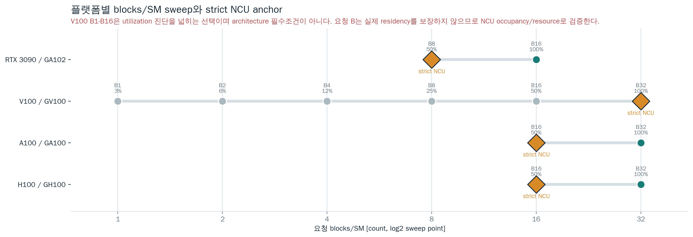
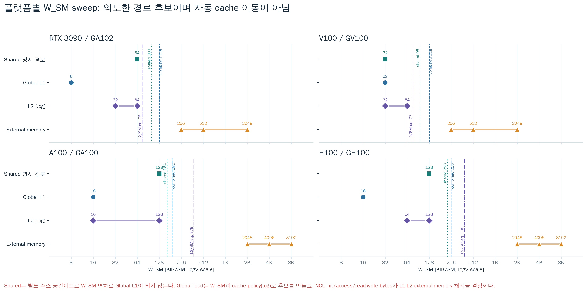
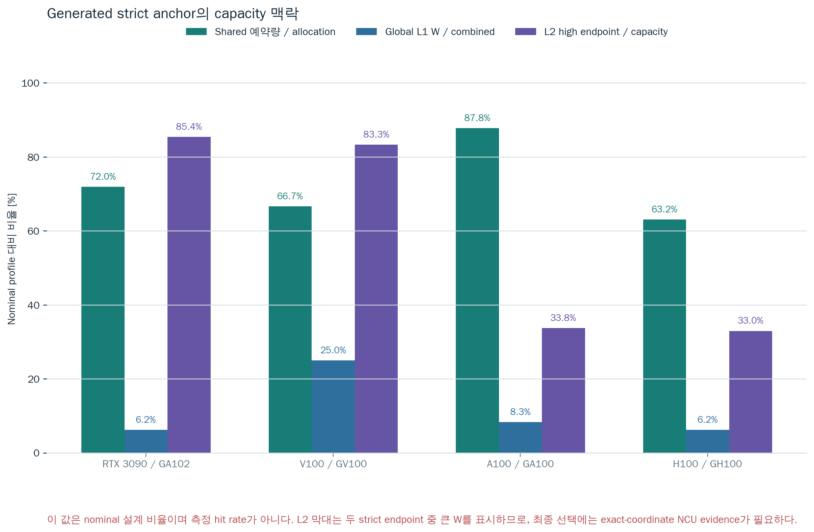

# Component Energy 최종 실험 계획

작성일: 2026-07-05, updated 2026-07-13

## 1. 실험 목표

이 실험의 목표는 RTX 3090, A100, V100과 H100 확장 profile에서 다음 경로의
**board-level effective energy coefficient**를 합리적으로 분리하는 것이다.

| 목표 항목 | 목표 단위 | 채택 가능한 해석 |
|---|---:|---|
| Tensor MMA incremental | pJ/FLOP | no-MMA register/control 대비 FP16 WMMA 추가 에너지 |
| Register operand/control | pJ/reg-op 또는 진단값 | spill-free register/control workload의 board-level proxy |
| Shared memory scalar path | pJ/bit | shared-memory load instruction path의 effective traffic energy |
| Global L1 hit path | pJ/bit | global load가 L1 hit로 끝나는 path의 effective traffic energy |
| L2 hit path | pJ/bit | L1을 배제하고 L2 hit로 끝나는 path의 effective traffic energy |
| DRAM streaming path | pJ/bit | 필수 목표가 아니라 L2 분리 sanity check |

중요한 제한은 다음과 같다.

- NVML energy는 보드/디바이스 전체 에너지다. Tensor Core, register file, scheduler, LSU, interconnect, cache, memory controller, DRAM, clock/power-state 변화가 함께 들어간다.
- GPU 세대별 power API 의미는 다르다. 최종 분석에서는 `nvmlDeviceGetTotalEnergyConsumption` 기반 `energy_source=nvml_total_energy`, `energy_integration_method=total_energy_mj_delta`, `measurement_scope=gpu_device_total_energy_counter`, `nvml_total_energy_supported=true` row를 우선하고, `GetPowerUsage` fallback row는 provisional로 둔다. 세부 기준은 `docs/platforms/power_measurement_api_matrix_ko.md`를 따른다.
- Energy sweep 직후 `scripts/audit_power_api_measurements.py`를 실행한다. 새 finalplan에서는 `--require-explicit-measurement-scope`를 사용해 raw CSV에 `measurement_scope`가 직접 기록되었는지 확인한다. 이 단계에서 `final_candidate`가 아닌 row가 있으면 NCU path가 좋아도 최종 coefficient로 채택하지 않는다.
- Matched-control 이후 `scripts/audit_component_reliability.py`를 실행해 power/NCU/계수 안정성 gate를 결합한 verdict를 만든다.
- Final analyzer는 `--require-control-ncu-acceptance`를 사용한다. Tensor의 `reg_operand_only`와 Global L1/L2/DRAM의 `global_addr_only`가 treatment와 같은 좌표에서 NCU accepted가 아니면 해당 pair를 최종 계수에 사용하지 않는다.
- 따라서 최종 보고서는 “pure physical bitcell energy”가 아니라 “NCU로 path가 검증된 microbenchmark의 effective coefficient”로 쓴다.
- 계수는 NCU path 검증과 energy 차분/회귀 검증을 모두 통과해야 후보값으로 채택한다.

## 2. 아키텍처 기준

사용자가 지정한 NVIDIA whitepaper를 기준으로 capacity와 경로를 분리한다.

| GPU | Register file / SM | L1/shared / SM | L2 | Memory | 실험 설계 영향 |
|---|---:|---:|---:|---|---|
| RTX 3090, GA102 | 256 KiB | 128 KiB combined | 6 MiB | GDDR6X | L2/SM이 작고 L1/shared와 겹치므로 W_SM만으로 L2-only를 만들기 어렵다. L2는 `l2_cg_load_only`를 우선 사용한다. |
| V100, GV100 | 256 KiB급 | 128 KiB combined, shared allocation 96 KiB profile | 6 MiB | HBM2 | B4/B16 utilization 민감도와 strict B32 anchor를 측정한다. Volta 지원 CUDA/NCU 조합을 별도로 확인한다. |
| A100, GA100 | 256 KiB | 192 KiB combined, shared allocation 최대 164 KiB | 40 MiB | HBM2 | 큰 L2라도 normal global load는 L1과 섞인다. strict L2는 `l2_cg_load_only`와 path-specific L1 hit/L2 read 검증을 사용한다. |
| H100, GH100 | 256 KiB급 | 256 KiB combined, shared allocation 228 KiB profile | 50 MiB | HBM2e/HBM3, SKU별 상이 | 현재 kernel은 WMMA compatibility path이며 Hopper-native WGMMA/TMA 계수로 해석하지 않는다. |

주의: CUDA에서 설정 가능한 dynamic shared memory 한계와 whitepaper의 물리 combined L1/shared capacity는 같은 값이 아닐 수 있다. 실험 채택은 capacity 계산이 아니라 NCU hit/access counter를 우선한다.

## 3. 기존 결과의 냉정한 판정

| 기존 항목 | 판정 | 이유 | 새 처리 |
|---|---|---|---|
| Tensor `0.077-0.170 pJ/FLOP` 과거 sweep | superseded historical | v1 dynamic loop가 GA102 RF2에서 `HMMA/logical MMA=3`, 나머지 primary RF에서 2로 비례성을 깨뜨렸다. control/kernel/pair protocol도 현행 v2와 다르다. | fixed-RF v2로 RF1/2/4/8/16을 재실행. RTX 3090은 NCU 10/10 accepted, 33 valid pair, median 2.2525 pJ/FLOP을 standalone current Tensor 근거로 기록. A100/V100/H100은 각 노드에서 독립 재측정 |
| Global L1 `0.449 pJ/bit` | 후보값 미만 | L1 hit path는 맞지만 energy row 6개 중 2개가 음수였다. | 음수 row가 사라지는지 seconds/repeats를 늘려 재실험한다. |
| L2 `0.798 pJ/bit` | 후보값 | CG L2 path는 맞지만 long scoreboard가 크고 1개 음수 row가 있었다. | L2는 stall을 보고하고, pJ/bit를 L2 SRAM 단독값으로 부르지 않는다. |
| DRAM legacy `clocked_empty` 값 | 폐기된 current 후보 | 과거 control과 현행 matched-ITER address control이 다르며 cumulative path/device energy 의미도 섞였다. | 최신 보고는 26.709-28.409 pJ/bit provisional cumulative-path band로 제한하고 새 pair-lock 실험으로 검증한다. |
| Register direct `263 pJ/update` | 폐기 | scalar ALU, dependency, scheduler/control, active power를 작은 update 수로 나눈 값이다. | pure register-file energy로 쓰지 않는다. |

## 4. 실험 분리 원칙

### 4.1 NCU path acceptance

energy 계수는 아래 NCU 기준을 통과한 mode만 사용한다.

| Path | mode | NCU 채택 기준 |
|---|---|---|
| Tensor | `reg_mma` | HMMA instruction > 0, spill/local memory 0, L1/L2/DRAM traffic이 작음 |
| Tensor control | `reg_operand_only` | 새 final run은 HMMA=정확히 0, spill/local=0, treatment와 동일 ITER. legacy fixed epilogue 완화는 과거 결과 설명에만 사용 |
| Shared scalar | `shared_scalar_load_only` | shared bytes/accesses 존재, expected shared bytes와 같은 order, bank conflict 0 또는 매우 낮음 |
| Global L1 | `global_l1_load_only` | path-specific L1 hit >=95%, L1 request/hit bytes 존재, L2 read/L1 request <=1%, DRAM/L1 request <=1% |
| L2 hit | `l2_cg_load_only` | path-specific L2 read hit >=95%, L1 path hit <=1%, L1 hit/request bytes <=1%, DRAM/L2 read <=2% |
| DRAM sanity | `dram_cg_load_only` | path-specific L1 hit <= 1%, DRAM bytes가 충분, path-specific L2 read hit은 `L2 capacity / working set` 기반 residual bound 내 |

NCU 보고 표에는 반드시 단위를 적는다.

| 지표 | 단위 |
|---|---|
| L1 hit rate | % |
| L2 hit rate | % |
| Shared accesses | access count |
| L1 accesses | requests 또는 sectors |
| L2 accesses | sectors |
| DRAM accesses | sectors |
| Shared/L1/L2/DRAM bytes | bytes |
| Stall long scoreboard | % |
| Stall short scoreboard / wait | % |

### 4.2 Energy coefficient

Energy run은 NCU 없이 실행한다. Shared/L1 pair는 nearest control의 power rate를
treatment elapsed에 맞춘다. Tensor pair는 각 RF에서 `reg_mma`의 treatment 목표시간과
`reg_operand_only`의 control 최소시간을 각각 calibrate하고, 두 ITER 중 큰 값을 treatment와
control에 동일하게 적용한 뒤 net energy를 직접 차분한다.
`reg_mma`와 `reg_operand_only`는 RF당 dependent register integer add 1개를 공통으로
실행하고, control의 기존 FP32 FMA/checksum/memory는 제거한다.
L2와 DRAM pair도 동일하게 각각 `l2_cg_load_only`/`dram_cg_load_only` treatment와
`global_addr_only` control을
dual-calibrate하고 동일 ITER를 적용한 뒤 두 net energy를 직접 차분한다.

Matched-control 분석은 다음 gate를 켠다.

| gate | 목적 |
|---|---|
| `--require-ncu-denominator` | memory pJ/byte에서 NCU actual traffic denominator가 없는 row 제외 |
| `--require-total-energy` | endpoint power fallback이 final coefficient에 섞이는 것 방지 |
| `--expected-power-semantics <profile>` | V100/A100 `instant`, RTX 3090/H100 `one_sec_average` metadata 확인 |
| `--pairing nearest-control` | 반복 run에서 treatment를 실행 순서상 가장 가까운 control과 비교해 thermal/clock drift 완화 |
| `--tensor-pair-policy matched-iters` | Tensor의 동일 ITER를 확인하고 `E_reg_mma - E_reg_operand_only` 직접 차분 |
| `--l2-pair-policy matched-iters` | L2 CG와 address control의 동일 ITER를 확인하고 net energy 직접 차분 |
| `--dram-pair-policy matched-iters` | DRAM treatment/control의 동일 ITER를 확인하고 `net_E_dram - net_E_addr` 직접 차분 |
| `--require-control-ncu-acceptance` | treatment뿐 아니라 no-MMA/address control도 동일 좌표 NCU acceptance를 요구 |
| `--min-delta-j`, `--min-delta-fraction` | `delta_E`가 noise floor 안에 있는 양수 row를 최종 summary에서 제외 |

Power API gate는 `docs/platforms/power_measurement_api_matrix_ko.md`를 기준으로
아래처럼 해석한다.

| GPU | `GetPowerUsage` 의미 | final energy numerator | fallback 처리 |
|---|---|---|---|
| RTX 3090 / GA102 | 1초 평균 power | `nvmlDeviceGetTotalEnergyConsumption` 전후 mJ 차분 | provisional only |
| V100 / GV100 | instantaneous power | `nvmlDeviceGetTotalEnergyConsumption` 전후 mJ 차분 | provisional only |
| A100 / GA100 | instantaneous power | `nvmlDeviceGetTotalEnergyConsumption` 전후 mJ 차분 | provisional only |
| H100 / GH100 | 1초 평균 power | GPU/device total-energy mJ 차분 | module/memory power와 분리, provisional only |

즉, 세대별 power sample 의미는 metadata와 fallback 해석을 바꾸지만, 최종
pJ/FLOP 또는 pJ/bit의 분자는 가능한 한 세대 공통으로 total-energy counter 차분을
쓴다. total-energy counter가 없으면 그 결과는 component coefficient final 표가 아니라
fallback/provisional 표로 분리한다.

```text
delta_E_default_J = E_mode_J - (E_control_J / t_control_s) * t_mode_s
delta_E_dram_J = net_E(dram_cg_load_only, ITER=N)
               - net_E(global_addr_only, ITER=N)
coefficient = delta_E_J / denominator
```

| Component | numerator | control | denominator |
|---|---|---|---|
| Tensor MMA incremental | `reg_mma` | `reg_operand_only` | FLOP |
| Shared scalar path | `shared_scalar_load_only` | `clocked_empty` | NCU shared bytes 우선, expected shared bytes fallback |
| Global L1 path | `global_l1_load_only` | `global_addr_only` | NCU L1 bytes 우선, expected L1 bytes fallback |
| L2 hit path | `l2_cg_load_only` | `global_addr_only` | NCU L2 bytes 우선, expected L2 bytes fallback |
| DRAM sanity path | `dram_cg_load_only` | `global_addr_only` | NCU DRAM bytes 우선, expected DRAM bytes fallback |

음수 coefficient는 component energy로 채택하지 않는다. 단순히 0으로 클리핑하지 않고 `not_identified_or_control_failed`로 기록한다.

## 5. 이번 RTX 3090 실행 계획

이번 실행은 “최종 논문값”이 아니라 final-quality로 가기 위한 강한 재현성 점검이다. 목표는 음수 row가 줄어드는지, NCU path 검증과 energy 계수가 같은 방향인지 확인하는 것이다.

### 5.1 NCU 검증

대표 LR=4 검증은 빠른 preflight에는 유용하지만, 최종 coefficient에서는
energy sweep과 같은 `reuse_factor`/`load_repeat` list를 NCU sidecar에서도 수집한다.
`scripts/run_ncu_validation.sh`는 다음 환경변수를 받는다.

| 환경변수 | 최종 권장값 | 의미 |
|---|---|---|
| `TENSOR_REUSE_FACTORS` | `1,2,4,8,16` | `reg_operand_only`, `reg_mma` Tensor/control sweep |
| `MEMORY_LOAD_REPEATS` | `1,2,4,8,16` | shared, global L1, L2 path sweep |
| `DRAM_LOAD_REPEATS` | `1,4,8,16` | DRAM streaming sanity sweep; energy LR 4,8,16과 exact coordinate를 맞춤 |

빠른 대표 검증을 수행할 때의 최소 좌표는 다음이다.

| Component | blocks/SM | W_SM (KiB) | representative factor | 이유 |
|---|---:|---:|---:|---|
| Tensor | 16 | 2048 | reuse 4 | B16 full occupancy에서 HMMA/spill 확인 |
| Shared scalar | 16 | 64 | load_repeat 4 | shared bytes와 bank conflict 확인 |
| Global L1 | 16 | 16 | load_repeat 4 | L1 hit path 확인 |
| L2 hit | 16 | 64 | load_repeat 4 | RTX 3090은 CG path로 L1을 배제 |
| DRAM sanity | 16 | 8192 | load_repeat 4 | L2 miss/DRAM streaming 확인 |

### 5.2 Energy 재실험

| Component | modes | blocks/SM | W_SM (KiB) | factor sweep | seconds (s) | repeats |
|---|---|---:|---:|---:|---:|---:|
| Tensor | `reg_operand_only`, `reg_mma` | 16 | 2048 | reuse 1,2,4,8,16 | 5 | 3 |
| Shared scalar | `clocked_empty`, `shared_scalar_load_only` | 16 | 64 | load_repeat 1,2,4,8,16 | 5 | 3 |
| Global L1 | `global_addr_only`, `global_l1_load_only` | 16 | 16,64 | energy load_repeat 4,8,16; NCU 1,2,4,8,16 | 5 | 3 |
| L2 hit | `global_addr_only`, `l2_cg_load_only` | 16 | 64 | energy load_repeat 4,8,16; NCU 1,2,4,8,16 | 5 | 3 |
| DRAM sanity | `global_addr_only`, `dram_cg_load_only` | 16 | 8192 | energy load_repeat 4,8,16; NCU 1,2,4,8,16 | 5 | 3 |

주의: Shared/L1 primary runner는 현재 duration-calibrated 방식이다. 따라서 `load_repeat`를
2배로 늘리면 `ITER`가 줄어 목표 실행 시간을 맞추기 때문에 총 byte denominator가
반드시 2배로 늘지는 않는다. `load_repeat` sweep은 path의 instruction mix/rate 안정성을
보는 축이고, 총 denominator scaling을 확인하려면 같은 `load_repeat`에서 duration sweep
또는 fixed-ITER 보조 실험을 별도로 수행한다. RTX 3090 L1에서는 `load_repeat=4`,
10/20/30초 duration-scaling check가 기존 0.15 pJ/bit 결과와 정합했다.
L2 CG와 DRAM CG는 이 예외에서 제외하며, treatment와 address control에 동일 ITER를 강제한다.
과거 RTX 3090 Tensor duration-scaling `0.077-0.170 pJ/FLOP`는 새
pair-lock/fixed-RF v2 이전의 역사적 민감도 분석이다. 현행 finalplan에서는 그대로
재사용하지 않는다. 2026-07-13 RTX 3090 fixed-RF v2는 RF1/2/4/8/16, B16,
treatment 20초/control 2초 floor, 7 repeats로 실행했다. Power API 70/70, NCU
10/10을 통과했고 pair/power-state gate 후 33/35 valid, median 2.2525 pJ/FLOP,
RF별 median 1.9754-2.3211 pJ/FLOP이다. 이는 더 긴 treatment active time의
scheduler/clock/register lifetime까지 포함한 board-level effective incremental이며 pure
Tensor circuit energy가 아니다. 다른 GPU에는 이 숫자를 이식하지 않고 동일 v2
프로토콜로 재측정한다.

성공 기준:

| 기준 | 통과 조건 |
|---|---|
| execution | 모든 row `smid_histogram_ok=true`, elapsed >= 4 s |
| Tensor | 동일 ITER, control HMMA=0, treatment `HMMA/logical MMA` RF spread<=10%, spill/local=0, RF별 최소 5 valid pair, pair timestamp gate, `delta_E>=10 J`, coefficient>0 |
| Shared scalar | 모든 load_repeat에서 양수, NCU shared path accepted |
| Global L1 | 음수 row가 남으면 final에서 제외 또는 control 재설계 |
| L2 | L2 hit >= 95%, DRAM/L2 <= 2%, long scoreboard를 결과 표에 포함 |
| DRAM | sanity check로만 사용, physical DRAM energy라고 쓰지 않음 |

Tensor/register NCU acceptance는 absolute memory byte threshold와 함께
bytes/HMMA 또는 bytes/register-op ratio를 확인한다. reuse factor가 커질수록
setup/cache traffic의 absolute byte도 커질 수 있으므로, absolute byte만으로 reject하면
RF가 큰 row가 불리해진다.

## 6. V100/A100/H100 확장 계획

### 6.1 RTX 3090/A100/V100/H100 파라미터와 실험 개수 비교

아래 표는 `scripts/plan_platform_component_experiment.py`의 현재 기본 profile로
GPU 한 장에서 새 표준 package를 실행하는 조건이다. 공통으로 energy command당
`seconds=10 s`, 유효 좌표당 `repeats=5 count`, `store_repeat=1 count`를 사용하며,
energy 측정과 NCU profiling은 분리한다. 개수는 2026-07-10에
`run_component_regression_sweep.py` dry-run matrix와 `run_ncu_validation.sh`의
`DRY_RUN_NCU=1` case manifest로 다시 검산했다.

| 파라미터 | RTX 3090 / GA102 | A100 / GA100 | V100 / GV100 | H100 / GH100 | 단위/조건 |
|---|---|---|---|---|---|
| CUDA arch / active SM | `sm_86` / 82 | `sm_80` / 108 | `sm_70` / 80 | `sm_90` / 132 | SM count는 full-GPU profile 기준이며 runtime preflight와 다르면 중단 |
| energy blocks/SM | 8,16 | 16,32 | 4,16,32 | 16,32 | blocks/SM; V100은 저밀도 B4, 중간 B16, strict B32를 비교 |
| strict NCU blocks/SM | 8 | 16 | 32 | 16 | blocks/SM; 다른 B의 energy row를 채택하려면 exact-coordinate NCU 추가 필요 |
| Tensor W_SM / RF | 2048 / 1,2,4,8,16 | 동일 | 동일 | 동일 | W_SM: KiB/SM 고정 좌표, RF: reuse factor count; W_SM은 register footprint가 아님 |
| Shared scalar W_SM | 32,64 | 64,128 | 32,64 | 64,128 | KiB/SM; shared allocation/residency 조건 통과 필요 |
| Global L1 W_SM | 8,16 | 16,32 | 8,16,32 | 16,32 | KiB/SM; 아래 최소 tile 조건으로 일부 W/B 제외 |
| L2 CG W_SM | 64 | 16,32,64,128 | 32,64 | 64,128 | KiB/SM; A100은 40 MiB L2 안에서 hit plateau 후보를 넓게 탐색 |
| DRAM sanity W_SM | 8192 | 8192 | 8192 | 8192 | KiB/SM = 8 MiB/SM; full-GPU working set이 nominal L2보다 큼 |
| memory energy LR | 4,8,16 | 4,8,16 | 4,8,16 | 4,8,16 | load repeat, count |
| Tensor NCU RF | 1,2,4,8,16 | 동일 | 동일 | 동일 | count |
| Shared/L1/L2 NCU LR | 1,2,4,8,16 | 동일 | 동일 | 동일 | count |
| DRAM NCU LR | 1,4,8,16 | 동일 | 동일 | 동일 | count |
| fallback power semantics | 1초 평균 | instantaneous | instantaneous | 1초 평균 | final numerator는 모두 NVML total-energy mJ delta만 허용 |

#### 6.1.1 Sweep 선택 근거와 시각화



현재 V100은 B4를 저밀도 민감도 점, B16을 중간 밀도 점, B32를 strict anchor로 사용한다.
B1/B2/B8은 실행시간 대비 추가 식별력이 제한적이어서 기본 package에서 제외했다. 요청
blocks/SM은 실제 동시 residency를 보장하지 않으므로 세 점 모두 SMID와 NCU
occupancy/resource evidence로 검증한다.



Shared W는 shared allocation capacity와 `W_SM + blocks/SM` 보수적 예약량을 기준으로
선택한다. A100/H100은 각각 164/228 KiB shared profile이므로 W64/W128을 사용할 수 있고,
RTX 3090/V100은 100/96 KiB profile이라 W32/W64를 쓴다. 다음 power-of-two W256은
A100/H100 shared profile을 넘으므로 shared 후보가 아니다.

Global L1 W는 작은 cached-global working set과 block당 최소 1 KiB tile을 동시에
만족하도록 선택한다. L2 W는 `active_SM * W_SM`이 nominal L2 안에 남도록 하면서 `.cg`로
L1 hit를 억제한다. DRAM W8192 KiB/SM은 full-GPU working set을 L2보다 충분히 크게 만드는
sanity 좌표다. 이 세 경로는 W 값만으로 판정하지 않고 NCU path-specific hit/access/bytes로
최종 분류한다. Shared는 별도 address space이므로 이 Global L1-L2-DRAM 전이와 분리한다.



그래프의 비율은 measured hit rate가 아니라 nominal design context다. A100 L2의
W16/32/64/128은 과거 W256 불안정 이후 plateau를 찾기 위해 확장한 remediation sweep이고,
H100 W64/128은 같은 방식의 target-node 검증이 아직 필요한 후보다. 즉 현재 L2 W는 모든
GPU에서 동일 capacity percentage로 정규화된 값이 아니며, future comparison에서는
10/25/50/80% L2 capacity target을 per-SM W로 환산한 뒤 power-of-two로 반올림하는 방법을
추가 sensitivity sweep으로 권장한다.

Memory-backed mode는 block당 최소 1 KiB tile을 요구하므로
`W_SM (KiB) >= blocks/SM`인 좌표만 실행한다. 이 조건을 적용한 실제 W/B 조합은
다음과 같다.

| Path | RTX 3090 유효 W/B | A100 유효 W/B | V100 유효 W/B | H100 유효 W/B | 제외 조건 |
|---|---|---|---|---|---|
| Global L1 | W8/B8; W16/B8,16 | W16/B16; W32/B16,32 | W8/B4; W16/B4,16; W32/B4,16,32 | W16/B16; W32/B16,32 | RTX W8/B16, A100/H100 W16/B32, V100 W8/B16,32와 W16/B32는 tile < 1 KiB/block |
| L2 CG | W64/B8,16 | W16/B16; W32,64,128/B16,32 | W32,64/B4,16,32 | W64,128/B16,32 | A100 W16/B32만 tile = 0.5 KiB/block이라 제외 |

아래 `유효 좌표`는 treatment와 control command를 모두 포함한 1회 반복 기준이다.
`energy raw rows`는 이 값에 `repeats=5`를 곱한 값이다. Schema smoke,
Tensor calibration, NCU sidecar는 서로 다른 단계이므로 energy raw rows에 합산하지 않는다.

| Component/path | RTX 3090 유효 좌표 / raw rows | A100 유효 좌표 / raw rows | V100 유효 좌표 / raw rows | H100 유효 좌표 / raw rows | 좌표 계산 |
|---|---:|---:|---:|---:|---|
| Tensor | 20 / 100 | 20 / 100 | 30 / 150 | 20 / 100 | 2 modes x B x RF 5개 |
| Shared scalar | 24 / 120 | 24 / 120 | 36 / 180 | 24 / 120 | 2 modes x W x B x LR 3개 |
| Global L1 | 18 / 90 | 18 / 90 | 36 / 180 | 18 / 90 | 2 modes x 유효 W/B x LR 3개 |
| L2 CG | 12 / 60 | 42 / 210 | 36 / 180 | 24 / 120 | 2 modes x 유효 W/B x LR 3개 |
| DRAM sanity | 12 / 60 | 12 / 60 | 18 / 90 | 12 / 60 | 2 modes x B x LR 3개 |
| **합계** | **86 / 430** | **116 / 580** | **156 / 780** | **98 / 490** | 유효 commands / expected CSV rows |

| 별도 실행 단계 | RTX 3090 | A100 | V100 | H100 | 의미 |
|---|---:|---:|---:|---:|---|
| feasibility 전 candidate matrix | 92 rows | 128 rows | 174 rows | 104 rows | mode x W x B x RF/LR의 전체 조합 |
| feasibility 제외 | 6 rows | 12 rows | 18 rows | 6 rows | treatment/control과 LR를 포함한 최소 tile 위반 row |
| schema/revision smoke | 3 rows | 3 rows | 3 rows | 3 rows | full sweep 전 CSV schema와 kernel marker 확인 |
| Tensor pair calibration | 10 coordinates / 20 commands | 10 coordinates / 20 commands | 15 coordinates / 30 commands | 10 coordinates / 20 commands | B x RF 좌표마다 treatment/control-floor calibration 2회; 큰 ITER를 두 mode에 함께 적용 |
| L2 pair calibration | 6 coordinates / 12 commands | 21 coordinates / 42 commands | 18 coordinates / 36 commands | 12 coordinates / 24 commands | 유효 W/B/LR 좌표마다 treatment/control-floor calibration 2회; 큰 ITER를 두 mode에 함께 적용 |
| DRAM pair calibration | 6 coordinates / 12 commands | 6 coordinates / 12 commands | 9 coordinates / 18 commands | 6 coordinates / 12 commands | B x LR 좌표마다 treatment/control-floor calibration 2회; 큰 ITER를 두 mode에 함께 적용 |
| primary NCU sidecar | 44 cases | 74 cases | 44 cases | 44 cases | A100만 L2 W 4개에서 treatment/control을 모두 profiling; H100 strict sidecar는 W64 사용 |
| nominal energy kernel time | 4,300 s | 5,800 s | 7,800 s | 4,900 s | raw rows x 10 s의 기준값; dual calibration에서 control candidate가 크면 Tensor treatment가 10 s보다 길어질 수 있으며 calibration/launch/cooling/NCU 시간도 별도 |

상세 계산식, generated strict anchor와 기존 RTX 3090 accepted B16 결과의 구분은
[cross-platform component experiment guide](../platforms/cross_platform_component_experiment_guide_ko.md)의
4.0-4.5절을 기준으로 한다. A100/V100/H100 수치는 아직 target-node acceptance를 통과한
실측 결과가 아니라 실행 계획이다.

### 6.2 V100 세부 조건

V100은 RTX 3090과 L2 용량은 비슷하지만 SM 수, 최대 blocks/SM, warp residency,
combined L1/shared 구조와 NCU toolchain 지원 범위가 다르므로 별도 좌표를 사용한다.

| Step | V100 확인 내용 |
|---|---|
| preflight | profile `v100`, CUDA 12.x 권장 compiler의 `compute_70` 지원, `sm_70`, runtime 80 SM, 32GB reference memory >= 30,000 MiB, NVML total energy support |
| blocks sweep | energy B=4,16,32; strict NCU 대표 B=32. one warp/block이라 이론상 64 warps/SM의 50%이며, 실제 residency는 achieved occupancy/registers/shared-block NCU evidence로 확인 |
| shared | energy W_SM 32/64 KiB; strict NCU W32/B32. W64/B32는 96 KiB capacity 경계 stress point |
| global L1 | energy W_SM 8/16/32 KiB; strict NCU W32/B32. 기존 W8/B16은 block당 1 KiB tile 미만이라 폐기 |
| L2 final path | `l2_cg_load_only - global_addr_only`; strict W32/B32 = 2.5 MiB total, W64 = 5 MiB stress point |
| Tensor | `reg_mma - reg_operand_only`, energy B=1-32, strict NCU B32, reuse 1-16 |
| NCU | 2024.3 GV100 지원 확인. `--list-chips`, `--query-metrics --chips gv100`, exact-coordinate hit/access/byte/stall/HMMA evidence 필수 |
| power | `nvml_total_energy`, `total_energy_mj_delta`, device total-energy scope, `instant` semantics만 final candidate |

### 6.3 A100 세부 조건

A100 노드에서는 RTX 3090 결과를 이식하지 않고 같은 acceptance-first 절차를 반복한다.

| Step | A100 확인 내용 |
|---|---|
| preflight | profile `a100`, runtime SM 수, NVML energy support, NCU metric support |
| power API audit | energy sweep CSV가 `nvml_total_energy`, `total_energy_mj_delta`, `measurement_scope=gpu_device_total_energy_counter`, `nvml_power_usage_semantics=instant` 조건을 만족하는지 확인 |
| shared/L1 | `shared_scalar_load_only` W_SM 64/128 KiB. Global L1은 strict W16/B16, diagnostic W32/B16 및 W32/B32; invalid W16/B32는 treatment/control 모두 자동 제외 |
| L2 final path | `l2_cg_load_only - global_addr_only`, W_SM 16/32/64/128 KiB에서 path-specific L2 read hit >=95%, L1 hit/request bytes <=1%인 plateau 선택. L1 request bytes 자체는 허용. pre-measurement warm-up도 `ld.global.cg` 사용 |
| L2 diagnostic | `l2_load_only`는 normal global load라 L1과 섞일 수 있으므로 strict coefficient에서 제외 |
| Tensor | `reg_mma - reg_operand_only`, blocks/SM 16/32, reuse 1-16. RF별 treatment/control-floor calibration ITER의 최대값을 두 mode에 동일 적용하고 calibration manifest/raw/detail을 audit |
| DRAM | `dram_cg_load_only - global_addr_only`, W_SM 8192 KiB, LR 4/8/16. 좌표별 treatment/control-floor calibration ITER의 최대값을 두 mode에 동일 적용하고 direct net-energy 차분 |
| Register | ptxas footprint와 NCU spill/local 0 확인. pure RF energy로 주장하지 않음 |

## 7. 최종 보고서 형식

최종 보고서는 아래 표를 반드시 포함한다.

| 표 | 필수 열 |
|---|---|
| GPU architecture | GPU, SM, register/SM (KiB), L1/shared (KiB), L2 (MiB), memory type, source |
| Sweep 조건 | mode, W_SM (KiB), blocks/SM, active_SM (SM), reuse_factor, load_repeat, seconds (s), repeats |
| NCU validation | aggregate/path-specific L1/L2 hit (%), shared accesses/bytes, L1 request/hit/miss bytes, L2 read hit/miss sectors와 bytes, DRAM bytes, stall_long_scoreboard (%) |
| Acceptance | mode, component, accepted/rejected, reason |
| Reliability audit | component/path, verdict, cautions, reject reasons |
| Energy coefficients | component/path, estimate, unit, min, median, max, rows used, invalid rows, status |
| 제한 | board-level effective coefficient, not pure physical energy |

## 8. 이번 실행 후 판정 언어

| 상태 | 보고 문구 |
|---|---|
| NCU path accepted, energy 양수/안정 | `accepted candidate` |
| NCU path accepted, energy 일부 음수/편차 큼 | `path accepted, coefficient provisional` |
| NCU path rejected | `rejected for component coefficient` |
| Register proxy | `register/control diagnostic only` |
| DRAM | `sanity path only on RTX 3090 GDDR6X` |

이 기준을 통과하지 못한 수치는 문서에 남기되, component별 최종 pJ 표에는 넣지 않는다.
