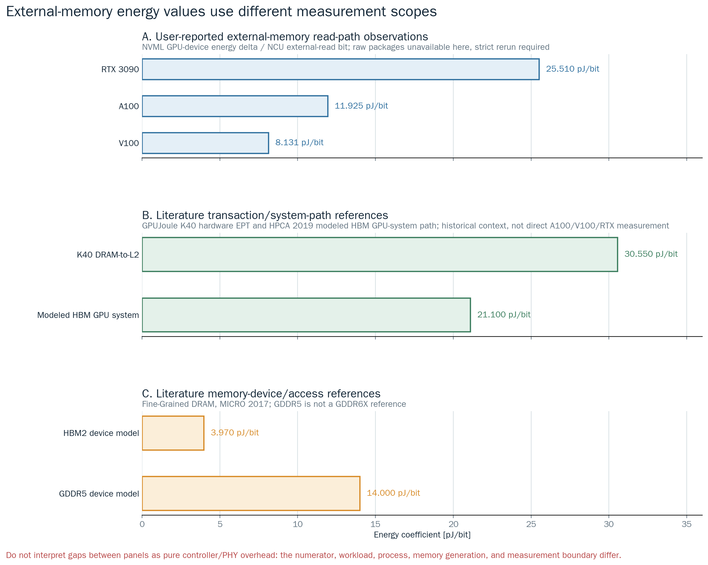

# External-Memory Read-Path 에너지 실험 설계

## 1. 결론

현재 `dram_cg_load_only - global_addr_only` 차분으로 얻은 값은 **DRAM 소자
자체의 에너지**가 아니다. NVML이 측정한 GPU device 전체 energy에서 주소-only
control을 뺀 뒤 NCU external-memory read byte로 나눈 **workload-dependent
effective GPU-device external-memory read-path coefficient**다.

따라서 다음 수치는 물리 HBM/GDDR pJ/bit로 인용하면 안 된다.

| GPU | 전달받은 값 (pJ/bit) | provenance | 현재 판정 |
|---|---:|---|---|
| RTX 3090 | 25.510 | 사용자 전달값 | external-memory effective path 후보, strict 재실험 필요 |
| A100 | 11.925 | 사용자 전달값; 원본 raw/NCU package는 이 저장소에서 독립 재계산하지 못함 | 같은 조건으로 strict 재실험 필요 |
| V100 | 8.131 | 사용자 전달값; 원본 raw/NCU package는 이 저장소에서 독립 재계산하지 못함 | 같은 조건으로 strict 재실험 필요 |

위 값이 크다는 관찰은 맞지만, 그 자체가 계산 오류의 증거는 아니다. 범위가
다른 물리 DRAM reference와 직접 비교했기 때문이다. 다만 기존 코드에는 분모,
압축 가능 입력, 단일 working-set, 느슨한 acceptance gate 문제가 실제로 있었으므로
기존 값은 재실험 전까지 확정값으로 사용하지 않는다.

## 2. Reference와 측정 범위

`Fine-Grained DRAM`이 제시한 HBM2 약 3.97 pJ/bit와 GDDR5 약 14.0
pJ/bit는 DRAM 장치 access 모델의 값이다. activation, DRAM 내부 data movement,
I/O를 다루지만 GPU SM, L1/L2 miss 처리, on-chip fabric, GPU memory controller,
stall 중 활성 회로, voltage regulator 손실을 모두 합친 board-level 차분값은 아니다.
([O'Connor et al., MICRO 2017](https://research.nvidia.com/sites/default/files/pubs/2017-10_Fine-Grained-DRAM%3A-Energy-Efficient/oconnor_and_chatterjee.micro2017.pdf))

NCU `dram__bytes_read.sum`은 L2와 device memory 사이에서 전송된 read byte를
계수한다. 이는 energy meter가 아니다.
([Nsight Compute Profiling Guide](https://docs.nvidia.com/nsight-compute/2025.2/ProfilingGuide/index.html))

NVML `nvmlDeviceGetTotalEnergyConsumption`은 device의 누적 total energy를
반환한다. HBM/GDDR rail만 별도로 반환하거나 controller/PHY/L2 energy를 분해하지
않는다.
([NVML API Reference](https://docs.nvidia.com/deploy/nvml-api/group__nvmlDeviceQueries.html))

따라서 두 값의 분자 범위가 다르다.

| 구분 | 분자에 포함되는 범위 | 분모 | 허용되는 표현 |
|---|---|---|---|
| DRAM device reference | DRAM device/access 모델 | device가 전송한 bit | HBM2/GDDR5 device pJ/bit |
| 본 microbenchmark | NVML GPU-device total energy 차분 | strict NCU external read bit | effective external-memory read-path pJ/bit |

## 3. 기존 25.510 / 11.925 / 8.131 pJ/bit가 큰 이유

현재 차분은 다음 항을 함께 포함한다.

```text
SM address/issue + load dependency + scheduler/stall effect
+ L1TEX request/miss handling
+ L2 lookup/miss and partition/fabric traffic
+ memory controller + PHY/interposer/board signaling
+ HBM2/HBM3/GDDR6X device access
+ GPU-device power-delivery loss captured by NVML
```

RTX 3090은 24 GB GDDR6X, 384-bit interface, 936 GB/s peak인 off-package
graphics board다. HBM2 3.97 pJ/bit와 직접 비교할 대상이 아니다.
([GA102 whitepaper](https://www.nvidia.com/content/PDF/nvidia-ampere-ga-102-gpu-architecture-whitepaper-v2.pdf))

V100은 900 GB/s HBM2이고, A100은 40 MB L2와 1555 GB/s 5-site HBM2를
사용한다. A100에는 compressible pattern의 DRAM traffic을 줄일 수 있는 Compute
Data Compression도 있다.
([V100 whitepaper](https://images.nvidia.com/content/volta-architecture/pdf/volta-architecture-whitepaper.pdf),
[A100 whitepaper](https://images.nvidia.com/aem-dam/en-zz/Solutions/data-center/nvidia-ampere-architecture-whitepaper.pdf))

전달값을 HBM2 3.97 pJ/bit로 단순 나누면 A100은 약 3.00배, V100은 약
2.05배다. 이 배율은 전체 경로 overhead가 포함될 때 가능한 order지만, 현재 raw
package 없이 값의 정확성을 보증하지는 못한다. RTX 3090의 25.510은 HBM2가 아닌
GDDR6X 전체 경로 값이므로 이 배율 비교 자체가 부적절하다.

GPUJoule은 K40의 DRAM-to-L2 transaction EPT를 30.55 pJ/bit로 제시하고,
같은 HPCA 2019 논문은 future HBM GPU system model에 21.1 pJ/bit를
사용한다. 이 값들은 HBM2 device 3.97 pJ/bit보다 본 실험의 scope에
가깝다. 따라서 8.131-25.510 pJ/bit가 device reference보다 크다는
이유만으로 계산 오류라고 할 수는 없다. 다만 K40 실측은 28 nm Kepler/GDDR5,
21.1은 미래 HBM 시스템 model이므로 역시 현대 GPU의 acceptance target으로
쓰면 안 된다.
([Arunkumar et al., HPCA 2019](https://research.nvidia.com/publication/2019-02_understanding-future-energy-efficiency-multi-module-gpus))



## 4. 확인된 기존 설계 문제

| 문제 | 왜 잘못되었나 | 조치 |
|---|---|---|
| 이름이 `DRAM sanity` | sanity인지 coefficient인지, 물리 DRAM인지 불명확 | 표시명 `External-memory read path (effective)`로 변경 |
| `dram_bytes` 사용 | read+write가 섞여 read-path 분모가 아님 | strict 분모를 `dram__bytes_read.sum`으로 고정 |
| expected byte fallback | 실제 miss, compression, replay를 반영하지 못함 | NCU exact/same-working-set read byte가 없으면 reject |
| 입력값이 32종 반복 | GA100 Compute Data Compression에 취약 | deterministic high-entropy FP16 pattern으로 변경 |
| W_SM=8192 KiB 한 점 | L2 capacity transition과 min/max를 알 수 없음 | architecture별 L2 배수 sweep으로 변경 |
| capacity-aware L2 gate가 느슨함 | working set이 작아 L2 hit가 높아도 통과 가능 | service L2 hit <=10%와 DRAM-read/L2-read >=90% 동시 요구 |
| write traffic 미검사 | writeback/output 오염을 read energy로 나눌 수 있음 | write/read <=1% 요구 |
| bandwidth 미표기 | low-rate latency 실험과 saturated stream의 pJ/bit가 섞임 | NCU duration이 있으면 read GB/s를 함께 보고 |

## 5. 새 실험이 측정하는 것

### 5.1 Treatment와 control

| 역할 | mode | 하는 일 | 고정 조건 |
|---|---|---|---|
| control | `global_addr_only` | 같은 tile 선택, 주소 계산, checksum loop를 수행하지만 global load는 하지 않음 | W_SM, blocks/SM, active SM, ITER, load_repeat |
| treatment | `dram_cg_load_only` | 같은 loop에서 `ld.global.cg.u32` read를 수행하고 L2보다 큰 set을 순환 | control과 동일 |

mode 이름은 과거 command/API 호환을 위해 유지한다. 보고서 component key는
`external_memory_read_path`를 사용한다.

### 5.2 계산

먼저 각 row에서 idle 동안 소비했을 energy를 제거한다.

```text
net_E(mode) = measured_device_E(mode) - idle_power * elapsed(mode)
```

같은 ITER의 treatment와 control을 직접 차분한다.

```text
delta_E_path = net_E(dram_cg_load_only) - net_E(global_addr_only)
```

마지막으로 NCU가 실제로 관측한 **read** bit로 나눈다.

```text
effective_path_pJ_per_bit
  = delta_E_path [J] * 1e12 / (NCU dram__bytes_read.sum [B] * 8)
```

값이 작으면 해당 workload와 power state에서 external read 1 bit를 서비스하는
GPU-device 증분 energy가 작았다는 뜻이다. HBM/GDDR cell 하나의 순수 energy가
작다는 뜻은 아니다.

## 6. Architecture-aware working-set sweep

W_SM은 SM당 논리 working set이며 full-GPU set은 `active_SM x W_SM`이다. 최소
한 점은 residual L2 hit 때문에 reject될 수 있도록 경계 가까이에 두고, 더 큰 두
점 이상에서 external-memory dominance를 확인한다.

| GPU | memory | nominal L2 (MiB) | W_SM sweep (KiB/SM) | full-GPU set (MiB) | L2 배수 |
|---|---|---:|---|---|---|
| RTX 3090, 82 SM | GDDR6X, off-package | 6 | 256, 512, 1024, 2048 | 20.5, 41, 82, 164 | 3.42x, 6.83x, 13.67x, 27.33x |
| V100, 80 SM | HBM2, interposer | 6 | 256, 512, 1024, 2048 | 20, 40, 80, 160 | 3.33x, 6.67x, 13.33x, 26.67x |
| A100, 108 SM | HBM2, interposer | 40 | 2048, 4096, 8192 | 216, 432, 864 | 5.40x, 10.80x, 21.60x |
| H100, 132 SM | HBM3, interposer | 50 | 2048, 4096, 8192 | 264, 528, 1056 | 5.28x, 10.56x, 21.12x |

| GPU | blocks/SM sweep | energy load_repeat | NCU load_repeat | 단위 |
|---|---|---|---|---|
| RTX 3090 | 8, 16 | 4, 8, 16 | 1, 4, 8, 16 | blocks/SM, count |
| V100 | 4, 16, 32 | 4, 8, 16 | 1, 4, 8, 16 | blocks/SM, count |
| A100 | 16, 32 | 4, 8, 16 | 1, 4, 8, 16 | blocks/SM, count |
| H100 | 16, 32 | 4, 8, 16 | 1, 4, 8, 16 | blocks/SM, count |

최종값은 한 좌표가 아니라 accepted 좌표의 min, median, mean, max, IQR, bootstrap
median CI와 NCU read GB/s를 함께 보고한다. GPU 세대 간 비교는 같은 W_SM 숫자가
아니라 `full working set / nominal L2` 비율과 bandwidth regime을 함께 맞춘다.

## 7. Strict NCU acceptance

| 항목 | gate | 의미 |
|---|---:|---|
| local spill read/write | 0 B | local-memory 오염 없음 |
| raw implementation marker | `input_data_pattern=splitmix64_uniform_fp16_v1` | 압축 가능한 32-value 구형 binary 거부 |
| L1 path hit | <=1% | L1 hit 경로가 아님 |
| L2 final-service hit | <=10% | read의 대부분이 L2에서 끝나지 않음; A100은 source+LTC-fabric logical hit 사용 |
| L2/source read / expected | 0.95-1.05 | 발행한 global read 요청량 보존 |
| external read / expected | 0.85-1.05 | 실제 external read가 충분하고 비정상 증폭 없음 |
| external read / L2 source read | >=0.90 | external-memory service가 지배적 |
| external write / external read | <=0.01 | read-only 경로의 write 오염 제한 |
| denominator | `dram__bytes_read.sum` 필수, `dram_read_bytes_source`로 provenance 확인 | sector 환산/total/expected fallback 금지 |
| write evidence | `dram__bytes_write.sum` 필수, `dram_write_bytes_source`로 provenance 확인 | total-read 차분으로 0 write를 추정하지 않음 |

NCU counter가 존재하지 않거나 dropped되면 provisional이 아니라 strict coefficient
대상에서 reject한다. counter acceptance는 경로를 검증할 뿐 energy attribution을
물리 소자 수준으로 바꾸지는 않는다.

## 8. 두 종류의 결과를 구분한다

| 결과 | 계산 | 해석 | 상태 |
|---|---|---|---|
| cumulative effective path | external-load treatment - address control | SM에서 external memory read service까지의 증분 completion energy | 현재 구현된 주 결과 |
| beyond-L2 marginal path | external-load treatment - NCU-accepted L2-hit load control | L2 hit보다 external miss가 추가하는 controller/PHY/memory/stall 증분 | L2 경로가 안정적으로 accepted된 플랫폼에서 보조 회귀로만 사용 |
| physical memory-device energy | memory rail/device model 필요 | HBM/GDDR 자체 access energy | 현재 NVML+NCU만으로 직접 식별 불가 |

`beyond-L2` 차분도 순수 DRAM은 아니다. treatment와 L2 control은 latency와 실행
시간이 다르며 controller, PHY, fabric, stall effect가 남는다. 물리 소자 energy를
주장하려면 분리된 memory-rail telemetry, 외부 전력 계측 또는 검증된 architecture
power model이 추가로 필요하다.

## 9. 보고 규칙

1. `DRAM energy`라고 단독 표기하지 않는다.
2. RTX 3090은 `GDDR6X external-memory read path`, V100/A100은 `HBM2
   external-memory read path`, H100은 `HBM3 external-memory read path`로 쓴다.
3. 모든 표에 `effective GPU-device coefficient; not pure memory-device energy`를
   표기한다.
4. pJ/bit과 함께 pJ/Byte, W_SM (KiB/SM), full set (MiB), blocks/SM,
   load_repeat (count), NCU read GB/s를 기록한다.
5. 문헌 device pJ/bit는 reference band로만 그리고 회귀 target이나 clamp로 쓰지
   않는다.
6. 기존 25.510/11.925/8.131은 새 high-entropy input과 strict read-byte gate로
   재실험하기 전에는 historical/user-reported observation으로만 남긴다.
