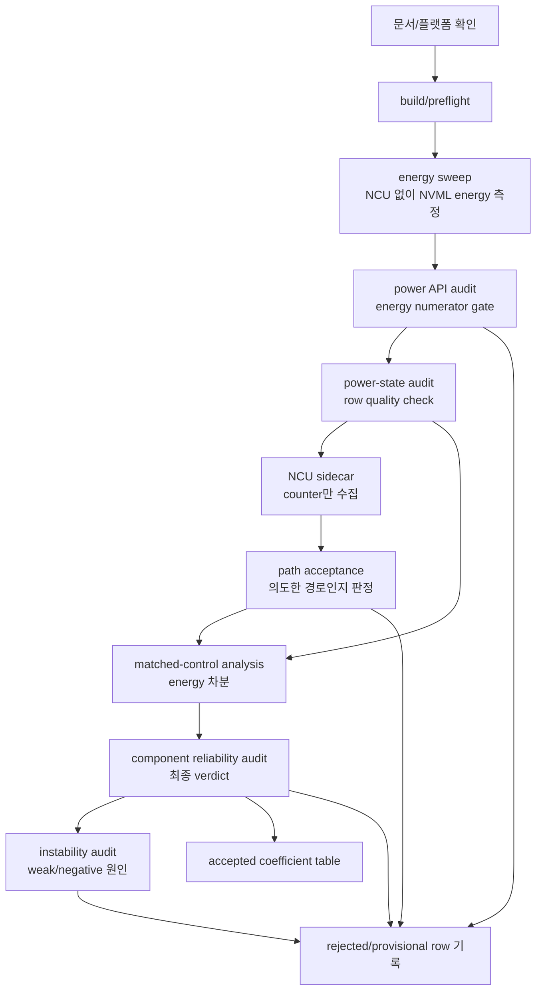
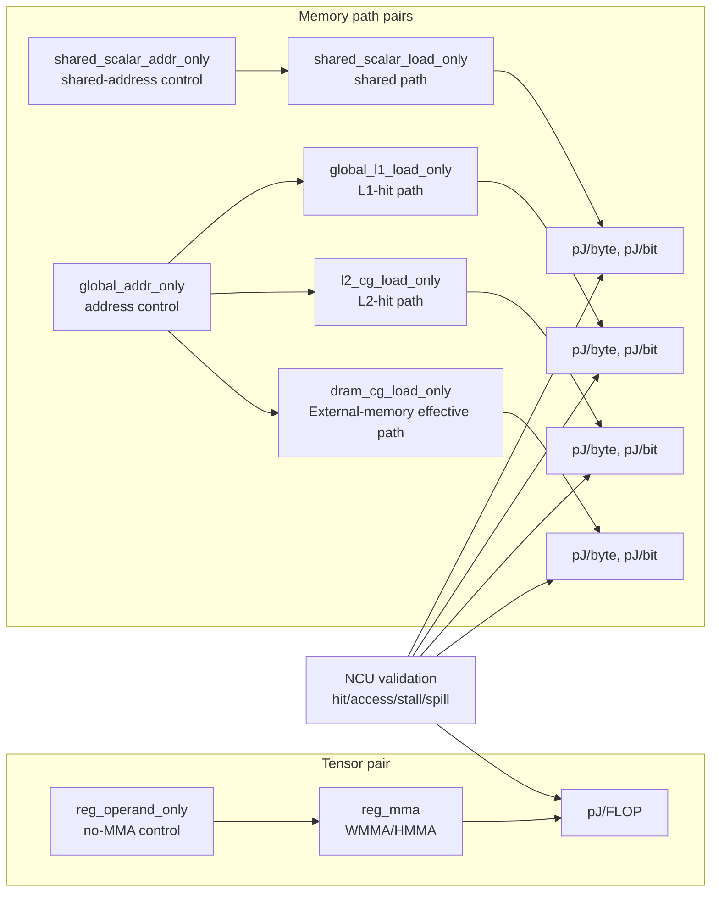

# How It Works: Component Energy Microbenchmark

작성일: 2026-07-02
최종 업데이트: 2026-07-22

이 문서는 현재 코드 기준으로 GPU component energy 실험이 어떻게 동작하는지 설명한다. 예전 문서에는 `shared_mma`, `l2_mma`, `dram_mma` 중심의 초기 탐색 설명이 많이 섞여 있었지만, 현재 해석은 **acceptance-first full-component finalplan**과 **FP16 Tensor-only `component_dynamic_attribution_v3`**를 목적에 따라 분리한다.

핵심은 다음 한 문장이다.

```text
이 실험의 pJ/FLOP, pJ/byte, pJ/bit 값은 NVML board-level energy를
matched-control로 차분하고, NCU로 path와 traffic denominator를 검증한
effective microbenchmark coefficient다.
```

순수 Tensor Core 회로 에너지, 순수 register-file 에너지, 순수 SRAM/HBM bitcell 에너지를 직접 측정하는 실험이 아니다.

## 0. 새 Tensor-only v3를 어떻게 이해할 것인가

새 FP16 Tensor 실험은 `clocked_empty`, `reg_operand_only`, `reg_mma`만
수집하는 별도 package다. 하나의 pair는 다음 순서로 실행된다.

```text
pair cooldown -> clocked_empty before
              -> control/reg_operand_only <-> treatment/reg_mma
              -> clocked_empty after
```

Control/treatment 순서는 coordinate와 repeat에 따라 반전한다. 두 모드는
동일 ITER, RF, blocks/SM, active SM을 사용한다. 각 mode의 `net_E_J`는
해당 mode 실행 중 측정한 idle energy가 이미 제거된 값이다.

| 방법 | 구현 계산 | 알 수 있는 것 | 단독 채택 주의 |
|---|---|---|---|
| matched-ITER completion | `(net_E_mma - net_E_operand) / FLOP_mma` | 같은 ITER를 완료할 때 MMA가 추가한 GPU-device energy | MMA로 길어진 active time도 포함 |
| clocked MI-ATC | `(delta_E_completion - P_clocked_empty * delta_t) / FLOP_mma` | blocks/SM별 저활동 active-time를 제거한 동적 Tensor 대리값 | `clocked_empty`가 scheduler-matched 반사실이라는 모델 가정 |
| control-rate ATC | `(E_mma - E_operand/t_operand * t_mma) / FLOP_mma` | no-MMA operand/control이 treatment 시간 동안 유지됐을 때의 operand-rate arm | control과 treatment의 power state가 비교 가능해야 함 |
| joint regression | `delta_E = beta_FLOP*FLOP + beta_time*delta_t + fixed effects` | RF/B/duration sweep에서 FLOP과 시간 기여를 동시 추정 | predictor 공선성, repeat 3, 충분한 좌표가 필요 |

즉 **v3는 MI-ATC 또는 operand-rate arm 하나의 별칭이 아니다.** 한 measurement
bundle에서 네 방법을 같이 보고, NCU HMMA/FLOP 비례성, control HMMA=0,
zero spill, binary hash 일치가 통과한 좌표만 해석한다. 방법 간 결과가 크게
다르면 하나를 골라 `순수 Tensor energy`라고 부르지 않고 반사실 모델
민감도로 보고한다.

Pilot은 B `4,8,16`, RF `1,4,16`, duration `5,15 s`, repeat `1`이므로
실행/NCU/캘리브레이션 진단용이다. Final은 RF `1,2,4,8,16`, duration
`5,15,30 s`, repeat `3`이며 이 조건에서만 회귀와 bootstrap CI를 final
후보로 판정한다. 전체 수식과 acceptance는
[component dynamic attribution protocol](component_dynamic_attribution_protocol_ko.md)을 따른다.

## 1. 실험 목적

이 저장소의 목적은 GPU 전체 전력 측정값에서 다음 경로의 **effective energy coefficient**를 합리적으로 분리해 보는 것이다.

| 목표 component/path | 목표 단위 | 현재 코드에서 채택 가능한 해석 |
|---|---:|---|
| Tensor MMA incremental | pJ/FLOP | no-MMA register/control 대비 FP16 WMMA/HMMA 추가 에너지 |
| Shared memory scalar path | pJ/byte, pJ/bit | shared-memory scalar load instruction path의 effective traffic energy |
| Global L1 hit path | pJ/byte, pJ/bit | global load가 L1 hit로 끝나는 path의 effective traffic energy |
| L2 hit path | pJ/byte, pJ/bit | L1을 배제하거나 낮춘 L2-hit transaction path의 effective traffic energy |
| External-memory read path | effective pJ/byte, pJ/bit | 주소-only control 대비 외부 메모리 read service 전체의 workload-dependent GPU-device coefficient; 물리 DRAM 소자 에너지 아님 |
| Register/control | pJ/reg-op 또는 진단값 | pure register energy가 아니라 no-MMA control/proxy |

이 목적을 달성하기 위해 실험은 세 가지를 함께 사용한다.

| 방법 | 역할 | 왜 필요한가 |
|---|---|---|
| Parameter sweep | `blocks/SM`, `W_SM`, `reuse_factor`, `load_repeat`를 바꿔 path가 분리되는 조건을 찾음 | GPU 구조마다 L1/shared/L2/DRAM 크기와 behavior가 다르기 때문 |
| Matched-control 차분 | 모든 final pair에서 treatment/control에 동일 ITER를 적용하고 net energy를 직접 뺀다 | 같은 logical work에서 scheduler/loop/address 비용을 최대한 맞추기 위해 |
| NCU path validation | L1/L2/DRAM/shared bytes, hit rate, Tensor instruction, spill, stall을 확인 | mode 이름만으로는 실제 경로를 보장할 수 없기 때문 |

## 2. 현재 최종 실험 축

현재 finalplan에서 component는 다음 pair로 본다.

| 실험 축 | treatment / control | 의미 | 최종 단위 |
|---|---|---|---|
| Tensor | `reg_mma - reg_operand_only` | FP16 WMMA/HMMA incremental cost 후보 | pJ/FLOP |
| Shared scalar | `shared_scalar_load_only - shared_scalar_addr_only` | 같은 shared allocation/index loop 대비 shared-memory scalar read path | pJ/byte, pJ/bit |
| Global L1 | `global_l1_load_only - global_addr_only` | 같은 주소/loop control 대비 global L1-hit load path | pJ/byte, pJ/bit |
| L2 | `l2_cg_load_only - global_addr_only` | 같은 주소/loop control 대비 L1-bypassed L2-hit path | pJ/byte, pJ/bit |
| L2 capacity diagnostic | `l2_load_only` | 일반 global-load path가 L1과 섞이는지 확인 | strict coefficient 제외, NCU 진단 전용 |
| External memory | `dram_cg_load_only - global_addr_only` | 같은 주소/loop control 대비 GPU-device external-memory read path | effective pJ/byte, pJ/bit 후보 |

중요한 현재 코드 기준:

- `scripts/plan_platform_component_experiment.py`는 `tensor`, `shared`, `l1`, `l2`, `dram` energy CSV를 나누어 생성한다.
- `scripts/analyze_matched_control_energy.py`의 기본 final pair는 `l2_cg_load_only` 기반 L2 coefficient를 계산한다.
- `l2_load_only`는 normal global load라 global L1을 우회하지 않는다. 따라서 strict L2 coefficient로 쓰지 않고, 필요한 경우 NCU 진단에만 사용한다.
- `shared_mma`, `l2_mma`, `dram_mma`는 여전히 코드에 있지만 현재 최종 component coefficient의 primary pair가 아니다. 보조 진단 또는 과거 탐색용으로 본다.

## 3. 전체 실행 흐름

전체 실험은 energy run과 NCU run을 분리한다. NCU replay는 kernel 실행을 바꿀 수 있으므로 NCU에서 나온 energy를 최종 pJ 분자로 쓰지 않는다.



| 단계 | 대표 script | 산출물 | 핵심 판정 |
|---|---|---|---|
| preflight | `scripts/preflight_gpu_support.py` | `results/summary/*_preflight.md` | GPU profile, CC, SM 수, NVML, NCU 상태 확인 |
| energy sweep | `scripts/run_component_regression_sweep.py` | `results/raw/*_component_finalplan_*.csv` | NCU 없이 `net_E_J`, elapsed, expected denominator 수집 |
| power API audit | `scripts/audit_power_api_measurements.py` | `results/summary/*_power_api_audit.md` | `nvml_total_energy`, integration method, profile power semantics 확인 |
| power-state audit | `scripts/audit_power_state_stability.py` | `results/summary/*_power_state_audit.md` | 같은 mode/config row 사이의 평균 전력, endpoint power, 온도/clock outlier 확인 |
| NCU sidecar | `scripts/run_ncu_validation.sh` | `results/ncu/*/ncu_cache_validation_summary.csv` | hit rate, bytes, accesses, stall, spill, Tensor instruction 확인 |
| path acceptance | `scripts/analyze_ncu_path_acceptance.py` | `results/summary/*_ncu_acceptance.*` | accepted/provisional/rejected 분류 |
| matched-control | `scripts/analyze_matched_control_energy.py` | `results/summary/*_matched_control_report.md` | pJ/FLOP, pJ/byte, pJ/bit 계산 |
| component reliability audit | `scripts/audit_component_reliability.py` | `results/summary/*_component_reliability_audit.md` | power/NCU/계수 안정성을 결합해 accepted/caution/sanity/reject 판정 |
| matched-control instability audit | `scripts/audit_matched_control_instability.py` | `results/summary/*_matched_control_instability_audit.md` | weak-signal/negative row의 원인과 follow-up 조건 요약 |

## 4. Energy Run이 측정하는 것

Energy run은 NVML을 이용해 kernel 실행 전후의 GPU energy 또는 power를 측정한다. raw CSV의 `net_E_J`는 mode별 독립 실행값이다.

```text
delta_E_J = NVML energy after - NVML energy before
idle_baseline_scaled_J = idle energy measured for same seconds, scaled to kernel elapsed time
net_E_J = delta_E_J - idle_baseline_scaled_J
```

Power API audit은 이 분자가 `nvml_total_energy` 기반 final 후보인지 확인한다.
Power-state audit은 같은 mode/config 반복 row와 비교해 특정 row의 평균 전력 또는
endpoint power가 비정상적으로 무너졌는지 확인한다. 이 둘은 역할이 다르다.
Power API audit을 통과해도 power-state outlier row는 matched-control delta를
왜곡할 수 있다.

멀티 GPU 노드에서 raw CSV의 `gpu_id`는 repeat 번호가 아니라 **물리 CUDA/NVML GPU
index**다. GPU 0 하나만 실행해도 harness는 보조 관찰을 위해 같은 `run_id`로 GPU
0,1,2,... 행을 기록할 수 있으며, 이때 `n_gpu_active=1`, active row의 notes는
`gpu_active=1`, 나머지는 `gpu_active=0`이다. 따라서 power-state audit은
`run_id` 하나가 아니라 `(sweep_source_id, run_id, gpu_id)`로 원본과 조인한다.
구형 audit처럼 `gpu_id`가 없거나 이 복합키가 중복되면 현재 분석기는 audit 재생성을
요구하며 중단한다. inactive GPU의 `smid_histogram_ok=false`가 active GPU 0의 판정을
덮어쓰는 것을 허용하지 않는다.

GPU 세대별 power API 의미가 다르기 때문에 energy run은 아래처럼 해석한다.

| 측정 경로 | 세대별 의미 | 최종 coefficient 사용 |
|---|---|---|
| `nvmlDeviceGetTotalEnergyConsumption` 전후 mJ 차분 | Volta 이상 fully supported device에서 기대되는 누적 GPU/device energy counter. 실제 지원 여부는 raw CSV로 확인 | 우선 사용 |
| `nvmlDeviceGetPowerUsage` endpoint 적분 | total energy counter가 없을 때의 fallback. V100/A100은 instant, RTX 3090/H100은 1초 평균 의미로 기록 | provisional/diagnostic |
| `power.draw.average` / `power.draw.instant` | nvidia-smi field. average는 GA100 제외 Ampere 이상에서 기대, instant는 runtime 지원 여부 확인 | metadata/diagnostic |
| H100 module power | GPU + supported NVIDIA CPU + module 구성요소 power | component numerator로 섞지 않음 |
| GPU memory power | GPU memory subsystem power | external-memory path의 보조 metadata로만 사용; device energy로 직접 환산하지 않음 |

세대별로 final numerator gate는 다음처럼 다르게 확인한다. 이 표는 API 지원 여부를
자랑하기 위한 표가 아니라, matched-control `delta_E_J`의 분자가 같은 의미인지 확인하는
표다.

| GPU/profile | fallback power 의미 | final pJ 계산에 필요한 power metadata | final 제외 조건 |
|---|---|---|---|
| RTX 3090 / `rtx3090` | `GetPowerUsage`는 1초 평균 | `nvml_total_energy_supported=true`, `energy_source=nvml_total_energy`, `measurement_scope=gpu_device_total_energy_counter`, `nvml_power_usage_semantics=one_sec_average` | WSL/driver에서 total-energy counter가 없고 endpoint fallback만 남은 row |
| V100 / `v100` | `GetPowerUsage`는 instantaneous | total-energy delta, `measurement_scope=gpu_device_total_energy_counter`, `nvml_power_usage_semantics=instant`, GV100 NCU path accepted | GV100 NCU 미지원 또는 `one_sec_average` semantics가 섞인 row |
| A100 / `a100` | GA100은 Ampere 예외로 instantaneous | total-energy delta, `measurement_scope=gpu_device_total_energy_counter`, `nvml_power_usage_semantics=instant`, MIG/full GPU와 runtime SM 기록 | RTX 3090의 active SM/L2/shared 좌표 또는 `one_sec_average` semantics가 섞인 row |
| H100 / `h100` | `GetPowerUsage`는 1초 평균 | GPU/device total-energy delta, `measurement_scope=gpu_device_total_energy_counter`, `nvml_power_usage_semantics=one_sec_average`, module/memory power 분리 기록 | module power 또는 GPU memory power를 L1/L2/DRAM denominator와 나눈 row |

여기서 중요한 점은 API가 보이는 것과 final coefficient로 쓸 수 있는 것이 다르다는
것이다. 새 플랫폼 결과를 볼 때는 항상 아래 순서로 확인한다.

| 확인 질문 | 확인할 CSV/문서 항목 | final 후보 조건 |
|---|---|---|
| total energy counter가 실제로 성공했는가? | `nvml_total_energy_supported`, `energy_source` | `true`, `nvml_total_energy` |
| energy 계산 방식이 무엇인가? | `energy_integration_method` | `total_energy_mj_delta` |
| fallback power sample의 시간 의미가 profile과 맞는가? | `nvml_power_usage_semantics` | RTX 3090/H100 `one_sec_average`, V100/A100 `instant` |
| 측정 scope가 GPU/device인가? | `measurement_scope`, preflight power scope | `gpu_device_total_energy_counter` |
| NCU denominator/path가 의도대로인가? | NCU acceptance CSV | treatment path `accepted` |

이 중 하나라도 깨지면 pJ/FLOP 또는 pJ/bit 숫자가 양수여도 final component
coefficient로 채택하지 않는다. 특히 H100/HGX에서 보이는 module power나 GPU memory
power는 "추가로 관찰한 telemetry"이지 L1/L2/DRAM denominator로 나눌 energy 분자가 아니다.

상세한 세대별 API 표와 final/provisional/reject 기준은
[power_measurement_api_matrix_ko.md](../platforms/power_measurement_api_matrix_ko.md)에
둔다.

주의:

- `shared_mma` row에 `reg_mma`가 미리 빠져 있지 않다.
- `l2_mma` row에 `shared_mma`나 `reg_mma`가 미리 빠져 있지 않다.
- raw `pJ_per_FLOP`, raw `pJ_per_input_bit`는 mode 자체의 1차 지표일 뿐 component별 최종값이 아니다.

## 5. NCU가 하는 일

NCU는 energy를 직접 측정하지 않는다. NCU의 역할은 두 가지다.

| 역할 | 의미 |
|---|---|
| Path validation | 해당 kernel이 의도한 Tensor, shared, L1, L2, DRAM 경로를 실제로 사용했는지 확인 |
| Denominator validation | memory path의 pJ/byte 또는 pJ/bit 계산에 사용할 실제 traffic byte를 확인하거나 보정 |

NCU에서 확인해야 하는 항목은 다음이다.

| Component/path | NCU에서 확인할 항목 | 채택 의도 |
|---|---|---|
| Tensor | HMMA/Tensor instruction, control total SASS instruction, spill/local memory, L1/L2/DRAM traffic | `reg_mma`는 Tensor instruction을 실행하고, control은 Tensor instruction 없이 expected register work에 비례해 실행되어야 함 |
| Shared scalar | shared accesses, shared bytes, shared instruction count, bank conflict | shared memory scalar load path가 충분히 발생하고 bank conflict가 낮아야 함 |
| Global L1 | path-specific L1 hit rate, L1 request/hit bytes, L2 read bytes, DRAM bytes | global load가 L1 lookup hit 중심이어야 함 |
| L2 CG | path-specific L1 hit bytes, source L2 hit/miss, architecture-specific remote/fabric lookup, native hit, DRAM read | `.cg` 요청은 L1TEX를 통과하지만 L1 cache hit는 거의 없어야 함. GA100은 첫 partition miss와 최종 L2 miss를 구분 |
| External-memory CG | DRAM read/write bytes, expected source bytes, L1/L2 final-service hit | read-dominant external-memory path인지 strict 검증 |
| 공통 | long/short scoreboard stall, wait stall, SMID histogram, spill/local | stall 또는 placement 문제를 결과에 같이 기록 |

현재 acceptance 기준은 다음처럼 요약된다.

| Path | accepted 조건 요약 |
|---|---|
| Tensor | `reg_mma`에서 Tensor/HMMA instruction > 0, spill/local 0, memory traffic이 threshold 이하 |
| Tensor control | `reg_operand_only`에서 Tensor/HMMA instruction = 정확히 0, spill/local 0, `SR_CLOCKLO` token이 static backward loop 내에 존재, runtime SASS/expected register op >=0.1, treatment와 동일 NCU 좌표 accepted |
| Shared scalar | shared bytes/accesses > 0, shared instruction 존재, bank conflict ratio 낮음, global/L2/DRAM traffic 낮음 |
| Global L1 | path-specific L1 hit >=95%, L1 request/hit bytes 존재, L2 read/L1 request <=1%, DRAM/L1 request <=1% |
| L2 CG | architecture-correct final L2 service >=95%, L1 path hit <=1%, L1 hit bytes/request bytes <=1%, DRAM-read/source-L2-read <=2%. GA100은 source+LTC-fabric logical hit와 native-model coherence 사용 |
| External-memory read | L1 hit <=1%, final L2 hit <=10%, source/expected 0.95-1.05, DRAM read/source >=0.90, write/read <=0.01, direct `dram__bytes_read.sum`/`dram__bytes_write.sum` provenance |

이 기준을 통과하지 못한 row는 pJ 값이 양수여도 최종 component coefficient로 채택하지 않는다.

NCU 버전에 따라 `sass__inst_executed_register_spilling_mem_local_op_*`가 GA100 metric
catalog에 없을 수 있다. 현재 sidecar는 함께 요청한
`l1tex__t_bytes_pipe_lsu_mem_local_op_ld/st`를 fallback으로 사용한다. 실험 kernel이
명시적 local-memory 자료구조를 사용하지 않으므로 두 local byte counter가 모두 0이고
ptxas도 spill 0일 때 `spill_evidence_source=local_memory_bytes_zero_inference`로 기록한다.
이때 architecture-neutral gate인 `spill_zero_verified=1`도 함께 기록한다. local bytes가
양수면 전용 spill instruction counter의 유무와 관계없이 reject한다.

## 6. pJ 계산 방식

### 6.1 Matched-control energy 차분

모든 final pair는 treatment 목표시간 candidate와 control 최소시간 candidate를 각각
calibrate한 뒤, 둘 중 큰 ITER를 treatment/control 모두에 적용한다. 실행시간은 달라도
logical loop count는 같다. 최종 분자는 두 idle-corrected net energy의 직접 차분이다.

| pair | final work policy | energy 차분 |
|---|---|---|
| Shared scalar - shared address control | dual calibration 후 동일 ITER | `net_E_treatment - net_E_control` |
| Global L1 - address control | dual calibration 후 동일 ITER | `net_E_treatment - net_E_control` |
| Tensor MMA - register operand control | dual calibration 후 동일 ITER | `net_E_treatment - net_E_control` |
| L2 CG - address control | dual calibration 후 동일 ITER | `net_E_treatment - net_E_control` |
| DRAM CG - address control | dual calibration 후 동일 ITER | `net_E_treatment - net_E_control` |

```text
ITER_treatment = ITER_control = N
delta_E_J = net_E_treatment(N) - net_E_control(N)
```

과거 Shared/Global L1 분석은 mode별로 따로 맞춘 ITER를 실행하고 control 평균 전력을
treatment 시간으로 확대한 duration-scaled 차분을 사용했다. RTX 3090 재감사에서
`clocked_empty`의 power가 LR에 따라 크게 변하고, memory stall이 issue/clock activity까지
바꾸면서 Shared LR16과 Global L1 다수 좌표가 음수가 되었다. 이는 load 회로가 음의
에너지를 쓴다는 뜻이 아니라 control 구조와 작업량이 맞지 않았다는 뜻이다. 따라서 이
방식은 현행 final coefficient에서 허용하지 않는다.

고정 ITER만 사용하면 같은 work가 대역폭 또는 처리량이 높은 GPU에서 더 빨리 끝날 수 있다.
현재 energy sweep의 `--seconds=10`은 ITER 고정값이 아니라 calibration 목표시간이다. 각
플랫폼에서 짧은 calibration run으로 필요한 ITER를 추정하므로, 더 빠른 GPU는 대체로 더
큰 ITER를 선택하고 실제 power 측정창은 약 10 s로 유지한다. 따라서 플랫폼 간 ITER 수는
직접 성능 비교값이 아니며, 실제 `elapsed_s`와 NCU가 확인한 bytes/operations를 분모로 써야
한다. 또한 이 보정은 peak memory bandwidth만으로 결정되지 않는다. cache hit 경로,
latency, SM 수, blocks/SM, occupancy, clock과 instruction dependency가 함께 영향을 준다.

Tensor final pair는 per-mode duration scaling의 예외다. `reg_mma`와
`reg_operand_only`를 따로 duration
calibration한 ITER를 각 mode에 그대로 쓰면 RF가 커질수록 서로 다른 work count를 비교하게
된다. 현재 finalplan은 각 RF에서 treatment 목표시간의 `reg_mma` ITER와 control 최소시간의
`reg_operand_only` ITER를 구하고, 둘 중 큰 ITER를 두 mode에 동일하게 적용한다.

L2 CG도 같은 이유로 동일 ITER가 필수다. `global_addr_only`가 `l2_cg_load_only`보다
빠르거나 느리다는 이유로 각 mode에 서로 다른 ITER를 주면, 주소 제어 작업과 L2 load
작업의 실행 횟수 자체가 달라진다. 현행 finalplan은 각 W/B/LR 좌표에서
`l2_cg_load_only`의 목표시간 candidate와 `global_addr_only`의 control 최소시간 candidate를
구하고, 둘 중 큰 값을 양쪽에 적용한다. 산출물 `*_l2_pair_calibration.csv`, raw 두 mode의
`ITER`, matched detail의 `pair_energy_basis=matched_iters_net_energy`와 `iter_ratio=1`이 모두
일치해야 한다.

2026-07-13 이전 V100 실행에서 NCU L2 read hit 약 99.9996%, L1 hit 0%를 얻었더라도,
control ITER가 treatment보다 약 2배 많아 모든 좌표가 음수였던 결과는 L2 path 검증만
성공한 것이다. 그 음수 `-12~-9 pJ/byte` 계수는 동일 작업량 차분이 아니므로 물리적
L2 에너지나 유효 coefficient로 해석하지 않는다.

```text
ITER_reg_mma = ITER_reg_operand_only
delta_E_tensor_J = net_E_reg_mma_J - net_E_reg_operand_only_J
```

Analyzer detail의 `pair_energy_basis=matched_iters_net_energy`, `iter_ratio=1`이 둘 다
확인되어야 한다. duration-scaled Tensor row는 새 final coefficient에서 reject한다.
또한 final analyzer는 `--require-control-ncu-acceptance`를 사용한다. 따라서
`reg_operand_only`와 `global_addr_only`도 treatment와 같은
`W_SM, blocks/SM, active_SM, RF/LR` 좌표에서 NCU `accepted`여야 한다.
treatment만 깨끗하고 control에 HMMA 또는 global input traffic이 남은 pair는 계수를
만들지 않는다.
또한 control HMMA=0만으로는 충분하지 않다. v4에서는 ptxas가 control 반복문
전체를 제거해도 HMMA=0/spill=0 조건이 통과했고, v5는 GA102에서는
통과했지만 A100에서 10억 ITER control이 약 1 ms에 종료되는 portability
실패를 보였다. 현행 v6는 treatment/control에 동일한 `SR_CLOCKLO` register
token을 넣고, static audit가 그 token read가 backward-loop 안에 있는지 확인한다.
NCU에서는 총 SASS instruction이 expected register operation에 비례하는지 별도로
확인한다.
동일 ITER control은 MMA treatment보다 빨리 끝난다. 따라서 표준 10 s package는 control
calibration floor 1 s, A100 targeted 20 s package는 2 s를 사용하고 analyzer는 각 floor의
80% 이상을 요구한다. 이보다 짧거나 `net_E_J <=0`이면 total-energy counter/noise floor에서
식별되지 않은 것으로 reject한다.

Pair calibration 자체도 계수 증거다. treatment/control의 최종 trial이 각각
`>=0.05 s`를 실제 실행해야 하며, control-derived ITER가 treatment 목표시간을
6배 초과하게 만들 것으로 예상되면 energy run 전에 중단한다. 표준
finalplan은 개별 command를 180 s에서도 중단한다. 이 값은 coefficient를
잘라내는 통계 threshold가 아니라 launch-only/사실상 hang을 막는 실행 안전 gate다.
실제 A100 실패 값과 무효화 범위는
[`a100_tensor_control_calibration_failure_20260715_ko.md`](../audits/a100_tensor_control_calibration_failure_20260715_ko.md)에
기록했다.

같은 ITER가 **같은 실행시간**을 뜻하지는 않는다. `reg_mma`가 더 오래 실행되면 direct
`net_E_treatment - net_E_control`에는 MMA instruction 자체뿐 아니라 그 추가 active time 동안의
scheduler, clocked SM, register-fragment lifetime 비용도 남는다. 반대로 control power를
treatment 시간으로 단순 확대하면 서로 다른 work를 가정하게 되므로 pure Tensor energy가
되지는 않는다. 현재 값은 동일 logical work를 완료하는 데 추가된 board-level energy라는
의미의 effective coefficient이며, 보고서에는 treatment TFLOP/s, 두 mode elapsed time과
net power를 함께 표기한다. GPU 간 값 차이는 Tensor 회로뿐 아니라 처리시간 차이의 영향도
받는다.

반복 run이 있을 때는 treatment row를 실행 순서상 가장 가까운 control row와 비교하는
`nearest-control` pairing을 우선 사용한다. GPU 온도와 clock이 시간에 따라 변하기 때문에,
mode별 median을 따로 고른 뒤 차분하면 실제로 같은 상태에서 측정되지 않은 두 row를
비교할 수 있다.

이 nearest 검색은 먼저 **동일 sweep 입력 CSV 안으로 제한**된다. finalplan은 Tensor,
Shared, Global L1, L2, DRAM을 서로 다른 5개 raw CSV에 기록하지만 L1/L2/DRAM은 모두
`global_addr_only` control을 사용한다. W_SM, blocks/SM, LR 좌표가 우연히 같더라도 다른
CSV의 control은 다른 경로 실험이므로 짝이 될 수 없다. 분석기는 입력 파일명을
`sweep_source_id`로 보존해 `config_key`에 포함하고, NCU acceptance/denominator key에는
`tensor/shared/l1/l2/dram` sweep family를 포함한다. detail CSV의 `source_file`과
`control_source_file`은 같은 파일이어야 한다.

현재 sweep runner는 알려진 두 mode pair를 하나의 원자적 실행 단위로 취급한다.
Tensor, Shared, Global L1, L2 CG, DRAM CG 모두 반복 시작점을 바꿀 때 command 한 개가 아니라
완전한 pair를 회전한다. 내부 순서는 반복과 좌표 index를 함께 사용해
`control -> treatment`와 `treatment -> control`를 counterbalance하며, 같은 반복
내에서도 서로 다른 좌표가 반대 방향을 갖도록 한다. 이로써 열/클럭 drift가
treatment에만 체계적으로 더해지는 것을
줄인다. 따라서 pair 하나가 repeat의 시작과 끝으로 분리되지 않으며 strict package는
두 실행 순서의 valid row를 모두 요구한다. 현재 raw CSV는 timed kernel 직전의
`measurement_start_epoch_ms`와 `steady_clock` elapsed를 기록하고, 종료 epoch는 시작
epoch에 monotonic elapsed를 더해 산출한다. 이는 Windows/WSL wall-clock 동기화가 측정
도중 시계를 앞뒤로 보정해도 interval 길이를 보존하기 위한 것이다. row의 `notes`에는
`measurement_interval_clock=steady_clock_anchored_epoch`가 남는다. 분석기는 두
benchmark interval 사이에 실제로 아무 pair kernel도 실행되지 않은 시간인
`pair_transition_gap_ms`를 계산한다. 생성 finalplan은
`max(30,000, (seconds + 15) x 1,000)` ms를 넘는 control 재사용을 reject한다.
각 binary process가 timed kernel 전에 측정 시간과 같은 길이의 idle baseline을 다시
측정하므로, 20초 이상 stability run에서는 고정 30초 한계를 쓰지 않는다.
실제 한계는 detail row의 `pair_transition_gap_limit_ms`에 기록하여 audit한다.

legacy 열 `pair_start_distance_ms`는 실제로 두 `run_id`의 **완료 시각 차이**였으며,
시작 간격이 아니다. 각 별도 프로세스의 idle baseline과 treatment 실행시간이 이 값에
포함되어 정상 인접 pair도 30초를 넘을 수 있었던 것이 A100/V100 일부 row 탈락의
원인이었다. 이전 raw CSV는 `start = run_id - elapsed_s`로 interval을 추정해 재분석하고
`pair_timing_source=legacy_run_id_elapsed_inferred`로 표시한다. 새 CSV는
`pair_timing_source=exact_epoch_interval`이어야 한다. Legacy fallback은 과거 row의
오탈락을 진단하기 위한 호환 경로이며, 새 strict result package의 final accepted
근거로는 허용하지 않는다.

또한 `delta_E_J`가 양수여도 충분히 크지 않으면 최종값으로 쓰지 않는다. 이 문서의 현재
기준은 `delta_E_J >= 10 J`이고,
`delta_E_J / max(E_treatment, control_energy_scaled) >= 0.5%`이다. 이 gate는
L1/shared처럼 treatment와 control의 board-level energy 차이가 작은 path에서 noise floor
안의 값을 component coefficient로 오해하지 않기 위한 장치다.

최종 summary에는 반복 안정도를 보기 위해 `IQR`, `MAD`, `CV`, bootstrap median 95% CI,
`confidence_class`도 함께 기록한다. 이 값들은 coefficient가 반복 run에서 얼마나 흔들리는지
보여주는 품질 지표이며, pure component isolation을 보증하지 않는다.

그 다음 denominator로 나눈다.

```text
pJ/FLOP = delta_E_J * 1e12 / FLOP
pJ/byte = delta_E_J * 1e12 / denominator_bytes
pJ/bit  = pJ/byte / 8
```

### 6.2 Tensor pJ/FLOP

Tensor는 byte denominator가 아니라 logical FLOP denominator를 사용한다.

| 항목 | mode | 의미 |
|---|---|---|
| treatment | `reg_mma` | register fragment를 준비하고 `mma_sync` 반복 |
| control | `reg_operand_only` | 비슷한 register fragment 구조를 쓰지만 `mma_sync` 없음 |
| denominator | FLOP | logical `m16n16k16` WMMA op 수 * 8192 FLOP |

각 RF 좌표에서 treatment/control의 `ITER`가 동일해야 하며, pair calibration manifest와
raw CSV를 package audit이 대조한다. control inner loop는 RF마다 dependent register integer
add 1개를 실행하고 최종 scalar sink를 공통 output `c.x[0]`에 저장해 ptxas가 loop를
제거하지 못하게 한다. `reg_mma`에도 같은 add를 MMA 다음에 한 번씩 실행하므로 차분에서
이 공통 instruction은 상쇄된다. 기존 control의 RF 비례 FP32 FMA/checksum과 memory
access는 없다. 두 mode의 output은 같은 per-thread 8개 scalar store, 총 256
floats/block 패턴을 쓴다. treatment는 accumulator fragment 8개를 저장해 compiler가
MMA를 제거하지 못하게 하고, control은 sink 값을 같은 주소 패턴으로 저장한다.
`store_matrix_sync`는 두 mode 모두 사용하지 않는다.

FLOP 계산:

```text
N_MMA = active_SM * blocks_per_SM * ITER * reuse_factor
FLOP  = N_MMA * 8192
```

`8192 FLOP`는 FP16 WMMA `m16n16k16` 한 번을 logical GEMM 기준으로 본 값이다.

```text
16 * 16 * 16 multiply-add = 4096 FMA = 8192 FLOP
```

Tensor에서 NCU는 denominator를 만드는 도구가 아니라 다음 조건을 확인하는 도구다.

| 확인 | 이유 |
|---|---|
| `reg_mma`에서 Tensor/HMMA instruction > 0 | 실제 Tensor path 실행 확인 |
| `reg_operand_only`에서 Tensor/HMMA instruction = 0 | no-MMA control 확인 |
| control static backward branch > 0 | ptxas 후 control loop 생존 확인 |
| control SASS instruction / expected register op >= 0.1 | launch-only control이 아니라 runtime work가 RF/ITER에 비례하는지 확인 |
| FP16-to-FP32 Tensor ops / expected FLOP = 약 1 | compiler가 논리 WMMA보다 많은 Tensor op를 발행하지 않았는지 확인 |
| RF별 HMMA/logical-MMA 비율의 상대 spread <= 10% | RF specialization에 따른 이중 predicated HMMA 같은 codegen 오염 검출 |
| spill/local memory = 0 | register spill로 L1/L2/DRAM traffic이 섞이는 것을 방지 |
| L1/L2/DRAM traffic이 작음 | Tensor coefficient가 memory traffic에 오염되지 않았는지 확인 |

### 6.3 Memory pJ/byte와 pJ/bit

Memory path는 다음 pair를 사용한다.

| Component/path | treatment | control | denominator 우선순위 |
|---|---|---|---|
| Shared scalar | `shared_scalar_load_only` | `shared_scalar_addr_only` | NCU shared read bytes |
| Global L1 hit | `global_l1_load_only` | `global_addr_only` | NCU L1 request bytes |
| L2 CG hit | `l2_cg_load_only` | `global_addr_only` | NCU L2 read bytes |
| External-memory read | `dram_cg_load_only` | `global_addr_only` | NCU `dram__bytes_read.sum` |

초기 expected bytes는 코드에서 다음처럼 계산된다.

```text
expected_bytes =
  active_SM * blocks_per_SM * ITER * load_repeat * 1024 bytes
```

하지만 최종 memory coefficient에서는 expected byte를 그대로 쓰지 않는다. NCU sidecar에서 얻은 actual bytes로 scale을 만든다.

```text
NCU scale = NCU actual bytes / expected bytes
final denominator bytes = energy-run expected bytes * NCU scale
```

보고서의 `denominator_source`는 다음처럼 해석한다.

| denominator_source | 의미 | 채택 수준 |
|---|---|---|
| `ncu_actual_exact` | mode, W_SM, blocks/SM, active_SM, reuse/load_repeat까지 같은 NCU row 사용 | 가장 좋음 |
| `ncu_actual_same_working_set` | mode, W_SM, blocks/SM, active_SM은 같고 factor는 대표 NCU scale 사용 | 기존 RTX 3090 strict 결과의 한계. 새 final run에서는 보조/fallback |
| `expected_no_ncu_match` | NCU actual denominator 없음 | 최종 pJ/byte 채택 금지 |

## 7. Shared Scalar와 Global L1의 차이

RTX 3090 GA102도 L1 data cache와 shared memory가 완전히 독립된 두 SRAM 블록처럼 떨어져 있는 구조가 아니다. NVIDIA GA102 whitepaper 기준으로 GA10x SM의 네 partition은 **combined 128 KiB L1 data cache/shared memory subsystem**을 공유하고, compute mode에서는 L1/shared 용량 구성을 workload에 맞게 나눌 수 있다.

하지만 실험 해석에서는 shared와 global L1을 그냥 같은 값으로 합치면 안 된다. 같은 on-chip subsystem에 가까운 자원을 공유하더라도, CUDA 주소 공간, instruction, datapath, NCU counter가 다르기 때문이다.

| 구분 | Shared scalar | Global L1 |
|---|---|---|
| 대표 mode | `shared_scalar_load_only` | `global_l1_load_only` |
| 접근 공간 | `__shared__` memory | global memory |
| 데이터 관리 | software-managed scratchpad | hardware-managed cache |
| 의도한 경로 | shared memory load path | global load가 L1 cache hit로 끝나는 path |
| 대표 instruction/path | shared load, bank selection/arbitration | `ld.global.ca`, address translation, coalescing, tag lookup |
| 데이터 위치 | block 내부 shared memory | global 주소 공간의 데이터가 L1에 캐시된 상태 |
| 주 검증 counter | shared bytes/accesses, shared instruction, bank conflict | L1 hit rate, L1 bytes, L2/DRAM traffic 낮음 |
| 현행 kernel carveout | `cudaSharedmemCarveoutMaxShared` 요청 | 별도 max-shared 요청 없음 |
| pJ/bit denominator | NCU shared read bytes | NCU L1 request bytes; 순수 SRAM bit-toggle 수가 아님 |
| 보면 안 되는 해석 | scalar ALU energy | shared memory energy |

쉽게 말하면:

```text
Shared scalar = __shared__ 배열을 반복해서 읽는 software-managed shared path
Global L1     = global pointer를 읽지만 L1 cache hit로 끝나게 만든 hardware cache path
```

왜 둘을 분리해야 하는가:

- RTX 3090에서 L1 cache와 shared memory는 combined/unified L1/shared subsystem을 공유하지만, 접근 instruction과 datapath는 동일하지 않다.
- V100도 128 KiB/SM의 combined L1/shared subsystem이지만 Shared와 Global-L1의 접근 의미는 같지 않다. NVIDIA는 shared를 software-managed memory, L1을 global load가 사용하는 hardware-managed cache로 구분한다.
- shared memory는 thread block이 명시적으로 관리하는 scratchpad다.
- global L1은 global memory instruction이 cache hierarchy를 통해 처리되는 path다.
- 현행 Shared kernel은 통합 자원을 Shared 쪽으로 배분하는 max-shared carveout을 요청하므로 Global-L1 kernel과 활성 용량 조건도 동일하지 않다. 이 API는 preference이며 실제 비율은 driver가 조정할 수 있다.
- 따라서 `shared_scalar_load_only`의 pJ/bit와 `global_l1_load_only`의 pJ/bit를 둘 다 “L1 energy”라고 합쳐 쓰면 안 된다.
- 논문/보고서에서는 `Shared scalar path`와 `Global L1-hit path`를 별도 coefficient로 쓰고, 필요할 때만 상위 범주로 `on-chip L1/shared subsystem effective traffic`이라고 묶어 표현한다.

### 7.1 두 값은 같아야 하는가

아니다. 동일한 물리 subsystem을 공유한다는 사실은 두 **effective path coefficient**가
같다는 뜻이 아니다. Shared 계수에는 banked shared read, RF write, dependent checksum
chain과 해당 control 차이가 들어가고, Global-L1 계수에는 global address/coalescing/tag
lookup, L1 hit data return, RF write와 해당 control 차이가 들어간다. 두 denominator도
각각 shared read bytes와 L1 request bytes라서 “같은 SRAM bit를 같은 횟수만큼 토글한
순수 회로 실험”이 아니다.

V100 외부 실행에서 보고된 Global L1 `0.672 pJ/bit`는
`accepted_low_stability`, Shared `1.124 pJ/bit`는 유일 후보가 legacy pair timing gate를
통과하지 못한 탈락 진단값이다. 따라서 현재 두 값의 1.67배 차이를 V100 구조 특성으로
해석하거나 두 계수의 대소관계를 인용하면 안 된다. 정확한 비교에는 같은 측정시간,
blocks/SM, 실제 NCU byte 보존, bank conflict=0, Global-L1 hit>=95%, 양방향 pair order,
충분한 반복과 신뢰구간을 모두 통과한 새 package가 필요하다.

하나의 상위 `L1/shared subsystem` 기여량이 필요해도 두 계수를 단순 평균하지 않는다.
대상 workload의 NCU traffic으로 다음처럼 합산한다.

```text
E_L1/shared = beta_shared * shared_read_bits
            + beta_global_L1 * global_L1_hit_bits
```

단일 가중 계수가 꼭 필요하면 위 에너지를 두 bit 수의 합으로 나눈다. 이 값은 workload의
Shared/Global-L1 traffic mix가 바뀌면 함께 바뀌며, SRAM array의 고유 상수가 아니다.
두 beta 중 하나라도 strict acceptance를 통과하지 못했다면 합산값도 final로 보고하지 않는다.

구조 근거: [NVIDIA Tesla V100 Architecture Whitepaper](https://images.nvidia.com/content/volta-architecture/pdf/volta-architecture-whitepaper.pdf),
[CUDA shared-memory carveout API](https://docs.nvidia.com/cuda/cuda-driver-api/group__CUDA__TYPES.html).

## 8. 주요 mode 설명

### `clocked_empty`

Memory traffic이나 MMA 없이 persistent grid/loop 구조를 만드는 diagnostic baseline이다.
현행 final protocol의 Shared는 `shared_scalar_addr_only`, Global L1/L2/External-memory는
`global_addr_only`를 matched control로 사용한다.

의미:

```text
clocked_empty ~= scheduler + warp loop + timing/control baseline
```

### `reg_operand_only`

`reg_mma`와 최대한 비슷한 register-fragment 반복 구조를 만들되 `mma_sync`만 제거한 no-MMA matched control이다.

의미:

```text
reg_operand_only ~= no-MMA register-fragment/control baseline
```

주의:

```text
reg_operand_only != pure register file energy
```

source에서는 A/B/C fragment, A fragment in-place sign flip, dependent scalar update,
C fragment 기반 epilogue를 treatment와 같게 선언하지만 `mma_sync`는 발행하지 않는다. 그러나
ptxas가 no-MMA control의 fragment를 대부분 최적화하므로 실제 register footprint는
treatment와 같지 않다. 따라서 pure RF pJ/access나 register-footprint-matched
Tensor-only control이 아니라 **lightweight no-MMA control**이다.

v4에서는 scalar sink가 empty inline asm에만 연결되어 ptxas가 이 lightweight control
loop까지 전부 제거했다. v5의 output sink도 A100에서는 충분하지 않았다.
v6는 두 mode의 inner step에 runtime `SR_CLOCKLO` token을 소비하며, static token-loop,
50 ms calibration trial, runtime SASS/register-op gate를 모두 통과해야 한다. 소스에
loop가 보인다는 사실만으로 실행됐다고 판단하지 않는다.

### `reg_mma`

memory-backed operand 공급을 최대한 줄이고 register fragment 기반으로 FP16 WMMA `mma_sync`를 반복한다.

의미:

```text
reg_mma - reg_operand_only ~= effective Tensor MMA incremental cost
```

operand는 global/shared memory에서 load하지 않고 `fill_fragment`로 register fragment에
직접 생성한다. A fragment는 `+1/8`에서 시작해 fragment 내부 sign bit를 logical
MMA마다 in-place로 뒤집고, B는 `+1/16`을 사용한다. 따라서 A 부호가 교대되어
FP32 accumulator가 두 상태 사이를 왕복하게 한다. 이는 양수만 장시간 누적할 때
FP32 정밀도 한계로 accumulator update가 사실상 멈추는 v2 문제를 제거한다.

이 방식은 양수/음수 두 fragment를 branch로 선택하던 v3도 대체한다. RTX 3090에서
v3 RF2 이상은 두 branch가 predicated HMMA로 함께 발행되어
`HMMA/logical MMA=4`가 되었고 RF1의 2와 불일치했다. v6는 v4의 in-place sign flip과
v5의 output sink를 유지하면서 두 mode에 runtime clock-token step을 공통으로 넣는다.
Treatment의 predicated HMMA를
금지하는 것과 control loop의 실제 실행을 별도 gate로 검증한다.

RF1/2/4/8/16은 모두 compile-time fixed-trip kernel로 dispatch한다. 임의 RF는
diagnostic용 dynamic fallback을 사용할 수 있지만 final coefficient는 각 GPU에서
`HMMA/logical MMA` 상대 spread<=10%, 가능한 GPU에서는
`FP16-to-FP32 Tensor ops / expected FLOP=0.98-1.02`, control HMMA=0,
local/spill=0을 통과해야 한다.
H100에서도 현재 mode는 WGMMA/TMA가 아니라 FP16 WMMA가 lowering된 HMMA
compatibility path를 측정한다.

Runtime clock-token은 두 mode에 동일하게 추가되지만 MMA와의 overlap 차이까지
완전히 제거하지는 못한다. 따라서 현재 Tensor 계수는 여전히 pure
Tensor circuit pJ/FLOP가 아니라 matched microbenchmark의 effective increment다.

### `shared_scalar_load_only`

dynamic shared memory를 만들고, shared memory scalar load를 반복한다. 현재 shared path의 primary mode다.

의미:

```text
shared_scalar_load_only - shared_scalar_addr_only
  ~= matched shared-address loop 대비 shared-memory scalar read path effective coefficient
```

### `shared_scalar_addr_only`

`shared_scalar_load_only`의 matched control이다. treatment와 같은 dynamic shared
allocation, 초기화 store, barrier, tile/index/checksum loop를 실행하지만 반복 shared read는
발행하지 않고 계산된 shared 주소만 소비한다. RTX 3090의 현재 sm_86 build에서 두 kernel은
모두 ptxas 기준 26 registers/thread, spill 0으로 확인되었다. NCU에서는 treatment의
`shared_read_bytes > 0`, control의 `shared_read_bytes = 0`을 요구한다. control의 초기화
`shared_write_bytes`는 의도된 공통 setup이므로 0일 필요가 없다.

이 차분도 순수 shared SRAM bitcell energy는 아니다. 동일 loop count를 완료할 때 추가된
shared load instruction, bank/arbitration, dependency stall, scheduler/clocked-SM 시간을 포함한
effective board-level completion energy다.

### `global_l1_load_only`

작은 global working set을 반복해서 `ld.global.ca.u32` scalar load로 읽어 global load가 L1 hit로 끝나도록 만드는 mode다. WMMA fragment load를 쓰지 않으므로 memory pair의 control과 per-thread scalar loop 구조가 맞는다.

의미:

```text
global_l1_load_only - global_addr_only
  ~= same-address/same-loop control 대비 global-load L1-hit path coefficient
```

NCU에서 L1 hit rate가 높고 L2/DRAM traffic이 낮아야 한다.

### `global_addr_only`

`global_l1_load_only`, `l2_cg_load_only`, `dram_cg_load_only`의 matched control이다.
같은 block별 base address, tile 선택, repeat loop, checksum 연산을 실행하지만 pointer를
주소값으로만 소비하고 global input load는 발행하지 않는다. 따라서 아래 차분은 단순 empty
loop 차분보다 주소 계산과 loop control 비용을 잘 제거한다.

```text
global_*_load_only - global_addr_only
```

NCU에서는 global-load L1 request byte가 0인지 확인한다. `--verify-smid=1`의 SMID atomic은 L2
sector counter에 나타날 수 있으므로, address control의 L2 sector가 0이어야 한다고 해석하면
안 된다. DRAM background는 paired treatment expected input bytes의 0.1% 이하만 허용한다.
이 상한은 output store, SMID atomic, profiler replay를 위한 것이며 global input request 0
조건을 대체하지 않는다.

### `l2_cg_load_only`

global load에 `ld.global.cg.u32` 경로를 사용해 L1을 최대한 배제하고 L2 hit path를 만들기 위한 mode다. RTX 3090/V100처럼 L2-only window를 W_SM만으로 만들기 어려운 GPU에서 primary L2 mode다.

의미:

```text
l2_cg_load_only - global_addr_only
  ~= same-address/same-loop control 대비 L1-bypassed L2-hit path coefficient
```

`.cg`는 global load를 L2와 그 아래 계층에 cache하고 L1에는 cache하지 않지만, 요청 자체는
L1TEX를 통과한다. 따라서 `L1 request bytes / L2 read bytes ~= 1`은 정상일 수 있으며 이를
L1 hit 오염으로 판정하면 안 된다. NCU에서는 global-load lookup 기반 L1 path hit와 hit
bytes가 거의 0인지, architecture별 final L2 service가 95% 이상인지 확인한다.
aggregate L1/L2 hit rate는 background/다른 op를 포함할 수 있어 진단값으로만 남긴다.
GA102/GH100은 검토된 direct/native 교차검증을 사용하고, V100/GV100에서 native metric이
없으면 이를 가짜 통과값으로 채우지 않는다.

GA100에서는 device/TEX source lookup miss가 곧 logical final miss가 아니다. 첫 partition
miss가 `srcunit_ltcfabric`을 통해 다른 L2 partition에서 hit할 수 있으므로 다음 식을 쓴다.

```text
logical final L2 hit = (source hit + LTC-fabric hit) / source read
native lookup model = (source hit + LTC-fabric hit) / (source read + fabric read)
```

logical final hit는 >=95%, source/fabric sector 보존은 각각 0.98-1.02,
native-model 차이는 <=2 percentage points여야 한다. direct source hit와 native lookup
hit 자체에는 95%를 강제하지 않는다. 상세 설계는
`a100_l2_fabric_aware_experiment_design_ko.md`를 따른다.
또한 `(L2 read hit sectors + L2 read miss sectors) / L2 read sectors`가 0.98-1.02인지
확인한다. observed L2 read bytes도
`active_SM * blocks/SM * ITER * load_repeat * 1024 B`로 계산한 logical expected bytes의
0.95-1.05여야 한다. `L2 miss bytes`와 `DRAM read bytes`도 함께 기록해 58-60% 같은 값이 실제
downstream miss traffic을 동반하는지 구분한다. DRAM은 cache-line transaction 때문에
32-byte L2 miss sector와 정확히 1:1일 필요는 없다.
CG mode의 시간 측정 전 warm-up도 `global_cg_warmup_kernel`의
`ld.global.cg.u32`로 수행한다. 이로써 일반 `.ca` warm-up이 L1을 먼저 채워
L2 target에 잔류 hit를 만드는 설계 혼입을 제거한다.

현재 `run_ncu_validation.sh`의 기본 수집 정책은
`NCU_REPLAY_MODE=application`, `NCU_CACHE_CONTROL=none`이다. application replay는
metric pass마다 프로그램을 다시 실행하므로 binary 내부 warm-up도 매번 재실행된다.
반대로 kernel replay/cache-control none은 application warm-up 이후의 cache 상태를
모든 pass에 동일하게 재현한다고 보장할 수 없어 cache-hit 검증의 기본값으로 쓰지 않는다.
case manifest와 NCU summary에는 replay mode, cache control, warm-up 횟수,
metric profile, L2 residency policy와 address layout이 기록된다.

최종 L2 hard gate는 전체 NCU metric bundle이 아니라 `l2_path_minimal` profile을
사용한다. 전체 bundle에서 서로 다른 application replay pass의 counter가 보존되지 않아
`hit + miss != read`가 된 실제 사례가 있었기 때문이다. 최소 profile은 path hit/miss,
native 교차검증, expected traffic, DRAM leakage, local spill, long scoreboard를 수집한다.
GA100/GH100은 같은 bundle에 LTC-fabric read/hit/miss를 추가해 source와 fabric
보존성을 모두 요구한다. External-memory도 coherent memory population을 위해 별도
`l2_path_minimal` replay를 사용한다. Tensor/Shared/Global-L1은 `full` profile을
사용하고 세 CSV를 행 단위로 merge한다. 서로 다른 replay의 metric을 한 행에 섞지 않는다.

A100 targeted L2 재실험은 W16/W128 KiB/SM, LR4에서 policy/layout/blocks-SM 후보를
순서대로 검사한다. 먼저 normal contiguous B16/B8/B4/B2/B1과 normal
`sm_interleaved` B16/B8/B4를 검사하고, 모든 normal 후보가 실패할 때 persisting
contiguous B16/B8/B4/B1과 sm_interleaved B8/B4를 검사한다.
`sm_interleaved`는 block-private region에 128 B guard를 넣고 virtual-grid 순서를 전치한다.
이는 공개되지 않은 세부 set/slice mapping을 가정해
결론내리는 대신 address-topology와 동시성 변화가 60% hit에 미치는 영향을 NCU로 판별하는
진단이다. 첫 완전 통과 후보만 energy에 전달하며 logical final-service 95% gate는
완화하지 않는다.
persisting 결과는 default cache가 아니라 residency-managed L2 path의 effective
coefficient다. persisting 후보는 NCU launch metadata의 실제
`launch__persisting_l2_cache_size`가 0보다 큰지도 확인한다.

### `l2_load_only`

일반 global load 기반 capacity diagnostic mode다.

주의:

- 모든 GPU에서 일반 `l2_load_only`는 L1 hit와 섞일 수 있으므로 L2-only coefficient로 부적절하다.
- 현재 final matched-control analyzer의 primary L2 pair는 `l2_cg_load_only - global_addr_only`다.

### `dram_cg_load_only` (호환 mode 이름)

nominal L2보다 큰 working set으로 `.cg` global read를 만들고 external-memory
traffic이 지배적인지 확인한다. 보고서 component 이름은 **External-memory read path
(effective)** 또는 `external_memory_read_path`다. `DRAM sanity`와 순수 `DRAM
energy`라는 표현은 더 이상 사용하지 않는다.

External-memory energy pair는 동일 ITER로 실행한다. Treatment와 control을 각각
시간 보정해 control power를 treatment 시간만큼 확장하는 방식은 control이 더 많은
주소/정수 작업을 수행해 DRAM 계수를 과도하게 낮출 수 있다. 따라서
`dram_cg_load_only`와 `global_addr_only`에 동일한 resolved ITER를 전달하고, 각
run에서 idle을 제거한 `net_E`를 직접 차분한다.

```text
delta_E_dram = net_E(dram_cg_load_only, ITER=N)
             - net_E(global_addr_only, ITER=N)

effective pJ/bit = delta_E_dram * 1e12
                 / (NCU dram__bytes_read.sum * 8)
```

`ITER` equality는 경로 검증과 별개의 hard gate다. NCU가 DRAM-dominant traffic을
보여도 treatment/control ITER가 다르면 coefficient는 reject한다.

Strict NCU는 L1 hit <=1%, A100 fabric을 포함한 final-service L2 hit <=10%,
source/expected read bytes 0.95-1.05, external read/source read >=0.90,
write/read <=0.01, spill 0을 요구한다. 입력은 A100 Compute Data Compression 영향을
줄이기 위해 deterministic high-entropy FP16 pattern을 사용한다. 이 coefficient에는
SM issue/stall, L1/L2 miss, fabric, controller/PHY, HBM/GDDR와 GPU-device 전력경로가
남으므로 물리 memory-device pJ/bit가 아니다. 상세 설계와 architecture별 W sweep은
[External-Memory Read-Path 설계](external_memory_read_path_experiment_design_ko.md)를
따른다.

### 보조/과거 탐색 mode

다음 mode는 코드에 남아 있지만 현재 final coefficient의 primary mode가 아니다.

| mode | 현재 위치 | 주의 |
|---|---|---|
| `shared_load_only` | shared WMMA load control/보조 진단 | bank conflict와 instruction mix 때문에 `shared_scalar_load_only`가 primary |
| `shared_mma` | shared operand + MMA 보조 진단 | `shared_mma - reg_mma`를 바로 shared energy로 해석하지 않음 |
| `l2_mma` | L2 operand + MMA 보조 진단 | L1/L2/DRAM path가 NCU로 확인되지 않으면 최종값 제외 |
| `dram_mma` | DRAM operand + MMA 보조 진단 | stall과 memory hierarchy 비용이 크게 섞임 |
| `reg_pressure` | scalar register-pressure 진단 | pure register-file energy가 아니라 control/proxy |
| `addr_only` | address generation control | memory coefficient primary pair는 아님 |

## 9. `W_SM`, blocks/SM, factor sweep의 의미

### 9.1 `W_SM`

`W_SM`은 SM당 logical working set 좌표다. 하지만 모든 mode에서 같은 의미가 아니다.

| mode 계열 | `W_SM` 사용 방식 |
|---|---|
| shared 계열 | block당 dynamic shared memory 크기 `W_block = W_SM / blocks_per_SM`에 반영 |
| global L1/L2/DRAM 계열 | `active_SM * W_SM` 크기의 global input buffer에 반영 |
| `reg_mma`, `reg_operand_only` | memory working set이 적용되지 않음. CLI에는 `1 KiB`를 placeholder로 전달 |
| `reg_pressure` | `W_SM`보다 `--reg-payload-bytes`와 ptxas register footprint가 중요 |

중요한 정정:

```text
reg_mma의 W_SM은 N/A이다. 현재 CLI의 1 KiB는 parser/coordinate
placeholder이며 register 또는 cache working set 크기가 아니다.
```

`reg_mma`의 실제 register footprint는 ptxas register count, threads/block, resident blocks/SM로 판단해야 한다.

```text
register_footprint_B_per_block
  = ptxas_registers_per_thread * threads_per_block * 4

register_footprint_B_per_SM
  = register_footprint_B_per_block * resident_blocks_per_SM
```

### 9.2 `blocks/SM`

`blocks/SM`은 SM 하나에 동시에 배치하려는 block 수다. 현재 기본 kernel은 block당 32 threads, 즉 1 warp를 쓴다.

| 항목 | 의미 |
|---|---|
| `threads/block = 32` | block 하나가 warp 하나 |
| `grid blocks = active_SM * blocks_per_SM` | 의도한 SM 수에 균등하게 workload를 뿌림 |
| `smid_histogram_ok` | 실제로 각 SM에 의도한 block 수가 갔는지 확인 |

`blocks/SM`을 바꾸면 occupancy, scheduler pressure, memory issue pattern이 함께 바뀐다. 다만
이 값은 requested grid density이지 실제 resident block 수의 보장이 아니다. 실제 residency는
NCU achieved occupancy, registers/thread, static/dynamic shared bytes per block으로 확인한다.
따라서 blocks sweep은 경향을 보는 도구이지 단독으로 component energy를 분리하는 도구가 아니다.

Memory-backed mode는 block당 최소 1 KiB logical tile이 필요하므로 `W_SM >= blocks/SM`을
만족해야 한다. 이 조건은 treatment뿐 아니라 같은 tile/address loop를 사용하는
`global_addr_only` control에도 동일하게 적용한다. 예를 들어 사용자 override의 A100
W16/B32는 0.5 KiB/block이라 두 mode 모두 제외된다. 현행 기본 A100 L1은 W16/B16만
사용한다. Matrix는 제외 row를 `valid=false`로 보존하며, 실행 직전 binary `--dry-run`이
valid 좌표를 다시 검증한다.

#### 9.2.1 왜 blocks/SM을 sweep하는가


현행 strict package의 `blocks/SM` sweep은 Tensor path에만 유지한다. Memory path는
energy와 NCU를 정확히 맞추기 위해 architecture anchor 한 점을 사용한다. Tensor B sweep은
component 종류를 바꾸는 실험이 아니라 같은 path를 얼마나 많은 warp/block이 동시에
구동할 때 effective coefficient와 power state가 달라지는지 보는
utilization 실험이다. 그래프의 마름모는 generated strict NCU anchor이고, 다른 B의 energy
row를 final로 채택하려면 그 B와 정확히 같은 좌표의 NCU acceptance가 추가로 필요하다.

| 관찰 결과 | 해석 | 추가 확인 |
|---|---|---|
| B가 증가해도 coefficient가 plateau | 해당 범위에서 block density에 덜 민감한 후보 | achieved occupancy와 clock이 안정적인지 확인 |
| B 증가와 함께 coefficient 감소 | scheduler/clock/고정 비용이 더 많은 operation에 amortize되었을 가능성 | denominator와 ITER calibration이 동일 정책인지 확인 |
| B 증가와 함께 coefficient 증가 | contention, bank conflict, scoreboard stall 또는 clock 변화 가능성 | long scoreboard, bank conflict, clock, temperature 확인 |
| requested B와 achieved occupancy가 함께 증가하지 않음 | register/shared/resource limit로 실제 residency가 제한됨 | registers/thread, shared bytes/block 확인 |

V100 Tensor의 B4/B16은 저밀도와 중간 밀도 민감도이고 B32는 높은 요청 density다.
Memory path는 B32 한 점을 사용하며, L2 selector만 필요하면 B16/B4로 fallback한다.
B1/B2/B8은 실행시간 대비 추가 식별력이 제한적이어서 기본 package에서 제외했다.

### 9.3 `reuse_factor`

Tensor 계열에서 한 번 준비한 operand로 MMA를 몇 번 반복하는지 정한다.

| 증가하면 | 의미 |
|---|---|
| FLOP 증가 | fixed overhead가 FLOP당 amortize됨 |
| Tensor instruction count 증가 | pJ/FLOP 식별성이 좋아질 수 있음 |
| 너무 크면 | thermal/clock/stall 변화가 생길 수 있음 |

### 9.4 `load_repeat`

Memory load-only 계열에서 iteration당 load를 몇 번 반복하는지 정한다.

| 증가하면 | 의미 |
|---|---|
| expected bytes 증가 | pJ/byte denominator가 커짐 |
| NCU traffic 증가 | path 검증이 쉬워짐 |
| 너무 크면 | stall과 clock 변화가 커질 수 있음 |

### 9.5 `W_SM` sweep과 memory path 판정


`W_SM`은 SM 하나가 반복 접근하도록 만든 논리 working set이다.

```text
W_block = W_SM / blocks_per_SM
full_GPU_working_set = active_SM * W_SM
```

**Shared는 Global L1 -> L2 -> DRAM 전이축에 포함되지 않는다.** Shared kernel은 별도
shared address space와 instruction을 명시적으로 사용한다. 따라서 Shared W를 늘린다고
Global L1이 되지 않으며, Shared 채택은 shared accesses/bytes와 global traffic 누출로
판정한다.

Global memory path에서는 W와 cache policy를 함께 바꿔 후보를 만든다. 작은 W의 normal
global load는 Global L1 후보이고, `.cg` load는 L1 cache hit를 억제한 L2 후보이며,
L2보다 충분히 큰 W의 `.cg` stream은 external-memory 후보가 된다. 그러나 W만으로
경로를 확정하지 않는다.

| 의도한 path | 실험자가 설정 | NCU에서 관찰해야 하는 전이 |
|---|---|---|
| Shared | shared mode, capacity 안의 W | shared bytes/accesses 증가, global L1/L2/DRAM traffic 낮음 |
| Global L1 | 작은 W, cached global load | path-specific L1 hit >=95%, L2/DRAM 누출 <=1% |
| L2 CG | L2 안의 full-GPU W, `ld.global.cg` | L1 path hit <=1%, architecture-specific final L2 service >=95%, DRAM-read/source-read <=2%; GA100은 source+fabric logical hit |
| External memory | full-GPU W가 nominal L2의 여러 배, `ld.global.cg` | L1 hit <=1%, final L2 hit <=10%, DRAM read/source read >=90%, write/read <=1% |


위 capacity 비율은 설계 좌표의 nominal 맥락이지 측정 hit rate가 아니다. 특히 unified L1은
동적 partition/cache behavior를 가지므로 `W_SM / combined capacity`만으로 L1 hit를
보장할 수 없다. A100은 과거 W256 전체 27 MiB가 40 MiB L2 경계에서 불안정했던 문제를
피하기 위해 W16/32/64/128에서 NCU-accepted plateau를 찾고, H100 W64/128도 target-node
NCU 검증 전에는 후보일 뿐이다.

## 10. 플랫폼별 설계 차이

GPU architecture가 다르면 같은 `W_SM`이라도 의미가 달라진다.

| GPU | build arch | default SMs | L1/shared | L2 | 주요 설계 포인트 |
|---|---:|---:|---:|---:|---|
| RTX 3090 / GA102 | sm_86 | 82 | 128 KiB combined | 6 MiB | L2/SM이 작고 L1과 섞이기 쉬워 `l2_cg_load_only` 우선 |
| V100 / GV100 | sm_70 | 80 | 128 KiB combined, 96 KiB shared allocation | 6 MiB | CUDA 12.x `compute_70` compiler와 Volta NCU `gv100` 지원 toolchain 필요, L2는 CG path 우선 |
| A100 / GA100 | sm_80 | 108 | 192 KiB combined, 164 KiB shared allocation | 40 MiB | `l2_cg_load_only`에서 source partition과 LTC-fabric remote lookup을 분리 |
| H100 SXM5 / GH100 | sm_90 | 132 default | 256 KiB combined, 228 KiB shared allocation profile | 50 MiB | partition-fabric L2; 현재 kernel은 WMMA compatibility path이며 WGMMA/TMA 실험 아님 |

공통 주의:

- `active_SM`은 profile 기본값이 아니라 runtime/preflight에서 확인한 값을 우선한다.
- L2/streaming feasibility도 `runtime active_SM * W_SM`으로 계산한다. reduced-SM/MIG/vGPU에 full-SM 값을 강제하지 않는다.
- `combined L1/shared`와 CUDA dynamic shared allocation 한계는 같은 값이 아니다.
- NCU chip alias는 플랫폼별로 다르다: V100 `gv100`, A100 `ga100`, H100 `gh100`.
- V100은 CUDA 13 `nvcc`로 새 `sm_70` binary를 만들 수 없다. CUDA compiler와 NCU는
  독립 gate이며, 각각 `nvcc --list-gpu-arch`의 `compute_70`과
  `ncu --query-metrics --chips gv100` 성공을 확인한다.
- V100은 최신 Nsight Compute에서 Volta/GV100 지원이 빠진 버전이 있을 수 있으므로 `ncu --list-chips`를 확인한다.

## 11. 표준 finalplan 좌표

`scripts/plan_platform_component_experiment.py`가 생성하는 기본 좌표는 다음과 같다.

| GPU | Tensor W_SM (KiB) | Shared W_SM (KiB) | L1 W_SM (KiB) | L2 W_SM (KiB) | External-memory W_SM (KiB) | blocks/SM |
|---|---:|---:|---:|---:|---:|---|
| RTX 3090 | N/A (CLI 1) | 64 | 8 | 32,64 with `l2_cg_load_only` | 256,512,2048 | Tensor B4/8/16; memory B8 |
| V100 | N/A (CLI 1) | 32 | 32 | 32,64 with `l2_cg_load_only` | 256,512,2048 | Tensor B4/16/32; memory B32; L2 selector B32/B16/B4 |
| A100 | N/A (CLI 1) | 128 | 16 | 16,128 with `l2_cg_load_only` | 2048,4096,8192 | Tensor B4/16/32; memory B16; L2 selector B16/B8/B4/B2/B1 |
| H100 SXM5 profile | N/A (CLI 1) | 128 | 16 | 64,128 with `l2_cg_load_only` | 2048,4096,8192 | Tensor B4/16/32; memory B16; L2 selector B16/B8 |

생성되는 energy sweep의 대표 factor는 다음이다.

V100 Shared/L1 strict NCU anchor는 W32/B32다. L2는 W32와 W64 두 anchor에서
`normal/contiguous B32 -> normal/sm_interleaved B32 -> B16 -> B4` 후보를 순서대로
검사한다. V100(CC 7.0)은 CUDA persisting-L2 control을 지원하지 않으므로 해당 후보를
생성하지 않는다. A100은 W16/W128에서 B16/B8/B4/B2/B1,
contiguous/sm-interleaved, normal/persisting 후보를 검사한다. 어느 후보도
source+LTC-fabric logical final hit, native fabric-model 교차검증, L1 bypass,
source/fabric sector conservation, observed/expected traffic, DRAM leakage gate를 모두
통과하지 못하면 L2 전력 sweep을 시작하지 않는다. logical final-service 95% 기준을
낮추지 않는다. H100도 같은 partition-fabric 모델을 적용하며, GH100에서 필수 fabric
counter가 없으면 direct hit rate로 대체하지 않고 L2를 reject한다.

A100에서 관찰된 source direct hit `51-62%`와 native op-read hit `67-72.5%`는
`native ~= 1/(2-direct)` 관계와 일치한다. 이는 first-partition miss가 LTC fabric의 다른
partition에서 회수되는 패턴과 정합한다. 새 sidecar는 이를 가정으로 승인하지 않고
device/TEX source와 `srcunit_ltcfabric` read/hit/miss를 같은 minimal replay에서 직접
수집한다. logical final hit, native-model 오차, DRAM read가 모두 통과할 때만 L2로
인정한다. eviction first/normal/last는 optional full-profile 진단이다.

| Component/path | modes | factor |
|---|---|---|
| Tensor | `reg_operand_only,reg_mma` | `reuse_factor=1,2,4,8,16` |
| Shared scalar | `shared_scalar_addr_only,shared_scalar_load_only` | energy/NCU `load_repeat=4,8,16`; 동일 ITER |
| Global L1 | `global_addr_only,global_l1_load_only` | energy/NCU `load_repeat=4,8,16` |
| L2 | `global_addr_only,l2_cg_load_only` | energy/final NCU `load_repeat=4,8,16`; selector는 LR4; dual calibration의 최대 동일 ITER |
| External-memory read path | `global_addr_only,dram_cg_load_only` | architecture별 W 세 점; energy/NCU `load_repeat=4,8,16` |

권장 실행 기준:

| 항목 | 권장값 |
|---|---:|
| final seconds | 10 s 이상 |
| final repeats | 5 이상 |
| NCU sidecar | energy run과 별도 실행, `TENSOR_REUSE_FACTORS`, `MEMORY_LOAD_REPEATS`, `DRAM_LOAD_REPEATS`로 energy sweep과 같은 factor list 수집 |
| memory pJ/byte | `--require-ncu-denominator` 사용 |
| energy source | `--require-total-energy` 사용 |
| power semantics | `--expected-power-semantics`: RTX 3090/H100 `one_sec_average`, V100/A100 `instant` |
| repeated run pairing | `--pairing nearest-control` 사용 |
| pair execution order | 알려진 2-mode pair는 원자적으로 인접하게 유지하고 반복+좌표 index로 `control -> treatment` / `treatment -> control`을 counterbalance; `pair_transition_gap_ms`, `pair_timing_source`, 양방향 valid row 확인 |
| signal quality | `--min-delta-j`, `--min-delta-fraction` 사용 |

## 12. 결과를 어떻게 해석해야 하는가

### 안전한 표현

| 결과 | 안전한 표현 |
|---|---|
| Tensor | `reg_operand_only` 대비 `reg_mma`의 effective MMA incremental cost |
| Shared scalar | NCU shared bytes 기준 shared-memory scalar load path coefficient |
| Global L1 | NCU L1 bytes 기준 global-load L1-hit path coefficient |
| L2 | NCU L2 bytes 기준 L1-bypassed L2-hit path coefficient |
| External memory | NCU DRAM read bytes 기준 effective GPU-device read-path coefficient |

### 피해야 할 표현

| 피해야 할 표현 | 이유 |
|---|---|
| `순수 Tensor Core energy` | register, scheduler, issue, accumulator와 공통 scalar epilogue residual이 섞임 |
| `순수 register file energy` | 현재 `reg_operand_only`와 `reg_pressure`는 control/proxy |
| `L1 SRAM bitcell pJ/bit` | NVML board energy와 path overhead가 섞임 |
| `HBM physical pJ/bit 측정` | DRAM path에는 cache/controller/interconnect/stall이 포함됨 |
| `W_SM만 맞으면 L2 실험` | 실제 L1/L2/DRAM 경로는 NCU hit/access로 확인해야 함 |

## 13. 자가점검 체크리스트

문서/보고서 작성 전에 다음을 확인한다.

| 질문 | 통과 기준 |
|---|---|
| GPU profile이 맞는가? | `target_profile`, build arch, active_SM, L2/shared capacity가 플랫폼과 일치 |
| NCU chip이 맞는가? | V100 `gv100`, A100 `ga100`, H100 `gh100` |
| energy run과 NCU run을 섞지 않았는가? | energy 분자는 NVML run, path/denominator는 NCU sidecar |
| Tensor control이 no-MMA이면서 실제 실행되는가? | `reg_operand_only` HMMA 0, static backward loop >0, runtime SASS/expected-op >=0.1; `reg_mma` HMMA >0 |
| register spill이 없는가? | ptxas spill 0, NCU local spill 0 |
| Shared path가 진짜 shared인가? | shared bytes/accesses 존재, bank conflict 낮음, global/L2/DRAM traffic 낮음 |
| Global L1 path가 진짜 L1 hit인가? | L1 hit >= 95%, L2/DRAM leakage 낮음 |
| L2 path가 L1/HBM과 섞이지 않았는가? | L1 path hit <=1%, final L2 service >=95%, DRAM-read/source-read <=2%. GA100은 source/fabric 보존, logical hit, native-model 오차까지 통과 |
| External-memory 결과의 범위를 명시했는가? | `effective GPU-device external-memory read path`로 표기하고 physical HBM/GDDR energy라고 쓰지 않음 |
| pJ/byte denominator가 NCU 기반인가? | `ncu_actual_exact` 또는 `ncu_actual_same_working_set` |
| 음수 coefficient를 숨기지 않았는가? | 음수는 `not_identified_or_control_failed`로 기록 |
| 모든 표에 단위가 있는가? | W_SM KiB/MiB, blocks/SM, seconds s, repeats count, bytes, %, pJ/FLOP, pJ/bit 명시 |

## 14. 한눈에 보는 실험 구조



최종적으로 보고해야 하는 것은 “component 이름만 붙인 숫자”가 아니라 다음 네 가지가 함께 있는 표다.

| 반드시 같이 보고할 것 | 이유 |
|---|---|
| treatment/control pair | 어떤 차분인지 알아야 숫자의 의미가 결정됨 |
| sweep 조건 | W_SM, blocks/SM, reuse/load_repeat가 path와 coefficient를 바꿈 |
| NCU acceptance | mode 이름만으로 path가 보장되지 않음 |
| coefficient와 단위 | pJ/FLOP, pJ/byte, pJ/bit를 섞으면 해석이 틀림 |

## 15. 결론

현재 코드의 component 실험은 다음처럼 이해하는 것이 가장 정확하다.

```text
Tensor:       reg_mma - reg_operand_only
Shared path:  shared_scalar_load_only - shared_scalar_addr_only
Global L1:    global_l1_load_only - global_addr_only
L2:           l2_cg_load_only - global_addr_only
External memory: dram_cg_load_only - global_addr_only
```

이 결과는 GPU architecture와 workload geometry에 의존한다. 따라서 RTX 3090에서 통과한 좌표를 A100, V100, H100에 그대로 적용하지 말고, 각 GPU의 register, L1/shared, L2 capacity와 NCU metric 지원 상태를 확인한 뒤 같은 acceptance-first 절차를 다시 실행해야 한다.
