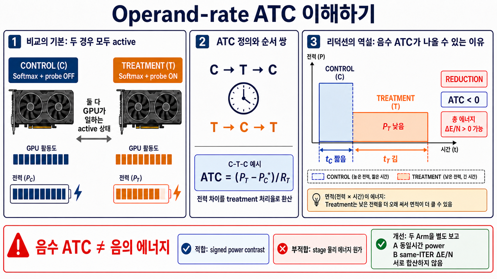
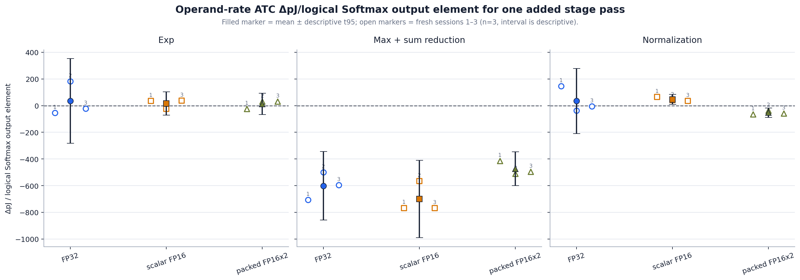

# Whole-Softmax stage Operand-rate ATC protocol

Protocol revision: `softmax_whole_stage_operand_rate_atc_v2`.
V2는 compiler CSE와 treatment 전용 observer switching을 막는
treatment-invariant sink 및 SASS dataflow gate를 필수화한다.

## 측정 질문

이 실험은 A인 **absolute idle-subtracted complete-Softmax net pJ/logical
output**을 측정하는 실험이 아니다. 동일한 active Softmax를 control로 두고
treatment에 stage 한 번을 추가했을 때의 board-level power contrast를 treatment
logical-output rate로 나눈 B, 즉 **paired incremental Operand-rate ATC
`ΔpJ/added-stage logical output`**을 측정한다. 따라서 같은 `ITER` 실행의 단순
`E_T-E_C`나 complete Softmax의 절대 에너지와는 다른 추정량이다.

| 구분 | numerator | denominator | idle의 역할 |
|---|---|---|---|
| absolute complete-Softmax endpoint (A) | `qualified trace energy - idle power × elapsed` | complete Softmax logical output 수 | absolute endpoint 식에 포함 |
| paired incremental whole-stage ATC (B) | 시간 보간한 `treatment - active control` power contrast | treatment의 added-stage logical output rate 또는 수 | role 전 상태 진단에만 기록, ATC numerator에서 제외 |

감사 후 판정은 측정 계약의 성립과 energy estimand의 적합성을 분리한다. 같은
symbol·geometry·I/O·resource와 runtime flag를 사용하는 active control은
**probe ON/OFF의 signed board-power contrast**에는 구조적으로 적절하다. 그러나
C와 T의 runtime이 다르면 B는 role-energy contrast가 아니라 power 차이를
treatment rate로 투영하므로, 물리적 stage energy 질문의 primary estimator로는
불충분하다.
따라서 역사적 B는 energy 질문에서 **secondary diagnostic**으로 재분류한다. ATC가
양수라는 사실도 이 estimand 문제를 해결하거나 물리적 energy 추정의 타당성을
증명하지 않는다.
C-T-C fixed-work 식은 `(E_hat_T-E_hat_C*)/N`, T-C-T 식은
`(E_hat_T*-E_hat_C)/N`이다. `E_hat_role=P_hat_trace×t_CUDA`이며 별표는 두 outer
role의 추정 energy를 middle 시점으로 보간했다는 뜻이다.



위 생성형 이미지는 측정 plot이 아니라 power(높이), runtime(폭), energy(면적)의
차이를 설명한다. 초록 상자의 A/B는 서로 다른 두 후속 arm이며 결과를 합산하지
않는다. 정확한 정량 근거는 [완료 보고서](../results/rtx3090_softmax_whole_stage_atc_20260728_operand_rate_v2_final_ko.md)의
식과 SHA-bound CSV/JSON이다.

비교 대상은 다음 아홉 cell이다.

| stage probe | FP32 endpoint | scalar FP16 endpoint | packed FP16x2 endpoint |
|---|---|---|---|
| exponent | FP32 `__expf` pass | scalar FP16 EX2 pass | packed FP16x2 EX2 pass |
| reduction | FP32 max+sum pass | scalar FP16 max+sum pass | half2 lane-wise max+sum pass |
| normalization | FP32 reciprocal+multiply pass | scalar FP16 reciprocal+multiply pass | packed FP16x2 reciprocal+multiply pass |

모든 endpoint는 원래의 max, exponent, sum, normalization, I/O를 포함한 complete
Softmax를 수행한다. Treatment만 지정 stage의 결과를 한 번 더 계산하고 그 결과를
live sink에 전달한다. 추가 pass는 실제 Softmax output을 변경하지 않는다.
Exponent 추가 pass는 primary pass에서 이미 계산한 `x - max`를 재사용하고,
`log2(e)` scale과 EX2 exponent evaluation만 한 번 더 수행한다.
Normalization의 row-sum reciprocal은 물리적으로 row당 한 번만 실행되는 것이
아니라 각 참여 thread가 두 row의 reciprocal을 복제 계산한 뒤 담당 원소에
multiply한다. FP16 정책의 reciprocal은 native FP16 RCP가 아니라
FP32 RCP 후 FP16으로 반올림하는 경로다.

## 역사적 acquisition estimand와 현재 해석 등급

V2 manifest/CSV에 당시 `primary_estimand`로 기록한 정확한 이름은 다음과 같다.

```text
active-control Operand-rate ATC delta pJ per logical Softmax output element for one added <stage> pass
```

이 artifact 내부 이름과 계산식은 provenance를 위해 변경하지 않는다. 다만 현재의
물리적 energy 질문에서는 이 값을 secondary signed-power diagnostic으로 해석한다.

`C-T-C` bracket에서는 treatment 시점의 active-control power를 두 control에서
시간 보간한다.

```text
P_C_at_T = (1 - w) P_C_before + w P_C_after
ΔP = P_T - P_C_at_T
paired incremental ATC ΔpJ/added-stage output
= ΔP × elapsed_T × 1e12 / N_added,T
```

`T-C-T` bracket에서는 middle control 시점의 treatment power와 treatment result
rate를 두 treatment에서 시간 보간한다.

```text
P_T_at_C = (1 - w) P_T_before + w P_T_after
R_T_at_C = (1 - w) R_T_before + w R_T_after
ΔP = P_T_at_C - P_C
paired incremental ATC ΔpJ/added-stage output
= ΔP × 1e3 / R_T_at_C[Goutput/s]
```

한 treatment role의 추가 stage 작업량은 다음과 같다.

```text
N_added = grid_blocks × rows_per_block × ITER × S
        = grid_blocks × 2 × ITER × S
```

Exponent와 normalization은 output element마다 elementwise stage 하나를 추가한다.
Reduction은 row마다 max+sum pass 하나를 추가하되 같은 `S`개의 logical output에
나누어 표시한다. 따라서 reduction 값은 개별 add/max opcode의 에너지가 아니다.

Packed FP16x2의 두 lane은 서로 다른 scalar logical output 두 개다.
`N_added`가 이미 두 lane을 모두 세므로 packed 결과를 다시 2로 나누지 않는다.
Packed PTX instruction당 값을 보조적으로 표시할 때만 logical-result 값의 2배다.

Idle power와 A인 `absolute idle-subtracted complete-Softmax net pJ/logical
output`은 진단값으로만 남긴다. Idle은 ATC numerator에 들어가지 않는다.

## 완료 결과 상태 (2026-07-28)

공식 run
[`rtx3090_softmax_whole_stage_atc_20260728_operand_rate_v2_final`](../../results/raw/rtx3090_softmax_whole_stage_atc_20260728_operand_rate_v2_final/manifest.json)은
`3 stages × 3 endpoints × 3 sessions × 6 roles = 162 measured roles`를
완료하고 모든 fail-closed gate를 통과했다. 아래 각 cell은 fresh session
`n=3`의 **mean ± sample SD; [descriptive t95]**이며, 단위는 manifest/CSV의
역사적 `primary_estimand` template인
**`active-control Operand-rate ATC delta pJ per logical Softmax output element
for one added <stage> pass`**다. 이 이름은 acquisition provenance이고 현재 energy
질문의 해석 등급은 secondary diagnostic이다.

| Added stage | FP32 | scalar FP16 | packed FP16x2 |
|---|---:|---:|---:|
| Exp | +34.978 ± 127.818; [−282.539, +352.494] | +16.335 ± 34.846; [−70.228, +102.897] | +12.169 ± 32.096; [−67.561, +91.900] |
| Max + sum reduction | −600.909 ± 103.083; [−856.981, −344.836] | −700.436 ± 116.748; [−990.453, −410.419] | −473.433 ± 51.194; [−600.606, −346.260] |
| Normalization | +34.630 ± 98.027; [−208.883, +278.143] | +47.067 ± 15.392; [+8.832, +85.302] | −52.910 ± 13.889; [−87.414, −18.407] |



> **Reduction의 세 음수값은 음의 물리적 에너지나 stage 원가가 아니다.**
> Treatment 평균 전력이 active control보다 낮고 treatment runtime은 더 길었던
> 관측에서 생긴 **signed Operand-rate power projection**이다. GPU가 에너지를
> 생성했다는 뜻이 아니며, 세 stage 값을 합해 complete-Softmax 에너지를 만들 수
> 없다. 반대로 양수 ATC도 물리적 stage-energy estimator가 타당하다는 증거가
> 아니다.

Role 전 1초 idle은 `diagnostic_only_excluded_from_ATC_numerator`로 기록됐고
ATC numerator에는 사용하지 않았다. Packed FP16x2는 두 scalar logical lane을
분모가 이미 모두 세므로 결과에 `/2`를 적용하지 않는다. Frozen sm86 binary의
static added-stage audit은 9/9 specialization, NCU dynamic instruction audit은
18/18 target launch와 9/9 C/T pair를 통과했다. NCU는 added-instruction 증거만
제공하며 energy 계산에서는 제외했다. 에너지 입력은 NVML total-energy trace다.
이 공식 acquisition의 입력은 frozen binary 기본값인 logit scale `4.0`, seed
`5573589319906701683`으로 결정론적으로 생성됐다. 당시 command/raw/manifest에 두
값을 중복 기록하지 않은 provenance 한계가 있어, 후속 runner는 이를 명시적 CLI
인자와 manifest/raw 필드로 고정한다.

세부 session 산포, C-T-C/T-C-T disagreement와 Matplotlib 그림은
[완료 보고서](../results/rtx3090_softmax_whole_stage_atc_20260728_operand_rate_v2_final_ko.md)에
있다. 보고서에는 당시 ATC primary와 섞지 않은 **historical non-primary
same-ITER gross board-energy diagnostic**도 포함했다. 각 role에서
`E_hat_role=P_hat_trace×t_CUDA`를 만든다. C-T-C는
`(E_hat_T−E_hat_C*)×1e12/N_same_ITER`, T-C-T는
`(E_hat_T*−E_hat_C)×1e12/N_same_ITER`를 계산하고 두 orientation을 평균한다.
Idle은 쓰지 않는다.

| Reduction implementation | historical mean ATC ΔpJ/output | mean T/C elapsed | historical same-ITER gross ΔE/N |
|---|---:|---:|---:|
| FP32 | −600.909 | 1.390× | +1,826.390 |
| scalar FP16 | −700.436 | 1.726× | +3,530.892 |
| packed FP16x2 | −473.433 | 1.442× | +1,423.060 |

Reduction 진단은 18/18 bracket에서 양수였다. 이는 음수 ATC가 음의 물리적
에너지를 뜻하지 않음을 확인한다. 동시에 `1.390× / 1.726× / 1.442×`의 runtime
차이 때문에 signed power와 fixed-work energy가 서로 반대 부호가 될 수 있음을
보여준다. Same-ITER gross 값도 complete Softmax 공통 작업의 늘어난 runtime을
포함하므로 pure stage 또는 opcode 원가는 아니다.

기존 `82.164 / 19.393 / 25.055`는 이 아홉 whole-stage cell의 선행 결과가 아니라,
별도 geometry와 control shell에서 얻은 **EX2-only paired incremental
`ΔpJ/added logical EX2 result`**다. 반대로 기존 수천 pJ 값은
**absolute idle-subtracted complete-Softmax net pJ/logical output**이다.
어느 쪽도 이번 whole-stage ATC 결과로 재표기하지 않는다.

## 제안된 v3 energy primary와 제한된 two-arm 후속 (미구현)

이 절은 **proposed v3 / not implemented**다. 완료된 v2의 code, manifest, raw
data, `primary_estimand` 이름 또는 fail-closed gate를 소급 변경하지 않는다.
실행 전 별도 preregistration과 runner/analyzer 구현·self-test가 필요하다.

질문에 따라 primary를 다음처럼 고정한다.

| 질문 | Primary | 보조 진단 |
|---|---|---|
| 이 concrete probe ON/OFF 구현의 고정 작업량 증분 board energy는 얼마인가? | C-T-C `(E_hat_T−E_hat_C*)/N`, T-C-T `(E_hat_T*−E_hat_C)/N`의 exact same-ITER 평균 | equal-duration C/T power와 output rate, 역사적 Operand-rate ATC |
| 실제 Softmax에서 precision stage를 바꾸면 energy/output이 어떻게 달라지는가? | complete-Softmax 또는 stage-replacement endpoint energy/output | SASS/NCU instruction delta와 probe ATC |
| opcode 또는 회로 고유 에너지는 얼마인가? | 이 protocol만으로 식별하지 않음 | 어느 위 지표도 opcode 계수로 재명명하지 않음 |

Fixed-work `ΔE_hat/N`도 added pass 때문에 늘어난 시간 동안 실행된 공통 Softmax
board energy estimate를 포함한다. 따라서 이것은 해당 concrete implementation의
증분 board-energy primary estimate이지, 순수 stage/opcode 원가가 아니다. 실제
precision 선택은 primary stage를 교체한 complete-Softmax endpoint에서 별도로
판단한다.

넓은 CTA×S sweep 대신 현재 `S=1024`, grid 41 CTA(q50), 256 threads/CTA,
2 rows/CTA 좌표에서 **scalar FP16 exp, reduction, normalization 세 cell**만
후속 측정한다.

- 각 cell은 fresh CUDA-process session **4회**를 사용한다. Arm 순서는 `A→B`
  2회와 `B→A` 2회, bracket 시작 순서는 `C-T-C→T-C-T` 2회와
  `T-C-T→C-T-C` 2회를 2×2로 교차 균형화한다.
- 각 session은 **equal-duration power-rate arm**과 **exact same-ITER energy
  arm**을 모두 실행한다.
- Equal-duration arm은 C와 T를 같은 목표 wall time으로 보정하고 `P_C`, `P_T`,
  `R_C`, `R_T`를 분리 보고한다. 이는 clock/power-state와 처리율을 설명하는
  secondary sensitivity다. Role elapsed ratio `0.98–1.02`를 v3 사전 gate로
  사용한다. 이 범위는 완료 v2에는 없었던 2026-07-29 사후 진단 기준이다.
- Exact same-ITER arm은 C와 T에 동일한 `ITER`와 logical output 수를 고정하고
  `E_hat_role=P_hat_trace×t_CUDA`를 계산한다. 사전 지정 primary는 orientation별
  두 식의 평균 `ΔE_hat/N_same_ITER`이다. 직접 joule endpoint를 적분한 값으로
  부르지 않는다.
- 공통 preheat는 **5초**이며, idle·온도·SM clock은 진단값으로 기록한다.
- 기본 clock run 뒤 해석이 남는 경우에만 동일 3-cell/4-session 설계를 fixed SM
  clock에서 반복한다. Fixed-clock은 optional sensitivity이지 기본 결과와
  자동 pooling하지 않는다.

이 후속도 CTA와 `S`를 추가 sweep하지 않으며, 양수/음수 부호 자체를 validity
gate로 사용하지 않는다.

## 동일-symbol 반사실

아래 exact same-`ITER` 계약은 완료 v2와 proposed v3의 Arm B에 적용한다. Arm A는
equal-duration을 위해 C/T `ITER`만 독립 보정하되, 그 차이를 manifest에 기록하고
나머지 symbol·geometry·I/O·resource 계약은 유지한다.

각 `(stage, endpoint)` cell의 control과 treatment는 다음 항목이 같아야 한다.

- 같은 frozen binary와 CUDA kernel symbol
- 같은 template specialization, grid, block, shared-memory 크기
- 같은 input/output buffer와 dtype
- 같은 `ITER`, `S`, CTA당 row 수
- 같은 register/shared-memory resource envelope

두 role의 유일한 의도된 차이는 uniform runtime flag다.

```text
control:   complete Softmax + extra_stage_pass=false
treatment: complete Softmax + extra_stage_pass=true
```

모든 thread가 같은 flag를 보며, reduction probe의 barrier도 block 전체가 함께
진입한다. Control/treatment를 서로 다른 kernel symbol로 만들거나 treatment만
다른 compile-time specialization을 쓰면 이 protocol의 ATC로 인정하지 않는다.
이 동일-symbol 계약은 signed probe ON/OFF power contrast의 구조적 타당성을
지지하지만, runtime이 다른 두 role의 물리적 energy를 ATC 식이 식별한다는 증거는
아니다.

Observer가 treatment 자체의 부하를 만들지 않도록 C/T는 같은 opaque
materialization, sink mixing, store와 같은 최종 sink data bits를 가져야 한다.
Treatment 전용 tag나 상수로 sink switching을 강제로 다르게 만들지 않는다.
추가 stage의 생존 증거는 C/T sink digest 차이가 아니라 frozen SASS에서 확인한
`runtime flag → added arithmetic → common live sink` dataflow다.

Compiler가 redundant pass를 제거하거나 기존 pass와 common-subexpression
elimination하지 않았다는 것은 frozen cubin의 PTX/SASS와 live-sink dataflow로
확인한다. 완료 run의 NCU audit은 instruction-count 보조 검증에만 사용했다.
에너지는 NCU가 아니라 NVML total-energy trace에서 구했다.

## 동결한 RTX 3090 대표 좌표

넓은 CTA×S sweep은 반복하지 않는다.

| 항목 | 값 |
|---|---:|
| GPU | RTX 3090, sm_86 |
| runtime SM | 82 |
| `S` | 1,024 |
| requested SM coverage | 50% |
| `grid_blocks` | 41 |
| threads/CTA | 256 |
| rows/CTA | 2 |
| logical output/CTA/ITER | 2,048 |
| common preheat | 5 s |
| treatment target | 약 13 s |
| NVML sampling | 250 ms |
| fresh sessions | 3 |

Runtime occupancy API의 `occupancy_max_blocks_per_sm`을 `O`라 할 때
`41 <= 82 × O`를 요구한다. 이 좌표는 grid가 SM 수보다 작으므로 각 measured role의
SMID histogram에서 41개 CTA가 41개 고유 SM에 놓이고 한 SM의 최대 block 수가
1인지도 확인한다.

온도는 Softmax workload의 결과로 상승할 수 있으므로 hard reject 조건으로 쓰지
않는다. 대신 role 전후 온도와 SM clock을 저장하고 session 편차와 함께 보고한다.

## 완료 v2 수집 순서

Stage마다 세 fresh CUDA process/session을 사용한다. 한 process 안에서는 모든
policy와 role을 같은 CUDA context에서 실행한다.

```text
session 1: FP32 → scalar FP16 → packed FP16x2  (ABC)
session 2: scalar FP16 → packed FP16x2 → FP32  (BCA)
session 3: packed FP16x2 → FP32 → scalar FP16  (CAB)
```

추가 run 없이 stage의 전체 실행 위치도 Latin rotation으로 균형화한다.

```text
global 1–3: exp → reduction → normalization
global 4–6: reduction → normalization → exp
global 7–9: normalization → exp → reduction
```

각 policy cell은 아래 여섯 role을 연속 실행한다.

```text
C1 → T1 → C2 → T2 → C3 → T3
 \___ C-T-C ___/ \___ T-C-T ___/
```

표현상 두 bracket은 `C1-T1-C2`와 `T2-C3-T3`이다. 각 cell에서 control과
treatment가 세 번씩 등장하므로 role count와 위치가 균형을 이룬다. 한 session의
통계 단위는 여섯 role이 아니라 두 bracket effect의 평균이다. 최종 비교는 cell마다
독립 fresh-session 값 세 개(`n=3`)의 평균, sample SD, min/max, descriptive t95를
제시한다.

완료 v2의 측정 전 작업은 다음 순서를 따른다.

1. 세 endpoint의 numerical validation과 treatment 기준 `ITER` calibration을
   canonical endpoint 순서로 완료한다.
2. 각 cell의 control과 treatment에 같은 calibrated `ITER`를 고정한다.
3. role과 무관한 canonical FP32 control conditioner를 한 번 5 s 실행한다.
   actual duration gate는 3.75–6.25 s다.
4. 선언된 ABC/BCA/CAB 및 bracket 순서를 바꾸지 않고 측정한다.
5. 각 role 전 1 s idle을 진단용으로 기록하되 ATC 계산에는 쓰지 않는다.

전체 규모는 다음과 같다.

```text
3 stages × 3 endpoints × 3 fresh sessions × 6 roles = 162 measured roles
```

이는 stage 질문에 필요한 최소 matrix이며 CTA나 `S`를 추가 sweep하지 않는다.

## fail-closed gate

다음 조건을 하나라도 만족하지 못하면 해당 run을 headline 결과로 사용하지 않는다.

- manifest, raw, trace schema와 SHA-256 binding 불일치
- sm_86 native cubin 또는 frozen binary 불일치
- 선언된 3 stage × 3 endpoint × 3 session × 6 role schedule 불일치
- control/treatment의 kernel symbol, geometry, `ITER`, I/O 또는 resource 불일치
- `N_added = grid × 2 × ITER × S` 불일치
- NVML counter 비단조, guarded fit-point 부족 또는 trace fit 실패
- numerical validation 실패, non-finite output, control/treatment output 불일치
- runtime occupancy/capacity 또는 SMID placement gate 실패
- treatment의 추가 stage가 static/dynamic audit에서 확인되지 않음

온도 차이, signed effect의 양수/음수, 또는 descriptive t95가 0을 포함하는 것은
자동 삭제 조건이 아니다. 이들은 결과가 식별되지 않았거나 noise floor에 가깝다는
중요한 관측으로 그대로 보고한다. 특히 양수 부호는 contract 통과나 physical
stage-energy estimator의 타당성을 증명하지 않는다.

## 해석 경계

- 완료 결과의 범위는 RTX 3090, `S=1024`, q50, 이 persistent cache-reuse
  kernel의 signed probe ON/OFF board-power contrast다.
- 세 fresh session은 같은 GPU에서 순차 실행한 fresh CUDA context 세 개이며
  독립 모집단 표본이 아니다. 전체 stage 위치는 Latin rotation으로 균형화하지만
  각 cell의 C-T-C→T-C-T 순서는 고정되어 있으므로 t95는 descriptive
  uncertainty로만 읽는다.
- q50은 매 role에 41개 고유 SM을 쓰도록 검증하지만, role 사이에 정확히 같은
  41개 물리 SM subset을 썼다는 뜻은 아니다.
- pure opcode energy, Tensor Core energy, 또는 cuDNN/FlashAttention의 일반값이
  아니다.
- 세 stage 값을 단순 합해 complete Softmax 절대 에너지로 만들지 않는다. 각 probe는
  complete Softmax 위에 추가된 marginal pass이고 interaction과 고정 overhead를
  포함하지 않는다.
- 기존 EX2-only ATC `82.164 / 19.393 / 25.055`와는 exponent probe의 범위가 가장
  가깝지만, 새 실험은 두 row/CTA와 endpoint-wide precision/I/O가 다른 별도 cohort다.
  직접 재현값으로 주장하려면 kernel geometry와 control shell까지 같아야 한다.
- 기존 수천 pJ 값은 A인 absolute idle-subtracted complete-Softmax net
  pJ/logical output이다. 새 B의 paired incremental whole-stage ATC 결과와 같은
  표에서 무수식 `pJ/element`로 비교하지 않는다.
