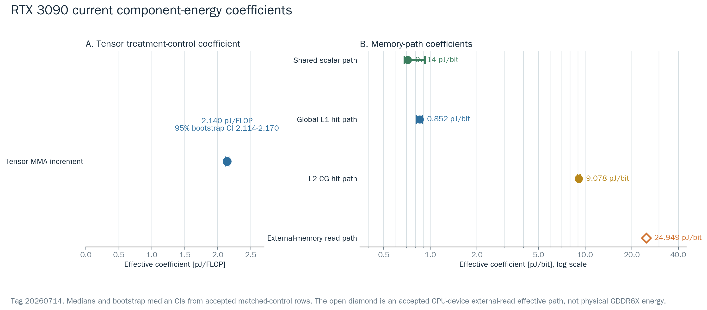
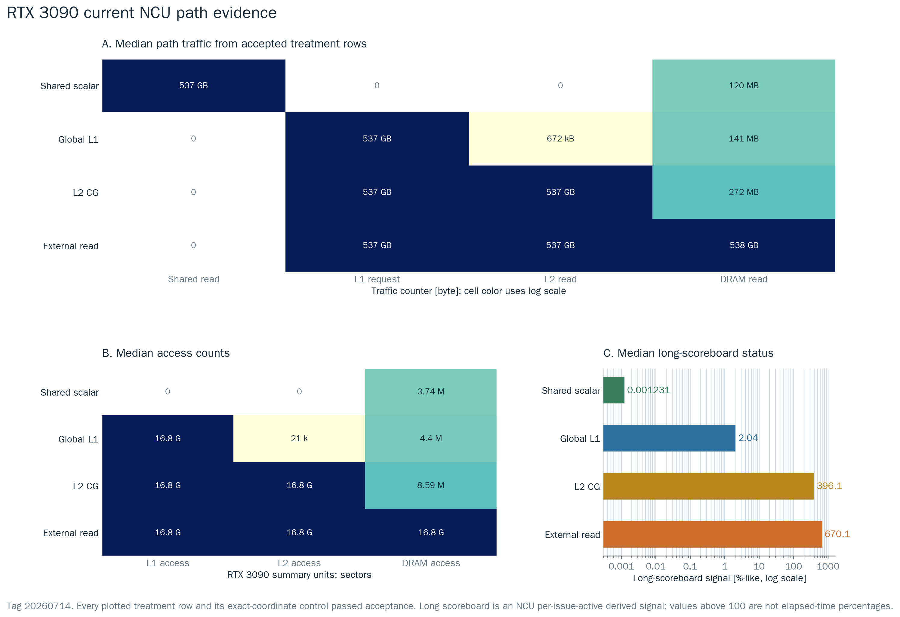

# GPU Power Modeling 백서용 종합 정리

갱신일: 2026-07-14

## 핵심 주장

이 연구는 NVIDIA GPU 내부 transistor/bitcell energy를 직접 측정하지 않는다. CUDA
microbenchmark를 treatment-control pair로 실행하고, NVML GPU/device total-energy
delta에서 공통 비용을 차분한 뒤, NCU counter로 실행 경로와 traffic denominator를
검증해 **workload-dependent effective board-level energy coefficient**를 추정한다.

안전한 표현:

```text
NCU로 treatment와 control 경로가 검증된 board-level effective microbenchmark coefficient
```

피해야 할 표현:

```text
순수 Tensor Core 회로 에너지
순수 register-file access energy
순수 L1/L2 SRAM bitcell energy
순수 DRAM/HBM/GDDR device energy
```

## Component 정의

| Component | treatment | control | 단위 | 해석 |
|---|---|---|---|---|
| Tensor MMA incremental | `reg_mma` | `reg_operand_only` | pJ/FLOP | no-MMA register/control 대비 FP16 WMMA/HMMA 증분 |
| Shared scalar path | `shared_scalar_load_only` | `shared_scalar_addr_only` | pJ/bit | matched shared-address loop 대비 software-managed shared scalar-read path |
| Global L1 hit path | `global_l1_load_only` | `global_addr_only` | pJ/bit | global load가 L1 hit로 끝나는 path |
| L2 CG hit path | `l2_cg_load_only` | `global_addr_only` | pJ/bit | path-specific L1 hit를 낮춘 L2 read-hit path |
| External-memory read path | `dram_cg_load_only` | `global_addr_only` | effective pJ/bit | GPU-device global-read path; 물리 HBM/GDDR energy 아님 |

Shared와 Global L1은 unified L1/shared subsystem과 관련되지만 주소 공간, instruction
path, arbitration, denominator가 다르므로 별도 effective coefficient로 보고한다. 두
coefficient의 차이를 SRAM bitcell energy 차이라고 해석하지 않는다.

## 측정 및 검증 구조

```text
profile/preflight
  -> treatment/control parameter sweep
  -> pair-locked 동일 ITER energy run
  -> NVML GPU/device total-energy delta + idle subtraction
  -> 별도 NCU sidecar: HMMA, shared/L1/L2/DRAM bytes, hit, spill, stall
  -> treatment와 control exact-coordinate acceptance
  -> matched-control coefficient와 반복 통계
  -> reliability + strict-summary + platform-package audit
```

NCU replay는 power numerator와 분리한다. Profiler overhead를 energy에 넣지 않되,
energy run과 동일한 좌표에서 실행 경로와 분모를 검증한다. 모든 final pair는 동일
ITER를 사용한다. V100 과거 L2처럼 path acceptance가 성공했더라도 treatment/control
ITER가 다르면 같은 작업량 비교가 아니므로 coefficient를 폐기한다.

## RTX 3090 현행 결과

2026-07-14 RTX 3090 v5 finalplan은 strict 4-component와 별도 external-memory
effective path를 완주했다.

| path | median | 95% bootstrap median CI | rows | 상태 |
|---|---:|---:|---:|---|
| Tensor MMA incremental | **2.140 pJ/FLOP** | 2.114-2.170 | 75 | strict accepted |
| Shared scalar | **0.714 pJ/bit** | 0.680-0.923 | 15 | strict accepted |
| Global L1 | **0.852 pJ/bit** | 0.813-0.888 | 15 | strict accepted |
| L2 CG | **9.078 pJ/bit** | 8.935-9.299 | 30 | strict accepted |
| External-memory read | **24.949 pJ/bit** | 24.864-25.101 | 45 | accepted effective path |



Tensor v5 control은 static SASS에서 RF1/2/4/8/16 backward loop와 HMMA=0을 보이고,
runtime NCU에서 operation-proportional SASS와 spill/local=0을 통과했다. Treatment의
HMMA/logical MMA는 2로 선형이다. 그러나 treatment/control register footprint가
완전히 같지 않으므로 Tensor 값에는 WMMA operand/accumulator register 및 scheduler
path가 포함된다.

Memory NCU는 Shared read traffic, Global-L1 path hit 99.9998-99.9999%, L2 path의
L1 hit 0%와 L2 hit 99.9974-100%, external read의 DRAM traffic 정합을 확인했다.



360/360 power row가 explicit GPU/device total-energy scope를 사용했고, 180/180
matched pair가 valid였다. NCU는 final treatment/control 72개가 accepted였으며
비교용 baseline 한 개만 not-selected였다. Strict audit는 193/193, package audit는
31/31 check를 통과했다.

상세 sweep, raw counter 표, 그림 해석은
`docs/results/gpu_power_modeling_experiment_results_ko.md`에 있다.

## 플랫폼 상태

| Platform | command readiness | current measured package | 상태 |
|---|---|---|---|
| RTX 3090 | ready | 있음, 2026-07-14 | complete |
| V100 32GB | ready | 없음 | target node 재실행/반입 필요 |
| A100 | ready | 없음 | target node 재실행/반입 필요 |
| H100 SXM5 profile | ready | 없음 | target node 실행/반입 필요 |

Command package가 있다는 것은 코드와 실행 순서가 준비됐다는 뜻이지, 해당 GPU의
coefficient가 측정됐다는 뜻은 아니다. V100/A100/H100은 각 architecture의 capacity,
NVML semantics, NCU metric availability 및 L2 path selector를 적용한 뒤 동일 audit를
통과해야 한다.

## 보고 원칙

최종 표에는 반드시 다음 열을 포함한다.

| 필드 | 이유 |
|---|---|
| GPU/profile, active SM | architecture/runtime 조건 고정 |
| treatment-control pair | coefficient 의미 결정 |
| W_SM (KiB/SM), blocks/SM, RF/LR | sweep 좌표와 working-set 해석 |
| seconds (s), repeats (count), ITER | 측정 신호와 work-count 검증 |
| NCU treatment/control acceptance | path와 control contamination 검증 |
| denominator source와 bytes/FLOP | pJ 단위 계산 추적 |
| min/median/mean/max, CI, valid/invalid rows | 분산과 재현성 표시 |
| NVML source/integration/scope | GPU 세대별 API 의미 구분 |
| access/bytes/hit/long-scoreboard | memory-path 증거 표시 |

문헌 pJ/bit는 sanity와 measurement-boundary 비교에만 사용한다. GPUJoule의
transaction-path 값과 HBM device/access 값은 scope가 다르므로 목표값으로 fitting하지
않는다. RTX 3090 external 24.949 pJ/bit와 HBM device 약 3.9 pJ/bit가 다르다는 사실만으로
측정이 틀렸거나 맞았다고 판정할 수 없다.

## 다음 실험

1. V100은 CUDA 12.x `sm_70` build와 NCU permission preflight 후 current package를
   다시 실행한다.
2. A100은 NCU-first L2 selector로 source+LTC-fabric logical service plateau를 먼저
   통과시킨다.
3. H100은 현행 WMMA compatibility result와 향후 native WGMMA/TMA/FP8 연구를
   분리한다.
4. 외부 플랫폼 결과 반입 후 `scripts/run_local_readiness_checks.sh`와 package/goal
   audit를 다시 실행한다.

과거 2026-07-08 protocol의 수치와 그림은
`archive/pre_current_protocol_20260712/`에 보존한다. 현행 v5 결과와 합산하거나
평균내지 않는다.
