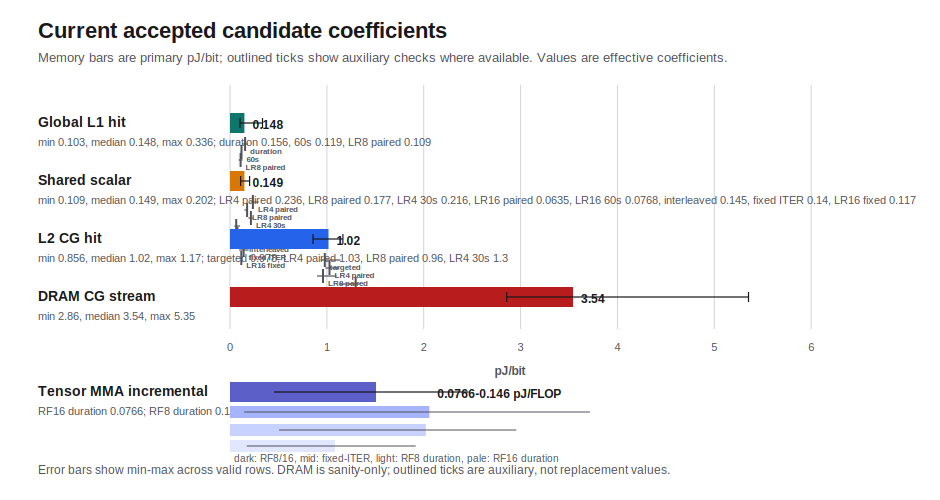
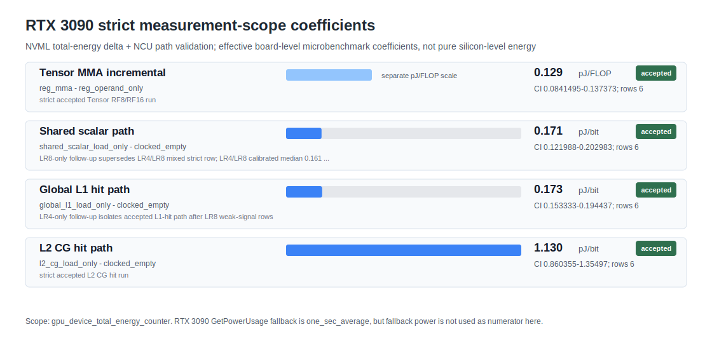
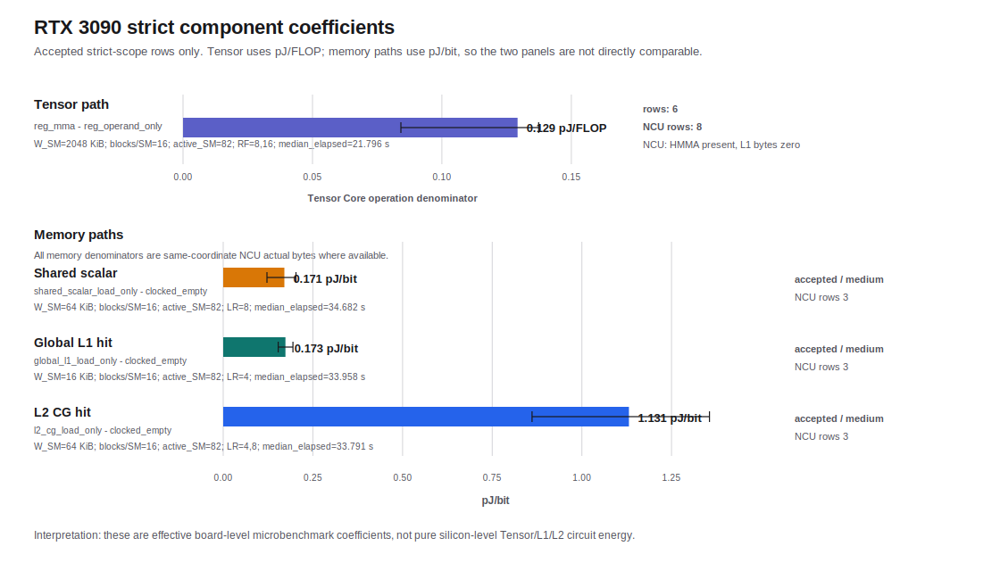
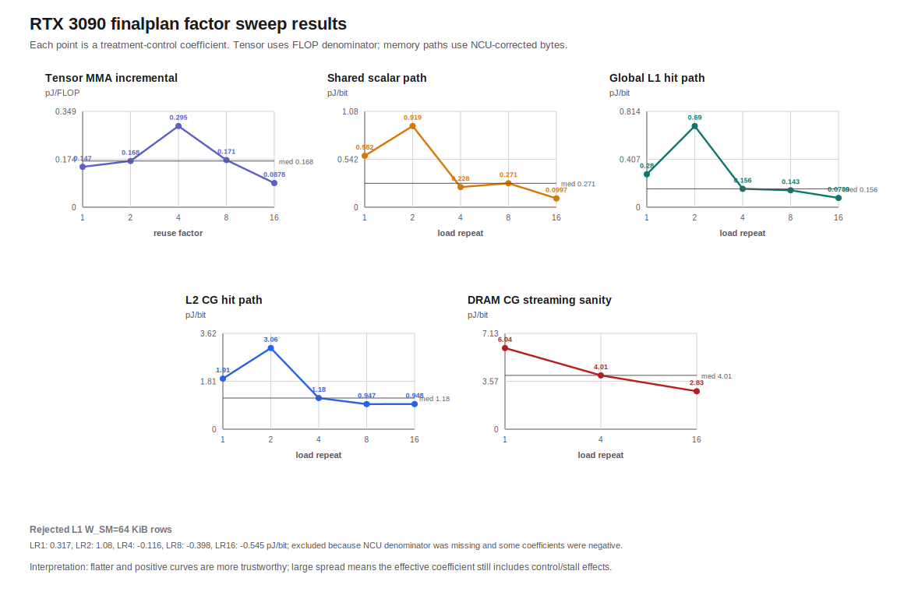
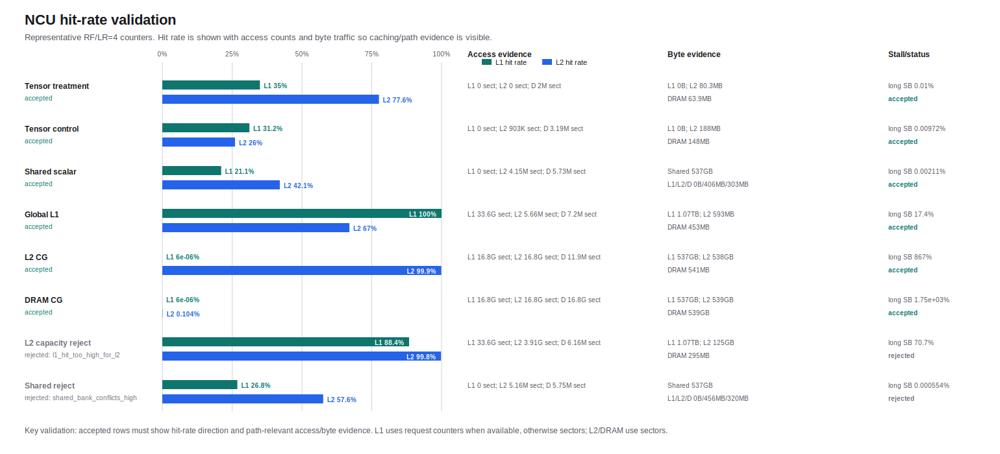
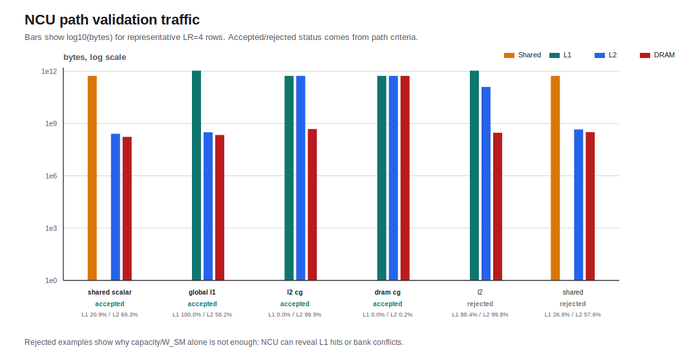
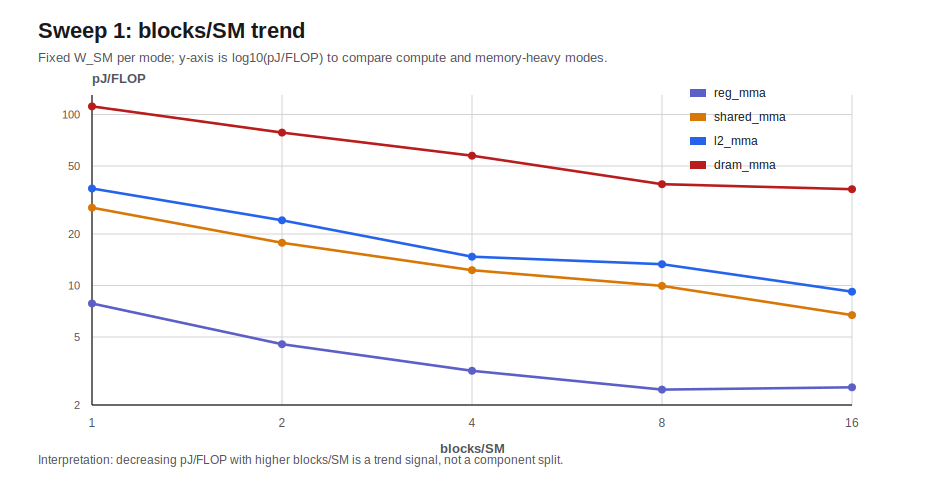

# GPU Power Modeling 실험 결과 정리

작성일: 2026-07-08
대상 결과: RTX 3090 finalplan 결과, 2026-07-05 실행분과 2026-07-08 stability/strict 재측정, Tensor targeted/fixed-ITER/RF8/RF16 duration-scaling rerun, Shared/L1 targeted rerun, Shared LR4/LR8/LR16 paired auxiliary와 LR16 60초 low-stability follow-up, Shared LR4/LR8/LR16 interleaved 30초 follow-up, Shared fixed-ITER LR4/LR8/LR16 follow-up, Shared fixed-ITER LR16 및 LR4/LR8 focus follow-up, Global L1 30초/60초/paired 30초 stability rerun과 paired combined/LR8 auxiliary, Shared/L2 LR4 30초 stability rerun, L2 LR4/LR8 paired combined primary와 targeted/LR4/LR8 auxiliary

이 문서는 방법론 설명이 아니라, 실제 실험 결과를 바로 확인하기 위한 정리 문서다. 모든 sweep 조건은 표로 정리했고, 단위가 필요한 값에는 단위를 명시했다.

## 1. 결과 한눈에 보기

아래 값은 순수 회로/bitcell energy가 아니다. NVML board-level energy에서 control kernel을 뺀 뒤, NCU counter로 경로가 맞는지 검증한 effective microbenchmark coefficient다. 2026-07-08 stability/strict 재측정에서는 `energy_source=nvml_total_energy`, `energy_integration_method=total_energy_mj_delta`, `nvml_total_energy_supported=true` row만 최종값에 사용했다. RTX 3090의 `GetPowerUsage` fallback 의미는 `one_sec_average`지만, 아래 energy numerator는 endpoint power fallback이 아니다. 최신 strict+fresh NCU 결과는 [rtx3090_strict_scope_fresh_ncu_component_coefficients_20260708.md](../../results/summary/rtx3090_strict_scope_fresh_ncu_component_coefficients_20260708.md)에 따로 고정했고, reliability audit은 4개 component 모두 `accepted`다. 기존 current reporting 표에는 `measurement_scope` 컬럼 도입 이전 schema에서 추론한 결과도 남아 있으므로, 새 A100/V100/H100 및 새 finalplan run은 `--require-explicit-measurement-scope`를 통과해야 한다. GPU 세대별 power API 의미와 final/provisional/reject 기준은 [power_measurement_api_matrix_ko.md](../platforms/power_measurement_api_matrix_ko.md)를 따른다. 반복 run은 `nearest-control` pairing과 `delta_E >= 10 J`, `delta_E / max(E_treatment, E_control_scaled) >= 0.5%` gate를 적용했다. Power API audit 결과는 [rtx3090_finalplan_stability_power_api_audit_20260708.md](../../results/summary/rtx3090_finalplan_stability_power_api_audit_20260708.md)에 남겼고, 102개 raw energy row가 기존 audit 기준으로 `final_candidate`를 통과했다. Component reliability audit은 [rtx3090_finalplan_stability_component_reliability_audit_20260708.md](../../results/summary/rtx3090_finalplan_stability_component_reliability_audit_20260708.md)에 정리했다. Current sanity audit은 [rtx3090_current_component_sanity_audit_20260708.md](../../results/summary/rtx3090_current_component_sanity_audit_20260708.md)에 추가했고, 현재 보고값은 fail 0개와 warning 4개다.

### 1.0 Strict measurement-scope rerun

아래 표는 raw CSV에 `measurement_scope=gpu_device_total_energy_counter`가 직접 기록된
strict rerun만 모은 것이다. 이 run은 전력 API 의미 차이를 반영하기 위해
`--require-explicit-measurement-scope` audit을 통과한 결과만 사용한다.

보고용으로는 아래 표를 우선 사용한다. Tensor는 `pJ/FLOP`, memory path는 `pJ/bit`라
서로 직접 크기 비교하면 안 된다. 아래 값은 모두 순수 회로 에너지가 아니라
NCU로 path를 검증한 board-level effective microbenchmark coefficient다.

| Component/path | 보고값 | 단위 | 대표 treatment-control | 핵심 NCU 검증 | 해석 주의 |
|---|---:|---|---|---|---|
| Tensor MMA incremental | 0.129216 | pJ/FLOP | `reg_mma - reg_operand_only` | HMMA instruction 존재, L1 bytes 0 | spill counter는 NCU summary에 없으므로 ptxas/register-footprint 근거와 함께 봐야 함 |
| Shared scalar path | 0.170590 | pJ/bit | `shared_scalar_load_only - clocked_empty` | shared bytes 1.0748e12, global L1 bytes 0 | global L1/L2 hit-rate는 background이며 shared hit-rate로 읽으면 안 됨 |
| Global L1 hit path | 0.173483 | pJ/bit | `global_l1_load_only - clocked_empty` | L1 hit 99.9995%, L1 bytes 1.07479e12 | global load가 L1에서 끝나는 path의 effective coefficient |
| L2 CG hit path | 1.131073 | pJ/bit | `l2_cg_load_only - clocked_empty` | L1 hit 약 0%, L2 hit 약 99.985%, L2 bytes median 8.06527e11 | long-scoreboard stall이 크므로 pure L2 SRAM energy로 해석 금지 |

| Component/path | 대표 mode pair | 조건 | median | unit | bootstrap median CI | rows used | reliability | 해석 |
|---|---|---|---:|---|---:|---:|---|---|
| Tensor MMA incremental | `reg_mma - reg_operand_only` | RF=8/16, W_SM=2048 KiB, blocks/SM=16, 20초, 3 cycles | 0.129216 | pJ/FLOP | 0.0841495-0.137373 | 6 | `accepted` | strict scope 기준 Tensor 후보. RF sensitivity는 여전히 별도 해석 |
| Shared scalar path | `shared_scalar_load_only - clocked_empty` | W_SM=64 KiB, blocks/SM=16, LR=8, 30초, 6 cycles | 0.170590 | pJ/bit | 0.121988-0.202983 | 6 | `accepted` | LR8-only strict follow-up. LR4/LR8 calibrated 0.161 pJ/bit는 보조 근거 |
| Global L1 hit path | `global_l1_load_only - clocked_empty` | W_SM=16 KiB, blocks/SM=16, LR=4, 30초, 6 cycles | 0.173483 | pJ/bit | 0.153333-0.194437 | 6 | `accepted` | LR8 weak-signal을 분리한 LR4-only strict follow-up |
| L2 CG hit path | `l2_cg_load_only - clocked_empty` | W_SM=64 KiB, blocks/SM=16, LR=4/8, 30초, 3 cycles | 1.131073 | pJ/bit | 0.860995-1.35578 | 6 | `accepted` | strict+fresh NCU 기준 L2 후보. L1보다 충분히 큰 계층 순서와 정합 |

최신 strict+fresh NCU 요약은
[rtx3090_strict_scope_fresh_ncu_component_coefficients_20260708.md](../../results/summary/rtx3090_strict_scope_fresh_ncu_component_coefficients_20260708.md)와
[rtx3090_strict_scope_fresh_ncu_component_coefficients_20260708.csv](../../results/summary/rtx3090_strict_scope_fresh_ncu_component_coefficients_20260708.csv)에 있다.
Fresh NCU reliability audit은
[rtx3090_strict_scope_fresh_ncu_component_reliability_audit_20260708.md](../../results/summary/rtx3090_strict_scope_fresh_ncu_component_reliability_audit_20260708.md)에
정리했고, Tensor/Shared/L1/L2 4개 component가 모두 `accepted`다. Curated strict summary와 underlying reliability artifact의 정합성은
[rtx3090_strict_scope_fresh_ncu_component_summary_audit_20260708.md](../../results/summary/rtx3090_strict_scope_fresh_ncu_component_summary_audit_20260708.md)에
고정했다. 이 audit은 189개 check 모두 pass, failure 0, warning 0이다. 여기에는
matched-control detail row의 scope, energy source/integration, power-state reject 부재,
memory path의 `ncu_actual_exact` denominator, median/row count 일치 검증, L2 > L1/shared
hierarchy gate, broad plausibility range gate가 포함된다. 또한 strict summary가 참조하는
NCU summary artifact에 L1/L2 hit rate, L1/L2/DRAM access count, L1/L2/DRAM byte traffic,
Tensor HMMA instruction, long-scoreboard stall 컬럼과 component-relevant OK mode row가
있는지도 `ncu_summary_counter_schema` gate로 확인한다. 마지막으로
`ncu_summary_coordinate_alignment` gate는 해당 OK mode row가 strict matched-control
detail의 `mode`, `W_SM_KiB`, `blocks_per_SM`, `active_SM`, `reuse_factor`,
`load_repeat`, `store_repeat` 좌표와 실제로 일치하는지 확인한다.
`ncu_evidence_summary_fields` gate는 strict summary 표 자체가 path-relevant NCU
evidence를 노출하는지 확인한다. Shared scalar path의 global L1/L2 hit-rate counter는
background context이며, shared-memory byte/access evidence와 구분해서 해석해야 한다.
Strict summary gate는 현재 Tensor/Shared scalar/Global L1/L2 네 component만 final row로
허용한다. Register direct, register-pressure, DRAM streaming row는 diagnostic 또는
sanity evidence로 분리하며, strict final component summary에 들어가면 audit fail로 처리한다.
NCU는 Windows 설치 경로의 공백 때문에 WSL에서 직접 실행하지 않고 `/tmp/ncu2025`의
공백 없는 경로로 복사해 fresh replay를 수행했다. 첫 fresh NCU run은 Tensor
`REG_BLOCKS_PER_SM=4`라 strict energy row의 `blocks_per_SM=16`과 맞지 않았고,
Tensor는 `REG_BLOCKS_PER_SM=16` fresh NCU sidecar를 추가 실행해 맞췄다.
새 플랫폼(A100/V100/H100)에서는 이 표와 같은 strict audit 통과 조건에 더해 해당
플랫폼에서 새 NCU sidecar를 다시 수집해야 한다. Shared는 LR4/LR8 mixed strict row에서
LR4 weak row가 남아 있어 LR8-only accepted row를 현재 strict 대표로 두고,
LR4/LR8 calibrated 0.161 pJ/bit는 method-sensitivity 보조 근거로 둔다. Global L1은
LR8 weak/negative row를 분리하기 위해 LR4-only accepted row를 현재 strict 대표로 둔다.

### 1.1 Current reporting 결과

아래 표는 현재 RTX 3090에서 보고할 때 우선 사용할 후보값이다. Memory path는
factor별 NCU sidecar를 새로 수집해 `ncu_actual_exact` denominator로 재분석한 값이다.
Tensor는 broad RF=1,2,4,8,16 sweep의 분산이 커서 RF=8/16만 20초, 6회 반복으로
다시 측정한 targeted stability 결과를 lower-side candidate로 두고, fixed-ITER
보조실험과 함께 range로 보고한다. 추가 RF=8/RF16 duration-scaling은 Tensor가
reuse factor에 따라 상단과 하단으로 갈라지는지 확인하는 auxiliary evidence다.

| Component/path | 대표 mode pair | median | unit | bootstrap median 95% CI | rows used | confidence | 결과 상태 |
|---|---|---:|---|---:|---:|---|---|
| Tensor MMA incremental, RF=8/16 targeted | `reg_mma - reg_operand_only` | 0.107 | pJ/FLOP | 0.0835-0.134 | 12 | medium-high | `accepted`, blended RF=8/16 candidate |
| Tensor MMA incremental, fixed-ITER auxiliary | `reg_mma - reg_operand_only` | 0.146 | pJ/FLOP | 0.109-0.202 | 10 | medium-high | `accepted_auxiliary`, method sensitivity |
| Tensor MMA incremental, RF=8 duration-scaling auxiliary | `reg_mma - reg_operand_only` | 0.143 | pJ/FLOP | 0.115-0.160 | 15 | medium-high | `accepted_auxiliary`, slope 0.144-0.156 pJ/FLOP |
| Tensor MMA incremental, RF=16 duration-scaling auxiliary | `reg_mma - reg_operand_only` | 0.077 | pJ/FLOP | 0.0541-0.0948 | 15 | medium-high | `accepted_auxiliary`, slope 0.053-0.071 pJ/FLOP |
| Shared scalar path, W_SM=64 KiB | `shared_scalar_load_only - clocked_empty` | 0.149 | pJ/bit | 0.124-0.179 | 10 | medium-high | `accepted`, LR4/LR8 fixed-ITER focus primary |
| Shared scalar path LR4 paired 30초 auxiliary | `shared_scalar_load_only - clocked_empty` | 0.236 | pJ/bit | 0.212-0.297 | 6 | medium | `accepted_auxiliary`, clean high-side LR4 evidence |
| Shared scalar path LR8 paired 30초 combined auxiliary | `shared_scalar_load_only - clocked_empty` | 0.177 | pJ/bit | 0.150-0.181 | 12 | medium-high | `accepted_auxiliary`, 중간 조건 재현 확인 |
| Shared scalar path LR4 30초 auxiliary | `shared_scalar_load_only - clocked_empty` | 0.216 | pJ/bit | 0.190-0.235 | 9 | medium-high | `accepted_auxiliary`, LR4 단일조건은 mixed median보다 높음 |
| Shared scalar path LR16 paired 30초 combined auxiliary | `shared_scalar_load_only - clocked_empty` | 0.064 | pJ/bit | 0.0457-0.104 | 11 | medium | `accepted_auxiliary`, low-side/method-sensitivity, primary 대체 아님 |
| Shared scalar path LR16 paired 60초 auxiliary | `shared_scalar_load_only - clocked_empty` | 0.077 | pJ/bit | 0.0420-0.106 | 5 | low | `accepted_low_stability_auxiliary`, 60초에서도 low-side 재현, primary 대체 아님 |
| Shared scalar path LR4/LR8/LR16 interleaved 30초 auxiliary | `shared_scalar_load_only - clocked_empty` | 0.145 | pJ/bit | 0.0769-0.188 | 12 | medium | `accepted_auxiliary`, aggregate는 primary 지지, factor split은 LR4 0.199/LR8 0.145/LR16 0.0618 pJ/bit |
| Shared scalar path LR4/LR8/LR16 fixed-ITER auxiliary | `shared_scalar_load_only - clocked_empty` | 0.140 | pJ/bit | 0.0937-0.193 | 8 | medium | `accepted_with_caution_auxiliary`, treatment ITER=17,000,000, bytes 1x/2x/4x scaling, LR16 weak row 1개 |
| Shared scalar path LR16 fixed-ITER focus auxiliary | `shared_scalar_load_only - clocked_empty` | 0.117 | pJ/bit | 0.109-0.122 | 6 | medium | `accepted_auxiliary`, LR16 focus 6/6 valid, prior weak row는 지속적이지 않음 |
| Shared scalar path targeted mixed-LR auxiliary | `shared_scalar_load_only - clocked_empty` | 0.152 | pJ/bit | 0.114-0.204 | 29 | medium | `accepted_with_caution_auxiliary`, LR4/LR8/LR16 mixed support |
| Global L1 hit path, W_SM=16 KiB | `global_l1_load_only - clocked_empty` | 0.148 | pJ/bit | 0.143-0.170 | 12 | medium-high | `accepted`, C-T-C paired 30초 combined primary |
| Global L1 hit path duration-scaling auxiliary | `global_l1_load_only - clocked_empty` | 0.156 | pJ/bit | 0.130-0.185 | 14 | medium-high | `accepted_auxiliary`, slope/duration support, invalid detail 1개 |
| Global L1 hit path 60초 auxiliary | `global_l1_load_only - clocked_empty` | 0.119 | pJ/bit | 0.109-0.122 | 7 | medium | `accepted_auxiliary`, power-state reject 1개를 pairing 전 제외, primary 대체 아님 |
| Global L1 hit path LR8 paired 30초 auxiliary | `global_l1_load_only - clocked_empty` | 0.109 | pJ/bit | 0.0879-0.129 | 6 | medium | `accepted_auxiliary`, LR8 단일조건, L1 method sensitivity |
| L2 CG hit path, W_SM=64 KiB | `l2_cg_load_only - clocked_empty` | 1.017 | pJ/bit | 0.947-1.071 | 12 | medium-high | `accepted`, C-T-C paired LR4/LR8 combined primary |
| L2 CG hit path targeted mixed-LR auxiliary | `l2_cg_load_only - clocked_empty` | 0.978 | pJ/bit | 0.935-1.139 | 30 | medium-high | `accepted_auxiliary`, targeted L2 rerun, temperature caution metadata |
| L2 CG hit path LR4 paired 30초 auxiliary | `l2_cg_load_only - clocked_empty` | 1.027 | pJ/bit | 0.984-1.129 | 6 | medium | `accepted_auxiliary`, C-T-C paired run, primary 지지 |
| L2 CG hit path LR8 paired 30초 auxiliary | `l2_cg_load_only - clocked_empty` | 0.960 | pJ/bit | 0.898-1.100 | 6 | medium | `accepted_auxiliary`, C-T-C paired run, primary 지지 |
| L2 CG hit path LR4 30초 non-paired auxiliary | `l2_cg_load_only - clocked_empty` | 1.298 | pJ/bit | 1.123-1.338 | 9 | medium-high | `accepted_auxiliary`, drift/order-sensitive high-side evidence |
| DRAM CG streaming path, W_SM=8192 KiB | `dram_cg_load_only - clocked_empty` | 3.541 | pJ/bit | 2.963-4.454 | 9 | medium-high | `accepted_sanity`, not physical DRAM energy |

동일 내용을 machine-readable 형식으로 고정한 CSV는
[rtx3090_current_reporting_component_coefficients_20260708.csv](../../results/summary/rtx3090_current_reporting_component_coefficients_20260708.csv)다.
각 수치의 power API scope, NCU acceptance, reliability audit, power-state 상태를
묶은 증거 행렬은
[rtx3090_current_reporting_evidence_matrix_20260708.md](../../results/summary/rtx3090_current_reporting_evidence_matrix_20260708.md)에
정리했다. Primary artifact 선택 이유는
[rtx3090_current_primary_selection_audit_20260708_ko.md](../../results/summary/rtx3090_current_primary_selection_audit_20260708_ko.md)에
따로 기록했다.

### 1.2 Tensor targeted RF8/RF16 stability rerun

기존 Tensor broad sweep은 NCU path는 accepted였지만 계수 분산이 커서
`accepted_low_stability`였다. 그래서 Tensor만 RF=8/16 조건에서 `seconds=20`,
`repeats=6`으로 다시 측정했다.

| view | result | 해석 |
|---|---:|---|
| Power API audit | 24/24 `final_candidate` | `nvml_total_energy` 기반, fallback 미사용 |
| Power-state audit | 24/24 `ok` | 평균 전력 outlier 없음 |
| matched-control valid | 12/12 | negative/weak-signal row 없음 |
| combined median | 0.106658 pJ/FLOP | lower-side Tensor reporting candidate |
| RF=8 median | 0.133532 pJ/FLOP | RF별 차이 존재 |
| RF=16 median | 0.083454 pJ/FLOP | RF별 차이 존재 |
| reliability | `accepted`, medium-high | 단, workload-effective coefficient로만 해석 |

Broad RF=1,2,4,8,16 factor exact-NCU Tensor median은 0.169745 pJ/FLOP였지만
confidence가 low였다. 따라서 현재 RTX 3090 Tensor는 targeted RF=8/16 결과인
0.107 pJ/FLOP를 blended RF=8/16 candidate로 둔다. RF=8 duration-scaling은
0.143 pJ/FLOP로 상단을 지지했고, RF=16 duration-scaling은 0.077 pJ/FLOP로
하단을 지지했다. 따라서 Tensor는 RF-dependent effective coefficient로 보고한다.
하나의 넓은 범위가 필요하면 `0.06-0.15 pJ/FLOP`라고 쓰되, RF=8과 RF=16 사이
차이가 남아 있으므로 순수 Tensor Core 회로 상수로 쓰면 안 된다. 상세는
[rtx3090_tensor_targeted_rf8_rf16_report_20260708_ko.md](../../results/summary/rtx3090_tensor_targeted_rf8_rf16_report_20260708_ko.md)에 정리했다.

### 1.3 Tensor fixed-ITER RF8/RF16 auxiliary check

Duration-calibrated runner에서는 reuse_factor가 커져도 목표 실행시간을 맞추기 위해
ITER가 줄어든다. 이 정책이 Tensor 값에 영향을 주는지 확인하기 위해 `ITER=8000000`을
고정하고 RF=8/16을 다시 측정했다.

| view | result | 해석 |
|---|---:|---|
| Power API audit | 20/20 `final_candidate` | `nvml_total_energy` 기반, fallback 미사용 |
| Power-state audit | 20/20 `ok` | 평균 전력 outlier 없음 |
| matched-control valid | 10/10 | negative/weak-signal row 없음 |
| combined median | 0.145635 pJ/FLOP | duration-targeted보다 높음 |
| RF=8 median | 0.161342 pJ/FLOP | RF별 차이 존재 |
| RF=16 median | 0.108536 pJ/FLOP | RF별 차이 존재 |
| reliability | `accepted`, medium-high | 보조 accepted result |

따라서 fixed-ITER 0.146 pJ/FLOP는 RF=8 상단과 정합하는 보조값으로 보고하고,
RF=16 lower-side와 함께 Tensor를 RF-dependent effective coefficient로 해석한다.
상세는 [rtx3090_tensor_fixed_iter_rf8_rf16_report_20260708_ko.md](../../results/summary/rtx3090_tensor_fixed_iter_rf8_rf16_report_20260708_ko.md)에 정리했다.

### 1.4 Tensor RF8 duration-scaling auxiliary check

RF=8 조건만 고정하고 `seconds=10,20,30`을 sweep하여 duration scaling을 확인했다.

| view | result | 해석 |
|---|---:|---|
| Power API audit | 30/30 `final_candidate` | `nvml_total_energy` 기반, fallback 미사용 |
| Power-state audit | 29/30 `ok`, 1/30 `caution` | 첫 10초 control row의 temperature outlier |
| matched-control valid | 15/15 | negative/weak-signal row 없음 |
| all RF=8 median | 0.143114 pJ/FLOP | fixed-ITER auxiliary와 정합 |
| 10 s bucket median | 0.106437 pJ/FLOP | 짧은 duration에서 분산 큼 |
| 20 s bucket median | 0.150594 pJ/FLOP | upper-side range 지지 |
| 30 s bucket median | 0.131535 pJ/FLOP | 0.13-0.16 범위 |
| slope estimates | 0.144-0.156 pJ/FLOP | OLS/Theil-Sen/bucket median slope |
| reliability | `accepted`, medium-high | 보조 accepted result |

이 결과는 RF=8 조건에서는 Tensor incremental coefficient가 약 0.14-0.15 pJ/FLOP에
모인다는 것을 보여준다. 이후 RF=16 duration-scaling은 0.077 pJ/FLOP로 통과했으므로,
Tensor는 RF=8 upper-side와 RF=16 lower-side를 분리해 보고해야 한다. 상세는
[rtx3090_tensor_rf8_duration_scaling_report_20260708_ko.md](../../results/summary/rtx3090_tensor_rf8_duration_scaling_report_20260708_ko.md)에 정리했다.

### 1.5 Tensor RF16 duration-scaling auxiliary check

RF=16 조건만 고정하고 `seconds=10,20,30`을 sweep하여 RF16 lower-side가 재현되는지
확인했다.

| view | result | 해석 |
|---|---:|---|
| Power API audit | 30/30 `final_candidate` | `nvml_total_energy` 기반, fallback 미사용 |
| Power-state audit | 30/30 `ok` | 평균 전력/endpoint power outlier 없음 |
| matched-control valid | 15/15 | negative/weak-signal row 없음 |
| all RF=16 median | 0.076647 pJ/FLOP | RF8보다 명확히 낮음 |
| 10 s bucket median | 0.083468 pJ/FLOP | 기존 RF16 targeted와 유사 |
| 20 s bucket median | 0.076647 pJ/FLOP | lower-side 재현 |
| 30 s bucket median | 0.063566 pJ/FLOP | duration이 길어도 RF8 상단으로 올라가지 않음 |
| slope estimates | 0.053-0.071 pJ/FLOP | RF8 slope 0.144-0.156보다 낮음 |
| reliability | `accepted`, medium-high | 보조 accepted result |

이 결과는 RF16 lower-side가 단순 잡음이 아니라 reuse factor 조건 의존성임을 보여준다.
따라서 현재 Tensor 결과는 RF16 lower 약 `0.06-0.09 pJ/FLOP`, RF8 upper 약
`0.14-0.15 pJ/FLOP`로 분리해 보고한다. 상세는
[rtx3090_tensor_rf16_duration_scaling_report_20260708_ko.md](../../results/summary/rtx3090_tensor_rf16_duration_scaling_report_20260708_ko.md)에 정리했다.

### 1.6 Shared/L1 targeted stability rerun

기존 결과에서 Shared scalar와 Global L1은 NCU path는 accepted였지만 matched-control
detail row 일부가 negative 또는 weak-signal이었다. 그래서 전체 sweep이 아니라
두 path만 `seconds=20`, `repeats=10`으로 다시 측정했다. 이 rerun은 새 NCU
측정이 아니라 기존 factor exact-NCU denominator를 사용한 energy 안정성 확인이다.

| Component/path | condition | previous median | previous valid/total | targeted median | targeted valid/total | reliability | 해석 |
|---|---|---:|---:|---:|---:|---|---|
| Shared scalar path | W_SM=64 KiB, B/SM=16, LR=4/8/16 | 0.151 pJ/bit | 6/9 | 0.152 pJ/bit | 29/30 | `accepted_with_caution` | 값은 current primary 0.149 pJ/bit와 정합하지만 LR16 weak row가 있어 auxiliary로 유지 |
| Global L1 hit path | W_SM=16 KiB, B/SM=16, LR=4/8/16 | 0.150 pJ/bit | 7/9 | 0.105 pJ/bit | 26/30 | `accepted_with_caution` | 표본은 늘었지만 LR=16에서 negative row 4개. current primary는 clean paired combined 0.148 pJ/bit |

Power API audit은 120개 raw row 모두 `final_candidate`로 통과했다. 즉 이번 rerun도
`nvml_total_energy`와 `total_energy_mj_delta`를 사용했고, RTX 3090의
`GetPowerUsage` 1초 평균 fallback은 최종 분자로 쓰지 않았다.
Power-state audit에서는 Global L1 `load_repeat=16` treatment row 2개가
`avg_power_low_outlier`로 잡혔다. 큰 음수 row는 L1 path 문제가 아니라 row-level
전력 상태 이상이고, 나머지 작은 음수 row는 weak signal로 해석한다.

Shared `load_repeat=4`, `load_repeat=8`, `load_repeat=16`을 각각 control-treatment-control paired
30초로 추가 측정했다. LR4 paired run은 Power API 18/18 `final_candidate`,
power-state 18/18 `ok`, matched-control 6/6 valid, reliability `accepted`였고
median은 `0.236322680069 pJ/bit`였다. LR8 paired run은 같은 조건을 한 번 더
반복해 combined로 재분석했고 Power API 36/36 `final_candidate`, power-state 36/36
`ok`, matched-control 12/12 valid, reliability `accepted`였으며 median은
`0.176837809858 pJ/bit`였다. LR16은 같은 paired 조건을
한 번 더 반복해 combined로 재분석했다. Combined run은 Power API 36/36
`final_candidate`, power-state 35/36 `ok`, matched-control 11/12 valid,
reliability `accepted_with_caution`였고 median은 `0.063545571121 pJ/bit`였다.
Rerun2 단독도 `0.086445454365 pJ/bit`, 6/6 valid, reliability `accepted`였으므로
LR16 low-side는 재현된 것으로 본다. 따라서 paired sequence 자체가 Shared 값을
낮춘 것이 아니라, Shared coefficient가 LR/control 정책에 민감하다고 해석한다.
같은 LR16 조건을 60초로 늘린 follow-up도 수행했다. 이 run은 Power API 18/18
`final_candidate`, power-state 18/18 `ok`였지만 matched-control은 5/6 valid,
reliability `accepted_low_stability`였고 median은 `0.076818689337 pJ/bit`였다.
이는 LR16 lower-side가 duration을 늘려도 사라지지 않음을 보여주지만, signal fraction
median이 1.25% 수준이라 primary로 승격할 수는 없다. 네 auxiliary는 primary 대체값이
아니라 high/mid/low method-sensitivity evidence다.

추가로 LR4, LR8, LR16을 한 run 안에서 교차 실행하는 interleaved 30초 follow-up을
수행했다. 이 run은 Power API 36/36 `final_candidate`, power-state 36/36 `ok`,
matched-control 12/12 valid, reliability `accepted`였고 aggregate median은
`0.145060662799 pJ/bit`였다. Factor별로는 LR4 `0.199095235002 pJ/bit`,
LR8 `0.145060662799 pJ/bit`, LR16 `0.061768180495 pJ/bit`였다. 즉 aggregate는
current primary `0.149 pJ/bit`를 지지하지만, 같은 rotated run 내부에서도
LR4 > LR8 > LR16 split이 유지된다. 따라서 Shared coefficient 분산은 단순히
별도 실행 시점 또는 run-order만으로 설명하기 어렵고, LR/control 정책에 따른
method sensitivity로 보는 것이 더 타당하다.

이어 fixed-ITER follow-up도 수행했다. Treatment는 `ITER=17,000,000`으로 고정하고
control은 30초 duration-calibrated baseline으로 실행했다. 이 구조에서는 shared bytes가
LR4 `9.14e13 B`, LR8 `1.83e14 B`, LR16 `3.65e14 B`로 약 1x/2x/4x로 벌어진다.
Power API는 27/27 `final_candidate`, matched-control은 8/9 valid,
reliability는 `accepted_with_caution`였고 aggregate median은
`0.140327428192 pJ/bit`였다. Factor별 median은 LR4 `0.1538`, LR8 `0.1934`,
LR16 `0.1186 pJ/bit`였다. 이 결과는 Shared primary `0.149 pJ/bit`와
interleaved aggregate `0.145 pJ/bit`를 지지하지만, LR16 weak row 1개가 남아
Shared caution을 제거하지는 않는다.

이후 LR16만 fixed-ITER로 6 cycles 반복했다. 이 focus rerun은 Power API 18/18
`final_candidate`, power-state 18/18 `ok`, matched-control 6/6 valid,
reliability `accepted`였고 median은 `0.116939328925 pJ/bit`였다. 따라서 직전
fixed-ITER LR16 weak row는 지속적인 path failure가 아니라 row-level weak signal 또는
control scaling noise로 재분류한다. 다만 LR별 policy sensitivity는 계속 남아 있으므로
Shared를 pure circuit constant로 보지는 않는다.

이어 LR4/LR8만 fixed-ITER로 5 cycles 반복했다. 이 focus rerun은 Power API 30/30
`final_candidate`, power-state 30/30 `ok`, matched-control 10/10 valid,
reliability `accepted`였고 aggregate median은 `0.148735236874 pJ/bit`였다.
Factor별 median은 LR4 `0.179085853450 pJ/bit`, LR8 `0.142373666736 pJ/bit`였다.
이 결과는 current Shared primary로 승격한다. 다만 LR4와 LR8 split이 남아 있으므로
single circuit constant로 격상하지 않는다.

여덟 auxiliary는 primary 대체값이 아니라 high/mid/low method-sensitivity evidence다. 상세는
[rtx3090_shared_paired_lr4_30s_stability_report_20260708_ko.md](../../results/summary/rtx3090_shared_paired_lr4_30s_stability_report_20260708_ko.md),
[rtx3090_shared_paired_lr8_30s_stability_report_20260708_ko.md](../../results/summary/rtx3090_shared_paired_lr8_30s_stability_report_20260708_ko.md),
[rtx3090_shared_paired_lr16_30s_combined_report_20260708_ko.md](../../results/summary/rtx3090_shared_paired_lr16_30s_combined_report_20260708_ko.md),
[rtx3090_shared_paired_lr16_60s_stability_report_20260708_ko.md](../../results/summary/rtx3090_shared_paired_lr16_60s_stability_report_20260708_ko.md),
[rtx3090_shared_interleaved_lr4_lr8_lr16_30s_report_20260708_ko.md](../../results/summary/rtx3090_shared_interleaved_lr4_lr8_lr16_30s_report_20260708_ko.md),
[rtx3090_shared_fixediter_lr4_lr8_lr16_report_20260708_ko.md](../../results/summary/rtx3090_shared_fixediter_lr4_lr8_lr16_report_20260708_ko.md),
[rtx3090_shared_fixediter_lr16_focus_report_20260708_ko.md](../../results/summary/rtx3090_shared_fixediter_lr16_focus_report_20260708_ko.md),
[rtx3090_shared_fixediter_lr4_lr8_focus_report_20260708_ko.md](../../results/summary/rtx3090_shared_fixediter_lr4_lr8_focus_report_20260708_ko.md)에 정리했다.

### 1.7 Shared duration-scaling check

Shared scalar도 `load_repeat=4`를 고정하고 10초, 20초, 30초 duration sweep을
추가로 수행했다. 이 실험은 Shared를 Global L1과 분리해서 실행했고, 모든 row는
`nvml_total_energy` 기반이다.

| view | result | 해석 |
|---|---:|---|
| Power API audit | 30/30 `final_candidate` | `nvml_total_energy` 기반 |
| Power-state audit | 28/30 `ok`, 2/30 `caution` | reject 없음. 10초 초반 temperature outlier |
| matched-control valid | 15/15 | negative/weak-signal row 없음 |
| ratio median | 0.198 pJ/bit | through-origin 또는 단순 ratio 관점 |
| OLS slope with intercept | 0.122 pJ/bit | fixed overhead를 허용한 per-byte 항 |
| Theil-Sen slope | 0.108 pJ/bit | robust slope |
| reliability | `accepted` | path/row gate는 통과 |

이 결과는 Shared path가 실패했다는 뜻이 아니라, Shared scalar coefficient에 fixed/control
overhead와 duration sensitivity가 남아 있음을 보여준다. Current CSV에는 broad result와
LR4/LR8 fixed-ITER focus `0.149 pJ/bit`를 primary로 사용하되, 보고서에서는 Shared를
`0.145-0.24 pJ/bit` 수준의 method-sensitive effective coefficient로 설명하고,
LR16 low-side는 별도 caution으로 둔다.
상세는 [rtx3090_shared_duration_scaling_report_20260708_ko.md](../../results/summary/rtx3090_shared_duration_scaling_report_20260708_ko.md)에 정리했다.

### 1.8 Global L1 duration-scaling check

`load_repeat` sweep은 duration-calibrated runner 때문에 총 byte denominator가 2배씩
늘어나는 실험이 아니다. 이 한계를 확인하기 위해 Global L1은 `load_repeat=4`를 고정하고
10초, 20초, 30초 duration sweep을 추가로 수행했다.

| view | result | 해석 |
|---|---:|---|
| Power API audit | 30/30 `final_candidate` | `nvml_total_energy` 기반 |
| Power-state audit | 30/30 `ok` | 평균 전력 outlier 없음 |
| matched-control valid | 14/15 | negative row 1개는 weak signal |
| median ratio | 0.156 pJ/bit | 기존 L1 0.150 pJ/bit와 정합 |
| OLS slope with intercept | 0.147 pJ/bit | 회귀 관점에서도 정합 |
| Theil-Sen slope | 0.149 pJ/bit | robust slope도 기존값과 정합 |

따라서 duration-scaling은 Global L1 slope/duration 보조근거로 유지한다. 다만
1개 weak-signal row가 남아 있으므로 current primary로는 더 깨끗한 paired combined
결과를 사용한다. 상세는
[rtx3090_l1_duration_scaling_report_20260708_ko.md](../../results/summary/rtx3090_l1_duration_scaling_report_20260708_ko.md)에 정리했다.

추가로 같은 `W_SM=16 KiB`, `blocks/SM=16`, `load_repeat=4` 조건을 30초로 고정하고
10회 반복한 stability rerun을 수행했다. 이 run은 20/20 row가 Power API
`final_candidate`, power-state 20/20 `ok`였고, matched-control은 9/10 valid였다.
Median은 `0.152768827798 pJ/bit`로 기존 duration-scaling `0.156 pJ/bit`와 정합했다.
다만 1개 row는 `delta_E=-2.754 J`로 음수였으므로, 이 30초 stability run은
caution auxiliary로 두고 current primary는 더 깨끗한 paired combined 결과를 사용한다. 상세는
[rtx3090_l1_30s_stability_report_20260708_ko.md](../../results/summary/rtx3090_l1_30s_stability_report_20260708_ko.md)에 정리했다.

같은 좌표를 60초, 8회 반복으로 늘린 auxiliary check도 수행했다. 이 run은 Power API
16/16 `final_candidate`였지만, power-state audit에서 treatment row 1개가
`avg_power_low_outlier`, `endpoint_power_after_low`, `temperature_outlier`로 reject됐다.
해당 reject row를 pairing 전에 제외한 filtered matched-control은 7/7 valid, median
`0.119147774400 pJ/bit`였다. 이 값은 30초 결과보다 낮으므로 primary를 대체하지
않는다. 오히려 L1 caution의 핵심 원인이 단순 duration 부족이 아니라
control/treatment 순서, thermal/power drift, row-level power-state 변화임을 보여주는
auxiliary evidence로 둔다. 상세는
[rtx3090_l1_60s_stability_report_20260708_ko.md](../../results/summary/rtx3090_l1_60s_stability_report_20260708_ko.md)와
[rtx3090_l1_60s_stability_powerstate_filtered_matched_control_report_20260708.md](../../results/summary/rtx3090_l1_60s_stability_powerstate_filtered_matched_control_report_20260708.md)에 정리했다.

이 판단을 확인하기 위해 `clocked_empty -> global_l1_load_only -> clocked_empty`
순서의 paired 30초 run을 두 번 수행해 combined auxiliary로 결합했다. 결합 결과는
Power API 36/36 `final_candidate`, power-state 36/36 `ok`, matched-control
12/12 valid였고 median은 `0.148475682850 pJ/bit`였다. 이 run은 Power API,
power-state, matched-control, reliability gate가 모두 깨끗하므로 current Global L1
primary로 승격한다. 기존 negative/outlier 문제는 순수 cache-hit 실패가 아니라
control drift와 측정 상태 관리 문제라는 해석이 강화된다. 상세는
[rtx3090_l1_paired_30s_combined_report_20260708_ko.md](../../results/summary/rtx3090_l1_paired_30s_combined_report_20260708_ko.md)에 정리했다.

다만 L1이 완전히 단일 상수로 고정된다고 보기는 어렵다. 같은 paired 구조에서
`load_repeat=8`로 추가 측정한 LR8 run은 Power API 18/18 `final_candidate`,
power-state 18/18 `ok`, matched-control 6/6 valid였고 median은
`0.109042344866 pJ/bit`였다. 이 값은 LR4 paired combined `0.148 pJ/bit`보다 낮고
60초 auxiliary `0.119 pJ/bit`와 가깝다. 따라서 current primary는
paired combined `0.148 pJ/bit`로 두고, Global L1은 `0.11-0.16 pJ/bit`
정도의 method-sensitive effective coefficient로 설명하는 것이 더 타당하다. NCU
sidecar의 `global_l1_load_only_W16_B16_LR8` row는 L1 hit rate `99.9997%`,
L1 bytes `2.14958e12 B`, L2 bytes `4.42726e8 B`, DRAM bytes `3.53405e8 B`로
L1-hit dominated path를 확인했다. 상세는
[rtx3090_l1_paired_lr8_30s_stability_report_20260708_ko.md](../../results/summary/rtx3090_l1_paired_lr8_30s_stability_report_20260708_ko.md)에 정리했다.

### 1.9 L2 targeted stability rerun

기존 L2 CG path는 NCU path가 accepted였지만 broad finalplan power-state audit에
small-group caution이 남아 있었다. 그래서 L2만 `W_SM=64 KiB`, `blocks/SM=16`,
`load_repeat=4/8/16`, `seconds=20`, `repeats=10`으로 다시 측정했다. 이 rerun은
새 NCU 측정이 아니라 기존 factor exact-NCU denominator를 사용한 energy numerator
안정성 확인이다.

| view | result | 해석 |
|---|---:|---|
| Power API audit | 60/60 `final_candidate` | `nvml_total_energy` 기반 |
| Power-state audit | 59/60 `ok`, 1/60 `caution` | reject 없음, control temperature outlier 1개 |
| matched-control valid | 30/30 | negative/weak-signal row 없음 |
| median | 0.978 pJ/bit | targeted mixed-LR auxiliary support |
| bootstrap median 95% CI | 0.935-1.139 pJ/bit | 기존 broad median 1.138 pJ/bit와 CI가 겹침 |
| reliability | `accepted`, medium-high | coefficient gate는 통과 |
| evidence matrix | `accepted_with_caution` | reliability는 accepted이나, control temperature caution 1개를 추적 metadata로 반영 |

이 targeted rerun은 broad factor exact-NCU의 1.138 pJ/bit보다 낮고 이후 paired
LR4/LR8 결과와 같은 범위다. 다만 evidence matrix에는 coefficient-eligible control
temperature caution 1개가 추적 metadata로 남으므로, current primary가 아니라
mixed-LR auxiliary support로 둔다. 상세는
[rtx3090_targeted_l2_stability_report_20260708_ko.md](../../results/summary/rtx3090_targeted_l2_stability_report_20260708_ko.md)에 정리했다.

### 1.10 Shared/L2 LR4 30초 stability auxiliary check

Shared와 L2는 mixed LR4/8/16 median만 보면 component별 대표값이 하나인 것처럼
보일 수 있다. 그래서 `load_repeat=4`를 고정하고 `seconds=30`, `repeats=10`으로
다시 실행했다.

| view | Shared scalar LR4 | L2 CG LR4 non-paired | 해석 |
|---|---:|---:|---|
| Power API audit | 30/30 final candidate | 30/30 final candidate | 같은 raw run 기준 |
| Power-state audit | 29/30 ok, 1/30 reject | 29/30 ok, 1/30 reject | reject 1개는 L2 row |
| matched-control valid | 9/10 | 9/10 | 각각 invalid row 1개 |
| median | 0.216 pJ/bit | 1.298 pJ/bit | non-paired LR4 단일조건 auxiliary |
| 기존 targeted LR4 median | 0.225 pJ/bit | 1.279 pJ/bit | non-paired 결과와 정합 |
| mixed LR4/8/16 결과 | 0.152 pJ/bit | 0.978 pJ/bit | Shared와 L2 모두 auxiliary support로 유지 |

이후 L2만 같은 LR4 조건에서 `clocked_empty -> l2_cg_load_only -> clocked_empty`
paired 30초 run으로 다시 측정했다. 이 paired run은 Power API 18/18
`final_candidate`, power-state 18/18 `ok`, matched-control 6/6 valid였고 median은
`1.027253973421 pJ/bit`였다. 이어서
같은 paired 구조에서 `load_repeat=8`을 측정한 결과도 Power API 18/18
`final_candidate`, power-state 18/18 `ok`, matched-control 6/6 valid였고 median은
`0.959640381997 pJ/bit`였다. NCU sidecar는 L1 hit `0.000003%`, L2 hit `99.9368%`,
L2 bytes `1.07618e12 B`, DRAM bytes `1.26191e9 B`로 L2-hit dominated path를
확인했다. LR4와 LR8 paired run을 결합한 primary 분석은 Power API 36/36
`final_candidate`, power-state 36/36 `ok`, matched-control 12/12 valid,
reliability `accepted`였고 median은 `1.016556433727 pJ/bit`였다. 기존 non-paired
LR4 `1.298 pJ/bit`는 drift/order-sensitive high-side evidence로 낮춰 해석한다.

따라서 이 run은 기존 결과를 반박하지 않고, Shared와 L2 coefficient가 LR/method 및
control ordering에 민감하다는 점을 더 분명히 보여준다. Current reporting에서는
Shared primary는 LR4/LR8 fixed-ITER focus로 두고, L2 primary는 paired LR4/LR8
combined로 둔다. Shared는 primary/interleaved aggregate 기준 `0.145-0.149 pJ/bit`,
LR4 high-side `0.20-0.24 pJ/bit`, LR16 low-side `0.06-0.08 pJ/bit` 수준의
method-sensitive effective coefficient로, L2는 paired LR4/LR8 combined primary
`1.02 pJ/bit`, targeted auxiliary `0.98 pJ/bit`, paired LR8 auxiliary
`0.96 pJ/bit`, paired LR4 auxiliary `1.03 pJ/bit`를 함께 보고한다.
상세는
[rtx3090_shared_l2_30s_stability_report_20260708_ko.md](../../results/summary/rtx3090_shared_l2_30s_stability_report_20260708_ko.md)에
정리했고, L2 paired follow-up은
[rtx3090_l2_paired_lr4_lr8_30s_combined_report_20260708_ko.md](../../results/summary/rtx3090_l2_paired_lr4_lr8_30s_combined_report_20260708_ko.md),
[rtx3090_l2_paired_lr4_30s_stability_report_20260708_ko.md](../../results/summary/rtx3090_l2_paired_lr4_30s_stability_report_20260708_ko.md)와
[rtx3090_l2_paired_lr8_30s_stability_report_20260708_ko.md](../../results/summary/rtx3090_l2_paired_lr8_30s_stability_report_20260708_ko.md)에
정리했다.

### 1.11 LR/RF=4 Exact-NCU subset sanity

아래 표는 factor sidecar를 실행하기 전 LR/RF=4 대표 NCU만 사용해 산출한 중간 sanity다.
현재 대표 결과는 1.1의 factor exact-NCU 결과를 우선한다.

| Component/path | condition | median | unit | median pJ/bit | rows used | confidence | 결과 상태 |
|---|---|---:|---|---:|---:|---|---|
| Tensor MMA incremental | `reuse_factor=4` | 0.310835 | pJ/FLOP | - | 3 | low | superseded sanity |
| Shared scalar path | `load_repeat=4` | 1.20141 | pJ/byte | 0.150176 | 3 | low | `ncu_actual_exact` |
| Global L1 hit path | `load_repeat=4` | 1.45661 | pJ/byte | 0.182076 | 2 | low | `ncu_actual_exact` |
| L2 CG hit path | `load_repeat=4` | 11.1166 | pJ/byte | 1.38957 | 3 | low | `ncu_actual_exact` |
| DRAM CG streaming path | `load_repeat=4` | 33.6545 | pJ/byte | 4.20681 | 3 | low | `ncu_actual_exact` |

해석 순서는 `Shared scalar ~= Global L1 < L2 CG < DRAM CG sanity`로 나와 reference order와는 대체로 맞는다. 다만 L1/shared의 board-level delta signal은 작고, L2/DRAM은 stall-heavy라서 “물리적 component energy”로 단정하면 안 된다.

Instability audit 기준으로 Shared scalar와 Global L1은 NCU path 문제가 아니라
matched-control delta의 약한 신호가 문제다. Shared는 9개 detail row 중 3개,
Global L1은 9개 중 2개가 negative 또는 weak-signal gate에 걸렸다. 이 값들은
최종 median 계산에서 제외했고, 다음 개선 실험은 seconds 20-30 s, repeats 10회 이상,
동일 power API audit 조건으로 targeted rerun하는 것이 맞다.

`confidence`는 row 수, relative IQR, bootstrap median CI 폭으로 만든 반복 안정도 라벨이다. 물리 component isolation을 보증하는 값은 아니다.

최신 strict 결과의 상세 보고서는 [rtx3090_finalplan_stability_strict_report_20260708_ko.md](../../results/summary/rtx3090_finalplan_stability_strict_report_20260708_ko.md)에 정리했다. Factor exact-NCU 결과는 [rtx3090_finalplan_stability_factor_exactncu_report_20260708_ko.md](../../results/summary/rtx3090_finalplan_stability_factor_exactncu_report_20260708_ko.md)를 우선한다. 아래의 2026-07-05 finalplan 표들은 실험 흐름과 이전 결과를 설명하기 위한 이력으로 남긴다.

## 2. 결과 이미지

| 그림 | 파일 | 보여주는 내용 |
|---|---|---|
| 최종 component coefficient | `docs/assets/component_energy_method/final_component_coefficients.svg` | primary coefficient bar, bootstrap CI, auxiliary median range summary |
| finalplan factor sweep | `docs/assets/component_energy_method/finalplan_factor_sweep_coefficients.svg` | reuse/load_repeat 변화에 따른 coefficient 변화 |
| finalplan sweep 조건 | `docs/assets/component_energy_method/finalplan_sweep_design_matrix.svg` | component별 W_SM, blocks/SM, active_SM, factor sweep 조건 |
| NCU hit-rate 검증 | `docs/assets/component_energy_method/ncu_hit_rate_validation.svg` | L1/L2 hit rate와 accepted/rejected path |
| NCU traffic 검증 | `docs/assets/component_energy_method/ncu_path_validation_bytes.svg` | shared/L1/L2/DRAM byte traffic |
| 초기 Sweep 1 blocks/SM | `docs/assets/component_energy_method/sweep1_blocks_trend.svg` | blocks/SM 변화에 따른 pJ/FLOP 추세. final coefficient 입력은 아니며 원본 CSV는 archive 보관 |
| 초기 Sweep 2 W_SM | `docs/assets/component_energy_method/sweep2_wsm_trend.svg` | W_SM 변화에 따른 pJ/FLOP 추세. final coefficient 입력은 아니며 원본 CSV는 archive 보관 |

## 3. Finalplan Sweep 조건

Finalplan은 초기 sweep에서 찾은 후보 조건을 바탕으로, component별 treatment-control pair를 고정하고 factor만 바꿔 차분 계수를 계산한 실험이다.

| Component | treatment mode | control mode | W_SM (KiB) | blocks/SM (blocks/SM) | active_SM (SM) | sweep parameter | sweep values | run time (s) | repeats (count) |
|---|---|---|---:|---:|---:|---|---|---:|---:|
| Tensor | `reg_mma` | `reg_operand_only` | 2048 | 16 | 82 | reuse factor | 1, 2, 4, 8, 16 | 5 | 3 |
| Shared scalar | `shared_scalar_load_only` | `clocked_empty` | 64 | 16 | 82 | load_repeat | 1, 2, 4, 8, 16 | 5 | 3 |
| Global L1 | `global_l1_load_only` | `clocked_empty` | 16, 64 | 16 | 82 | load_repeat | 1, 2, 4, 8, 16 | 5 | 3 |
| L2 CG | `l2_cg_load_only` | `clocked_empty` | 64 | 16 | 82 | load_repeat | 1, 2, 4, 8, 16 | 5 | 3 |
| DRAM CG | `dram_cg_load_only` | `clocked_empty` | 8192 | 16 | 82 | load_repeat | 1, 4, 16 | 5 | 3 |

W_SM은 SM 하나당 working set 크기다. blocks/SM과 active_SM은 GPU에 일을 얼마나 퍼뜨릴지 정하는 조건이고, reuse/load_repeat는 같은 경로의 operation 또는 byte 수를 얼마나 늘릴지 정하는 sweep 축이다.

## 4. Shared와 Global L1을 분리해서 보는 이유

RTX 3090 GA102에서 L1 data cache와 shared memory는 같은 SM 내부의 combined/unified L1/shared subsystem을 공유한다. 따라서 물리 구조만 보면 둘은 가까운 자원이다.

하지만 이 실험에서는 둘을 같은 coefficient로 합치지 않는다. 이유는 다음과 같다.

| 구분 | Shared scalar path | Global L1-hit path |
|---|---|---|
| 대표 pair | `shared_scalar_load_only - clocked_empty` | `global_l1_load_only - clocked_empty` |
| CUDA 주소 공간 | `__shared__` memory | global memory |
| 데이터 관리 방식 | software-managed scratchpad | hardware-managed L1 cache |
| NCU denominator | shared bytes (B) | L1 bytes (B) |
| path 검증 | shared access, shared bytes, bank conflict | L1 hit rate, L2/DRAM leakage |
| 보고서 표현 | Shared scalar path effective coefficient | Global L1-hit path effective coefficient |

정리하면, `Shared scalar`와 `Global L1`은 같은 on-chip L1/shared subsystem과 관련은 있지만 같은 실험값으로 보면 안 된다. 보고서에서는 별도 coefficient로 제시하고, 상위 설명에서만 “on-chip L1/shared subsystem 관련 경로”라고 묶어 표현하는 것이 안전하다.

## 5. Energy Run 품질

Energy run은 NCU 없이 NVML total energy counter로 실행했다. NCU는 별도 대표 조건에서 경로 검증에 사용했다. Power API 의미와 제약은 [power_measurement_api_matrix_ko.md](../platforms/power_measurement_api_matrix_ko.md)를 따른다.

| raw result file | rows (count) | elapsed range (s) | non-positive net energy rows (count) | SMID bad rows (count) |
|---|---:|---:|---:|---:|
| `results/raw/rtx3090_finalplan_tensor_energy_20260705.csv` | 30 | 4.931-5.614 | 0 | 0 |
| `results/raw/rtx3090_finalplan_shared_energy_20260705.csv` | 30 | 4.783-5.754 | 0 | 0 |
| `results/raw/rtx3090_finalplan_l1_energy_20260705.csv` | 60 | 4.801-5.847 | 0 | 0 |
| `results/raw/rtx3090_finalplan_l2_energy_20260705.csv` | 30 | 4.770-5.657 | 0 | 0 |
| `results/raw/rtx3090_finalplan_dram_energy_20260705.csv` | 18 | 4.806-5.541 | 0 | 0 |

이 표 기준으로 실행 자체는 중간에 실패하지 않았다. 다만 실행이 성공했다는 것과 component 경로가 의도대로 분리됐다는 것은 별개라서 NCU 검증이 필요하다.

## 6. NCU 검증 결과

2026-07-08 factor sidecar는 현재 stability energy row의 factor를 직접 포함한다.
Tensor/control은 `reuse_factor=1,2,4,8,16`, memory path는 `load_repeat=4,8,16`을
수집했다. 따라서 현재 대표 결과의 memory denominator는 `ncu_actual_exact`다.
아래 표는 LR/RF=4 대표 row를 보여주는 요약이고, 전체 factor별 acceptance는
`results/summary/rtx3090_finalplan_ncu_factor_stability_acceptance_20260708.csv`에 있다.

| mode | 목적 | acceptance | L1 hit (%) | L2 hit (%) | shared bytes (B) | L1 bytes (B) | L2 bytes (B) | DRAM bytes (B) | long SB (%) | 해석 |
|---|---|---|---:|---:|---:|---:|---:|---:|---:|---|
| `reg_mma` | Tensor treatment | accepted | 36.420 | 40.839 | 0 | 0 | 1.264e8 | 8.098e7 | 0.0128 | HMMA 있음, spill/local 0 |
| `reg_operand_only` | Tensor control | accepted | 31.405 | 60.183 | 0 | 0 | 1.212e8 | 7.737e7 | 0.0101 | HMMA 없음, spill/local 0 |
| `shared_scalar_load_only` | Shared scalar | accepted | 20.941 | 69.318 | 5.374e11 | 0 | 2.580e8 | 1.717e8 | 0.00208 | shared traffic 지배, bank conflict 0 |
| `global_l1_load_only` | Global L1 | accepted | 99.999 | 58.191 | 0 | 1.075e12 | 3.141e8 | 2.193e8 | 17.429 | L1 hit path로 인정 |
| `l2_cg_load_only` | L2 CG | accepted | 0.000006 | 99.941 | 0 | 5.374e11 | 5.380e11 | 4.830e8 | 866.815 | L1 bypass, L2 hit path로 인정 |
| `dram_cg_load_only` | DRAM sanity | accepted | 0.000006 | 0.156 | 0 | 5.374e11 | 5.389e11 | 5.385e11 | 1770.600 | DRAM streaming sanity |
| `l2_load_only` | L2 capacity 후보 | rejected | 88.369 | 99.794 | 0 | 1.075e12 | 1.254e11 | 2.955e8 | 70.728 | L1 hit가 너무 높아 L2 계수에서 제외 |
| `shared_load_only` | Shared WMMA load 후보 | rejected | 26.849 | 57.606 | 5.374e11 | 0 | 4.561e8 | 3.195e8 | 0.000554 | bank conflict가 높아 제외 |

NCU stall metric은 sampling/normalization 방식 때문에 100%를 넘는 값이 나올 수 있다. 여기서는 절대 비율이라기보다 “해당 path가 stall-heavy인지”를 보는 신호로 사용했다.

## 7. Finalplan Factor Sweep 결과

### 7.1 Tensor reuse sweep

| reuse factor (unitless) | W_SM (KiB) | blocks/SM (blocks/SM) | active_SM (SM) | delta_E (J) | denominator (FLOP) | coefficient (pJ/FLOP) | valid |
|---:|---:|---:|---:|---:|---:|---:|---|
| 1 | 2048 | 16 | 82 | 53.2879 | 3.63176e14 | 0.146727 | yes |
| 2 | 2048 | 16 | 82 | 45.3693 | 2.70023e14 | 0.168020 | yes |
| 4 | 2048 | 16 | 82 | 124.110 | 4.20190e14 | 0.295366 | yes |
| 8 | 2048 | 16 | 82 | 70.7121 | 4.12666e14 | 0.171354 | yes |
| 16 | 2048 | 16 | 82 | 37.4690 | 4.26609e14 | 0.0878299 | yes |

이 broad reuse sweep의 median은 약 0.168-0.170 pJ/FLOP지만 confidence가 low라
현재 최종 Tensor 대표값으로 단독 사용하지 않는다. RF=8/16 targeted rerun에서는
median 0.107 pJ/FLOP, fixed-ITER 보조실험에서는 median 0.146 pJ/FLOP가 나왔으므로
초기에는 단일 method-sensitive range로 보았다. 이후 RF=8 duration-scaling은
0.143 pJ/FLOP, RF=16 duration-scaling은 0.077 pJ/FLOP로 통과했으므로 현재 RTX 3090
Tensor는 RF-dependent coefficient로 보고한다. 두 결과 모두
`reg_mma`와 `reg_operand_only`의 board-level 차분이므로 Tensor Core transistor만의
물리 에너지가 아니다.

### 7.2 Shared scalar load_repeat sweep

| load_repeat (count) | W_SM (KiB) | blocks/SM (blocks/SM) | active_SM (SM) | delta_E (J) | denominator (B) | coefficient (pJ/byte) | coefficient (pJ/bit) | valid |
|---:|---:|---:|---:|---:|---:|---:|---:|---|
| 1 | 64 | 16 | 82 | 134.948 | 2.89970e13 | 4.65388 | 0.581735 | yes |
| 2 | 64 | 16 | 82 | 227.544 | 3.09399e13 | 7.35441 | 0.919301 | yes |
| 4 | 64 | 16 | 82 | 59.7455 | 3.28267e13 | 1.82003 | 0.227503 | yes |
| 8 | 64 | 16 | 82 | 74.5686 | 3.44549e13 | 2.16424 | 0.270530 | yes |
| 16 | 64 | 16 | 82 | 28.2121 | 3.53583e13 | 0.797892 | 0.0997365 | yes |

이 표는 broad factor sweep의 Shared 중간 결과다. 현재 reporting 대표값은
LR4/LR8 fixed-ITER focus의 0.149 pJ/bit를 사용하고, 이 broad sweep은
method-sensitivity 참고로만 사용한다.

### 7.3 Global L1 W_SM=16 KiB load_repeat sweep

| load_repeat (count) | W_SM (KiB) | blocks/SM (blocks/SM) | active_SM (SM) | delta_E (J) | denominator (B) | coefficient (pJ/byte) | coefficient (pJ/bit) | valid |
|---:|---:|---:|---:|---:|---:|---:|---:|---|
| 1 | 16 | 16 | 82 | 84.0143 | 3.74857e13 | 2.24124 | 0.280155 | yes |
| 2 | 16 | 16 | 82 | 231.552 | 4.19647e13 | 5.51777 | 0.689722 | yes |
| 4 | 16 | 16 | 82 | 54.5318 | 4.35749e13 | 1.25145 | 0.156431 | yes |
| 8 | 16 | 16 | 82 | 51.3984 | 4.47857e13 | 1.14765 | 0.143456 | yes |
| 16 | 16 | 16 | 82 | 28.6159 | 4.53410e13 | 0.631125 | 0.0788907 | yes |

Global L1 current primary는 W_SM=16 KiB, LR=4 paired combined에서 median 0.148 pJ/bit다. Duration-scaling 0.156 pJ/bit와 broad median 0.150 pJ/bit가 이를 지지한다. NCU에서 L1 hit rate 99.999%가 확인되어 path 자체는 가장 명확한 편이지만, coefficient 분산은 여전히 크다.

### 7.4 Global L1 W_SM=64 KiB rejected sweep

| load_repeat (count) | W_SM (KiB) | blocks/SM (blocks/SM) | active_SM (SM) | delta_E (J) | denominator source | coefficient (pJ/bit) | valid | reject reason |
|---:|---:|---:|---:|---:|---|---:|---|---|
| 1 | 64 | 16 | 82 | 40.9839 | expected_no_ncu_match | 0.316932 | no | missing_ncu_denominator |
| 2 | 64 | 16 | 82 | 151.805 | expected_no_ncu_match | 1.08197 | no | missing_ncu_denominator |
| 4 | 64 | 16 | 82 | -16.2790 | expected_no_ncu_match | -0.116360 | no | missing_ncu_denominator; negative_coefficient |
| 8 | 64 | 16 | 82 | -57.9885 | expected_no_ncu_match | -0.397775 | no | missing_ncu_denominator; negative_coefficient |
| 16 | 64 | 16 | 82 | -79.3804 | expected_no_ncu_match | -0.544647 | no | missing_ncu_denominator; negative_coefficient |

이 행들은 결과 표에서 제외했다. 이유는 NCU denominator가 없고 음수 coefficient가 포함되어 차분 측정이 안정적이지 않았기 때문이다.

### 7.5 L2 CG load_repeat sweep

| load_repeat (count) | W_SM (KiB) | blocks/SM (blocks/SM) | active_SM (SM) | delta_E (J) | denominator (B) | coefficient (pJ/byte) | coefficient (pJ/bit) | valid |
|---:|---:|---:|---:|---:|---:|---:|---:|---|
| 1 | 64 | 16 | 82 | 195.855 | 1.28267e13 | 15.2693 | 1.90867 | yes |
| 2 | 64 | 16 | 82 | 314.279 | 1.28198e13 | 24.5151 | 3.06439 | yes |
| 4 | 64 | 16 | 82 | 121.460 | 1.29138e13 | 9.40542 | 1.17568 | yes |
| 8 | 64 | 16 | 82 | 97.7656 | 1.29071e13 | 7.57453 | 0.946817 | yes |
| 16 | 64 | 16 | 82 | 98.4488 | 1.29773e13 | 7.58623 | 0.948278 | yes |

이 표는 broad factor sweep의 L2 중간 결과다. NCU에서 L1 bypass와 L2 hit가 확인됐지만,
long scoreboard가 매우 커서 stall/control 성분이 계수에 섞였을 가능성이 크다.
현재 reporting 대표값은 C-T-C paired LR4/LR8 30초 combined 결과인 1.017 pJ/bit를 사용한다. 위 broad factor sweep과 targeted mixed-LR auxiliary 0.978 pJ/bit는 같은 order의 보조 근거로 남기며, 오래된 non-paired LR4 1.298 pJ/bit는 drift/order-sensitive high-side evidence로만 해석한다.

### 7.6 DRAM CG streaming sanity sweep

| load_repeat (count) | W_SM (KiB) | blocks/SM (blocks/SM) | active_SM (SM) | delta_E (J) | denominator (B) | coefficient (pJ/byte) | coefficient (pJ/bit) | valid |
|---:|---:|---:|---:|---:|---:|---:|---:|---|
| 1 | 8192 | 16 | 82 | 227.927 | 4.71394e12 | 48.3517 | 6.04397 | yes |
| 4 | 8192 | 16 | 82 | 151.077 | 4.71415e12 | 32.0477 | 4.00596 | yes |
| 16 | 8192 | 16 | 82 | 106.626 | 4.71738e12 | 22.6027 | 2.82534 | yes |

DRAM 값은 RTX 3090 GDDR6X board-level streaming sanity다. HBM2 physical 3.9-4.0 pJ/bit 같은 device-level 값과 같은 의미로 비교하면 안 된다.

## 8. 초기 Sweep 1: blocks/SM sweep

초기 Sweep 1은 component 분리 실험이 아니라, 어떤 occupancy 조건에서 에너지/FLOP 추세가 안정적인지 찾기 위한 후보 탐색이었다. 현재 final coefficient를 계산하는 직접 입력은 아니므로 원본 결과 파일은 `archive/legacy_20260707/results/`에 보관한다.

| 조건 항목 | 값 |
|---|---|
| GPU | RTX 3090 |
| active_SM | 82 SM |
| sweep parameter | blocks/SM |
| requested sweep values | 1, 2, 4, 8, 16, 32 blocks/SM |
| actually executed values | 1, 2, 4, 8, 16 blocks/SM |
| excluded value | 32 blocks/SM, RTX 3090 resident block limit 때문에 제외 |
| fixed W_SM for `reg_mma` | 32 KiB |
| fixed W_SM for `shared_mma` | 64 KiB |
| fixed W_SM for `l2_mma` | 64 KiB |
| fixed W_SM for `dram_mma` | 8192 KiB |
| repeats | 5 count |
| elapsed per run | 약 10 s |
| unit of result | pJ/FLOP |

| mode | W_SM (KiB) | B=1 pJ/FLOP | B=2 pJ/FLOP | B=4 pJ/FLOP | B=8 pJ/FLOP | B=16 pJ/FLOP |
|---|---:|---:|---:|---:|---:|---:|
| `reg_mma` | 32 | 7.843 | 4.537 | 3.169 | 2.460 | 2.539 |
| `shared_mma` | 64 | 28.512 | 17.764 | 12.281 | 9.938 | 6.713 |
| `l2_mma` | 64 | 36.908 | 24.069 | 14.739 | 13.314 | 9.194 |
| `dram_mma` | 8192 | 111.449 | 78.365 | 57.406 | 39.133 | 36.567 |

이 결과는 blocks/SM이 증가할수록 pJ/FLOP가 낮아지는 경향을 보여준다. 하지만 이 mode들은 현재 finalplan의 `shared_scalar_load_only`, `global_l1_load_only`, `l2_cg_load_only`와 다르므로 최종 component coefficient로 사용하지 않는다.

## 9. 초기 Sweep 2: W_SM sweep

초기 Sweep 2는 working set 크기를 바꿔 shared/L2/DRAM 후보 영역을 찾기 위한 탐색이었다. 현재 final coefficient를 계산하는 직접 입력은 아니므로 원본 결과 파일은 `archive/legacy_20260707/results/`에 보관한다.

| 조건 항목 | 값 |
|---|---|
| GPU | RTX 3090 |
| active_SM | 82 SM |
| sweep parameter | W_SM |
| requested W_SM range | 1 KiB - 128 MiB, 2배씩 증가 |
| unit of W_SM | KiB 또는 MiB |
| elapsed per run | 1 s |
| repeats | 1 count |
| unit of result | pJ/FLOP |
| purpose | candidate capacity region 탐색 |

| mode | executed W_SM range | rows (count) | pJ/FLOP median range | 해석 |
|---|---|---:|---|---|
| `shared_mma` | 1 KiB - 64 KiB | 25 | 4.544 - 10.266 pJ/FLOP | shared-resident 후보 탐색 |
| `l2_mma` | 1 KiB - 64 KiB | 25 | 5.344 - 8.461 pJ/FLOP | full-GPU working set이 L2 후보 범위 안 |
| `dram_mma` | 128 KiB - 128 MiB | 55 | 23.081 - 38.891 pJ/FLOP | full-GPU working set이 L2를 초과하도록 구성 |

| mode | W_SM (KiB) | rows (count) | blocks range (blocks/SM) | median pJ/FLOP | median net_E (J) |
|---|---:|---:|---|---:|---:|
| `shared_mma` | 1 | 1 | 1-1 | 10.266 | 46.455 |
| `shared_mma` | 2 | 2 | 1-2 | 5.424 | 34.320 |
| `shared_mma` | 4 | 3 | 1-4 | 5.745 | 56.193 |
| `shared_mma` | 8 | 4 | 1-8 | 4.544 | 66.811 |
| `shared_mma` | 16 | 5 | 1-16 | 4.772 | 84.769 |
| `shared_mma` | 32 | 5 | 1-16 | 5.087 | 91.728 |
| `shared_mma` | 64 | 5 | 1-16 | 4.952 | 89.181 |
| `l2_mma` | 1 | 1 | 1-1 | 8.461 | 36.941 |
| `l2_mma` | 2 | 2 | 1-2 | 6.228 | 39.193 |
| `l2_mma` | 4 | 3 | 1-4 | 7.993 | 76.839 |
| `l2_mma` | 8 | 4 | 1-8 | 5.344 | 83.607 |
| `l2_mma` | 16 | 5 | 1-16 | 5.533 | 97.815 |
| `l2_mma` | 32 | 5 | 1-16 | 6.516 | 113.245 |
| `l2_mma` | 64 | 5 | 1-16 | 6.607 | 102.288 |
| `dram_mma` | 128 | 5 | 1-16 | 23.081 | 137.620 |
| `dram_mma` | 256 | 5 | 1-16 | 35.869 | 172.380 |
| `dram_mma` | 512 | 5 | 1-16 | 37.663 | 173.939 |
| `dram_mma` | 1024 | 5 | 1-16 | 38.891 | 179.389 |
| `dram_mma` | 2048 | 5 | 1-16 | 37.990 | 184.365 |
| `dram_mma` | 4096 | 5 | 1-16 | 34.335 | 161.053 |
| `dram_mma` | 8192 | 5 | 1-16 | 35.511 | 167.817 |
| `dram_mma` | 16384 | 5 | 1-16 | 32.786 | 124.759 |
| `dram_mma` | 32768 | 5 | 1-16 | 35.626 | 166.917 |
| `dram_mma` | 65536 | 5 | 1-16 | 32.799 | 155.410 |
| `dram_mma` | 131072 | 5 | 1-16 | 35.845 | 165.536 |

초기 Sweep 2는 `seconds=1`, `repeats=1` 기반이라 최종 수치가 아니라 후보 영역 탐색으로만 사용한다. 최종 보고에는 finalplan matched-control 결과를 우선 사용한다.

## 10. 결과로 말할 수 있는 것과 말하면 안 되는 것

| 구분 | 말할 수 있는 것 | 말하면 안 되는 것 |
|---|---|---|
| Tensor | RTX 3090에서 `reg_mma - reg_operand_only` 조건의 effective incremental cost는 RF-dependent다. RF16 duration-scaling은 0.077 pJ/FLOP, RF8 duration-scaling은 0.143 pJ/FLOP로 재현됐다. 넓은 범위로는 0.06-0.15 pJ/FLOP | Tensor Core transistor-level energy가 0.077, 0.107, 0.143, 0.146 pJ/FLOP 중 하나라고 단정 |
| Shared scalar | shared traffic dominant scalar path의 current primary는 LR4/LR8 fixed-ITER focus 0.149 pJ/bit다. targeted mixed-LR 0.152 pJ/bit, interleaved 0.145 pJ/bit가 같은 order를 지지하지만 LR16 lower-side와 LR별 spread가 남아 있다 | shared memory bitcell energy라고 단정 |
| Global L1 | NCU상 L1 hit 99.999%인 global-load L1 hit path의 current primary는 clean paired combined 0.148 pJ/bit이고, duration-scaling 0.156 pJ/bit 및 broad median 0.150 pJ/bit와 정합 | 모든 L1 access가 항상 0.148 pJ/bit 또는 0.156 pJ/bit라고 일반화 |
| L2 CG | L1 bypass + L2 hit path의 current primary는 clean paired LR4/LR8 combined 1.017 pJ/bit이고, targeted mixed-LR 0.978 pJ/bit, paired LR8 0.960 pJ/bit, paired LR4 1.027 pJ/bit와 같은 order | stall/control 영향을 완전히 제거했다고 주장 |
| DRAM CG | DRAM streaming sanity는 L2보다 큰 3.541 pJ/bit order를 보여줌 | RTX 3090 GDDR6X 물리 DRAM device energy라고 주장 |

## 11. 개선이 필요한 부분

| 우선순위 | 개선 항목 | 이유 |
|---:|---|---|
| 1 | A100/H100/V100에서는 architecture별 W_SM 재선정 후 같은 gate 적용 | L1/shared, L2, HBM, Tensor 지원 구조가 RTX 3090과 다름 |
| 2 | Tensor RF=4 이하 조건 확장 | RF=8/RF=16 duration-scaling은 확인했지만 RF=4 이하 broad sweep 분산은 아직 완전히 설명하지 못함 |
| 3 | L2/DRAM stall-heavy 조건을 별도 보고 | long scoreboard가 커서 pJ/bit가 순수 movement보다 크게 보일 수 있음 |
| 4 | L1/Shared targeted rerun을 A100에서도 반복 | A100 L1/shared capacity와 cache 정책이 RTX 3090과 다름 |
| 5 | 결과 표에는 항상 unit, treatment-control pair, NCU acceptance, power API gate를 함께 표시 | 숫자만 쓰면 순수 회로 에너지로 오해하기 쉬움 |

## 12. 데이터 출처

| 파일 | 역할 |
|---|---|
| `results/summary/rtx3090_finalplan_stability_factor_exactncu_report_20260708_ko.md` | memory path factor exact-NCU 결과 보고서 |
| `results/summary/rtx3090_tensor_targeted_rf8_rf16_report_20260708_ko.md` | Tensor targeted RF=8/16 stability 결과 보고서 |
| `results/summary/rtx3090_tensor_fixed_iter_rf8_rf16_report_20260708_ko.md` | Tensor fixed-ITER RF=8/16 보조 결과 보고서 |
| `results/summary/rtx3090_tensor_rf8_duration_scaling_report_20260708_ko.md` | Tensor RF=8 duration-scaling 보조 결과 보고서 |
| `results/summary/rtx3090_tensor_rf16_duration_scaling_report_20260708_ko.md` | Tensor RF=16 duration-scaling 보조 결과 보고서 |
| `results/summary/rtx3090_targeted_shared_l1_stability_report_20260708_ko.md` | Shared/L1 targeted stability 결과 보고서 |
| `results/summary/rtx3090_shared_paired_lr4_30s_stability_report_20260708_ko.md` | Shared LR4 paired 30초 auxiliary 점검 보고서 |
| `results/summary/rtx3090_shared_paired_lr8_30s_stability_report_20260708_ko.md` | Shared LR8 paired 30초 auxiliary 점검 보고서 |
| `results/summary/rtx3090_shared_paired_lr8_30s_combined_report_20260708_ko.md` | Shared LR8 paired 30초 combined auxiliary 점검 보고서 |
| `results/summary/rtx3090_shared_paired_lr16_30s_combined_report_20260708_ko.md` | Shared LR16 paired 30초 combined auxiliary 점검 보고서 |
| `results/summary/rtx3090_shared_paired_lr16_60s_stability_report_20260708_ko.md` | Shared LR16 paired 60초 low-stability auxiliary 점검 보고서 |
| `results/summary/rtx3090_shared_interleaved_lr4_lr8_lr16_30s_report_20260708_ko.md` | Shared LR4/LR8/LR16 interleaved 30초 auxiliary 점검 보고서 |
| `results/summary/rtx3090_shared_fixediter_lr4_lr8_lr16_report_20260708_ko.md` | Shared LR4/LR8/LR16 fixed-ITER auxiliary 점검 보고서 |
| `results/summary/rtx3090_shared_fixediter_lr16_focus_report_20260708_ko.md` | Shared LR16 fixed-ITER focus 점검 보고서 |
| `results/summary/rtx3090_shared_fixediter_lr4_lr8_focus_report_20260708_ko.md` | Shared LR4/LR8 fixed-ITER focus 점검 보고서 |
| `results/summary/rtx3090_l1_duration_scaling_report_20260708_ko.md` | L1 duration-scaling 결과 보고서 |
| `results/summary/rtx3090_l1_30s_stability_report_20260708_ko.md` | L1 30초 stability 추가 점검 보고서 |
| `results/summary/rtx3090_l1_60s_stability_report_20260708_ko.md` | L1 60초 stability auxiliary 점검 보고서 |
| `results/summary/rtx3090_l1_paired_30s_combined_report_20260708_ko.md` | L1 paired 30초 combined primary 점검 보고서 |
| `results/summary/rtx3090_l1_paired_30s_combined_matched_control_summary_20260708.csv` | L1 paired 30초 combined primary coefficient summary |
| `results/summary/rtx3090_l1_paired_lr8_30s_stability_report_20260708_ko.md` | L1 LR8 paired 30초 auxiliary 점검 보고서 |
| `results/summary/rtx3090_l1_paired_lr8_30s_stability_matched_control_summary_20260708.csv` | L1 LR8 paired auxiliary coefficient summary |
| `results/summary/rtx3090_shared_l2_30s_stability_report_20260708_ko.md` | Shared/L2 LR4 30초 stability 추가 점검 보고서 |
| `results/summary/rtx3090_l2_paired_lr4_30s_stability_report_20260708_ko.md` | L2 LR4 paired 30초 auxiliary 점검 보고서 |
| `results/summary/rtx3090_l2_paired_lr4_30s_stability_matched_control_summary_20260708.csv` | L2 LR4 paired auxiliary coefficient summary |
| `results/summary/rtx3090_l2_paired_lr8_30s_stability_report_20260708_ko.md` | L2 LR8 paired 30초 auxiliary 점검 보고서 |
| `results/summary/rtx3090_l2_paired_lr8_30s_stability_matched_control_summary_20260708.csv` | L2 LR8 paired auxiliary coefficient summary |
| `results/summary/rtx3090_l2_paired_lr4_lr8_30s_combined_report_20260708_ko.md` | L2 LR4/LR8 paired 30초 combined primary 점검 보고서 |
| `results/summary/rtx3090_l2_paired_lr4_lr8_30s_combined_matched_control_summary_20260708.csv` | L2 LR4/LR8 paired combined primary coefficient summary |
| `results/summary/rtx3090_finalplan_stability_factor_exactncu_matched_control_summary_20260708.csv` | memory path coefficient summary |
| `results/summary/rtx3090_tensor_targeted_rf8_rf16_matched_control_summary_20260708.csv` | Tensor targeted coefficient summary |
| `results/summary/rtx3090_tensor_fixed_iter_rf8_rf16_matched_control_summary_20260708.csv` | Tensor fixed-ITER coefficient summary |
| `results/summary/rtx3090_tensor_rf8_duration_scaling_matched_control_summary_20260708.csv` | Tensor RF=8 duration-scaling coefficient summary |
| `results/summary/rtx3090_tensor_rf16_duration_scaling_matched_control_summary_20260708.csv` | Tensor RF=16 duration-scaling coefficient summary |
| `results/summary/rtx3090_shared_paired_lr4_30s_stability_matched_control_summary_20260708.csv` | Shared LR4 paired auxiliary coefficient summary |
| `results/summary/rtx3090_shared_paired_lr8_30s_combined_matched_control_summary_20260708.csv` | Shared LR8 paired combined auxiliary coefficient summary |
| `results/summary/rtx3090_shared_paired_lr16_30s_combined_matched_control_summary_20260708.csv` | Shared LR16 paired combined auxiliary coefficient summary |
| `results/summary/rtx3090_shared_paired_lr16_60s_stability_matched_control_summary_20260708.csv` | Shared LR16 paired 60초 low-stability auxiliary coefficient summary |
| `results/summary/rtx3090_shared_interleaved_lr4_lr8_lr16_30s_matched_control_summary_20260708.csv` | Shared interleaved LR4/LR8/LR16 aggregate coefficient summary |
| `results/summary/rtx3090_shared_interleaved_lr4_lr8_lr16_30s_factor_summary_20260708.csv` | Shared interleaved LR별 factor coefficient summary |
| `results/summary/rtx3090_shared_fixediter_lr4_lr8_lr16_matched_control_summary_20260708.csv` | Shared fixed-ITER LR4/LR8/LR16 aggregate coefficient summary |
| `results/summary/rtx3090_shared_fixediter_lr4_lr8_lr16_factor_summary_20260708.csv` | Shared fixed-ITER LR별 factor coefficient summary |
| `results/summary/rtx3090_shared_fixediter_lr16_focus_matched_control_summary_20260708.csv` | Shared LR16 fixed-ITER focus coefficient summary |
| `results/summary/rtx3090_shared_fixediter_lr4_lr8_focus_matched_control_summary_20260708.csv` | Shared LR4/LR8 fixed-ITER focus coefficient summary |
| `results/summary/rtx3090_shared_fixediter_lr4_lr8_focus_factor_summary_20260708.csv` | Shared LR4/LR8 fixed-ITER focus LR별 factor coefficient summary |
| `results/summary/rtx3090_finalplan_ncu_factor_stability_acceptance_20260708.csv` | NCU acceptance 및 counter table |
| `results/summary/rtx3090_current_reporting_component_coefficients_20260708.csv` | 현재 보고용 component coefficient 통합 CSV |
| `results/summary/rtx3090_current_reporting_evidence_matrix_20260708.md` | current reporting coefficient별 power/NCU/reliability evidence matrix |
| `results/summary/rtx3090_current_primary_selection_audit_20260708_ko.md` | current primary artifact 선택 감사 기록 |
| `archive/legacy_20260707/results/summary/rtx3090_sweep1_blocks_fixedw_20260702_summary.csv` | 초기 blocks/SM sweep summary. final coefficient 입력 아님 |
| `archive/legacy_20260707/results/summary/rtx3090_full_sweep_20260701_by_w_summary.csv` | 초기 W_SM sweep summary. final coefficient 입력 아님 |
| `scripts/plot_component_method_visuals.py` | 결과 SVG 생성 스크립트 |
