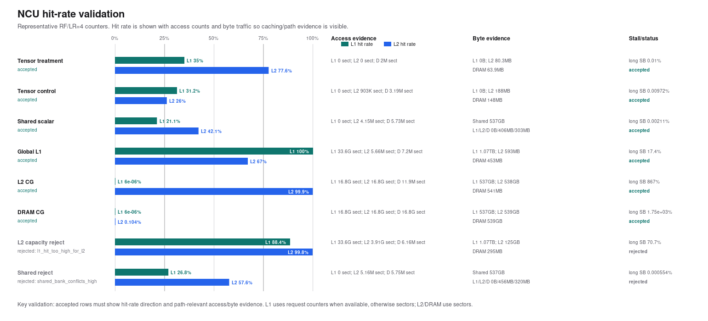
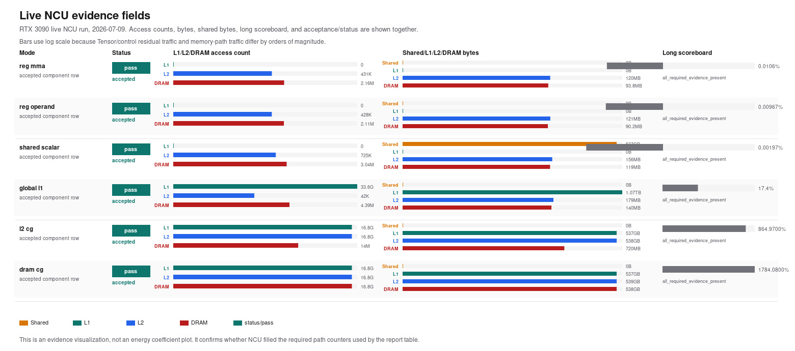

# GPU Power Modeling 실험 결과 상태

갱신일: 2026-07-14

## 현재 결론

현행 protocol을 통과한 **완전한 RTX 3090 component table은 없다**. Tensor,
Shared, Global L1, L2를 모두 같은 tag의 표준 10 s package로 재실행하지 않았기 때문이다.
2026-07-13 Tensor fixed-RF v2 energy run은 당시 gate를 통과했지만, 이후 accumulator
정체 가능성과 v3 predicated-HMMA codegen 오류를 확인해 현행 계수에서 제외했다.
현행 v4는 RTX 3090 RF1/2/4/8/16 NCU 경로와 FLOP 선형성은 통과했으나 새 power run을
하지 않았으므로 current Tensor pJ/FLOP은 없다. 2026-07-14에는 새 matched control의
유효성을 확인하기 위해 Shared와 Global L1만 5 s targeted run으로 재측정했다.

### 현행 Shared/Global-L1 targeted 결과

| Component/path | 값 | 단위 | 조건 | reliability | 지위 |
|---|---:|---|---|---|---|
| Shared scalar path | **0.637283** | pJ/bit | W64 KiB/SM, B8, LR4/8/16, 5 s x 5, 15/15 valid | accepted, medium-high | current targeted evidence |
| Global L1 hit path | **0.430305** | pJ/bit | W8 KiB/SM, B8, LR4/8/16, 5 s x 5, 14/15 valid | accepted_with_caution, medium | current targeted evidence |

Power API는 60/60 final candidate였고 NCU treatment/control은 12/12 accepted였다.
Shared control의 반복 shared read는 0 B, treatment read는 LR4/8/16에서 각각 약
0.269/0.537/1.075 TB였다. Global L1 treatment hit는 99.9992-99.9999%였다. 모든 valid
coefficient denominator는 `ncu_actual_exact`다. 상세 sweep, min/median/mean/max와 제외된
한 Global L1 pair는
[targeted report](../../results/summary/rtx3090_shared_l1_matched_pair_report_20260714_ko.md)에
기록했다. 이 두 값은 표준 10 s full-package final table로 확대 해석하지 않는다.

### L2 최소-counter protocol 검증

최종 L2 coefficient가 아니라 NCU 판정 방식 자체를 검증하기 위해 RTX 3090에서
W64 KiB/SM, B8, LR4, ITER 100,000을 `l2_path_minimal`로 실행했다.

| 항목 | treatment 결과 | 기준 | 판정 |
|---|---:|---:|---|
| application replay | 4 회 | 적을수록 counter cross-pass 위험 감소 | 기록 |
| L1 path hit | 0 % | <=1 % | pass |
| device/all-TEX L2 hit | 99.9991 % | >=95 % | pass |
| native L2 hit | 99.9451 % | >=95 % | pass |
| `(hit+miss)/read` | 0.99998 | 0.98-1.02 | coherent |
| observed/expected L2 bytes | 1.00002 | 0.95-1.05 | pass |
| long scoreboard | 369.971 | NCU per-issue-active signal | 진단값, elapsed-time % 아님 |

같은 address control은 global input load가 0이고 acceptance를 통과했다. 이는 전체
metric bundle에서 보였던 counter 불일치를 피하는 새 protocol의 GA102 검증이며,
A100 L2가 통과했다는 뜻은 아니다. A100은 동일 최소 profile로 새로 실행해야 한다.
원본은 `results/ncu/rtx3090_l2_minimal_stall_profile_20260714/`에 있다.

### A100 L2 외부 실행 상태

사용자가 외부 A100 노드에서 전달한 기존 범위는 아래와 같다. 같은 tag의 raw
`.ncu-rep`가 이 저장소에 반입되지 않았으므로 독립 재계산값이 아니라 reported external
evidence로 구분한다.

| 지표 | 관찰 범위 | 교정된 strict 사용법 | 현재 상태 |
|---|---:|---:|---|
| source/TEX direct L2 read hit | 51-62 % | 첫 partition 진단값, 단독 95% gate 아님 | reported only |
| native op-read hit | 67-72.5 % | source+fabric lookup model 교차검증값, 단독 95% gate 아님 | reported only |
| logical final-service hit | 미수집 | `(source hit + fabric hit)/source read >=95%` | 재실행 필요 |
| native-fabric-model 차이 | 미수집 | <=2 percentage points | 재실행 필요 |

두 범위는 모든 첫-partition miss가 LTC fabric의 다른 partition에서 hit할 때의
`native ~= 1/(2-direct)` 관계와 일치한다. 그러나 raw `srcunit_ltcfabric` counter가
없으므로 기존 실행을 소급 accepted로 바꾸지는 않는다. 현행 재실행은
`l2_path_minimal`에서 source/fabric hit/miss, logical final hit, source/fabric sector
보존성, native-model 오차, observed/expected bytes와 DRAM-read leakage를 동시에 통과한
candidate만 energy sweep에 전달한다. 상세 설계는
[A100 L2 fabric-aware 설계](../methodology/a100_l2_fabric_aware_experiment_design_ko.md),
감사 이력은
[A100 L2 counter scope 감사](../audits/a100_l2_counter_scope_and_rtx_pair_remediation_ko.md)에
정리했다.

### Tensor fixed-RF v2 역사적 결과와 v4 상태

| Component/path | 값 | 단위 | pair | 근거 | 상태 |
|---|---:|---|---|---|---|
| Tensor MMA incremental v2 | **2.252501** | pJ/FLOP | `reg_mma - reg_operand_only`, matched ITER | RF1/2/4/8/16, 33 valid pair, 당시 NCU 10/10 accepted | superseded historical; 현행 계수로 인용 금지 |
| Tensor MMA incremental v4 | - | pJ/FLOP | same pair, in-place sign-flip A fragment | RTX 3090 RF1-16 NCU accepted, RF1/2 ops/FLOP=1.0 | 새 board-energy run 필요 |

v2 RF별 median은 RF1 `1.9754`, RF2 `2.3211`, RF4 `2.2733`, RF8 `2.2525`, RF16
`2.2458 pJ/FLOP`이었다. 당시 treatment의 `HMMA/logical MMA=2`, control HMMA=0,
local read/write=0이었지만 positive-only FP32 누적의 장시간 수치 정체를 NCU instruction
count만으로 검출할 수 없었다. v4 구현과 새 gate는
[Tensor 교차 아키텍처 감사](../audits/tensor_mma_cross_architecture_implementation_audit_ko.md)를
따른다. v2 상세 조건은 역사적 재현 자료로
[`results/summary/rtx3090_tensor_fixedrf_v2_report_20260713_ko.md`](../../results/summary/rtx3090_tensor_fixedrf_v2_report_20260713_ko.md)에
정리했다.

2026-07-08 Global L1/L2 energy pair는 `clocked_empty` control을 사용했고,
`global_addr_only`의 동일 좌표 NCU acceptance와 현행 path-specific counter schema가
없다.

따라서 아래 과거 수치는 현행 final 값으로 인용하지 않는다.

| Component/path | 과거 보고값 | 단위 | 과거 pair | 현행 상태 |
|---|---:|---|---|---|
| Tensor MMA incremental | 0.129216 | pJ/FLOP | `reg_mma - reg_operand_only` | superseded historical; v2와 커널/프로토콜이 다름 |
| Shared scalar path | 0.170590 | pJ/bit | `shared_scalar_load_only - clocked_empty` | superseded historical; 현행 matched shared-address control 재실행 필요 |
| Global L1 hit path | 0.173483 | pJ/bit | `global_l1_load_only - clocked_empty` | provisional; address control 누락 |
| L2 CG hit path | 1.131073 | pJ/bit | `l2_cg_load_only - clocked_empty` | provisional; address control 누락 |
| RTX 3090 external-memory read path | **25.510** | effective pJ/bit | 사용자 전달값; `dram_cg_load_only - global_addr_only` 계열 | historical observation; high-entropy/read-only strict 재실험 전 확정 금지 |
| A100 external-memory read path | **11.925** | effective pJ/bit | 사용자 전달값; 원본 package 저장소 미포함 | historical observation; 독립 재계산 불가 |
| V100 external-memory read path | **8.131** | effective pJ/bit | 사용자 전달값; 원본 package 저장소 미포함 | historical observation; 독립 재계산 불가 |

이 표의 memory 값은 pure circuit/bitcell energy가 아니라 NVML GPU-device energy
차분으로 얻은 effective microbenchmark coefficient다. 특히 25.510/11.925/8.131은
물리 GDDR6X/HBM2 energy가 아니며 새 strict protocol의 accepted 결과도 아니다.


그림의 A/B/C 패널은 각각 본 실험과 같은 GPU-device effective-path
관측, transaction/system-path 문헌 값, memory-device model을 뜻한다. 관측값이
HBM2 device 3.97 pJ/bit보다 크더라도, GPUJoule K40 DRAM-to-L2
30.55 pJ/bit 및 modeled HBM GPU-system 21.1 pJ/bit과 비교하면 경로 계수로서
불가능한 크기는 아니다. 다만 architecture·process·memory·workload·meter
범위가 다르므로 문헌값에 맞춰 current 결과로 승인할 수도 없다.

과거 `clocked_empty` DRAM 수치는 pJ/byte에서 pJ/bit로 환산한 산술 자체보다 control
정책이 문제다. 현행 설계는 동일 ITER의 address control을 요구하므로 그 값을
external-memory effective-path coefficient로 재사용하지 않는다. 최신 정책은
[External-Memory Read-Path 설계](../methodology/external_memory_read_path_experiment_design_ko.md)를 따른다.

과거 전체 표, sweep, 그래프, 해석은
`archive/pre_current_protocol_20260712/docs/results/gpu_power_modeling_experiment_results_ko.md`에
보존한다. 옛 DRAM 막대가 최신값처럼 보이지 않도록 historical coefficient 그림은
active 결과 문서에서 제거하고 scope 비교 그림으로 대체했다.

## 현행 재감사 결과

| Audit | 결과 | 의미 |
|---|---:|---|
| old strict summary current-protocol reaudit | 181 pass, 8 fail | old path-specific schema와 address-control evidence 부족 |
| current goal readiness | 4 fail, 6 missing, 0 warning | RTX 3090 재실행 및 외부 V100/A100/H100 결과 필요 |
| platform implementation readiness | all pass | profile/command package 구현은 정적 기준 통과 |

근거:

- `results/summary/rtx3090_current_protocol_reaudit_20260714.md`
- `results/summary/component_energy_goal_readiness_audit_20260714.md`
- `docs/audits/current_goal_alignment_audit_ko.md`

## 보존된 RTX 3090 NCU 경로 검증 결과

아래 내용은 2026-07-08 factor sidecar와 2026-07-09 **실제 RTX 3090 live
NCU run**에서 얻은 historical path evidence다. 원본 NCU CSV와 `.ncu-rep`가 저장소에
남아 있어 재검산할 수 있으므로, 현행 결과 문서에도 보존한다.

다만 여기서 `accepted`는 **당시 treatment kernel의 경로 판정 기준을 통과했다**는
뜻이다. Global L1/L2/DRAM의 동일 좌표 `global_addr_only` control acceptance까지
요구하는 2026-07-12 현행 protocol의 final coefficient 승인을 뜻하지 않는다.

| 증거 층 | 실행일 | 검증한 내용 | 재사용 가능한 결론 | 재사용하면 안 되는 결론 |
|---|---|---|---|---|
| factor sidecar | 2026-07-08 | RF/LR별 treatment path, hit rate, access/byte traffic, stall | 당시 선택한 kernel이 Tensor/Shared/L1/L2/DRAM 방향으로 동작했는지 | 현행 control gate까지 통과한 최종 pJ/FLOP 또는 pJ/bit |
| live evidence run | 2026-07-09 | 실제 NCU output에서 필수 필드가 채워지는지 | access count, bytes, shared bytes, stall/status counter의 실재와 대표 경로 | 반복 energy run과 결합된 새 coefficient 또는 순수 회로 에너지 |

### NCU 검증 이미지






첫 그림은 2026-07-08 factor sidecar의 대표 RF/LR=4 row와 reject 예시를 함께
보여준다. 두 번째 그림은 2026-07-09 live run 6개 대표 row에서 요청한 evidence
field가 실제로 채워졌는지를 보여준다. 세 번째 그림은 Shared/L1/L2/DRAM byte
traffic의 크기 차이를 log scale로 비교한다. 이 그림들은 energy coefficient 그래프가
아니며, NCU 경로 증거 시각화다.

### 확인 필드와 단위

| 확인 항목 | NCU 요약 열 | 단위/해석 |
|---|---|---|
| L1 access count | `l1_accesses` | 이 RTX 3090 run에서는 sector. 다른 metric set에서는 request일 수 있어 `l1_access_unit`을 함께 확인 |
| L2 access count | `l2_accesses` | sector |
| DRAM access count | `dram_accesses` | sector |
| Shared traffic | `shared_bytes` | byte (B), SASS shared data byte counter 기반 |
| L1/L2/DRAM traffic | `l1_bytes`, `l2_bytes`, `dram_bytes` | byte (B) |
| Long scoreboard | `stall_long_scoreboard_pct` | `%` 표기의 NCU `per_issue_active` 파생 신호. 단순 시간 점유율이 아님 |
| Path 판정 | `acceptance`, `acceptance_reason` | 당시 path gate의 accepted/rejected와 이유 |
| Evidence 완전성 | `status`, `reason` | 필수 열이 실제 live NCU 결과에 존재하는지 |

`stall_long_scoreboard_pct`는 이름에 `%`가 있지만 active issue당 stall된 warp 수를
정규화한 파생 metric이므로 100을 넘을 수 있다. 예를 들어 L2/DRAM의 864.97와
1784.08을 각각 실행 시간의 864.97%, 1784.08%로 읽으면 안 된다. 여기서는 memory
dependency가 강한 path인지 비교하는 **percent-like stall signal**로만 사용한다.

### 2026-07-08 factor sidecar 대표 결과

아래 표는 RF/LR=4 treatment/control 대표 row다. `l2_cg_load_only`와
`dram_cg_load_only`에서 L1 access가 커도 L1 hit가 거의 0이므로, 그 수는 L1에
데이터가 머물렀다는 뜻이 아니라 L1TEX request-side sector traffic으로 해석한다.

| mode | 좌표 | 당시 acceptance | L1 hit (%) | L2 hit (%) | L1 accesses | L2 accesses | DRAM accesses | shared bytes (B) | L1 bytes (B) | L2 bytes (B) | DRAM bytes (B) | long SB signal (%) | field status |
|---|---|---|---:|---:|---:|---:|---:|---:|---:|---:|---:|---:|---|
| `reg_mma` | RF=4 | accepted | 34.9586 | 77.5795 | 0 sectors | 0 sectors | 1.99776e6 sectors | 0 | 0 | 8.02851e7 | 6.39284e7 | 0.010039 | pass |
| `reg_operand_only` | RF=4 | accepted | 31.1890 | 26.0331 | 0 sectors | 9.03367e5 sectors | 3.19101e6 sectors | 0 | 0 | 1.87625e8 | 1.47636e8 | 0.009723 | pass |
| `shared_scalar_load_only` | LR=4 | accepted | 21.0747 | 42.0761 | 0 sectors | 4.14979e6 sectors | 5.72894e6 sectors | 5.37401e11 | 0 | 4.05844e8 | 3.02841e8 | 0.002106 | pass |
| `global_l1_load_only` | LR=4 | accepted | 99.9982 | 66.9942 | 3.35872e10 sectors | 5.66108e6 sectors | 7.19713e6 sectors | 0 | 1.07479e12 | 5.92794e8 | 4.52661e8 | 17.4469 | pass |
| `l2_cg_load_only` | LR=4 | accepted | 0.000006 | 99.8978 | 1.67936e10 sectors | 1.67970e10 sectors | 1.19183e7 sectors | 0 | 5.37395e11 | 5.37997e11 | 5.40672e8 | 867.454 | pass |
| `dram_cg_load_only` | LR=4 | accepted | 0.000006 | 0.104067 | 1.67936e10 sectors | 1.68016e10 sectors | 1.68197e10 sectors | 0 | 5.37395e11 | 5.38836e11 | 5.38608e11 | 1747.88 | pass |

당시 reject된 비교 후보도 path 선정 근거로 남긴다.

| mode | 좌표 | 당시 acceptance | L1 hit (%) | L2 hit (%) | shared bytes (B) | L1 bytes (B) | L2 bytes (B) | DRAM bytes (B) | long SB signal (%) | reject reason |
|---|---|---|---:|---:|---:|---:|---:|---:|---:|---|
| `l2_load_only` | W_SM=64 KiB, B=16 | rejected | 88.3689 | 99.7936 | 0 | 1.07479e12 | 1.25376e11 | 2.95498e8 | 70.7279 | L1 hit가 너무 높아 L2-only 후보가 아님 |
| `shared_load_only` | W_SM=64 KiB, B=16 | rejected | 26.8489 | 57.6059 | 5.37401e11 | 0 | 4.56121e8 | 3.19504e8 | 0.000554 | shared bank conflict 4.1984e9가 검출됨 |

이 두 row는 capacity와 mode 이름만으로 path를 확정할 수 없고, hit/access/byte 및 bank
conflict counter를 함께 봐야 한다는 근거로만 사용한다.

원본 요약은
[factor stability acceptance CSV](../../results/summary/rtx3090_finalplan_ncu_factor_stability_acceptance_20260708.csv)와
[evidence field check](../../results/summary/rtx3090_ncu_evidence_field_check_20260709.md)에
있다. 전체 factor sidecar는 Tensor RF=1,2,4,8,16과 memory LR=4,8,16을 포함한다.

### 2026-07-09 실제 live NCU run

이 run은 coefficient를 다시 계산하기 위한 power 반복 실험이 아니라, 보고서에 쓰는
필드가 실제 NCU output에서 수집되는지 double-check한 실험이다. 공통 조건은 RTX 3090
82 active SM과 blocks/SM=16이며, 각 mode의 상세 좌표는 다음과 같다.

| mode | W_SM (KiB/SM) | ITER (count) | RF (unitless) | LR (count) |
|---|---:|---:|---:|---:|
| `reg_mma` | 2048 | 100,000 | 4 | 1 |
| `reg_operand_only` | 2048 | 100,000 | 4 | 1 |
| `shared_scalar_load_only` | 64 | 100,000 | 1 | 4 |
| `global_l1_load_only` | 16 | 100,000 | 1 | 4 |
| `l2_cg_load_only` | 64 | 100,000 | 1 | 4 |
| `dram_cg_load_only` | 8192 | 100,000 | 1 | 4 |

| mode | 당시 acceptance | L1 hit (%) | L2 hit (%) | L1 accesses | L2 accesses | DRAM accesses | shared bytes (B) | L1 bytes (B) | L2 bytes (B) | DRAM bytes (B) | long SB signal (%) | live field status |
|---|---|---:|---:|---:|---:|---:|---:|---:|---:|---:|---:|---|
| `reg_mma` | accepted | 36.2957 | 32.3856 | 0 sectors | 431,231 sectors | 2.16480e6 sectors | 0 | 0 | 1.20292e8 | 9.38189e7 | 0.010564 | pass |
| `reg_operand_only` | accepted | 31.7291 | 63.2529 | 0 sectors | 427,908 sectors | 2.11342e6 sectors | 0 | 0 | 1.21160e8 | 9.01961e7 | 0.009671 | pass |
| `shared_scalar_load_only` | accepted | 20.8079 | 15.0719 | 0 sectors | 724,793 sectors | 3.04068e6 sectors | 5.37401e11 | 0 | 1.55649e8 | 1.19054e8 | 0.001967 | pass |
| `global_l1_load_only` | accepted | 99.9998 | 57.2715 | 3.35872e10 sectors | 41,984 sectors | 4.38920e6 sectors | 0 | 1.07479e12 | 1.79393e8 | 1.40454e8 | 17.4343 | pass |
| `l2_cg_load_only` | accepted | 0.000007 | 99.9066 | 1.67936e10 sectors | 1.67994e10 sectors | 1.40017e7 sectors | 0 | 5.37395e11 | 5.38188e11 | 7.19515e8 | 864.970 | pass |
| `dram_cg_load_only` | accepted | 0.000007 | 0.038381 | 1.67936e10 sectors | 1.67998e10 sectors | 1.68180e10 sectors | 0 | 5.37395e11 | 5.38663e11 | 5.38470e11 | 1784.08 | pass |

필수 evidence field는 6/6 대표 row에서 모두 `pass`였다. 해석 가능한 핵심은 다음과
같다.

| path | live NCU에서 확인된 사실 | 현재 사용할 때의 제한 |
|---|---|---|
| Tensor treatment/control | `reg_mma`에 HMMA 1.0496e9, `reg_operand_only`에 HMMA 0; 두 mode 모두 당시 spill/local counter 0 | 현행 kernel revision과 treatment-control pair lock으로 재실행 필요 |
| Shared scalar | shared 5.37401e11 B, shared bank conflict 0, global traffic은 shared traffic보다 매우 작음 | Shared SRAM bitcell 단독 에너지가 아니라 scalar shared load path 증거 |
| Global L1 | L1 hit 99.9998%, L1 1.07479e12 B, L2/DRAM leakage는 훨씬 작음 | 당시 energy control이 `clocked_empty`; 현행 `global_addr_only` control 재실행 필요 |
| L2 CG | L1 hit 약 0%, L2 hit 99.9066%, DRAM/L2 bytes 약 0.134% | stall-heavy effective path이며 pure L2 SRAM energy가 아님 |
| External-memory CG | L1/L2 hit가 거의 0%, DRAM 5.38470e11 B | 과거 traffic 경로 증거일 뿐 현행 read-only strict coefficient는 아님 |

Live run의 재검산 경로:

| artifact | 경로와 역할 |
|---|---|
| NCU summary CSV | [ncu_cache_validation_summary.csv](../../results/ncu/rtx3090_ncu_evidence_check_20260709/ncu_cache_validation_summary.csv): live raw metric을 mode별 열로 정규화 |
| NCU path acceptance | [rtx3090_ncu_evidence_check_acceptance_20260709.md](../../results/summary/rtx3090_ncu_evidence_check_acceptance_20260709.md): 당시 path gate 결과 |
| Evidence field audit | [rtx3090_ncu_evidence_live_field_check_20260709.md](../../results/summary/rtx3090_ncu_evidence_live_field_check_20260709.md): 요청 필드 6/6 pass 확인 |
| NCU details/raw metrics | [live NCU directory](../../results/ncu/rtx3090_ncu_evidence_check_20260709/): mode별 `.ncu-rep`, `_details.csv`, `_raw_metrics.csv` |

## RTX 3090 재실행 조건

| Component | modes | energy W_SM (KiB/SM) | energy blocks/SM | strict NCU W/B | sweep |
|---|---|---:|---|---|---|
| Tensor | `reg_operand_only,reg_mma` | 2048 | 8,16 | 2048/8 | RF 1,2,4,8,16 |
| Shared scalar | `shared_scalar_addr_only,shared_scalar_load_only` | 32,64 | 8,16 | 64/8 | LR 4,8,16; NCU 1,2,4,8,16; 동일 pair ITER |
| Global L1 | `global_addr_only,global_l1_load_only` | 8,16 | 8,16 | 8/8 | LR 4,8,16; NCU 1,2,4,8,16 |
| L2 CG | `global_addr_only,l2_cg_load_only` | 64 | 8,16 | 64/8 | LR 4,8,16; NCU 1,2,4,8,16 |
| External-memory read | `global_addr_only,dram_cg_load_only` | 256,512,1024,2048 | 8,16 | W2048/B8 anchor | LR 4,8,16; NCU 1,4,8,16; read-only denominator |

공통 energy 조건은 target 10 s, 5 repeats다. Tensor와 모든 memory pair는 treatment/control-floor
dual calibration 후 큰 동일 ITER를 두 mode에 적용한다. Final analyzer는
`--require-control-ncu-acceptance`를 사용한다.

실행:

```bash
bash results/summary/rtx3090_component_finalplan_20260712_commands.sh
```

NCU 권한 오류가 있을 때만 NCU 경로를 sudo로 실행한다.

```bash
NCU_USE_SUDO=1 bash results/summary/rtx3090_component_finalplan_20260712_commands.sh
```

상세 명령과 acceptance 기준은
`results/summary/rtx3090_component_finalplan_20260712_command_plan.md`를 따른다.

## Final 인정 조건

1. Power row가 explicit GPU/device total-energy counter scope를 사용한다.
2. Tensor/Shared/Global L1/L2 treatment NCU path가 exact coordinate에서 accepted다.
3. `reg_operand_only`와 `global_addr_only` control도 같은 좌표에서 accepted다.
4. Memory denominator가 `ncu_actual_exact`이고 단위가 표에 기록된다.
5. matched-control, reliability, strict summary, strict summary audit, package audit가
   모두 통과한다.
6. 숫자의 hierarchy가 그럴듯하다는 이유로 실패 gate를 무시하지 않는다.

새 결과가 생성되기 전까지 보고서에는 “RTX 3090 historical/provisional result”라고
표기한다.
