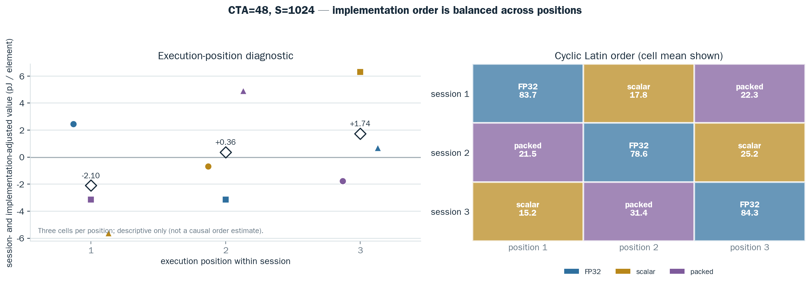
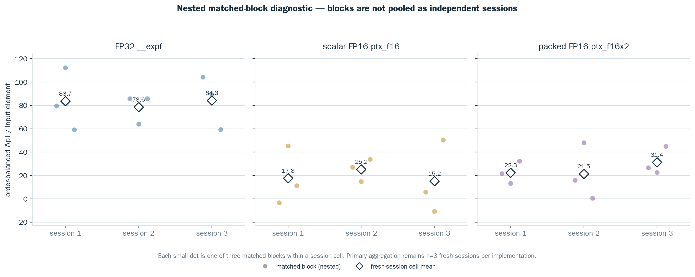

# CTA=48, S=1024 targeted Softmax EX2 confirmation

## Result

The three new cyclic-order sessions all passed raw/trace/manifest verification. The primary metric is incremental pJ per input element: one extra exponent result is added per element in treatment. It is not total Softmax pJ per element.

| implementation | fresh-session mean ΔpJ/element | sample SD | diagnostic t95 (n=3) | positive session effects |
|---|---:|---:|---:|---:|
| `fp32` | 82.164 | 3.134 | [74.379, 89.950] | 3/3 |
| `ptx_f16` | 19.393 | 5.223 | [6.417, 32.368] | 3/3 |
| `ptx_f16x2` | 25.055 | 5.484 | [11.433, 38.677] | 3/3 |

The t intervals are descriptive diagnostics with only three independent sessions, not a preregistered decision rule. The scalar FP16 target cell moved from historical 10.994 → 1.632 to a three-session mean of 19.393 ΔpJ/element after implementation-position balancing.

## Matplotlib 시각화: fresh-session 편차와 계층

네 그림은 모두 `session_cells.csv`를 primary 단위로 삼는다. 즉 구현별 독립 반복은
fresh session 3개이며, matched block 27개를 독립 표본으로 합치지 않는다. y축의
`ΔpJ/element`는 이 설계에서 `pJ/logical scalar exponent result`와 수치상 같지만,
전체 Softmax 에너지나 순수 MUFU/opcode 에너지는 아니다.

### 1. 평균 뒤의 raw session 값


[PNG](../assets/softmax_ex2_targeted_confirmation/rtx3090_softmax_ex2_targeted_confirmation_20260725_session_spread.png) · [SVG](../assets/softmax_ex2_targeted_confirmation/rtx3090_softmax_ex2_targeted_confirmation_20260725_session_spread.svg)

FP32의 session 표본 SD/CV/범위는 `3.134`/`3.81%`/`5.700`, scalar FP16은
`5.223`/`26.94%`/`10.058`, packed FP16은 `5.484`/`21.89%`/`9.914`
`pJ/element`다. 오른쪽 선은 같은 fresh session 내의 값을 연결한 categorical slope
plot으로, 시간 추세를 뜻하지 않는다. diamond는 평균이고 interval은 n=3의 descriptive
df=2 t95다.

### 2. paired contrast와 packed-scalar의 부호 반전


[PNG](../assets/softmax_ex2_targeted_confirmation/rtx3090_softmax_ex2_targeted_confirmation_20260725_path_contrasts.png) · [SVG](../assets/softmax_ex2_targeted_confirmation/rtx3090_softmax_ex2_targeted_confirmation_20260725_path_contrasts.svg)

`packed - scalar`는 session별 `+4.584`, `-3.785`, `+16.187`이고 평균은 `+5.662`
`pJ/element`다. diagnostic t95 `[-19.253, +30.577]`가 0을 포함하므로 packed가
scalar보다 낮은 증분 에너지를 낸다는 결론은 지원되지 않는다. 양수 방향은 왼쪽 path가
더 높은 incremental energy라는 뜻이며, 모든 contrast는 complete implementation path
차이다.

### 3. cyclic implementation order와 위치 진단



[PNG](../assets/softmax_ex2_targeted_confirmation/rtx3090_softmax_ex2_targeted_confirmation_20260725_position_balance.png) · [SVG](../assets/softmax_ex2_targeted_confirmation/rtx3090_softmax_ex2_targeted_confirmation_20260725_position_balance.svg)

세 session은 `FP32 → scalar → packed`, `packed → FP32 → scalar`,
`scalar → packed → FP32` 순서여서 각 implementation이 position 1/2/3을 한 번씩
차지한다. 왼쪽은 session·implementation 평균을 뺀 descriptive position diagnostic이며
position 평균은 각각 `-2.104`, `+0.360`, `+1.745 pJ/element`다. 9개 cell의 full
additive model 잔차 자유도는 2뿐이므로 이 그림은 순서 또는 온도의 인과효과를 주장하지
않으며, 뚜렷한 단조 위치 편향이 보이지 않는지 확인하는 QA 용도다.

### 4. cell 내부 matched-block 산포



[PNG](../assets/softmax_ex2_targeted_confirmation/rtx3090_softmax_ex2_targeted_confirmation_20260725_matched_block_diagnostics.png) · [SVG](../assets/softmax_ex2_targeted_confirmation/rtx3090_softmax_ex2_targeted_confirmation_20260725_matched_block_diagnostics.svg)

작은 점은 각 session cell 안의 3개 order-balanced matched block이고, diamond는 그
cell의 primary session mean이다. block 산포는 보여 주되, `n=27`을 27개의 독립 session으로
해석하지 않는다. 따라서 이 그림은 측정 안정성 진단이며 implementation 평균의 신뢰도
주장은 여전히 fresh session `n=3`에 제한된다.

그림은 다음으로 재생성한다:

```bash
python3 scripts/plot_softmax_ex2_targeted_confirmation.py --tag 20260725
python3 scripts/plot_softmax_ex2_targeted_confirmation.py --self-test
```

파일·입력·출력 QA의 상세는 [Matplotlib asset 안내](../assets/softmax_ex2_targeted_confirmation/README.md)에
있다. 이 companion은 canonical portable HTML/report artifact를 수정하지 않는다.

## Interpretation bounds

- All three paths share FP16 I/O and FP32 max/sum/reduction/normalization. They differ in the exponent/probe path, so comparisons are complete implementation-path contrasts, not isolated functional-unit coefficients.
- `ptx_f16x2` emits packed two-result PTX, but frozen sm_86 SASS lowers it to two scalar `MUFU.EX2.F16` instructions. Its pJ/element value must not be interpreted as half of scalar FP16 or as a physical two-lane-MUFU energy.
- Exact CTA=48/S=1024 native NCU sidecar confirms one added scalar EX2 result per element for both native paths; profiler energy is explicitly excluded from the ATC numerator.

## Evidence outputs

- `program`: `results/summary/rtx3090_softmax_ex2_targeted_confirmation_targeted_g48s1024_confirm_v1_20260725_program.csv`
- `session_cells`: `results/summary/rtx3090_softmax_ex2_targeted_confirmation_targeted_g48s1024_confirm_v1_20260725_session_cells.csv`
- `matched_blocks`: `results/summary/rtx3090_softmax_ex2_targeted_confirmation_targeted_g48s1024_confirm_v1_20260725_matched_blocks.csv`
- `implementation_summary`: `results/summary/rtx3090_softmax_ex2_targeted_confirmation_targeted_g48s1024_confirm_v1_20260725_implementation_summary.csv`
- `within_session_contrasts`: `results/summary/rtx3090_softmax_ex2_targeted_confirmation_targeted_g48s1024_confirm_v1_20260725_within_session_contrasts.csv`
- `contrast_summary`: `results/summary/rtx3090_softmax_ex2_targeted_confirmation_targeted_g48s1024_confirm_v1_20260725_contrast_summary.csv`
- `diagnostics`: `results/summary/rtx3090_softmax_ex2_targeted_confirmation_targeted_g48s1024_confirm_v1_20260725_diagnostics.csv`
- `numerical_validation`: `results/summary/rtx3090_softmax_ex2_targeted_confirmation_targeted_g48s1024_confirm_v1_20260725_numerical_validation.csv`
- `sass_audit`: `results/summary/rtx3090_softmax_ex2_targeted_confirmation_targeted_g48s1024_confirm_v1_20260725_sass_audit.csv`
- `ncu_audit`: `results/summary/rtx3090_softmax_ex2_targeted_confirmation_targeted_g48s1024_confirm_v1_20260725_ncu_audit.csv`
- `historical_context`: `results/summary/rtx3090_softmax_ex2_targeted_confirmation_targeted_g48s1024_confirm_v1_20260725_historical_context.csv`
- `historical_scalar_blocks`: `results/summary/rtx3090_softmax_ex2_targeted_confirmation_targeted_g48s1024_confirm_v1_20260725_historical_scalar_blocks.csv`
- `analysis_markdown`: `docs/results/rtx3090_softmax_ex2_targeted_confirmation_targeted_g48s1024_confirm_v1_20260725_analysis_ko.md`
