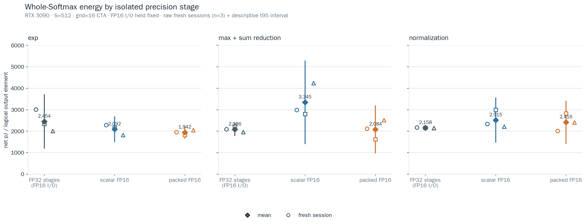
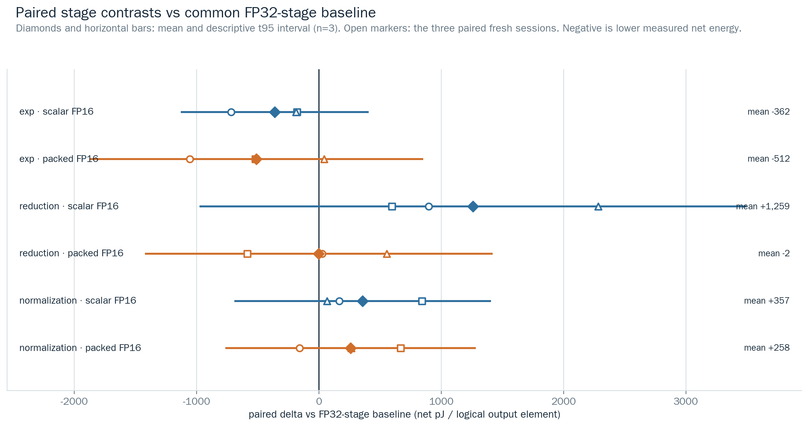
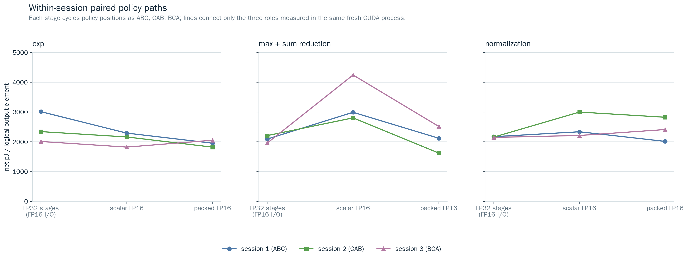
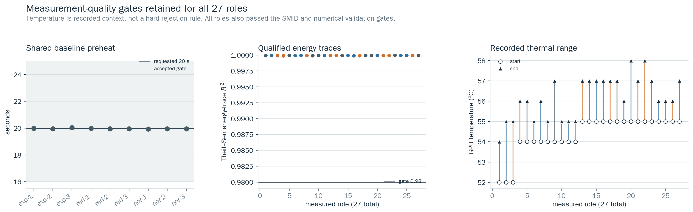

# RTX 3090 전체 Softmax 정밀도 단계 분리 분석 (2026-07-27)

## 기술 요약

**네, exp·max+sum reduction·normalization을 각각 FP32 / scalar FP16 / packed FP16으로 분리해 측정해야 합니다.** 이 보고서는 그 설계로 실행한 complete-Softmax 결과다. stage 비교에서는 FP16 input/output을 고정하고, 공통 기준 `fp16_io_fp32_all`은 세 compute stage를 FP32로 수행한다. 따라서 수치는 기존 EX2 Operand-rate ATC의 `pJ/added logical exponent result`가 아니라 **`net pJ/logical Softmax output element`** 이며 서로 합산·차감하면 안 된다.

S=512, grid=16 CTA, 20 s shared-baseline preheat, 13 s role 조건에서 fresh CUDA-process session 3개를 ABC/CAB/BCA로 교차했다. paired mean은 exp scalar -362.1 pJ/output, exp packed -512.0; reduction scalar 1,259.2, reduction packed -1.8; normalization scalar 357.0, normalization packed 257.7 (모두 baseline 대비)다.

그러나 **6개의 paired contrast 모두 fresh-session n=3 descriptive t95 interval이 0을 포함한다.** 따라서 현재 데이터는 구현 선택을 확정하는 energy proof가 아니다. 관찰된 방향성은 exp의 낮은 mean, scalar reduction의 높은 mean, packed reduction의 baseline 근접 mean이지만, 이를 순수 functional-unit energy나 보편적 FP16 이득으로 해석하지 않는다.

## 단계별 결과와 시각 증거



각 값은 complete Softmax 한 출력 원소당 idle-subtracted NVML GPU/device total-energy trace다. raw fresh session 점과 평균/설명적 t95 interval을 함께 표시했으며, 27개 role을 독립 표본으로 pool하지 않았다.

| 단계 | FP16 I/O + FP32-stage mean | scalar FP16 mean | packed FP16 mean | scalar−기준 | packed−기준 |
|---|---:|---:|---:|---:|---:|
| exp | 2,453.8 | 2,091.7 | 1,941.9 | -362.1 | -512.0 |
| max + sum reduction | 2,086.2 | 3,345.3 | 2,084.4 | 1,259.2 | -1.8 |
| normalization | 2,158.1 | 2,515.1 | 2,415.8 | 357.0 | 257.7 |

음수 contrast는 같은 fresh session의 FP32-stage baseline보다 낮게 관측된 net energy를 뜻한다. 기준 mean 자체도 stage group별 independent session 날짜/시간대에 따라 달라질 수 있으므로, stage group 사이 absolute mean을 직접 순위화하지 않는다.



| paired contrast | mean Δ | descriptive t95 | session range | sign (− / +) |
|---|---:|---:|---:|---:|
| exp · scalar FP16 | -362.1 | [-1,129.8, 405.5] | [-718.9, -179.4] | 3 / 0 |
| exp · packed FP16 | -512.0 | [-1,877.1, 853.1] | [-1,057.3, 41.7] | 2 / 1 |
| max + sum reduction · scalar FP16 | 1,259.2 | [-977.2, 3,495.5] | [595.2, 2,283.8] | 0 / 3 |
| max + sum reduction · packed FP16 | -1.8 | [-1,422.3, 1,418.7] | [-587.1, 555.5] | 1 / 2 |
| normalization · scalar FP16 | 357.0 | [-691.8, 1,405.8] | [64.6, 841.0] | 0 / 3 |
| normalization · packed FP16 | 257.7 | [-766.7, 1,282.1] | [-157.8, 666.9] | 1 / 2 |

`reduction · scalar FP16`은 세 session 모두 양수였지만 n=3 interval은 여전히 0을 포함한다. `exp · scalar FP16`은 세 session 모두 음수였지만 동일하게 interval만으로 개선을 확정할 수 없다. 이 불확실성 표기는 부정 결과가 아니라, 다음 확인 실험의 범위를 제한하기 위한 근거다.



## 범위·분모·설계

- GPU: full NVIDIA GeForce RTX 3090, CC 8.6, 82 SM, sm86 binary SHA `2276f41518cc228cfb350caaef3a112008abafcd7046daffef915c6647e5821d`.
- fixed kernel shape: S=512, 256 threads/CTA, CTA 16개, CTA당 독립 Softmax row 2개, logit scale=4.
- primary denominator: `Noutput = grid_blocks × rows_per_block × iterations × S`; `net_pJ/output = (Etrace − Pidle × elapsed) × 1e12 / Noutput`.
- trace energy: NVML GPU/device total-energy samples를 Theil–Sen slope로 fit한 qualified trace energy. endpoint fallback row는 분석에서 거부한다.
- schedule: stage group마다 baseline/scalar/packed를 ABC, CAB, BCA로 한 번씩 배치하고, 각 schedule은 새 binary process/CUDA context에서 실행했다.
- preheat: baseline `fp16_io_fp32_all`을 session당 한 번만 20 s 목표로 preheat했다. 그 뒤 각 policy calibration trial과 같은 ABC/CAB/BCA 순서의 unrecorded full-policy warm-up block을 실행한 뒤 measured roles를 시작했다. 이 conditioning energy는 numerator에 넣지 않았다.
- order caveat: ABC/CAB/BCA는 policy position을 한 번씩 회전하지만, pre-measurement conditioning과 measured block의 directed adjacent carryover를 완전 counterbalance하지 않는다. 따라서 order/thermal carryover를 causal effect로 분리하지 않으며 결과를 descriptive로 제한한다.

`fp16_io_fp32_all`이 primary baseline이며 FP16 I/O와 FP32 exp/reduction/normalization을 고정한다. `fp32_io_fp32_all`은 FP32 I/O까지 바꾸는 separate end-to-end reference라 I/O까지 바뀌므로 이번 27-role stage-isolation primary contrast에는 넣지 않았다. full FP32 / scalar-all / packed-all policy는 validation-only로 의미 검증했지만, stage effect를 더해 all-FP16 energy를 예측하지 않는다.

## 구현이 실제로 뜻하는 것

- **exp scalar / packed:** scalar는 `ex2.approx.f16` 4개, packed는 `ex2.approx.f16x2` 2개 PTX op로 각각 두 row×두 element를 처리한다. 이 frozen sm86 build에서는 둘 다 최종 SASS `MUFU.EX2.F16` 4개로 lowering됐다. packed PTX가 하나의 physical two-lane MUFU issue라는 뜻은 아니다.
- **max+sum reduction:** scalar는 scalar PTX `max.f16`/`add.f16` 각각 18개와 16-bit shared tree다. packed는 CTA의 **서로 독립적인 두 row**를 half2의 low/high lane으로 묶어 `max.f16x2`/`add.f16x2` 각각 9개를 수행한다. scalar SASS도 HADD2/HMNMX2 encoding을 쓰지만 `.H0_H0` lane replication이므로 두 independent packed lane과 같다고 부르지 않는다.
- **normalization:** scalar는 FP16 multiply 4개, packed는 half2 multiply 2개다. 두 정책 모두 `hrcp(half)`가 FP16→FP32 `RCP`→FP16 rounding으로 lowering되며 native FP16 reciprocal은 아니다. 따라서 이 stage는 “FP16-rounded reciprocal + scalar/packed probability multiply” 비교다.

## 정확도·경로·측정 품질

모든 27 measured role이 manifest/raw/trace hash, exact cyclic order, logical denominator, preheat, qualified trace, SMID, finite-output, FP64 reference gate를 통과했다. max absolute error 범위는 3.54528e-06–8.57577e-06, row-sum error 범위는 0.000136375–0.000624657였다. dominated-input validation pattern의 tail underflow count는 FP16 output에서 예상되는 기록값이며, non-finite failure는 0이다.



| check | coverage | result | meaning |
|---|---|---|---|
| evidence binding | 9 sessions / 27 roles | pass | manifest, raw CSV, energy trace, binary hash, runner hash, cyclic schedule, schema and denominator gates all passed |
| preheat and trace quality | preheat 19.944–20.046 s; R² 0.999885643–0.999966829 | pass | shared FP32-stage baseline preheat is within the 16–25 s gate; qualified Theil–Sen energy traces exceed R²=0.98 |
| placement and numerics | 27 / 27 roles | pass | SMID placement, finite-output, FP64-reference absolute-error and row-sum gates passed |
| recorded thermal context | 52–58 °C | recorded | temperature is recorded context, not a randomized causal adjustment or a hard rejection gate |
| sm86 code-path audit | 2276f41518cc | pass | PTX/SASS policy specializations match the scalar/packed reduction and FP16-rounded reciprocal contracts |

## 한계·불확실성·robustness

1. n=3 fresh session이라 t95 interval이 넓다. interval은 descriptive diagnostic이며 p-value나 causal effect size로 해석하지 않는다.
2. 이 측정은 RTX 3090 하나, S=512 / CTA=16 하나, logit scale=4 하나의 operating point다. CTA/S sweep, stage interaction full factorial, 다른 GPU generalization은 하지 않았다.
3. stage policy는 complete Softmax path 전체를 실행한다. 차이는 stage를 바꾼 implementation path이므로 pure MUFU/SFU/FP16-ALU circuit energy가 아니다.
4. temperature는 52–58 °C 범위로 기록했지만 randomized treatment가 아니므로 thermal coefficient나 보정 인과변수로 쓰지 않았다.
5. 20 s baseline preheat 뒤 schedule-order calibration과 unrecorded same-order full-policy warm-up이 있었다. position은 회전했지만 directed adjacent carryover는 완전 counterbalance하지 않았으므로, 그 thermal/scheduling effect를 stage effect로 분리할 수 없다.
6. stage contrast를 선형 합산해 `fp16_scalar_all` 또는 `fp16x2_all`의 에너지를 예측하면 안 된다. handoff rounding, data dependency, scheduling, shared-memory layout, compiler lowering interaction이 남는다.

## 권장 다음 단계

추가 CTA/S sweep 대신, 판단이 필요한 후보만 같은 S=512/CTA=16 조건에서 별도 confirmation을 한다. 최소 후보는 (a) exp packed vs FP32-stage baseline, (b) scalar reduction vs FP32-stage baseline이다. 각 후보는 두 정책만 fresh process에서 AB/BA로 counterbalance한 3개 이상의 추가 session으로 제한한다. 그 결과가 없으면 현재 implementation 선택은 accuracy/throughput 요구로 결정하고, energy superiority를 주장하지 않는다.

## 후속 질문

- fixed-clock 또는 external high-resolution meter가 exp/reduction contrast의 interval을 실제로 줄이는가?
- A100/H100에서 scalar·packed reduction의 PTX/SASS lowering과 board-level direction이 유지되는가?
- numerical tolerance가 더 엄격한 workload에서 FP16 reduction/normalization의 acceptable boundary는 어디인가?

## 재현 명령

```bash
source scripts/activate_softmax_experiment_env.sh
python3 scripts/analyze_softmax_whole_precision_stage_isolation.py \
  --run-dir results/raw/rtx3090_softmax_whole_precision_stage_isolation_20260727_stageiso_v1
python3 scripts/plot_softmax_whole_precision_stage_isolation.py \
  --run-dir results/raw/rtx3090_softmax_whole_precision_stage_isolation_20260727_stageiso_v1 \
  --out-dir docs/assets/softmax_whole_precision_stage_isolation
python3 scripts/audit_softmax_whole_precision_sass.py \
  --binary build-whole-precision-rtx3090/a100_fp16_softmax_whole_precision_energy \
  --cuobjdump "$CUOBJDUMP" --fail-on-unexpected
```
