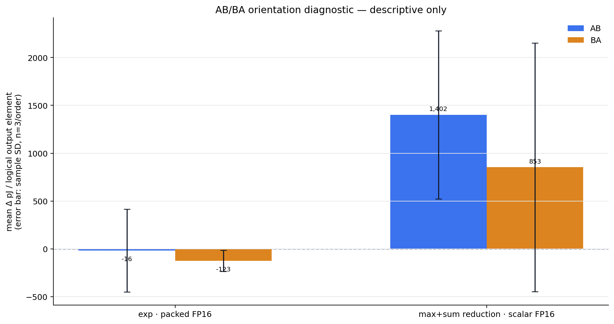
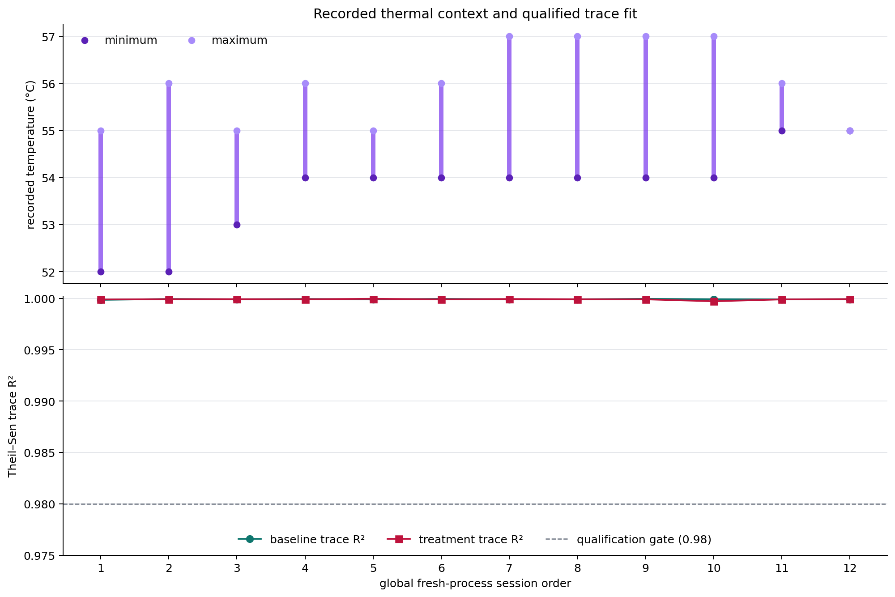

# RTX 3090 Softmax targeted AB/BA confirmation (2026-07-27)

## 기술 요약

이 보고서는 이전 stage-isolation 탐색에서 선택된 두 contrast만 **새로운 AB/BA fresh CUDA-process session**으로 재확인한다. 각 후보는 AB 3회와 BA 3회, 총 n=6 paired session으로 측정했으며, primary metric은 `net pJ/logical Softmax output element`이다. baseline은 `fp16_io_fp32_all` 즉 **FP16 I/O + FP32-stage baseline**이다.

exp packed의 treatment−baseline 평균 Δ는 -69.8 pJ/output (descriptive t95 [-372.4, 232.9]), reduction scalar는 1,127.5 pJ/output (descriptive t95 [39.5, 2,215.6])이다. 이 구간은 후보를 탐색 결과로 선택한 뒤의 n=6 descriptive summary이며, broad superiority의 확정 검정으로 해석하지 않는다.

## 두 후보의 fresh paired evidence

음수 Δ는 같은 fresh session에서 treatment가 baseline보다 낮게 관측된 idle-subtracted NVML GPU/device total-energy를 뜻한다. 각 candidate는 다른 candidate와 합치거나 순위 평균으로 합산하지 않는다.

| 후보 | baseline | treatment | n | AB / BA | mean Δ pJ/output | descriptive t95 | 음수 / 양수 session |
|---|---|---|---:|---:|---:|---:|---:|
| exp · packed FP16 | FP16 I/O + FP32 stages | `exp_fp16x2` | 6 | 3 / 3 | -69.8 | [-372.4, 232.9] | 4 / 2 |
| max+sum reduction · scalar FP16 | FP16 I/O + FP32 stages | `reduction_fp16_scalar` | 6 | 3 / 3 | 1,127.5 | [39.5, 2,215.6] | 1 / 5 |

paired-slope figure는 session 한 개 안의 baseline→treatment 변화를 연결한다. forest/delta figure의 0선과 t95 interval은 sign과 uncertainty를 동시에 보이기 위한 descriptive evidence이며, candidate 선택의 p-value로 사용하지 않는다.

## 이번 run의 설계 결정

- `exp_fp16x2`는 평균 Δ=-69.8 pJ/output, descriptive t95 [-372.4, 232.9]다. 0을 포함하므로 이 좌표에서 energy-saving endpoint 후보로 승격하지 않는다.
- `reduction_fp16_scalar`는 평균 Δ=1,127.5 pJ/output, descriptive t95 [39.5, 2,215.6]다. 이 고정 좌표에서는 개선 후보가 아니라 관측된 비용 증가이므로 endpoint 또는 CTA/S sweep으로 확대하지 않는다.

## 범위와 metric 정의

RTX 3090 sm86(82-SM device), S=512, grid=16 CTA, CTA당 독립 row 2개, logit scale=4, 13 s role, 1 s idle baseline, 20 s conditioner를 고정했다. grid=16은 full-SM saturation 실험이 아니다. 모든 비교는 complete Softmax forward이며, `net pJ/output = (qualified trace energy − idle power × elapsed) × 1e12 / logical output elements`다. 이는 기존 EX2 Operand-rate ATC의 `pJ/added logical exponent result`와 다른 단위이므로 비교·합산·차감하지 않는다.

## 순서 효과를 줄인 방법

각 fresh process는 정확히 두 role만 실행한다. 두 policy의 numerical validation과 calibrated iteration count는 measurement order와 무관한 canonical enum 순서로 먼저 완료하고, 이후 `fp16_io_fp32_all`만 20초 conditioning한다. 그 뒤 unrecorded policy warm-up 없이 AB 또는 BA를 측정한다. AB/BA 3회씩은 각 treatment의 first/second position과 directed predecessor를 균형화한다.

## 불확실성과 한계

후보가 기존 exploratory result를 보고 선택됐으므로 이 결과는 두 contrast의 **targeted fresh replication**이다. 추정치와 interval은 exploratory data와 pool하지 않는다. AB/BA는 position/carryover를 줄이지만 온도·board power state·DVFS의 모든 영향을 제거하지 않으며, 온도는 기록 context이지 rejection gate나 causal adjustment가 아니다. 외부 power meter나 fixed-clock condition은 사용하지 않았다.

exp packed PTX가 `f16x2`라고 해서 sm86에서 한 번의 물리적 two-result MUFU issue나 절반의 energy를 뜻하지 않는다. reduction scalar/packed stage delta를 더해 all-FP16 endpoint energy를 예측할 수도 없다. 이 보고서는 pure SFU/MUFU/ALU 회로 에너지나 다른 GPU, S/CTA에 일반화하지 않는다.

## 다음 의사결정 단계

한 후보의 fresh paired interval과 방향이 충분히 일관되면, 다음 단계는 그 policy를 사용한 **end-to-end endpoint** (`fp16_io_fp32_all` vs all-stage endpoint)의 별도 AB/BA test다. 여전히 interval이 넓으면 CTA/S sweep을 늘리기보다 fixed-clock 또는 external-meter 조건을 별도 sensitivity run으로 추가해 variance source를 분리하는 편이 타당하다.

## 추가 질문

A100/H100에서 같은 source가 어떤 target-specific PTX/SASS lowering을 보이는가? workload-level numerical tolerance가 더 엄격할 때 FP16 reduction boundary는 유지되는가? external power meter가 board-level trace variance를 줄이는가?

## 품질 gate

| check | coverage | result |
|---|---|---|
| evidence binding | 12 fresh processes / 24 measured roles | pass |
| AB/BA and conditioning | exp packed: AB=3 BA=3; reduction scalar: AB=3 BA=3 | pass |
| trace, placement and numerics | preheat 19.878-19.976 s; R² 0.999714829-0.999955990; 24/24 roles | pass |
| recorded thermal context | 52-57 °C | recorded |
| sm86 compiled path | ad33175b2388 (results/raw/rtx3090_softmax_whole_precision_targeted_confirmation_20260727_abba_confirm_v1/sass_audit.json) | pass |

