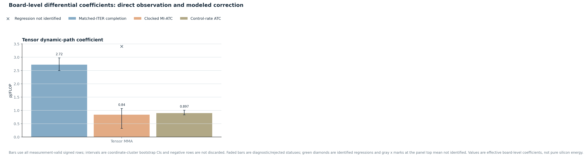
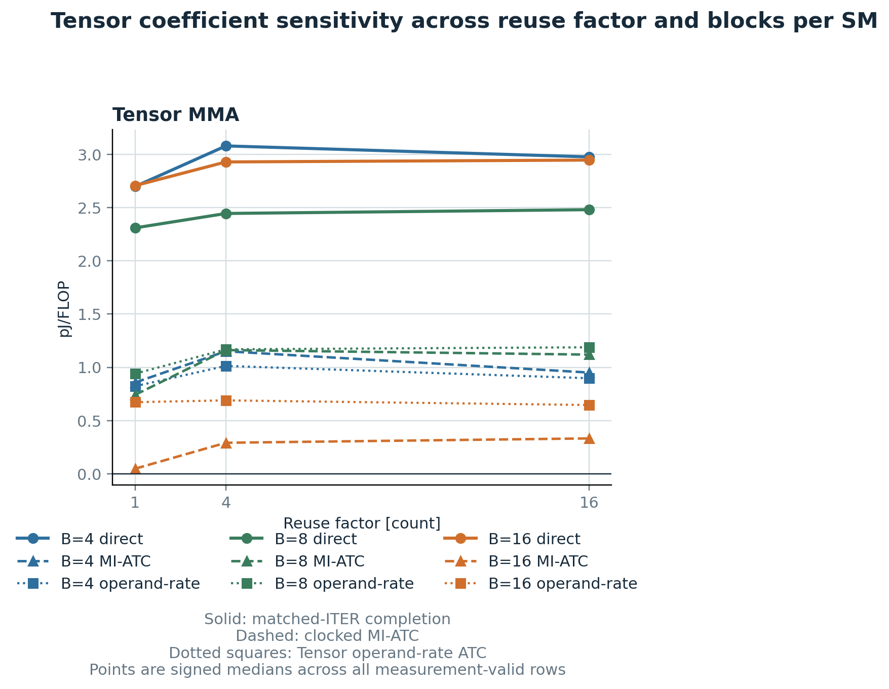
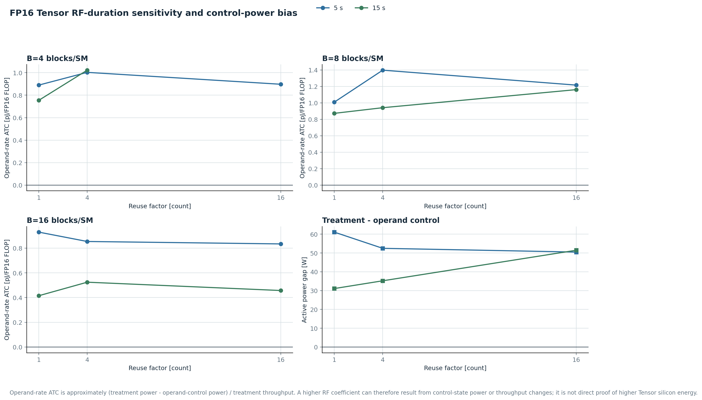
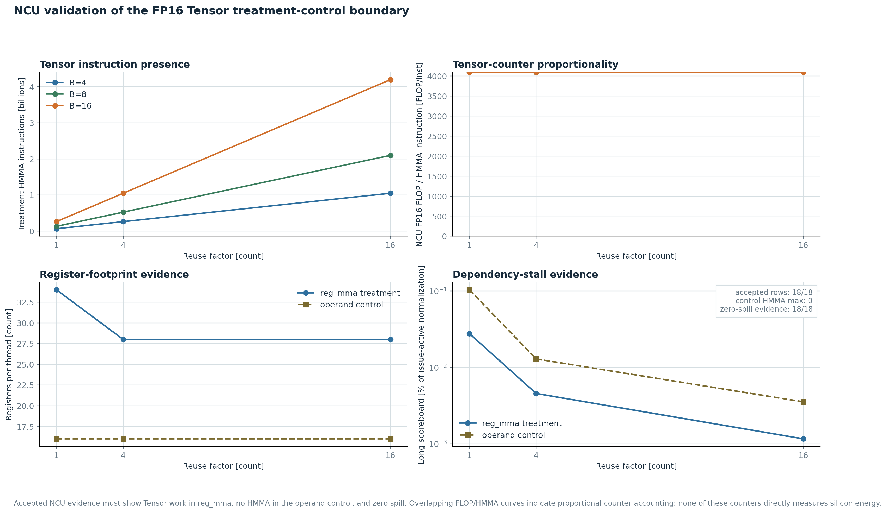

# RTX 3090 Component 동적 에너지 귀속 결과

- profile: `rtx3090`
- protocol: `component_dynamic_attribution_v3`

동일 ITER 완료는 직접 관측값이고 MI-ATC 및 공동회귀는 모델값이다. 어느 값도 순수 silicon-level component energy가 아니다.

> **Overall status: diagnostic only.** energy quiescence=skipped; NCU quiescence=skipped; repeat levels=1 (required 3). 이 package의 수치를 final coefficient로 승격하지 않는다.

## 실행 및 채택 판정

| Gate | Result | Interpretation |
|---|---:|---|
| explicit treatment-control pairs | 18/18 | manifest pair 구조 완료 |
| energy measurement gate | 17/18 | invalid: `active_baseline_drift_too_high:1` |
| NCU treatment/control path | 18/18 | quiescence: `skipped` |
| accepted final estimator | 0 | 0이면 수치를 final coefficient로 인용하지 않음 |

## Pair 시작 상태

각 treatment-control pair 직전에 runner가 관찰한 값이다. 이 표는 pre-run quiescence audit을 대체하지 않으며, `quiescence_status=skipped`이면 final acceptance 증거가 아니다.

| Metric | Min | Median | Max | Unit |
|---|---:|---:|---:|---|
| cooldown wait | 2.22313 | 6.03797 | 34.3439 | s |
| temperature | 41 | 46 | 48 | degC |
| power | 12.47 | 18.35 | 19.32 | W |
| GPU utilization | 0 | 0 | 1 | % |
| memory-controller utilization | 3 | 10.5 | 29 | % |

이번 실행은 각 pair 시작 전에 `power <= 35 W`, `temperature <= 48 degC`,
`GPU utilization <= 1%`, `memory-controller utilization <= 50%`를 1초 간격으로
3회 연속 만족하도록 기다렸다. 마지막 메모리 기준은 RDP/WSL 환경을 허용하기 위한
진단용 완화값이며 strict quiescence를 대체하지 않는다.

## 결과 시각화

## Parameter sweep과 선택 좌표

| Component | Treatment - control | Calibration | blocks/SM [blocks/SM] | W control -> treatment [KiB/SM] | Sweep factor [count] | Target duration [s] | Repeats [count] |
|---|---|---|---:|---:|---|---|---:|
| `tensor` | `reg_mma` - `reg_operand_only` | `factorial_grid` | 4, 8, 16 | 1 -> 1 | RF=1, 4, 16 | 5, 15 | 1 |

## 직접 차분과 활성시간 보정

`control_rate_atc`는 Tensor에서 operand-rate ATC와 같은 식이다. control의 단위시간당 net energy를 treatment 시간까지 확장해 제거하므로 control 상태가 treatment의 no-component 반사실을 잘 근사할 때만 유효하다.

| Component | Method | measurement-valid/total | positive/measurement-valid | Signed median | 95% bootstrap CI | Unit | Status |
|---|---|---:|---:|---:|---:|---|---|
| `tensor` | `matched_iter_completion` | 17/18 | 17/17 | 2.71965 | 2.49987-2.97678 | pJ/FLOP | `diagnostic_only_quiescence_unverified` |
| `tensor` | `mi_atc` | 17/18 | 17/17 | 0.840004 | 0.323423-1.07252 | pJ/FLOP | `diagnostic_only_quiescence_unverified` |
| `tensor` | `control_rate_atc` | 17/18 | 17/17 | 0.897204 | 0.833922-1.00849 | pJ/FLOP | `diagnostic_only_quiescence_unverified` |

## blocks/SM별 분포

| Component | B [blocks/SM] | Method | measurement-valid/total | positive/measurement-valid | Signed min | Signed median | Signed mean | Signed max | Unit | Status |
|---|---:|---|---:|---:|---:|---:|---:|---:|---|---|
| `tensor` | 4 | `matched_iter_completion` | 5/6 | 5/5 | 2.67919 | 2.9773 | 2.90741 | 3.1278 | pJ/FLOP | `diagnostic_only_quiescence_unverified` |
| `tensor` | 4 | `mi_atc` | 5/6 | 5/5 | 0.840004 | 0.950616 | 0.993305 | 1.22198 | pJ/FLOP | `diagnostic_only_quiescence_unverified` |
| `tensor` | 4 | `control_rate_atc` | 5/6 | 5/5 | 0.754525 | 0.897204 | 0.913503 | 1.02269 | pJ/FLOP | `diagnostic_only_quiescence_unverified` |
| `tensor` | 8 | `matched_iter_completion` | 6/6 | 6/6 | 2.2925 | 2.41358 | 2.41232 | 2.52658 | pJ/FLOP | `diagnostic_only_quiescence_unverified` |
| `tensor` | 8 | `mi_atc` | 6/6 | 6/6 | 0.738864 | 1.06756 | 1.00738 | 1.25081 | pJ/FLOP | `diagnostic_only_quiescence_unverified` |
| `tensor` | 8 | `control_rate_atc` | 6/6 | 6/6 | 0.872101 | 1.08447 | 1.09901 | 1.39706 | pJ/FLOP | `diagnostic_only_quiescence_unverified` |
| `tensor` | 16 | `matched_iter_completion` | 6/6 | 6/6 | 2.66538 | 2.88808 | 2.86152 | 3.00139 | pJ/FLOP | `diagnostic_only_quiescence_unverified` |
| `tensor` | 16 | `mi_atc` | 6/6 | 6/6 | 0.0207051 | 0.290771 | 0.223136 | 0.33968 | pJ/FLOP | `diagnostic_only_quiescence_unverified` |
| `tensor` | 16 | `control_rate_atc` | 6/6 | 6/6 | 0.415022 | 0.679139 | 0.668861 | 0.929233 | pJ/FLOP | `diagnostic_only_quiescence_unverified` |

## Tensor RF-duration 원인 분해

RF가 커져도 pJ/FLOP이 반드시 감소하지 않는다. 장시간 steady loop에서는 초기 fragment 준비 비용이 이미 충분히 상각되고, 아래 계수는 주로 treatment-control 전력 차와 실효 처리율의 비로 결정된다.

| B [blocks/SM] | RF [count] | duration [s] | valid/total | treatment/control/delta power [W] | throughput [TFLOP/s] | Direct | Clocked MI-ATC | Operand-rate ATC [pJ/FLOP] | Status |
|---:|---:|---:|---:|---:|---:|---:|---:|---:|---|
| 4 | 1 | 5 | 1/1 | 162.184/125.925/36.2591 | 40.7449 | 2.67919 | 0.874465 | 0.889903 | `diagnostic_low_sample` |
| 4 | 1 | 15 | 1/1 | 169.124/138.035/31.0886 | 41.2029 | 2.71965 | 0.840004 | 0.754525 | `diagnostic_low_sample` |
| 4 | 4 | 5 | 1/1 | 170.422/136.347/34.0746 | 33.9661 | 3.0331 | 1.07946 | 1.00319 | `diagnostic_low_sample` |
| 4 | 4 | 15 | 1/1 | 175.892/140.674/35.2175 | 34.4362 | 3.1278 | 1.22198 | 1.02269 | `diagnostic_low_sample` |
| 4 | 16 | 5 | 1/1 | 166.963/136.028/30.9352 | 34.4795 | 2.9773 | 0.950616 | 0.897204 | `diagnostic_low_sample` |
| 4 | 16 | 15 | 0/1 | -/-/- | - | - | - | - | `diagnostic_low_sample` |
| 8 | 1 | 5 | 1/1 | 206.501/138.812/67.6887 | 67.1188 | 2.2925 | 0.738864 | 1.00849 | `diagnostic_low_sample` |
| 8 | 1 | 15 | 1/1 | 216.18/155.83/60.3493 | 69.1999 | 2.32782 | 0.743699 | 0.872101 | `diagnostic_low_sample` |
| 8 | 4 | 5 | 1/1 | 230.066/144.284/85.7824 | 61.4022 | 2.49987 | 1.25081 | 1.39706 | `diagnostic_low_sample` |
| 8 | 4 | 15 | 1/1 | 238.787/179.601/59.1856 | 62.917 | 2.39139 | 1.07252 | 0.940694 | `diagnostic_low_sample` |
| 8 | 16 | 5 | 1/1 | 228.528/151.891/76.6367 | 63.062 | 2.43577 | 1.06259 | 1.21526 | `diagnostic_low_sample` |
| 8 | 16 | 15 | 1/1 | 241.07/166.836/74.2338 | 63.9703 | 2.52658 | 1.17578 | 1.16044 | `diagnostic_low_sample` |
| 16 | 1 | 5 | 1/1 | 206.264/145.179/61.0857 | 65.7378 | 2.66538 | 0.0734663 | 0.929233 | `diagnostic_low_sample` |
| 16 | 1 | 15 | 1/1 | 219.164/191.447/27.717 | 66.7845 | 2.74939 | 0.0207051 | 0.415022 | `diagnostic_low_sample` |
| 16 | 4 | 5 | 1/1 | 225.981/173.506/52.4745 | 61.4759 | 2.85847 | 0.277165 | 0.853578 | `diagnostic_low_sample` |
| 16 | 4 | 15 | 1/1 | 246.382/213.404/32.9777 | 62.8918 | 3.00139 | 0.304377 | 0.524356 | `diagnostic_low_sample` |
| 16 | 16 | 5 | 1/1 | 223.421/172.933/50.4877 | 60.5424 | 2.91769 | 0.323423 | 0.833922 | `diagnostic_low_sample` |
| 16 | 16 | 15 | 1/1 | 240.962/212.26/28.7021 | 62.7979 | 2.97678 | 0.33968 | 0.457055 | `diagnostic_low_sample` |

## Bytes/FLOP-time 공동회귀

| Component | Rows | Factor/B/duration/order/repeat levels | Coefficient | 95% CI | time beta (W) | corr | R2 | Status |
|---|---:|---:|---:|---:|---:|---:|---:|---|
| `tensor` | 17 | 3/3/2/2/1 | not identified | - | 104.459 | -0.0616231 | 0.996309 | `not_identified` |

## Binary provenance

| Evidence | Value |
|---|---|
| energy SHA-256 | `500bcb73a3dffebc92f041072ccba3ff5f4f85a836e045ba6eff9715cdb99862` |
| NCU SHA-256 | `500bcb73a3dffebc92f041072ccba3ff5f4f85a836e045ba6eff9715cdb99862` |
| NCU hash capture | `pre_post_collection_verified` |
| NCU quiescence | `skipped` |
| energy/NCU binary identity | `verified` |

이 바이너리는 CUDA 13.2 `nvcc`, `sm_86`으로 빌드했다. Runtime NCU는 위 동일
SHA-256에 대해 treatment HMMA와 control HMMA=0을 검증했다. 로컬에서 사용 가능한
정적 분석기는 CUDA 12.3 `cuobjdump`뿐이라 CUDA 13.2 fatbin을 읽지 못했으므로,
최종 바이너리의 별도 static SASS audit은 `blocked`다. Runtime counter 검증이 이
정적 audit 결측을 final package에서 대체한다고 해석하면 안 된다.

## blocks/SM별 NCU 경로 요약

| Component | B [blocks/SM] | Rows | Operation/access median | Bytes median [B] | Path hit [%] | Long scoreboard |
|---|---:|---:|---:|---:|---:|---:|
| `tensor` | 4 | 3 | tensor_fp16_f32_ops=1.07479e+12 | - | - | 0.003405 |
| `tensor` | 8 | 3 | tensor_fp16_f32_ops=2.14958e+12 | - | - | 0.00454 |
| `tensor` | 16 | 3 | tensor_fp16_f32_ops=4.29916e+12 | - | - | 0.007164 |

## NCU 경로와 분모 원본 증거

| Component | Role/mode | NCU status | Ops | Shared access/bytes | L1 access/bytes/hit | L2 access/bytes/hit | External access/bytes | Long scoreboard |
|---|---|---|---:|---:|---:|---:|---:|---:|
| `tensor` | control/`reg_operand_only` | `accepted` | 0 | 0/0 | 0/0/% | 0/0/% | 0/0 | 0.111272 |
| `tensor` | control/`reg_operand_only` | `accepted` | 0 | 0/0 | 0/0/% | 0/0/19.1785% | 1.96207e+06/6.15306e+07 | 0.011123 |
| `tensor` | control/`reg_operand_only` | `accepted` | 0 | 0/0 | 0/0/% | 0/0/% | 517544/1.65614e+07 | 0.014262 |
| `tensor` | control/`reg_operand_only` | `accepted` | 0 | 0/0 | 0/0/% | 0/0/% | 144/4608 | 0.074362 |
| `tensor` | control/`reg_operand_only` | `accepted` | 0 | 0/0 | 0/0/% | 0/0/% | 1.6871e+06/5.39872e+07 | 0.002861 |
| `tensor` | control/`reg_operand_only` | `accepted` | 0 | 0/0 | 0/0/% | 0/0/% | 619732/1.98314e+07 | 0.009351 |
| `tensor` | control/`reg_operand_only` | `accepted` | 0 | 0/0 | 0/0/% | 0/0/% | 4/128 | 0.103442 |
| `tensor` | control/`reg_operand_only` | `accepted` | 0 | 0/0 | 0/0/% | 0/0/% | 1.86038e+06/5.95322e+07 | 0.00353 |
| `tensor` | control/`reg_operand_only` | `accepted` | 0 | 0/0 | 0/0/% | 0/0/% | 619808/1.98339e+07 | 0.012863 |
| `tensor` | treatment/`reg_mma` | `accepted` | 1.07479e+12 | 0/0 | 0/0/% | 0/0/% | 621128/1.98761e+07 | 0.027634 |
| `tensor` | treatment/`reg_mma` | `accepted` | 1.71966e+13 | 0/0 | 0/0/% | 0/0/% | 8.01563e+06/2.56455e+08 | 0.001275 |
| `tensor` | treatment/`reg_mma` | `accepted` | 4.29916e+12 | 0/0 | 0/0/% | 0/0/% | 1.93098e+06/6.17894e+07 | 0.007164 |
| `tensor` | treatment/`reg_mma` | `accepted` | 2.68698e+11 | 0/0 | 0/0/% | 156073/4.99434e+06/% | 173136/487296 | 0.053965 |
| `tensor` | treatment/`reg_mma` | `accepted` | 4.29916e+12 | 0/0 | 0/0/% | 0/0/% | 3.58077e+06/1.14585e+08 | 0.000877 |
| `tensor` | treatment/`reg_mma` | `accepted` | 1.07479e+12 | 0/0 | 0/0/% | 0/0/% | 619724/1.98312e+07 | 0.003405 |
| `tensor` | treatment/`reg_mma` | `accepted` | 5.37395e+11 | 0/0 | 0/0/% | 0/0/% | 452724/1.44872e+07 | 0.026176 |
| `tensor` | treatment/`reg_mma` | `accepted` | 8.59832e+12 | 0/0 | 0/0/% | 0/0/% | 4.13326e+06/1.32264e+08 | 0.001157 |
| `tensor` | treatment/`reg_mma` | `accepted` | 2.14958e+12 | 0/0 | 0/0/% | 0/0/% | 779352/2.49393e+07 | 0.00454 |

## 해석 규칙

- Direct/MI-ATC/control-rate ATC min/median/mean/max/CI는 measurement gate를 통과한 signed row 전체를 사용한다. CI는 coordinate 단위 cluster bootstrap이며 음수 row를 제외한 양수 조건부 coefficient를 보고하지 않는다.
- `positive/measurement-valid < 0.8`이면 부호 불안정으로 reject하고 음수를 0으로 잘라내지 않는다. 전체가 통과해도 각 blocks/SM subgroup이 같은 부호 gate를 통과하지 못하면 단일 전체값을 reject한다.
- 공동회귀는 blocks/SM, RF/LR, execution order, repeat 고정효과와 coordinate-cluster bootstrap을 사용한다.
- Tensor MI-ATC는 동적 MMA 경로의 surrogate이며 RF/scheduler switching이 남는다.
- Tensor control-rate ATC는 operand-rate ATC다. RF별 control power와 treatment throughput이 함께 변하므로 RF ordering을 silicon Tensor energy ordering으로 직접 해석하지 않는다.
- Shared/Global L1은 직접 차분과 MI-ATC를 유지하고 공동회귀가 식별될 때만 회귀 계수를 추가 채택한다.
- L2와 External은 address-only가 아니라 각각 Global-L1과 L2의 인접 계층 control을 사용한다.
- External 결과는 memory controller와 PHY/link를 포함하며 physical DRAM-only energy가 아니다.
- `stall_long_scoreboard_pct`는 전체 실행시간 중 stall 비율이 아니라 issue-active 기준 stalled warp 정규화값이다. 여러 warp가 동시에 대기하면 100%를 넘을 수 있으므로 단순 시간 비율로 읽지 않는다.
