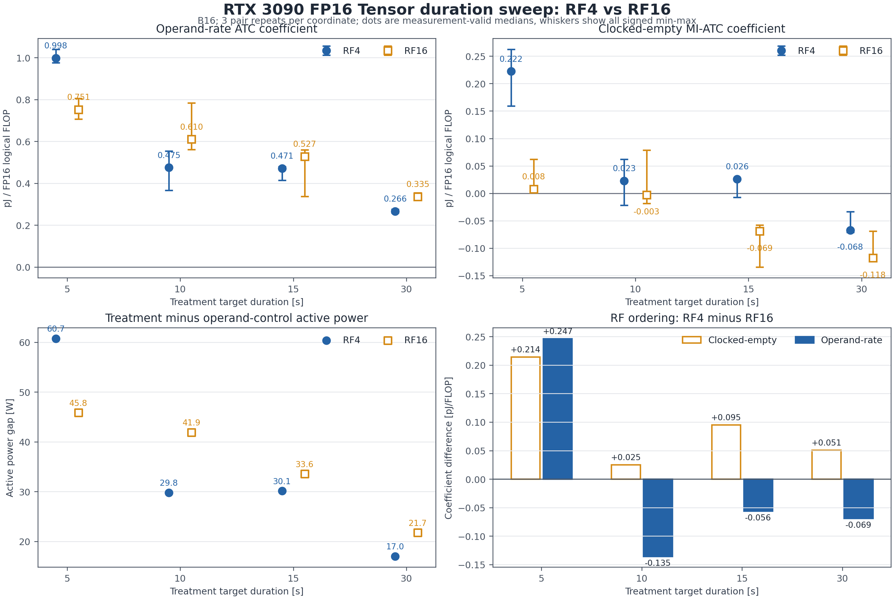

# RTX 3090 FP16 Tensor RF4/RF16 2026-07-21 결과 연결

이 경로는 2026-07-21 RF4/RF16 실험을 찾는 기존 링크를 위한 호환 문서다.
실험 행렬, duration별 수치와 품질 판정은
[원본 duration-sweep 보고서](rtx3090_tensor_fp16_clocked_vs_operand_atc_duration_sweep_20260721_ko.md)에,
원인 분석과 교차 플랫폼 v3 재실험 설계는
[2026-07-22 재해석 보고서](rtx3090_tensor_rf4_rf16_reuse_interpretation_20260722_ko.md)에 있다.

이 그림과 두 보고서가 사용하는 값은 동일한 5/10/15/30초 결합 summary를 근거로 한다.
그림은 진단 결과이며 final Tensor silicon energy를 의미하지 않는다.
