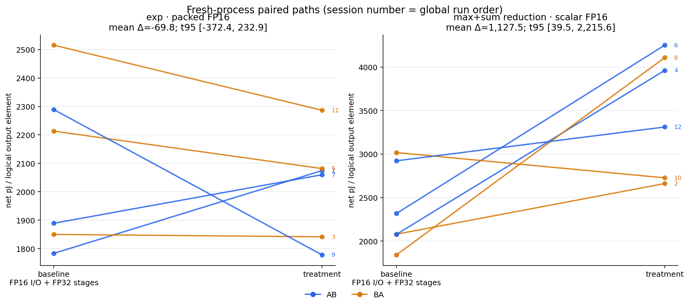
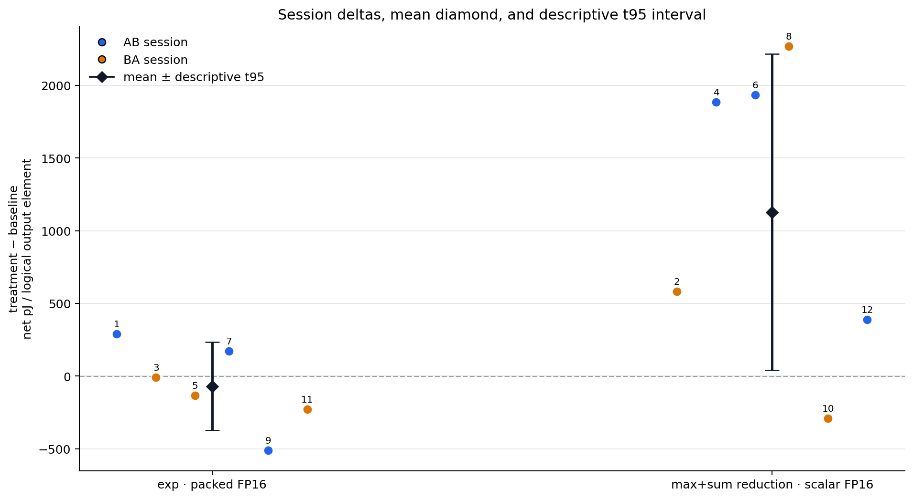
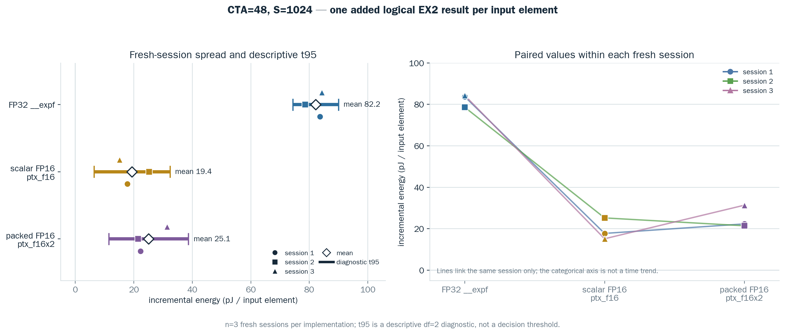
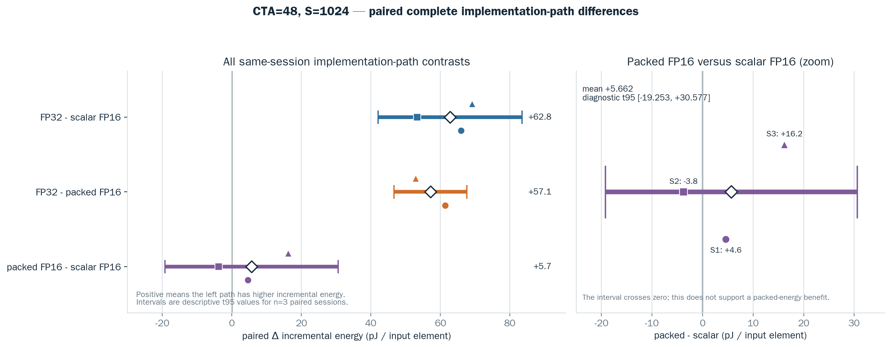

# FP16 Softmax: Operand-rate ATC와 전체 정밀도 단계 분리 기록

작성일: 2026-07-22 / 최종 갱신: 2026-07-28

상태: direct native FP16 PTX 구현과 RTX 3090 수치/SASS/NCU 검증 완료 /
사전 지정한 implementation 3 × CTA 4 × Softmax S 5의 **기준/재연 matrix가
각각 60/60 품질 통과** / 같은 frozen binary·좌표·순서·조건의 절차·데이터
재연성 `pass` / 기준→재연 전체 평균 38.763→39.927, 좌표 MAE 28.405,
Pearson/Spearman 0.416/0.466, point-sign 50/60, standalone verdict 45/60 /
사전등록한 수치 동등성 한계가 없어 numerical agreement는 기술적 결과이며 보편
coefficient·factor 인과효과는 미확정 / RTX 3090 whole-stage Operand-rate ATC v2
162/162 measured role, static specialization 9/9, NCU 18 launch·9 pair 통과 /
A100은 현행 short-row source를 실제
장치에서 재빌드·검증하지 않았고 **runtime energy·NCU는
`not_run_no_a100_device`**

## 이 문서의 두 Softmax 에너지 추정량

이 문서에서 다음 두 지표는 이름과 식을 함께 써서 구분한다.

| 구분 | 정확한 이름 | 계산 | 포함 범위 |
|---|---|---|---|
| A | **absolute idle-subtracted complete-Softmax net pJ/logical output** | `(qualified NVML trace energy - idle power × elapsed) × 1e12 / logical_output_elements` | max/subtract, exp, max+sum, normalization, I/O와 공통 실행 overhead를 포함한 complete forward의 board-level endpoint |
| B | **`active-control Operand-rate ATC delta pJ per logical Softmax output element for one added <stage> pass`** | 시간 보간한 `(treatment power - active-control power) / treatment added-output rate` | 동일한 active Softmax 위에 지정 stage pass 하나를 추가한 board-level signed rate projection |

A의 `net`은 idle 전력만 차감했다는 뜻이며 treatment-control 차감이라는 뜻이
아니다. 반대로 B에서는 role 전 idle 측정을 진단값으로만 기록하고 primary ATC
numerator에는 넣지 않는다. 두 분모가 수치상 processed element 수와 같을 수 있어도
회계 대상은 A의 complete output과 B의 added-stage output으로 서로 다르다.

기존 `82.164 / 19.393 / 25.055`는 B의 **EX2-only**
`ΔpJ/added logical EX2 result`다. 수천 pJ의 complete-Softmax 값은 A이며 계산
오류로 단위가 커진 것이 아니다.

### Whole-stage Operand-rate ATC 공식 RTX 3090 run (2026-07-28)

완료 run
[`rtx3090_softmax_whole_stage_atc_20260728_operand_rate_v2_final`](results/raw/rtx3090_softmax_whole_stage_atc_20260728_operand_rate_v2_final/manifest.json)은
`S=1024`, grid 41 CTA(q50), 256 threads/CTA, 2 rows/CTA, 5초 preheat에서
3 stage × 3 implementation × fresh 3 session의 162 measured role을 모두
통과했다. 아래 값은 **mean ± sample SD; [descriptive t95]**이고 단위는
manifest/CSV의 정확한 `primary_estimand` template인
**`active-control Operand-rate ATC delta pJ per logical Softmax output element
for one added <stage> pass`**다.

| Added stage | FP32 | scalar FP16 | packed FP16x2 |
|---|---:|---:|---:|
| Exp | +34.978 ± 127.818; [−282.539, +352.494] | +16.335 ± 34.846; [−70.228, +102.897] | +12.169 ± 32.096; [−67.561, +91.900] |
| Max + sum reduction | −600.909 ± 103.083; [−856.981, −344.836] | −700.436 ± 116.748; [−990.453, −410.419] | −473.433 ± 51.194; [−600.606, −346.260] |
| Normalization | +34.630 ± 98.027; [−208.883, +278.143] | +47.067 ± 15.392; [+8.832, +85.302] | −52.910 ± 13.889; [−87.414, −18.407] |

> **Reduction의 음수값을 음의 물리적 에너지나 stage 원가로 읽으면 안 된다.**
> 이 값은 treatment 평균 전력이 control보다 낮고 treatment runtime은 더 길었던
> 관측을 active-control power contrast와 treatment output rate로 결합한 signed
> Operand-rate projection이다. GPU가 에너지를 생성했다는 뜻도 아니며, 세 stage
> 값을 합해 complete-Softmax 절대 에너지를 복원할 수도 없다.

Role 전 idle은 상태 진단용으로만 기록했으며 primary ATC numerator에 사용하지
않았다. Packed FP16x2의 logical denominator는 두 scalar lane을 이미 모두 세므로
추가 `/2` 보정은 없다. Exact frozen sm86 binary는 static audit 9/9
specialization과 NCU dynamic instruction audit 18/18 launch·9/9 C/T pair를
통과했다. NCU는 instruction delta 확인에만 썼고 energy는 포함하지 않았다.
에너지 입력은 NVML total-energy trace다.

전체 결과와 Matplotlib 산포 그림은
[완료 보고서](docs/results/rtx3090_softmax_whole_stage_atc_20260728_operand_rate_v2_final_ko.md)에
있다. 보고서에는 Operand-rate ATC를 primary로 유지한 채 같은 좌표의
**non-primary same-ITER gross board-energy diagnostic**도 별도 표기했다.
Reduction의 FP32/scalar FP16/packed FP16x2 진단값은 각각
`+1,826.390 / +3,530.892 / +1,423.060 pJ/logical output`이고 18/18 bracket이
양수였다. 이 진단은 음수 ATC가 음의 물리적 에너지를 뜻하지 않음을 보여주지만,
complete Softmax 공통 작업의 추가 runtime까지 포함하므로 pure stage 원가가
아니다. 후속은 두 추정량을 분리한 채 논쟁 cell만 fixed-clock에서 targeted
재측정한다. CTA×S 전체 sweep을 다시 여는 것은 권하지 않는다.

raw CSV를 식에서 독립 재계산한 결과도 이를 확인한다. Stage-isolation 27/27 row와
range screen/follow-up 63/63 row에서
`logical_output_elements = grid × rows_per_CTA × ITER × S`가 모두 일치했고,
저장된 A 값과 재계산값의 최대 절대 차이는 각각
`8.96e-8`, `8.64e-8 pJ/logical output`이었다. 예를 들어
stage-isolation exp session 1 FP32는
`(2068.5499197 J - 112.851732425 W × 13.4831689453 s) × 1e12
/ 181685796864 = 3010.4221413 pJ/logical output`이다. 즉 수천 pJ와 수십 pJ의
차이는 `10^3` 변환이나 packed 분모 누락이 아니라 A와 B의 numerator 차이다.

## EX2 Operand-rate ATC cross-platform 확장 상태 (2026-07-27)

이 절은 `a100_fp16_softmax_energy`의 **추가 EX2 operand-rate probe**에만 적용한다.
이는 아래의 complete-Softmax 정밀도 단계 분리 binary, A의 absolute
idle-subtracted complete-Softmax 지표, FP16 reduction/normalization 해석을
cross-platform으로 보장하지 않는다. 다른 GPU에서의
probe 재현은 [Cross-platform Softmax EX2 실험 실행 가이드](docs/platforms/cross_platform_softmax_ex2_experiment_guide_ko.md)를 기준으로 한다. 실행 package는 `scripts/plan_softmax_cross_platform_ex2.py`가 생성하며, 이 문서의 fp32 조건은 Tensor Core FP32가 아닌 scalar FP32 `__expf` baseline이다.

| profile | 실행 범위 | 결과 해석 |
|---|---|---|
| V100 / sm_70 | CUDA 12.x에서 fp32 4 CTA × 5 S baseline만 실행; native FP16 EXP2 두 구현은 skip | FP32-only이며 3-way 비교 또는 0 pJ native 행으로 쓰지 않음 |
| A100 / sm_80 | 3 implementation × CTA 16/32/48/64 × S 128/256/512/1024/2048 | 별도 cross-platform protocol; target-native NCU 전에는 native final claim이 아님 |
| H100 / sm_90 | 같은 60-cell energy matrix | sm90 provisional SASS audit과 target-native NCU 전에는 preliminary이며 final ranking에 넣지 않음 |

이 표는 구현·실행 계획의 지원 범위이지 A100/H100 target-node에서 이미 얻은 측정값이 아니다.

모든 platform은 GPU/device total-energy counter와 동일한 logical scalar exponent-result 분모를 사용하되, raw row와 binary/UUID/PCI/NCU evidence를 platform 간에 pool하지 않는다.

## RTX 3090 전체 Softmax 정밀도 단계 분리 (2026-07-27)

당초의 `ptx_f16`, `ptx_f16x2`, `__expf` 비교는 같은 Softmax shell 안에 추가 EX2를
삽입한 operand-rate probe였다. 따라서 그것만으로는 complete Softmax의 `exp`,
`max+sum reduction`, `normalization` 중 어느 단계가 energy 차이에 기여하는지 말할 수
없다. 이를 분리하기 위해 새 binary
`a100_fp16_softmax_whole_precision_energy`를 추가했다. 이 binary는 stabilized
row-wise Softmax 전체를 계산하며, FP16 I/O를 고정한 뒤 한 단계만 변경한다.

| stage group | FP32 기준 정책 | scalar FP16 treatment | packed FP16 treatment |
|---|---|---|---|
| `exp` | `fp16_io_fp32_all` | `exp_fp16_scalar` | `exp_fp16x2` |
| `max+sum reduction` | `fp16_io_fp32_all` | `reduction_fp16_scalar` | `reduction_fp16x2` |
| `normalization` | `fp16_io_fp32_all` | `normalization_fp16_scalar` | `normalization_fp16x2` |

`fp32_io_fp32_all`, `fp16_scalar_all`, `fp16x2_all`은 수치 endpoint로 별도
`--validate-only`를 통과했지만, stage effect와 all-FP16 endpoint 차이를 더해
예측하지 않는다. nonlinear rounding, scheduling, shared-memory traffic가 있으므로
그런 가법성은 이 설계의 가정이 아니다.

### 구현 의미와 SASS 경계

- `exp`는 inline `ex2.approx.f16` / `ex2.approx.f16x2` PTX다. 다만 frozen
  CUDA 13.2 RTX 3090 sm86 binary에서는 두 정책 모두 네 개의 scalar
  `MUFU.EX2.F16`로 lowering됐다. `f16x2` PTX 하나를 physical 2-result issue나
  반 에너지로 해석하지 않는다.
- scalar reduction은 scalar `max.f16`/`add.f16` PTX를 사용한다. sm86 SASS에서는
  `HMNMX2`/`HADD2`의 `.H0_H0` lane replication으로 lowering된다. packed reduction은
  `*.f16x2` PTX와 half2 lane을 쓰되, **한 row 안의 두 원소를 묶는 방식이 아니라
  서로 독립된 두 CTA row를 lane에 배치**한다. 따라서 vector reduction의 의미를
  과장하지 않는다.
- normalization scalar/packed policy의 reciprocal은 native FP16 RCP가 아니다.
  `hrcp(half)`는 FP32 reciprocal (`MUFU.RCP`) 후 FP16 round로 lowering되며,
  policy 차이는 그 뒤 scalar half 또는 half2 probability multiply에 있다.

동일 shared-memory scratch를 다음 reduction에 재사용하기 전, 마지막 consumer가
읽은 뒤 `__syncthreads()`를 두어 scalar path race도 제거했다. SASS audit은 exp PTX
형태와 lowering, reduction lane semantics, reciprocal lowering을 binary에서
fail-closed로 확인한다.

### 제한된 RTX 3090 재현 결과

`S=512`, `CTA=16`, 256 threads/CTA, two rows/CTA, GPU 0 RTX 3090(sm86)를
고정했다. 각 stage는 3개의 fresh CUDA-process session으로 실행했고 순서는
`ABC → CAB → BCA`로 회전했다. session마다 baseline 20초 preheat를 한 번 수행했다.
그 뒤 schedule 순서의 policy calibration과 unrecorded full-policy warm-up이 같은 순서로
실행됐다. position은 회전하지만 directed carryover를 완전 counterbalance하지 않으므로,
이 conditioning의 thermal/scheduling effect를 stage effect로 분리하지 않고 결과를
descriptive로만 해석한다.
energy trace, SMID placement, numerical output, binary/script hash gate를 27/27
role에서 통과했다. 주 지표는 NVML GPU/device total-energy trace에서 계산한 A,
즉 **absolute idle-subtracted complete-Softmax net pJ/logical output**이다.
이는 EX2 probe의 B인 `paired incremental ΔpJ/added logical EX2 result`와 다른
estimand다.

| 변경 단계 | FP16 I/O + FP32-stage baseline mean | scalar FP16 mean | scalar Δ | packed FP16 mean | packed Δ |
|---|---:|---:|---:|---:|---:|
| `exp` | 2453.8 | 2091.7 | −362.1 | 1941.9 | −512.0 |
| `max+sum reduction` | 2086.2 | 3345.3 | +1259.2 | 2084.4 | −1.8 |
| `normalization` | 2158.1 | 2515.1 | +357.0 | 2415.8 | +257.7 |

표의 endpoint 값은 모두 A의
`absolute idle-subtracted complete-Softmax net pJ/logical output`이고, Δ는 같은
fresh session에서 그 A 값을 FP16 I/O + FP32-stage baseline과 비교한 mean paired
endpoint contrast다. 이는 added-stage pass를 넣는 B의 Operand-rate ATC가 아니다.
모든 contrast의 `n=3` descriptive t95
interval이 0을 포함한다. 따라서 위 부호를 성능/energy 개선의 확정이나 scalar·packed
선택 근거로 쓰지 않는다. 제한된 후속 확인이 필요하다면 CTA/S 전체 sweep 대신 같은
좌표에서 `exp packed vs baseline`, `reduction scalar vs baseline` 두 AB/BA pair만
추가 fresh session으로 재측정하는 것이 우선이다.

- [분석 보고서](docs/results/rtx3090_softmax_whole_precision_stage_isolation_20260727_stageiso_v1_analysis_ko.md)
- [Interactive report](docs/results/rtx3090_softmax_whole_precision_stage_isolation_20260727_stageiso_v1_report.html)
- [Matplotlib figures / 재생성](docs/assets/softmax_whole_precision_stage_isolation/README.md)
- [QA와 artifact 검증 범위](docs/results/rtx3090_softmax_whole_precision_stage_isolation_20260727_stageiso_v1_report_qa.md)

### 재실행

```bash
source scripts/activate_softmax_experiment_env.sh
cmake -S . -B build-whole-precision-rtx3090 \
  -DCMAKE_BUILD_TYPE=Release -DCMAKE_CUDA_ARCHITECTURES=86
cmake --build build-whole-precision-rtx3090 \
  --target a100_fp16_softmax_whole_precision_energy -j

python3 scripts/run_softmax_whole_precision_stage_isolation.py \
  --build-dir build-whole-precision-rtx3090 \
  --output-dir results/raw --session-tag "$(date +%Y%m%d)_stageiso" --execute
```

실행 뒤 analyzer, Matplotlib, SASS audit, report builder 순서와 immutable
manifest/hash gate는 [Scripts Map](scripts/README.md)에 정리했다.

### 제한된 fresh AB/BA confirmation — broad CTA/S sweep 대신 variance를 먼저 점검 (2026-07-27)

위 stage-isolation의 `n=3` cyclic schedule은 후보를 고르는 탐색 결과로만 남겼다.
새 confirmation은 그 데이터를 합치지 않고, 다음 두 contrast만 새 CUDA process에서
각각 AB 3회 + BA 3회(`n=6` paired session)로 재측정했다.

| candidate | baseline | treatment | 선택 이유 |
|---|---|---|---|
| exp packed | `fp16_io_fp32_all` | `exp_fp16x2` | 탐색의 packed exp 평균 Δ가 가장 음수였음 |
| reduction scalar | `fp16_io_fp32_all` | `reduction_fp16_scalar` | 탐색의 scalar reduction 평균 Δ가 가장 양수였음 |

기준 좌표는 RTX 3090 sm86, `S=512`, grid `CTA=16`, CTA당 독립 row 2개,
logit scale 4, role당 13 s, idle baseline 1 s다. 각 새 process에서 두 policy의
수치 validation과 iteration calibration을 **measurement order와 독립적인 canonical
enum 순서로 먼저** 끝낸 뒤, baseline `fp16_io_fp32_all`만 20 s common conditioner로
실행한다. 이어서 기록되지 않는 policy warm-up 없이 AB 또는 BA의 원래 두-role
schedule을 측정한다. 즉 기존 stage-isolation의 `ABC/CAB/BCA` carryover 한계를
후속 후보 확인에 그대로 가져오지 않았다.

모든 12 process/24 role은 frozen executable SHA
`ad33175b238804b97aaab77afe4de665215bd786e5e7c637c5f789ae41b5f2a9`, raw/trace
SHA, canonical conditioning metadata, SMID placement, FP64-reference numerical
gate와 qualified trace를 통과했다. actual conditioner는 19.878–19.976 s, trace
R²는 0.999714829–0.999955990, 기록 온도 범위는 52–57 °C다. 온도는 context로
남겼으며 hard reject나 causal correction에는 쓰지 않았다. 같은 frozen binary의
whole-Softmax sm86 PTX/SASS audit도 `--fail-on-unexpected`로 통과했다.

| candidate | baseline mean | treatment mean | mean treatment−baseline Δ | descriptive t95 | Δ < 0 / Δ > 0 | 이 좌표에서의 결정 |
|---|---:|---:|---:|---:|---:|---|
| exp packed | 2,090.0 | 2,020.2 | −69.8 | [−372.4, 232.9] | 4 / 2 | 0을 포함하므로 energy-saving endpoint로 승격하지 않음 |
| reduction scalar | 2,376.2 | 3,503.7 | +1,127.5 | [39.5, 2,215.6] | 1 / 5 | 관측된 비용 증가이므로 endpoint/CTA/S sweep으로 확대하지 않음 |

endpoint와 contrast의 회계 단위는 모두 A의 **absolute idle-subtracted
complete-Softmax net pJ/logical output**이다. descriptive t95는
후보 선택 뒤의 작은 `n=6` 요약이지 population-wide p-value 또는 cross-platform
ranking이 아니다. 특히 packed exp의 평균 부호만 보고 개선이라 부르면 안 된다.
반대로 scalar reduction의 양수 구간은 이 **고정 좌표·구현 경계**에서 그 후보를
다음 endpoint 실험으로 밀어 올릴 근거가 없다는 뜻이지 pure ALU/reduction 회로
에너지를 측정했다는 뜻은 아니다.





따라서 다음 개선은 CTA/S를 다시 넓게 sweep하는 것이 아니다. packed exp를 꼭
판별해야 할 필요가 생길 때만 같은 좌표에서 fixed-clock 또는 external-meter
sensitivity run으로 residual variance source를 분리한다. scalar reduction은 이
좌표에서 더 이상 후보로 확장하지 않는다.

- [fail-closed analysis/report source](docs/results/rtx3090_softmax_whole_precision_targeted_confirmation_20260727_abba_confirm_v1_analysis_ko.md)
- [portable HTML report](docs/results/rtx3090_softmax_whole_precision_targeted_confirmation_20260727_abba_confirm_v1_report.html)
- [report artifact](docs/results/rtx3090_softmax_whole_precision_targeted_confirmation_20260727_abba_confirm_v1_artifact.json)
- [report QA](docs/results/rtx3090_softmax_whole_precision_targeted_confirmation_20260727_abba_confirm_v1_report_qa.md) — Chromium 부재로 structural verification만 수행
- [Matplotlib figure inventory / 재생성](docs/assets/softmax_whole_precision_targeted_confirmation/README.md)
- [raw manifest and bound SASS evidence](results/raw/rtx3090_softmax_whole_precision_targeted_confirmation_20260727_abba_confirm_v1/manifest.json)

재실행은 dedicated confirmation binary를 사용한다. binary 이름만으로 mode가
compile-time 고정되는 것은 아니며, frozen runner가 `--confirmation-pair`, canonical
conditioning 및 exact AB/BA schedule contract를 모두 넘기고 C++ CLI가 이를
검증한다. 새 runner의 common baseline preheat는 session당 **5 s**다. 기존 2026-07-27
20 s artifact는 역사적 결과로 보존하며 새 run과 pool하지 않는다.

```bash
source scripts/activate_softmax_experiment_env.sh
cmake -S . -B build-whole-precision-confirmation-rtx3090 \
  -DCMAKE_BUILD_TYPE=Release -DCMAKE_CUDA_ARCHITECTURES=86
cmake --build build-whole-precision-confirmation-rtx3090 \
  --target a100_fp16_softmax_whole_precision_confirmation_energy -j

TAG="$(date +%Y%m%d)_abba_confirm_v1"
"$GPUPWR_PYTHON_BIN" scripts/run_softmax_whole_precision_targeted_confirmation.py \
  --build-dir build-whole-precision-confirmation-rtx3090 \
  --output-dir results/raw --session-tag "$TAG" --gpu-id 0 --execute
RUN="results/raw/rtx3090_softmax_whole_precision_targeted_confirmation_$TAG"

"$GPUPWR_PYTHON_BIN" scripts/audit_softmax_whole_precision_sass.py \
  --binary "$RUN/frozen/a100_fp16_softmax_whole_precision_confirmation_energy" \
  --cuobjdump "$CUOBJDUMP" --out "$RUN/sass_audit.json" --fail-on-unexpected
"$GPUPWR_PYTHON_BIN" scripts/bind_softmax_whole_precision_confirmation_sass.py \
  --run-dir "$RUN" --sass-audit "$RUN/sass_audit.json"
"$GPUPWR_PYTHON_BIN" scripts/analyze_softmax_whole_precision_targeted_confirmation.py \
  --run-dir "$RUN"
"$GPUPWR_PYTHON_BIN" scripts/plot_softmax_whole_precision_targeted_confirmation.py \
  --run-dir "$RUN" --out-dir docs/assets/softmax_whole_precision_targeted_confirmation
FIG="docs/assets/softmax_whole_precision_targeted_confirmation/rtx3090_softmax_whole_precision_targeted_confirmation_${TAG}_figure_manifest.json"
"$GPUPWR_PYTHON_BIN" scripts/build_softmax_whole_precision_targeted_confirmation_report.py \
  --run-dir "$RUN" --out-dir docs/results --figure-manifest "$FIG"
```

## Complete-Softmax FP32 / FP16 / FP16x2 범위 screen (2026-07-28)

EX2 Operand-rate ATC의 B,
`paired incremental ΔpJ/added logical EX2 result`와 stage-isolation의 고정
`S=512` 결과는 complete-Softmax endpoint의 범위를 답하지 않는다. 그래서 새
`a100_fp16_softmax_whole_precision_range_energy` target은 FP32, scalar FP16,
packed FP16x2가 max/subtract, exp, reduction, normalization, I/O를 모두 수행하는
endpoint만 비교한다. 주 지표는 A인 **absolute idle-subtracted complete-Softmax
net pJ/logical output**이다. Packed FP16x2도 두 scalar output을 이미 분모에
포함하므로 packed 수치를 다시 2로 나누지 않는다.

처음부터 CTA×S factorial sweep을 하지 않는다. `S=512,q50`, `S=1024,q50`
(사전 고정 representative), `S=4096,q50`, `S=1024,q25` 네 좌표만 사용하고,
10% practical gate가 실패할 때만 `S=2048,q50` 또는 q25 양 끝점을 추가한다.
256-thread CTA에서 thread는 `S/256`개의 **연속 column chunk**를 맡는다. 따라서
packed exp/normalization의 half2는 같은 row의 인접 원소를 묶고, packed reduction의
half2 lane은 기존과 같이 서로 독립적인 두 CTA row를 묶는다.

new fresh session의 common FP32 conditioner는 요청 **5 s**이며, actual은
3.75–6.25 s여야 한다. `q=25%/50%`도 단순 grid/SM 요청비가 아니라 initial
screen에서 `smid_unique=grid_blocks`, `smid_max_blocks_on_sm=1`의 runtime
placement gate를 통과해야 한다. RTX 3090/A100/H100은 3-way이고, V100은 native
FP16 EX2가 sm_75 이상이라 CUDA 12.x sm70 build에서 FP32-only로 명시한다.

설계, 플랫폼별 CTA, adaptive 분석 및 실행 명령은
[Whole-Softmax precision range protocol](docs/methodology/softmax_whole_precision_range_protocol_ko.md)에
있다. 이 새 5 s cohort는 기존 20 s 역사 artifact와 pool하지 않는다.

RTX 3090에서는 initial 4좌표(36 role) 뒤 두 10% gate가 모두 trigger되어,
사전 규칙에 따라 `S=2048,q50`, `S=512,q25`, `S=4096,q25`만 27 role 추가했다.
parent/child manifest, frozen binary/runner, raw/trace SHA, target-native PTX/SASS
audit, numerical/trace/SMID/denominator gate를 결합 검증한 최종 screened 결과는 다음과
같다. 지표는 모두 A의 **absolute idle-subtracted complete-Softmax net
pJ/logical output**이고 각각 fresh 3-session
median이다.

| endpoint | screened best (absolute net pJ/logical output) | 사전 고정 representative `S=1024,q50` (absolute net pJ/logical output) | screened worst (absolute net pJ/logical output) |
|---|---:|---:|---:|
| FP32 | 2,089.3 (`S=512,q50`) | 2,596.7 | 6,456.4 (`S=4096,q25`) |
| scalar FP16 | 2,055.8 (`S=1024,q50`) | 2,055.8 | 5,056.1 (`S=4096,q25`) |
| packed FP16x2 | 1,626.8 (`S=512,q50`) | 1,738.9 | 5,320.5 (`S=4096,q25`) |

대표 좌표에서는 packed FP16x2가 가장 낮다. 그러나 `S=4096,q25`에서는 모든 policy의
값이 커지고 3-session spread도 넓어져, 이를 “packed가 모든 shape/concurrency에서
항상 더 효율적”이라는 결론으로 일반화하지 않는다. screened extrema는 별도 fresh
confirmation 전까지 confirmed observed range가 아니다.

- [RTX 3090 range 분석 보고서](docs/results/rtx3090_softmax_whole_precision_range_20260728_range_v2_contiguous_followup_followup_analysis_ko.md)
- [portable HTML visualization report](docs/results/rtx3090_softmax_whole_precision_range_20260728_range_v2_contiguous_followup_followup_report.html)
- [bound follow-up manifest](results/raw/rtx3090_softmax_whole_precision_range_20260728_range_v2_contiguous_followup_followup/manifest.json)

## 현재 로컬 저장소와 실험환경

현행 작업 root는
`/home/bang001/gpupower0701`이다. 2026-07-24에 기존
`/mnt/c/Users/DMQA/OneDrive/문서/GPUPower0701` checkout을 Linux ext4로
복사했으며, Git object·origin·branch·HEAD와 당시 dirty worktree를 그대로
보존했다. 원본은 검증용 backup으로 삭제하지 않았다. 대량의 현행 미커밋 실험
결과를 보존하기 위해 re-init, reset, clean은 수행하지 않는다.

절대경로가 들어 있는 재생성 가능 CMake cache인 `build`, `build-a100`,
`build-h100`, `build-softmax-rtx3090-next`는 복사하지 않고 새 root에서 다시
만든다. 반면 기존 60-cell 결과의 `build-softmax`는 frozen evidence이므로
그대로 복사하고 이 디렉토리에서 재빌드하지 않는다.

두 60-cell session 증거의 `build-softmax/a100_fp16_softmax_energy`는 SHA-256
`eeda8c0a1df3628d04c5bf15a486ba3dd0fc43935fbc51a18505a1dffb409b66`으로
고정한다. 이후 빌드와 환경 검증은 별도
`build-softmax-rtx3090-next`에서 수행한다.

```bash
cd /home/bang001/gpupower0701
source scripts/activate_softmax_experiment_env.sh
bash scripts/check_softmax_experiment_env.sh
```

activation은 CUDA 13.2/CMake 4.3/Python 3.10 환경, WSL NVML, NCU
2026.2.1과 실제 CUDA 13.2 fatbin 판독을 통과한 cuobjdump 12.8을 명시적으로
선택한다. checker는 Git·GPU UUID·sm86 toolchain, 분리 빌드, strict preflight,
5개 S의 static SASS와 `3 implementation × 5 S`의 `validate-only`를 검사한다.
`validate-only`는 작은 CUDA 수치 검증이며 NVML energy 수집 또는 NCU profiling
sweep이 아니다. 이 gate를 통과한 뒤에만 후속 Operand-rate ATC energy
실험을 시작한다.

이동 전 `/mnt/c` checkout에서 수행한 2026-07-24 재설정 검증은
`environment_status=pass`였다. 그 checkout의 새 sm86 Softmax binary SHA-256은
`fc4efdea42d8f8d017bd55f598e878168cf11f2357ae0bfe5bc17b63a4d845f0`이고,
strict preflight 1/1, self-test 4/4, SASS specialization 5/5,
`validate-only` 15/15가 통과했다. 전체 수치 검증의 최악 max absolute error는
`5.07097e-05`, 최악 row-sum error는 `1.83105e-04`였고 native
packed/scalar bit mismatch는 0이었다. 기존 frozen SHA는 작업 전후
`eeda8c0a1df3628d04c5bf15a486ba3dd0fc43935fbc51a18505a1dffb409b66`으로
동일했다. [환경 재설정 기술 보고서](docs/results/rtx3090_softmax_environment_setup_20260724_report.html)와
[canonical artifact](docs/results/rtx3090_softmax_environment_setup_20260724_artifact.json)에
근거와 제한을 보존했다.

ext4 이동 후 새 root에서 같은 checker를 다시 실행해
`environment_status=pass`, strict preflight 1/1, self-test 4/4, SASS 5/5,
`validate-only` 15/15를 재확인했다. 새 경로에서 clean configure/build한 sm86
binary SHA-256은
`c615ddf65d8d5637ab3aa94c62cdba994239523aef2064855208578af2b99829`이다.
빌드 경로 메타데이터가 달라 이동 전 fresh binary와 byte-identical하지는 않지만,
frozen binary SHA는 이동·검증 전후 동일하다. 복사 범위, Git parity와 검증
제한은 [Linux ext4 이동 검증 기록](docs/results/rtx3090_softmax_linux_relocation_20260724_ko.md)에
정리했다. 과거 결과 파일 안의 `/mnt/c/...` 절대경로는 당시 acquisition
provenance이므로 새 경로로 치환하지 않는다.

## EX2 Operand-rate ATC의 Native FP16 PTX 확장 — 현재 권위 판정

이 절은 추가 EX2 operand-rate probe의 설계와 결과 기준이다. 위 complete-Softmax
stage-isolation 결과와 단위·estimand를 섞지 않는다. 뒤의 `__expf(float)` 절은 control
설계와 energy-trace 실패 원인을 보존한 **역사적 FP32 baseline**이며 native FP16 결과로 읽지 않는다.

### 결론

직접 작성한 다음 PTX 경로는 타당하게 구현됐고 RTX 3090에서 실행·수치·최종 binary path를 검증했다.

```ptx
ex2.approx.f16   d, a;
ex2.approx.f16x2 d, a;
```

[NVIDIA PTX ISA](https://docs.nvidia.com/cuda/parallel-thread-execution/#half-precision-floating-point-instructions-ex2)는 두 형식을 PTX ISA 7.0에서 도입하고 `sm_75` 이상에서 지원한다고 명시한다. 따라서 A100(`sm_80`)과 RTX 3090(`sm_86`)은 ISA 수준에서 모두 사용할 수 있다. 다만 이것은 다음 두 주장과 같지 않다.

- GA100과 GA102의 물리 SFU 내부 구현·유닛 수·latency·throughput·전력·에너지가 동일하다는 주장
- packed `f16x2` PTX 하나가 반드시 단일 2-result machine issue로 실행된다는 주장

현재 CUDA 13.2로 생성한 sm80·sm86 cubin은 모두 `MUFU.EX2.F16` 경로를 사용하지만, packed PTX 하나를 **두 scalar `MUFU.EX2.F16`과 permutation**으로 lowering한다. 이는 ISA 가용성과 opcode-level compiler path의 공통성을 증명할 뿐 물리적 cross-SKU 동일성을 증명하지 않는다. NVIDIA 공개 자료에는 native FP16 EX2의 cross-SKU 물리 동등성이나 처리율 표가 없으므로 RTX 계수를 A100으로 이식하지 않는다.

### 구현

주요 구현은 [softmax_config.hpp](include/softmax_config.hpp), [softmax_kernels.cu](src/softmax_kernels.cu), [softmax_main.cu](src/softmax_main.cu)에 있다.

```text
q_i = half_rn((x_i - max(x)) × log2(e))

scalar: e_i       = ex2.approx.f16(q_i)
packed: (e_i,e_j) = ex2.approx.f16x2(pack(q_i,q_j))

max / sum / reciprocal / normalization accumulator = FP32
input / output probability                           = FP16
```

- `--exp-impl ptx_f16`은 16-bit inline-PTX constraint `h`를 사용한다.
- `--exp-impl ptx_f16x2`는 두 half bit pattern을 32-bit 값으로 pack하고 constraint `r`을 사용한다.
- `asm volatile`과 live sink로 extra probe의 제거·병합을 막는다.
- 각 exp specialization 내부에서 control과 treatment는 같은 kernel symbol을 사용한다. Scalar와 packed는 서로 다른 specialization이므로 둘 사이의 직접 paired comparison은 아니다.
- packed는 모든 지원 짝수 S에서 허용한다. S=128/256은 인접 lane의 값을
  warp shuffle로 모아 한 `f16x2` PTX operand를 구성하고, S>=512는 한 thread가
  담당하는 인접 원소 두 개를 직접 pack한다. 따라서 S=256과 S=512 사이에는
  packed 구현 topology의 불연속이 있다.
- native 선택은 `sm_75+` runtime·binary gate를 통과해야 한다.

자연지수는 `exp(x)=exp2(x×log2(e))`로 변환한다. EX2 입력과 출력은 FP16이므로 FP32 `__expf` baseline과 같은 수치 알고리즘은 아니며, 둘의 energy coefficient를 같은 estimand로 합치지 않는다.

### 분모와 명칭

```text
N_logical_scalar_results = grid_blocks × ITER × S
N_PTX(f16)               = N_logical_scalar_results
N_PTX(f16x2)             = N_logical_scalar_results / 2
N_SASS_MUFU.EX2.F16      = N_logical_scalar_results  # 현재 sm80/sm86 lowering
```

주 단위는 항상 **paired incremental Operand-rate ATC
`ΔpJ/added logical scalar EX2 result`**다. 이 절의 역사적 표에 남은
`pJ/result` 축약도 이 정확한 단위를 가리킨다. Packed의 `ΔpJ/PTX-op`은 주 단위의
정확히 두 배인 보조 표시이며, hardware instruction energy로 부르지 않는다.
측정값에는 predicate, pack/unpack, XOR sink, scheduling·stall 변화가 포함되므로
`pure MUFU energy`도 아니다.

### Frozen binary와 구현 검증

| 증거 | RTX 3090 / sm86 | A100 target / sm80 |
|---|---|---|
| binary SHA-256 | `eeda8c0a1df3628d04c5bf15a486ba3dd0fc43935fbc51a18505a1dffb409b66` | `eac53249bffa504afb2f5675f748dc586a73516963c612b930ef485b3a11ef20` |
| exact specialization audit | 현행 5 S × 2 native = 10/10 pass | 역사적 pre-matrix audit만; 현행 S128/256 source 재빌드 필요 |
| scalar PTX→SASS | 4 `f16` → 4 `MUFU.EX2.F16` | 역사적 S512 경로에서 동일 |
| packed PTX→SASS | 2 `f16x2` → 4 `MUFU.EX2.F16` + permutation | 역사적 S512 경로에서 동일 |
| local spill | 현행 10 specialization 모두 0 | 역사적 audit에서 0 |
| runtime numerical/NCU | pass | `not_run_no_a100_device` |

과거 sm80 cubin의 scalar/packed `--validate-only`는 RTX 3090 host의 same-major
cubin compatibility 경로에서 S512 수치·all-encoding 검사를 통과했다. 이후 추가된
S128/256 packed adjacent-lane topology는 A100 target으로 다시 빌드·감사하기 전까지
sm80 검증 완료로 승격하지 않는다. 과거 smoke도 실제 A100 runtime·전력·NCU
증거는 아니다.

RTX 수치 검증 결과는 다음과 같다.

| 검증 | scalar f16 | packed f16x2 |
|---|---:|---:|
| Softmax max abs error vs FP64 | 2.6955e-05 | 2.6955e-05 |
| max row-sum error | 1.52588e-04 | 1.52588e-04 |
| control/treatment normal output | bit-identical | bit-identical |
| half encodings exercised per lane | 65,536 | 65,536 |
| packed/scalar bit mismatch | 0 | 0 |
| max normal relative error | 0.000975214 | 0.000975214 |
| PTX documented bound | 0.00104665 | 0.00104665 |

All-encoding vector는 같은 encoding을 low/high lane에 복제한다. 따라서 각 lane의 모든 bit pattern과 scalar/packed 값 일치는 검증하지만 모든 **서로 다른 cross-lane 조합**이나 lane swap을 exhaustive하게 증명하지는 않는다. 비균일 logit의 전체 Softmax FP64 reference가 실제 lane mapping 검사를 보완한다.

현행 matrix binary에서는 `3 implementation × 5 S = 15`개 `--validate-only`
조합이 모두 통과했다. 전체 최악값은 FP64 대비 max abs error
`5.07097e-05`, max row-sum error `1.83105e-04`, native all-encoding mismatch
0, max normal relative error `0.000975214 <= 0.00104665`였다.

RTX g16, ITER=5,000의 matching NCU에서는 두 구현 모두 다음을 통과했다.

| metric | control | treatment | delta / status |
|---|---:|---:|---|
| predicated XU thread instructions | 61,440,000 | 102,400,000 | 40,960,000 = `16×5,000×512` |
| same kernel symbol within implementation | — | — | pass |
| register/shared/occupancy equality | — | — | pass |
| LSU/global/shared/L1 request equality | — | — | pass |
| NCU replay energy | — | — | excluded |

Packed도 logical scalar result당 동적 XU count가 scalar와 같았다. 이는 static scalarization과 일관되며 packed PTX만으로 2× SFU 처리율을 기대할 근거가 없다는 뜻이다. Display/cache/background 영향을 받는 DRAM byte 차이는 관측값으로만 남기고 kernel request-side path gate에는 사용하지 않았다.
현행 S128/S256의 g16, ITER=5,000 matching NCU도 scalar/packed의 사전 계산한
logical-result XU delta, same-kernel resource/path equality를 통과했으며 NCU replay
energy는 동일하게 제외했다.

### 현행 3×4×5 matrix 실행 프로토콜

사용자가 지정한 조건은 축소하지 않고 다음 60개 cell의 완전요인 matrix로 고정했다.
`ctx`는 앞선 대화의 의미에 따라 CUDA context 수가 아니라 explicit CTA grid 수로
해석한다.

| 요인 | 수준 |
|---|---|
| implementation | `fp32`, `ptx_f16`, `ptx_f16x2` |
| CTA grid | 16, 32, 48, 64 |
| Softmax S | 128, 256, 512, 1024, 2048 |

상세 규칙은
[사전등록 문서](docs/methodology/rtx3090_softmax_ex2_factorial_matrix_preregistered_20260723_ko.md)에
고정했다. 핵심 조건은 S와 구현·CTA 외에는 기존 RTX Operand-rate ATC와 동일한
S=512 confirmation 계열의 scale=4, 256 threads/CTA, cache-reuse/default,
13초 role target, 500 ms trace, guarded fit gate 16이다.

- cell마다 하나의 새 persistent CUDA context에서 unrecorded warm-up bracket 1개와
  측정 bracket 6개를 순서 `F,R,R,F,F,R`로 실행한다.
- 20초 preheat는 **명목 calibration target**이다. 실제 실행시간은 보정 ITER에 의해
  달라지므로 16–30초를 즉시 fail-closed gate로 사용한다. 이는 thermal equilibrium을
  보장하거나 preheat의 인과 효과를 검정한다는 뜻이 아니다. Preheat는 별도
  CUDA context의 standalone full-treatment board-conditioning이고, measurement
  context 안의 unrecorded warm-up bracket과 구분한다.
- 20개 `(CTA,S)` macroblock의 구현 순서는 SHA-256 seed로 사전 고정하고 위치를
  층화해, 특정 구현이 시간 순서의 앞·중간·뒤에 몰리지 않게 했다.
- cell의 3 matched orientation block만 해당 좌표의 반복 단위다. 좌표마다 독립
  session replicate가 하나뿐이므로 60개 cell 완료 후 factor·interaction 요약은
  기술적 contrast로만 보고, 180개 block을 독립 표본처럼 pooling한 p-value·ANOVA나
  confirmatory factor CI는 만들지 않는다.
- 공통 주 단위는 `ΔpJ/added logical scalar EX2 result`다. 이는 A의 absolute
  idle-subtracted complete-Softmax net pJ/logical output이 아니며, `fp32`와
  native 경로의 차이는 순수 opcode가 아니라
  precision·변환·lowering을 포함한 구현 시스템 contrast다.

실행은 plan/state, binary·runner·analyzer SHA, 60개 raw/manifest/trace/preheat,
standalone 분석과 bundle SHA가 모두 맞아야 완료로 승격하는 resumable fail-closed
orchestrator를 사용한다. 개별 cell의 `positive_identified_pilot` 또는
`not_identified`는 전체 matrix 결론이 아니라 좌표 수준의 기술적 판정이다.

### 기준 60-cell matrix 결과 — 첫 번째 session

공식 tag `matrix60_p20_strat_v2_20260723`의 60개 셀은 재시도 없이 모두
`complete/pass`였고, raw role 1,080개와 matched orientation block 180개도 모두
검증됐다. Matrix 실행은 2026-07-23 16:01–20:27 KST, aggregate는 같은 날
20:28 KST에 끝났다. Aggregate basename의 `20260724`는 산출물 라벨이지 실행일이
아니다.

전체 60개 cell mean의 동일가중 기술 평균은 **38.763**, 중앙값은 **30.484**,
cell SD는 **44.831 pJ/added logical scalar exponent result**다. Point estimate가
양수인 cell은 55/60이지만, 같은 context의 `n=3, df=2` 진단 t-CI 하한도 양수인
`positive_identified_pilot`은 20/60뿐이고 40/60은 `not_identified`다. 둘을
혼동하지 않는다.

| implementation | cell | mean | median | point > 0 | positive diagnostic |
|---|---:|---:|---:|---:|---:|
| `fp32` | 20 | 70.556 | 75.183 | 19 | 11 |
| `ptx_f16` | 20 | 10.036 | 11.953 | 18 | 2 |
| `ptx_f16x2` | 20 | 35.696 | 30.484 | 18 | 7 |

이 implementation 평균은 한 좌표당 cell mean 하나를 동일가중한 screening
요약이다. `fp32`는 precision·변환·lowering이 다른 전체 경로이고 native 두
implementation도 서로 다른 context에서 실행됐으므로 opcode energy 순위나 직접
paired 우위로 해석하지 않는다.

| CTA grid | mean pJ/result | median cell t-CI 폭 | positive diagnostic |
|---:|---:|---:|---:|
| 16 | 29.387 | 176.367 | 2/15 |
| 32 | 45.493 | 140.652 | 4/15 |
| 48 | 39.753 | 73.232 | 7/15 |
| 64 | 40.417 | 45.327 | 7/15 |

CTA 평균 증분은 `+16.105, -5.740, +0.664 pJ/result`로 단조롭지 않다.
15개 implementation×S 곡선 중 네 CTA 수준에서 계속 증가한 곡선은 2개, 계속
감소한 곡선은 1개, 비단조 곡선은 12개다. 따라서 **CTA 증분은 coefficient를
단조롭게 개선하지 않았지만, diagnostic CI 폭과 양의 식별 셀 수는 CTA48까지
분명히 개선했다.** CTA64는 CI 폭을 더 줄였지만 positive diagnostic 수는 7개로
정체했다.

| Softmax S | mean pJ/result | median cell t-CI 폭 | positive diagnostic |
|---:|---:|---:|---:|
| 128 | 43.953 | 420.217 | 0/12 |
| 256 | 40.399 | 157.221 | 1/12 |
| 512 | 37.193 | 81.865 | 5/12 |
| 1024 | 38.759 | 54.275 | 8/12 |
| 2048 | 33.510 | 39.149 | 6/12 |

S 증가도 평균 coefficient의 scaling law가 아니다. 다만 논리 결과 수가 늘어
diagnostic CI 폭은 크게 줄었다. S128/256의 큰 변동과 packed S256→512 topology
불연속이 절대값이 큰 탐색 interaction을 지배하므로 이를 강한 물리 interaction으로
부르지 않는다.

명목 preheat 20초의 실제 범위는 17.389–17.746초로 60/60이 사전 gate
16–30초를 통과했다. 따라서 **이 runner의 운영 gate라는 의미에서는 20초 설정이
충분했다.** 그러나 preheat와 measurement context는 60/60에서 서로 달랐고,
preheat 종료부터 첫 측정 role까지 36.680–39.983초가 걸렸다. 즉 same-context
즉시 warm-up이나 열평형 보장, preheat가 분산을 줄였다는 인과 증거가 아니다.
Measurement context에는 별도의 unrecorded warm-up bracket이 있다.

과거 `ptx_f16/g32/S512` 19-point confirmation의 **23.040**은 CI
`[-66.331, 112.412]`, `not_identified`였고, 같은 좌표의 첫 matrix
nominal-20s cell은 **5.960**, 진단 t-CI `[-43.581, 55.501]`,
`not_identified`였다. 두 번째 matrix 재연은 **8.298**, 진단 t-CI
`[-55.213, 71.810]`, `not_identified`였다. 역사적 nominal-60s 3-batch의
14.640도 해당 프로그램 내부 점추정치다. 따라서 현재 값을 complete-Softmax
output당 `약 23.04 pJ`로 고정하지 않는다. 네 값의 정확한 단위는
`ΔpJ/added logical scalar EX2 result`이며 A의 absolute idle-subtracted
complete-Softmax net pJ/logical output이나 pure MUFU energy가 아니다.

첫 session만 본 당시에는 더 넓거나 촘촘한 sweep 대신 `S=1024, CTA=48`을
독립 session에서 반복하는 것을 다음 후보로 정했다. 당시 within-context 진단
결과는 fp32 `69.740 [47.505, 91.976]`, ptx_f16
`10.994 [2.912, 19.075]`, ptx_f16x2 `26.236 [12.751, 39.720]`
pJ/result로 세 경로 모두 양수였다. 아래 재연 결과가 이 선택을 실제로 시험했으며,
세 경로 모두가 재현됐다는 결론은 지지하지 않았다.

### 60-cell matrix 재연 — 두 번째 독립 측정 session

공식 재연 tag `matrix60_p20_repro_v1_20260724`는 ext4 root
`/home/bang001/gpupower0701`에서 2026-07-24 11:40–16:00 KST에 실행했다.
기준 session과 같은 RTX 3090 UUID, frozen binary SHA, 60개 좌표와 실행 순서,
derived seed, runner/analyzer 옵션 및 네 bound-script SHA를 사용했다. 재시도 없이
60/60 cell이 `complete/pass`였고, raw role 1,080개와 matched block 180개를
`verify-only`가 다시 검증했다. 따라서 **절차·데이터 재연성은 pass**다.

| session | cell mean | cell median | point > 0 | positive diagnostic |
|---|---:|---:|---:|---:|
| 기준 `matrix60_p20_strat_v2_20260723` | 38.763 | 30.484 | 55/60 | 20/60 |
| 재연 `matrix60_p20_repro_v1_20260724` | 39.927 | 28.393 | 53/60 | 19/60 |

전체 평균은 가까웠지만 이것만으로 좌표 수준 재현성을 주장하지 않는다. 동일
implementation×CTA×S 60쌍의 재연−기준 signed delta 평균은 **+1.164**,
중앙값은 **-1.111 pJ/result**였으나, MAE는 **28.405**, median absolute
delta는 **14.411**, identity RMSE는 **45.941 pJ/result**였다. Pearson
`r=0.416`, Spearman `rho=0.466`, Lin concordance `0.414`였고 point-sign은
50/60, standalone cell verdict는 45/60에서 일치했다. Verdict 전이는
`not→not` 33, `not→positive` 7, `positive→not` 8,
`positive→positive` 12였다. 사전등록된 numerical equivalence tolerance가
없으므로 이 수치에 사후 pass/fail threshold를 붙이지 않는다.

| implementation | 기준 mean | 재연 mean | paired-coordinate MAE | sign / verdict agreement |
|---|---:|---:|---:|---:|
| `fp32` | 70.556 | 75.083 | 36.188 | 19/20 / 14/20 |
| `ptx_f16` | 10.036 | 11.705 | 25.331 | 15/20 / 16/20 |
| `ptx_f16x2` | 35.696 | 32.992 | 23.695 | 16/20 / 15/20 |

재연의 실제 preheat는 17.023–17.413초로 60/60이 16–30초 gate를 통과했다.
Session cell-mean 온도 평균은 기준 72.519°C, 재연 71.548°C였고 SM clock 평균은
각각 1919.868, 1922.326 MHz였다. 평균 preheat는 17.563→17.263초,
preheat-to-measurement gap은 37.632→36.887초였다. 이 작은 차이는 기록된
운영 진단일 뿐 randomized thermal/preheat 효과가 아니다. 두 session이 같은
좌표 순서를 썼으므로 좌표 효과와 순서 효과도 분리할 수 없고, 첫 session의
DrvFS root와 재연의 ext4 root 차이 역시 원인으로 귀속하지 않는다.

첫 session에서 선택한 `S=1024, CTA=48`의 재연값은 fp32 **76.212**
(`positive_identified_pilot`), ptx_f16 **1.632** (`not_identified`),
ptx_f16x2 **27.759** (`positive_identified_pilot`) pJ/result였다. 기준→재연
delta는 각각 +6.471, -9.362, +1.523이다. 따라서 fp32와 packed 경로는 같은
within-context 양수 판정을 유지했지만 scalar 경로는 유지하지 못했다.

현 시점의 더 나은 개선은 CTA/S sweep을 더 넓히는 것이 아니다. 단일
`CTA=48, S=1024` 좌표만 새 사전등록으로 고정하고 최소 세 fresh measurement
session을 추가해 **session mean을 반복 단위**로 삼는다. 각 thermal time block
안에서 세 implementation 순서를 직접 counterbalance하고, 가능하면 fixed clock과
외부 고해상도 전력계를 사용한다. Preheat 20초 운영 gate는 두 session 모두
통과했으므로 preheat 시간 자체를 다시 sweep하는 우선순위는 낮다. 이 targeted
반복에서도 scalar가 불안정하면 전체 60-cell을 다시 돌리기보다 probe amplitude와
control 경계의 SASS/NCU 동등성을 별도 설계로 재검토한다. 120개 session-cell이나
360개 matched block을 독립 표본처럼 pooling하지 않는다.

### RTX 3090 제한적 g16→g32 실험과 독립 확인

사용자 지시에 따라 온도 상승 자체는 허용했고 82개 SM을 채우지 않았다. S=512, 256 threads/CTA, scale=4, cache-reuse/default를 고정하고 각 구현을 g16에서 시작한 뒤 정밀도가 부족해 g32 한 점만 추가했다. 각 cell은 persistent context의 6 bracket, 3 matched forward/reverse block이며 grid 간 결과를 pooling하지 않는다.

| 구현 | CTA | mean pJ/logical result | pair-t 95% CI | residual-MBB 95% CI | positive block | 판정 |
|---|---:|---:|---:|---:|---:|---|
| `ex2.approx.f16` | 16 | 105.584 | -72.996 … 284.165 | -28.624 … 242.633 | 3/3 | `not_identified` |
| `ex2.approx.f16x2` | 16 | 116.884 | -1275.286 … 1509.055 | -473.479 … 510.221 | 2/3 | `not_identified` |
| `ex2.approx.f16` | 32 | 109.031 | 46.901 … 171.161 | 44.143 … 158.325 | 3/3 | `positive_identified_pilot` |
| `ex2.approx.f16x2` | 32 | 37.046 | -210.160 … 284.252 | -76.773 … 150.147 | 2/3 | `not_identified` |

증분은 **scalar의 pilot 정밀도를 개선했다**. g32 scalar의 matched effects는 123.089, 123.850, 80.155 pJ/result로 모두 양수이며 두 aggregate CI의 하한도 0보다 크다. Packed g32는 CI 폭이 g16보다 줄었지만 -75.212 pJ/result block이 남아 미식별이다.

이 결과는 scalar가 packed보다 에너지를 더 쓴다는 비교 검정이 아니다. 두 구현은 별도 context·시간대의 batch였고 직접 counterbalance되지 않았다. Packed g32 point estimate가 작다는 사실과 PTX instruction 수가 절반이라는 사실만으로 packed energy·성능 우위를 주장하지 않는다.

네 batch의 최대 triplet 온도 span은 1–3°C, 최대 triplet SM-clock span은 0.78% 미만이었다. 모든 batch에서 raw/manifest 18개 role이 trace, quiescence, numerical, placement/state gate를 통과했다. 온도값이나 상승폭은 hard reject가 아니지만 competing process, clock/power-limit/thermal-slowdown event 변화는 계속 hard gate다.

최초 네 native batch의 최소 guarded fit point는 **8**이며 manifest의 `energy_trace_min_updates=8`에 묶인다. 따라서 당시 g32 scalar는 과거 FP32 16-point gate와 같은 확증 결과가 아니라 명시적으로 **8-point positive pilot**이었다.

#### 8-point 원인과 수정

문제는 온도나 energy counter 정체가 아니라 **수집 gate와 분석 gate의 불일치 및 짧은 guarded window**였다.

- 7초 target의 실제 role 시간은 6.194–6.257초였다.
- counter update p99의 두 배를 경계마다 제외해 한쪽 guard가 1.017–1.069초, fit span이 3.544–4.067초만 남았다.
- role당 14–15 sample 중 guarded changed point는 8–9개였다.
- fit window의 150개 point는 모두 counter가 실제 갱신됐고, 최대 query latency는 5.64 ms, 최소 R²는 0.99847이었다. 따라서 counter stall, polling latency 또는 비선형 fit이 직접 원인은 아니다.
- RTX runner의 native 기본 수집 gate는 8점이었지만 counterbalanced analyzer 기본 gate는 16점이었다.

수정은 CTA나 조건을 추가하는 sweep이 아니라 같은 scalar g32 한 좌표의 역할 관측창만 늘리는 방식으로 고정했다. 12초는 sampling phase에 따라 16점 경계여서 재실행 위험을 줄이기 위해 13초를 선택했다. `--seconds 13 --energy-trace-min-updates 16`의 fresh batch는 실제 role 11.200–11.397초와 19–20 fit point를 확보했다. 18개 role의 trace·quiescence·수치·placement/state gate가 모두 통과했고 최소 R²는 0.999784였다.

#### g32 scalar pilot과 confirmation — pooling하지 않은 독립 판정

| stage | observed min fit point | matched effects (pJ/logical result) | mean | pair-t 95% CI | residual-MBB 95% CI | positive block | 판정 |
|---|---:|---|---:|---:|---:|---:|---|
| adaptive 8-point pilot | 8 | 123.089, 123.850, 80.155 | 109.031 | 46.901 … 171.161 | 44.143 … 158.325 | 3/3 | `positive_identified_pilot` |
| independent 16-point confirmation | 19 | 6.717, 64.285, -1.881 | 23.040 | -66.331 … 112.412 | -9.426 … 65.446 | 2/3 | `not_identified` |

관측창 확대는 기술적으로 개선됐다. Residual-MBB 폭은 114.182에서 74.873 pJ/result로 줄었다. 그러나 독립 통계 반복 단위는 여전히 세 matched block이고, 새 block 간 변동 때문에 pair-t 폭은 오히려 124.259에서 178.743 pJ/result로 넓어졌다. 즉 16점은 role-level slope를 개선하지만 matched-block 표본 수나 자유도 2를 늘리지 않는다.

새 batch는 품질 실패가 아니라 **유효하지만 양의 pilot을 독립 재현하지 못한 결과**다. 한 block이 음수이고 두 aggregate CI가 모두 0을 포함하므로 기존 pilot과 합쳐 양의 CI를 만드는 방식으로 구제하지 않는다. 현재 결론은 효과가 0 또는 음수라는 뜻이 아니라 이 보드·좌표에서 양의 coefficient가 확증되지 않았다는 뜻이다.

Pilot은 67–69°C·1920–1935 MHz, confirmation은 57–68°C·1935–1950 MHz에서 실행됐고 trace power 범위도 각각 180.6–190.2 W와 164.5–173.9 W였다. 사용자의 지시에 따라 온도 차이 자체는 reject gate로 쓰지 않았다. 이 cross-batch operating-state 차이가 점추정 차이에 기여했을 가능성은 있지만 현재 두 batch만으로 원인이라고 판정할 수 없다.

#### 동일 g32의 예열된 3-batch 상세 confirmation

CTA를 더 올리는 대신 같은 scalar g32 좌표에서 실행 상태와 통계 반복을 상세화했다.
새 데이터를 보기 전에 [사전 규칙](docs/methodology/rtx3090_softmax_native_f16_g32_detailed_confirmation_preregistered_20260723_ko.md)을
작성하고 다음 세 batch를 결과와 무관하게 모두 실행했다.

- nominal 60-second calibration-scaled full-treatment preheat
- 실제 preheat 경과시간 fail-closed 하한 50초
- 13초 target role, 500 ms trace, configured/observed fit gate 16
- 서로 다른 persistent CUDA context 3개, batch마다 counterbalanced 6 triplet과
  matched orientation block 3개
- 기존 8-point pilot과 예열하지 않은 19-point confirmation은 새 1차 집계에 포함하지 않음

`--preheat-seconds 60`은 정확한 wall-clock 60초가 아니라 calibrated ITER를
`ceil(ITER×60/13)`으로 확장한다. 실제 세 preheat는 51.852–52.502초였고 모두 사전 하한을
통과했다. Runner는 요청 시간, preheat ITER·파일·실제 경과시간·binary SHA를 main
manifest에도 기록하며 preheat 파일을 fresh-tag 충돌 검사에 포함하도록 보강했다.

| batch | 실제 preheat (s) | 측정 온도 (°C) | min fit | matched effects (pJ/logical result) | batch mean | standalone pair-t 95% CI | 양수 block | 품질 |
|---:|---:|---:|---:|---|---:|---:|---:|---|
| B01 | 51.852 | 64–69 | 19 | 2.219, 41.280, -0.645 | 14.285 | -43.899 … 72.468 | 2/3 | pass |
| B02 | 52.247 | 68–70 | 19 | 22.437, 2.663, 43.307 | 22.802 | -27.686 … 73.291 | 3/3 | pass |
| B03 | 52.502 | 69–70 | 19 | 25.269, 16.820, -21.589 | 6.833 | -55.207 … 68.873 | 2/3 | pass |

1차 통계 단위는 같은 context 안의 9개 block이 아니라 서로 다른 context·시간 구간의
세 batch다. 세 batch mean을 동등 가중하고 `df=2` Student-t interval을 적용했다.
Batch와 그 안의 block을 두 단계로 재표집하는 가능한 531,441개 draw를 모두 열거한
exact hierarchical bootstrap은 사전등록한 강건성 gate이며, 9-block t interval은
진단값이다. 20,000-draw/seed `20260723` 결과는 Monte Carlo audit로 별도 보존한다.
다만 같은 보드에서 연속 실행했으므로 느린 열·전력 상태의 상관이 남을 수 있어
batch 독립성은 근사이며, `n=3` interval의 검정력도 낮다.

| program-level 항목 | 결과 |
|---|---:|
| equal-weight batch mean | 14.640 pJ/logical scalar exponent result |
| batch SD / batch-t 95% CI | 7.991 / -5.210 … 34.490 pJ/result |
| exact hierarchical bootstrap 95% CI | 0.068 … 28.702 pJ/result |
| seeded Monte Carlo bootstrap audit 95% CI | -0.157 … 28.697 pJ/result |
| forward / reverse 전체 평균 | 13.214 / 16.066 pJ/result |
| 양수 batch / matched block | 3/3 / 7/9 |
| 기존 23.040260 point의 새 batch-t CI 포함 | yes |
| 품질 / 최종 판정 | `pass` / `not_identified` |

상세 반복은 이전 한 batch보다 상태를 잘 맞추고 cross-batch 분산을 직접 드러냈다.
세 batch mean 범위는 6.833–22.802 pJ/result였고 3개 standalone residual-MBB 폭도
45.925–52.367 pJ/result로 이전 confirmation의 74.873보다 작았다. 그러나 이것만으로
preheat가 개선의 원인이라고 말할 수는 없다. Randomized preheat/no-preheat 대조가 없고
시간 순서도 분리되지 않았기 때문이다.

이 역사적 nominal-60s g32 3-batch 프로그램 내부 점추정치는
**14.640 pJ/logical scalar exponent result**다. 이전의 **23.040 pJ/result도 해당
프로그램의 새 95% CI 안에 있었지만**, 이후 60-cell matrix까지 포함해 어느 하나를
안정적인 단일 계수로 고정할 근거는 없다. 특히 이 단위는 A의 absolute
idle-subtracted complete-Softmax net pJ/logical output이 아니라 treatment에서
추가한 native scalar EX2 logical result당 board-level 증분 에너지다.

Monte Carlo 하한은 seed에 따라 0 근처에서 작은 부호 변화를 보였다. Exact enumeration은
이를 제거했지만 1차 batch-t CI가 여전히 0을 포함하므로 최종 `not_identified`는
어느 bootstrap 구현에서도 변하지 않는다.

### 역사적 g32 프로그램의 중단 및 당시 개선안

1. 당시 제한 실험에서는 RTX CTA sweep을 g32에서 중단했다. 이는 2026-07-22의
   역사적 결정이며, 이후 별도 사전등록한 3×4×5 matrix의 g48/g64 실행을 제한하지 않는다.
2. 사전등록한 예열 3-batch program이 `quality=pass`, `not_identified`이므로 현재 결과를 본 뒤 네 번째 batch를 붙여 이번 판정을 구제하지 않는다. 측정 품질 개선과 과학적 양의 식별은 구분한다.
3. 당시에는 더 정밀한 coefficient가 필요하면 같은 g32·preheat 좌표의 독립 batch
   반복을 제안했다. 현재 우선순위는 위 `60-cell matrix 재연` 절의
   `CTA=48, S=1024` targeted multi-session 설계가 대체한다.
4. 가능한 fixed-clock authority와 외부 고해상도 전력계는 단순 NVML 반복보다 우선한다. 둘 다 없다면 현재처럼 actual preheat·온도·clock·context를 manifest로 남긴다.
5. Scalar-vs-packed 전체 Softmax 우위가 질문이면 같은 열 상태에서 `scalar–packed–scalar`와 `packed–scalar–packed`를 직접 counterbalance한 별도 difference-of-effects 실험을 사용한다.
6. Compiler나 CUDA version이 바뀌면 final-binary SASS/NCU gate를 다시 실행한다. Packed scalarization이 바뀌기 전에는 2× 이점을 모델에 넣지 않는다.

재발 방지를 위해 RTX native runner의 기본값을 13초/16점으로 맞췄다. Analyzer는 `--decision-stage confirmation`에서 최소 16점을 요구하고, manifest의 configured collection gate가 analysis gate보다 낮으면 quality를 실패시킨다. Summary에는 decision stage와 configured/observed minimum fit point를 함께 기록한다. 상세 집계기는 exact 3-batch cardinality, frozen tag/SHA, 고유 context, raw/manifest/trace/preheat provenance와 사전 판정 규칙을 fail-closed로 검증한다.

실제 confirmation 명령은 다음과 같다.

```bash
python3 scripts/run_softmax_operand_rate_atc.py \
  --binary build-softmax/a100_fp16_softmax_energy \
  --target-profile rtx3090 --exp-impl ptx_f16 \
  --softmax-cols 512 --logit-scale 4 \
  --conditions cache_reuse_candidate --cache-policy default \
  --grid-blocks-list 32 \
  --seconds 13 --energy-trace-sample-ms 500 \
  --energy-trace-min-updates 16 \
  --tag 20260723_native_g32_scalar_confirm16_v1

python3 scripts/analyze_softmax_probe_counterbalanced.py \
  --input results/raw/rtx3090_fp16_softmax_operand_rate_atc_20260723_native_g32_scalar_confirm16_v1_ptx_f16_raw.csv \
  --energy-trace-input results/raw/rtx3090_fp16_softmax_operand_rate_atc_20260723_native_g32_scalar_confirm16_v1_ptx_f16_raw_energy_trace.csv \
  --manifest results/raw/rtx3090_fp16_softmax_operand_rate_atc_20260723_native_g32_scalar_confirm16_v1_ptx_f16_manifest.csv \
  --exp-impl ptx_f16 --grid-blocks 32 \
  --decision-stage confirmation --energy-trace-min-fit-points 16 \
  --seed 20260723 \
  --triplet-out results/summary/rtx3090_softmax_native_f16_g32_confirm16_20260723_triplets.csv \
  --matched-out results/summary/rtx3090_softmax_native_f16_g32_confirm16_20260723_matched.csv \
  --summary-out results/summary/rtx3090_softmax_native_f16_g32_confirm16_20260723_summary.csv \
  --report-out docs/results/rtx3090_softmax_native_f16_g32_confirm16_20260723_analysis_ko.md
```

### A100 제한 실행 설계

A100 runtime 장치가 없으므로 energy 또는 NCU 숫자를 추정하지 않았다. 실제 node에서는 각 구현별로 다음 adaptive stop을 적용한다.

1. S=512, 256 threads, scale=4, cache-reuse/default를 고정한다.
2. g27 counterbalanced6 한 batch만 먼저 실행한다.
3. numerical/SASS/environment/MIG/placement/trace gate가 실패하면 grid를 올리지 않고 같은 좌표의 원인을 해결한다.
4. quality가 통과하지만 aggregate CI가 불충분할 때만 해당 구현을 g54로 한 번 증가한다.
5. g54에서 종료하며 g27·g54 coefficient를 pooling하지 않는다.
6. g108 이상은 energy coefficient sweep에서 제외하고, 별도 timing/NCU resource question이 있을 때만 sidecar로 실행한다.

온도 상승은 A100에서도 hard reject가 아니다. 대신 telemetry 존재, exact C/T SMID set, clock span, competing process, power/thermal slowdown counter, CUDA↔NVML PCI identity, MIG-disabled full-device 조건을 gate한다. RTX의 counter cadence를 A100에 복사하지 않고 node에서 먼저 갱신 주기를 진단한다.

먼저 native SASS를 다시 묶는다.

```bash
CUOBJDUMP="${CUOBJDUMP:-/usr/local/cuda/bin/cuobjdump}"
test -x "${CUOBJDUMP}"

python3 scripts/audit_softmax_native_ex2_sass.py \
  --binary build-a100/a100_fp16_softmax_energy \
  --cuobjdump "${CUOBJDUMP}" \
  --expected-cuda-arch 80 \
  --out results/summary/a100_softmax_native_ex2_sass_audit.csv
```

각 implementation의 g27을 별도 tag로 실행한다.

```bash
python3 scripts/run_softmax_operand_rate_atc.py \
  --binary build-a100/a100_fp16_softmax_energy \
  --target-profile a100 --exp-impl ptx_f16 \
  --softmax-cols 512 --logit-scale 4 \
  --conditions cache_reuse_candidate --cache-policy default \
  --a100-sweep-stage screen --grid-blocks-list 27 \
  --tag native_f16_g27

python3 scripts/run_softmax_operand_rate_atc.py \
  --binary build-a100/a100_fp16_softmax_energy \
  --target-profile a100 --exp-impl ptx_f16x2 \
  --softmax-cols 512 --logit-scale 4 \
  --conditions cache_reuse_candidate --cache-policy default \
  --a100-sweep-stage screen --grid-blocks-list 27 \
  --tag native_f16x2_g27
```

해당 구현의 g27 quality는 pass지만 CI가 불충분할 때만 **새 tag**로 `--grid-blocks-list 54`를 한 번 실행한다. 분석은 implementation과 grid를 명시하고 A100 기본 16-point gate를 유지한다.

```bash
python3 scripts/analyze_softmax_probe_counterbalanced.py \
  --input results/raw/a100_fp16_softmax_operand_rate_atc_native_f16_g27_ptx_f16_raw.csv \
  --energy-trace-input results/raw/a100_fp16_softmax_operand_rate_atc_native_f16_g27_ptx_f16_raw_energy_trace.csv \
  --manifest results/raw/a100_fp16_softmax_operand_rate_atc_native_f16_g27_ptx_f16_manifest.csv \
  --exp-impl ptx_f16 --grid-blocks 27 \
  --energy-trace-min-fit-points 16 \
  --triplet-out results/summary/a100_native_f16_g27_triplets.csv \
  --matched-out results/summary/a100_native_f16_g27_matched.csv \
  --summary-out results/summary/a100_native_f16_g27_summary.csv \
  --report-out docs/results/a100_native_f16_g27_ko.md
```

### Native 결과 파일

- [두 60-cell session 재연 비교 portable HTML 보고서](docs/results/rtx3090_softmax_ex2_factorial_reproduction_20260724_report.html)
- [두 60-cell session 재연 비교 canonical artifact](docs/results/rtx3090_softmax_ex2_factorial_reproduction_20260724_artifact.json)
- [두 60-cell session 재연 비교 report QA](docs/results/rtx3090_softmax_ex2_factorial_reproduction_20260724_report_qa.md)
- [재연 session aggregate 분석](docs/results/rtx3090_softmax_ex2_factorial_repro_v1_20260724_ko.md)
- [재연 session frozen plan](results/summary/rtx3090_softmax_ex2_factorial_matrix_matrix60_p20_repro_v1_20260724_plan.csv)
- [재연 session completion state](results/summary/rtx3090_softmax_ex2_factorial_matrix_matrix60_p20_repro_v1_20260724_state.csv)
- [재연 비교 overall](results/summary/rtx3090_softmax_ex2_factorial_reproduction_20260724_overall.csv)
- [재연 비교 60 coordinate](results/summary/rtx3090_softmax_ex2_factorial_reproduction_20260724_coordinates.csv)
- [재연 비교 factor group](results/summary/rtx3090_softmax_ex2_factorial_reproduction_20260724_groups.csv)
- [재연 비교 verdict transition](results/summary/rtx3090_softmax_ex2_factorial_reproduction_20260724_verdict_transitions.csv)
- [재연 비교 session diagnostics](results/summary/rtx3090_softmax_ex2_factorial_reproduction_20260724_diagnostic_sessions.csv)
- [재연 비교 coordinate diagnostics](results/summary/rtx3090_softmax_ex2_factorial_reproduction_20260724_diagnostic_coordinates.csv)
- [재연 matrix program](results/summary/rtx3090_softmax_ex2_factorial_repro_v1_20260724_program.csv)
- [재연 matrix 60-cell 결과](results/summary/rtx3090_softmax_ex2_factorial_repro_v1_20260724_cells.csv)
- [재연 matrix factor 기술 요약](results/summary/rtx3090_softmax_ex2_factorial_repro_v1_20260724_factors.csv)
- [재연 matrix interaction 기술 contrast](results/summary/rtx3090_softmax_ex2_factorial_repro_v1_20260724_interactions.csv)
- [재연 matrix heatmap-ready 결과](results/summary/rtx3090_softmax_ex2_factorial_repro_v1_20260724_heatmap.csv)
- [재연 matrix run-order/thermal 진단](results/summary/rtx3090_softmax_ex2_factorial_repro_v1_20260724_diagnostics.csv)
- [기준 60-cell portable HTML 보고서](docs/results/rtx3090_softmax_ex2_factorial_matrix60_p20_strat_v2_20260723_report.html)
- [기준 60-cell canonical artifact](docs/results/rtx3090_softmax_ex2_factorial_matrix60_p20_strat_v2_20260723_artifact.json)
- [기준 60-cell report QA](docs/results/rtx3090_softmax_ex2_factorial_matrix60_p20_strat_v2_20260723_report_qa.md)
- [기준 60-cell aggregate 분석](docs/results/rtx3090_softmax_ex2_factorial_preheat20_20260724_ko.md)
- [기준/재연 공통 사전등록](docs/methodology/rtx3090_softmax_ex2_factorial_matrix_preregistered_20260723_ko.md)
- [기준 60-cell frozen plan](results/summary/rtx3090_softmax_ex2_factorial_matrix_matrix60_p20_strat_v2_20260723_plan.csv)
- [기준 60-cell completion state](results/summary/rtx3090_softmax_ex2_factorial_matrix_matrix60_p20_strat_v2_20260723_state.csv)
- [현행 RTX 3090 환경 재설정 기술 보고서](docs/results/rtx3090_softmax_environment_setup_20260724_report.html)
- [현행 RTX 3090 환경 재설정 canonical artifact](docs/results/rtx3090_softmax_environment_setup_20260724_artifact.json)
- [현행 RTX 3090 환경 재설정 report QA](docs/results/rtx3090_softmax_environment_setup_20260724_report_qa.md)
- [현행 RTX 3090 환경 preflight/setup 요약](results/summary/rtx3090_softmax_environment_setup_20260724_preflight.csv)
- [현행 RTX 3090 15-coordinate 수치 검증](results/summary/rtx3090_softmax_environment_setup_20260724_validation.csv)
- [현행 RTX 3090 5-S SASS 검증](results/summary/rtx3090_softmax_environment_setup_20260724_sass.csv)
- [기준 matrix program](results/summary/rtx3090_softmax_ex2_factorial_preheat20_20260724_program.csv)
- [기준 matrix 60-cell 결과](results/summary/rtx3090_softmax_ex2_factorial_preheat20_20260724_cells.csv)
- [기준 matrix factor 기술 요약](results/summary/rtx3090_softmax_ex2_factorial_preheat20_20260724_factors.csv)
- [기준 matrix interaction 기술 contrast](results/summary/rtx3090_softmax_ex2_factorial_preheat20_20260724_interactions.csv)
- [기준 matrix heatmap-ready 결과](results/summary/rtx3090_softmax_ex2_factorial_preheat20_20260724_heatmap.csv)
- [기준 matrix run-order/thermal 진단](results/summary/rtx3090_softmax_ex2_factorial_preheat20_20260724_diagnostics.csv)
- [portable HTML 기술 보고서](docs/results/rtx3090_a100_softmax_native_ex2_20260723_report.html)
- [canonical report artifact](docs/results/rtx3090_a100_softmax_native_ex2_20260723_artifact.json)
- [report QA와 chart map](docs/results/rtx3090_a100_softmax_native_ex2_20260723_report_qa.md)
- [g32 상세 confirmation 사전 규칙](docs/methodology/rtx3090_softmax_native_f16_g32_detailed_confirmation_preregistered_20260723_ko.md)
- [g32 상세 confirmation 기술 결과](docs/results/rtx3090_softmax_native_f16_g32_detailed_confirmation_20260723_ko.md)
- [g32 상세 confirmation program summary](results/summary/rtx3090_softmax_native_f16_g32_detailed_confirmation_20260723_program.csv)
- [g32 상세 confirmation batch summary](results/summary/rtx3090_softmax_native_f16_g32_detailed_confirmation_20260723_batches.csv)
- [g32 상세 confirmation matched block](results/summary/rtx3090_softmax_native_f16_g32_detailed_confirmation_20260723_matched.csv)
- [g32 상세 confirmation B01 분석](docs/results/rtx3090_softmax_native_f16_g32_detail_preheat60_b01_20260723_analysis_ko.md)
- [g32 상세 confirmation B02 분석](docs/results/rtx3090_softmax_native_f16_g32_detail_preheat60_b02_20260723_analysis_ko.md)
- [g32 상세 confirmation B03 분석](docs/results/rtx3090_softmax_native_f16_g32_detail_preheat60_b03_20260723_analysis_ko.md)
- [g32 scalar pilot-vs-confirmation 요약](results/summary/rtx3090_softmax_native_f16_g32_pilot_vs_confirmation_20260723.csv)
- [g32 scalar pilot-vs-confirmation matched block](results/summary/rtx3090_softmax_native_f16_g32_pilot_vs_confirmation_matched_20260723.csv)
- [제한 sweep 통합표](results/summary/rtx3090_softmax_native_ex2_limited_sweep_20260722.csv)
- [g32 matched block 통합표](results/summary/rtx3090_softmax_native_ex2_g32_matched_20260722.csv)
- [RTX 수치 검증](results/summary/rtx3090_softmax_native_ex2_numerical_validation_20260722.csv)
- [RTX sm86 SASS audit](results/summary/rtx3090_softmax_native_ex2_sass_audit_20260722.csv)
- [A100-target sm80 SASS audit](results/summary/a100_softmax_native_ex2_sass_audit_20260722.csv)
- [RTX NCU native EX2 gate](results/summary/rtx3090_softmax_native_ex2_ncu_g16_i5000_20260722_v3.csv)
- [scalar g16 분석](docs/results/rtx3090_softmax_native_f16_g16_20260722_analysis_ko.md)
- [scalar g32 8-point pilot 분석](docs/results/rtx3090_softmax_native_f16_g32_20260722_analysis_ko.md)
- [scalar g32 19-point confirmation 분석](docs/results/rtx3090_softmax_native_f16_g32_confirm16_20260723_analysis_ko.md)
- [scalar g32 confirmation summary](results/summary/rtx3090_softmax_native_f16_g32_confirm16_20260723_summary.csv)
- [scalar g32 confirmation matched block](results/summary/rtx3090_softmax_native_f16_g32_confirm16_20260723_matched.csv)
- [scalar g32 confirmation raw](results/raw/rtx3090_fp16_softmax_operand_rate_atc_20260723_native_g32_scalar_confirm16_v1_ptx_f16_raw.csv)
- [scalar g32 confirmation energy trace](results/raw/rtx3090_fp16_softmax_operand_rate_atc_20260723_native_g32_scalar_confirm16_v1_ptx_f16_raw_energy_trace.csv)
- [scalar g32 confirmation manifest](results/raw/rtx3090_fp16_softmax_operand_rate_atc_20260723_native_g32_scalar_confirm16_v1_ptx_f16_manifest.csv)
- [packed g16 분석](docs/results/rtx3090_softmax_native_f16x2_g16_20260722_analysis_ko.md)
- [packed g32 분석](docs/results/rtx3090_softmax_native_f16x2_g32_20260722_analysis_ko.md)

## 역사적 FP32 fast-`__expf` baseline 판정 — 참고용

과거 endpoint 기반 `I/O/linear → full` 결과의 양·음 부호는 폐기한다. 원인은 두 가지였다.

1. `nvmlDeviceGetTotalEnergyConsumption` counter의 갱신 주기보다 15–22 ms role 경계가 짧아 phase endpoint에 energy가 잘못 귀속됐다. 여섯 경계 중 다섯 개는 `0 J`, 한 개는 19.112 ms에 `15.172 J`를 기록했다. 후자를 경계에 귀속하면 `793.866 W`로 RTX 3090의 370 W power limit을 넘는다.
2. `linear_control`은 global/shared traffic만 full과 같았을 뿐 register, ALU, XU, total warp instruction과 실행시간이 달랐다. 따라서 same-state minus-exp control이 아니었다.

수정 설계는 정상 Softmax를 항상 실행하는 **같은 kernel symbol**에서 runtime predicate만 바꾼다. treatment는 결과와 무관한 sink용 data-dependent `__expf`를 element마다 하나 더 실행한다. energy는 phase endpoint delta가 아니라 kernel 내부 sparse cumulative-energy trace의 guarded Theil–Sen slope로 적분한다.

16/32/48 CTA의 `C–T–C` sweep에서는 9개 point estimate가 모두 양수였다. 그러나 모든 triplet CI가 0을 포함했고 treatment가 항상 가운데 위치와 겹쳤다. 이를 분리하기 위해 g16에서 `F–R, R–F, F–R`의 fresh counterbalanced pilot을 실행했다(`F=C–T–C`, `R=T–C–T`).

| 판정값 | 결과 |
|---|---:|
| matched effect (pJ/additional-exp operand) | 135.278, -11.014, 103.501 |
| order-balanced mean / median | 75.921 / 103.501 |
| pair-t 95% CI, df=2 | -115.225 … 267.068 |
| hierarchical residual-MBB 95% CI | -7.786 … 153.961 |
| positive matched blocks | 2 / 3 |
| 최종 verdict | `not_identified` |

현재 결론은 “효과가 없다”가 아니다. same-kernel/trace/order 설계는 과거 문제를 해결했지만, 세 matched block의 반복 간 분산 때문에 양의 coefficient를 식별하지 못했다. 추가 CTA sweep보다 같은 g16 좌표의 fresh counterbalanced block을 증분하는 편이 타당하다.

## 역사적 FP32 `__expf` A100 검토: 원 설계는 그대로 이식할 수 없었다

사용자가 지적한 “16개” 자원 제한은 고려 대상이 맞지만 **FP16 전용 SFU**라는 명칭은 틀리다. NVIDIA의 [CC 8.x architecture 설명](https://docs.nvidia.com/cuda/archive/12.8.1/cuda-c-programming-guide/index.html#compute-capability-8-x)은 SM마다 단정밀도 transcendental용 SFU 16개를 명시하고, 별도의 arithmetic-throughput 표는 나열된 FP32 특수함수에 **16 results/SM-cycle**을 제시한다. 현재 커널은 FP16을 load한 뒤 `__half2float`로 변환하고 `__expf(float)`를 호출한다. 따라서 두 수치는 모두 FP32 XU/SFU 경로에 적용되며 대상은 다음과 같다.

> A100의 FP16 I/O·FP32 accumulation Softmax 문맥에서 추가된 FP32 fast-`__expf` XU path의 operating-point board-energy increment.

[CUDA arithmetic throughput 표](https://docs.nvidia.com/cuda/archive/12.9.2/cuda-c-programming-guide/index.html#arithmetic-instructions)는 이 처리율을 32-bit reciprocal/rsqrt/log2/exp2/sin/cos에 대해 제시한다. 32-thread full warp 기준으로는 최대 `16/32 = 0.5` full-warp XU instruction/SM-cycle이다. 이것은 처리율이며 instruction latency가 2 cycle이라는 뜻이 아니다. [Nsight Compute pipeline 설명](https://docs.nvidia.com/nsight-compute/ProfilingGuide/index.html#pipelines)에서 XU는 transcendental/data-conversion pipeline이다.

S=512, 256 threads/CTA에서는 thread당 element가 2개이고 CTA가 8 warps다. 정상 Softmax 자체가 XU-idle control이 아니다.

| CTA-iteration당 예상 XU 부하 | thread operands | warp instructions | 16 results/cycle 용량 하한 |
|---|---:|---:|---:|
| control: normal exp + reciprocal | 512 + 256 = 768 | 16 + 8 = 24 | 48 SM cycles |
| treatment: control + probe exp | 768 + 512 = 1,280 | 24 + 16 = 40 | 80 SM cycles |
| probe delta | 512 | 16 | 32 SM cycles |

따라서 probe는 이미 사용 중인 XU 부하를 `66.7%` 늘린다. `__expf`도 pure EX2 하나가 아니다. 현재 frozen CUDA compiler의 sm80 lowering과 최종 cubin SASS에서는 FP32 scale instruction과 `MUFU.EX2`가 함께 나타난다. 계수에는 dependency, queueing, predicate/sink와 보조 instruction이 포함된다.

### CTA sweep과 SFU resource sweep의 분리

`g < 108`에서 CTA를 `27→54`로 늘리면 주로 참여 SM 수와 보드-level SNR이 증가한다. 참여 SM당 공급은 대체로 1 CTA이므로 이것을 “SFU 포화 sweep”이라고 부르면 안 된다. A100 실험을 다음 두 단계로 분리했다.

| 단계 | 좌표 | 목적 | 중단 규칙 |
|---|---|---|---|
| energy screen | g27 → g54 | partial-grid board signal/SNR | 두 점까지만; grid별 계수를 pooling하지 않음 |
| energy confirm | g108 | screen 두 점 모두 정밀도 부족일 때만 | 한 점 추가 후 중단 |
| XU resource sidecar | g108 → g216 | 고정 `S512/256-thread/scale4/cache_reuse_candidate/default`에서 nominal 1→2 CTA/SM의 latency hiding/throughput | g108 즉시 gate 실패 시 g216 전에 중단; matched-block bootstrap 95% gain 하한이 10% 초과할 때만 g432 한 점 허용 |

resource sidecar는 CUDA-event timing과 matching NCU만 사용한다. sidecar 실행에서 관측되는 NVML energy는 raw scope를 `resource_sidecar_energy_excluded`로 기록해 coefficient numerator로 사용할 수 없다. timing plateau가 생겨도 XU utilization이 낮으면 barrier/memory plateau이지 SFU saturation이 아니다. “SFU-saturated”라는 명칭은 matching A100 NCU에서 treatment XU utilization `≥80%`와 math-pipe throttle `≥5%`라는 사전 정의 signal을 확인하고, 같은 CTA-supply timing 판정과 결합한 경우에만 허용한다. 두 임계값은 NVIDIA가 보장하는 하드웨어 경계가 아니라 이 실험의 보수적인 분류 규칙이다.

### A100 hard gate와 구현된 해결책

- explicit `--target-profile a100`: A100 이름, CC 8.0, full-device 108 SM, loaded kernel `binaryVersion=80`을 모두 요구한다. reduced-SM/MIG slice는 physical-board energy를 slice에 귀속할 수 없어 거부한다.
- CUDA 논리 ordinal과 NVML physical index를 동일하다고 가정하지 않는다. `cudaDeviceGetPCIBusId` 결과로 NVML handle을 다시 찾아 같은 물리 보드를 묶고 PCI bus ID를 raw CSV에 기록한다.
- CUDA `binaryVersion`, FP32 exp input/path, 16 results/SM-cycle model, control/treatment/probe 예상 XU operands와 이론 하한을 raw CSV에 기록한다.
- 모든 role에 sorted `smid_set`과 per-SM CTA histogram을 기록한다. PTX `%smid`는 0부터 연속인 번호가 아니므로 physical SM 수 크기 vector index로 해석하지 않고 observed ID를 sparse sorted map으로 집계한다. underfill A100 pair는 launched CTA가 각각 다른 SM에 하나씩 관측되고 C/T SMID set이 맞아야 placement gate를 통과한다. 이는 kernel-entry 배치 증거이며 concurrent residency나 affinity 주장은 아니다.
- energy runner는 A100에서 persistent same-kernel probe, 6-bracket counterbalance, trace를 강제하며 기본 grid를 `27,54`로 제한한다. confirmation은 별도 `--a100-sweep-stage confirm --grid-blocks-list 108`만 허용한다.
- A100 energy/resource/NCU protocol coordinate는 `S=512`, `256 threads/CTA`, `logit_scale=4.0`, `cache_reuse_candidate/default`로 고정한다. runner가 override를 수집 전에 거부하고, resource summary→NCU capture manifest→audit→join이 동일성을 다시 gate한다.
- A100 preflight는 MIG disabled, physical UUID, 정규화한 CUDA↔NVML PCI identity를 강제한다. 각 배치 전/중/후 competing compute process를 검사하고, compute mode·persistence/ECC·power/enforced-power limit의 불변성과 power/thermal slowdown 누적 counter의 증가 없음도 hard gate로 적용한다.
- 각 energy 배치의 18개 role은 동일한 exact `smid_set`, grid 수와 같은 `smid_unique`, SM당 최대 1개 관측 CTA를 즉시 요구한다. 분석 단계에서는 manifest를 필수로 다시 읽고 전체 배치 SM-clock span(기본 15% 이내)과 유효한 temperature telemetry도 검증한다. 온도값 자체나 온도 상승폭은 탈락 기준이 아니다.
- 온도 상승 자체는 hard reject가 아니다. 사용자가 허용한 sustained Softmax workload이므로 temperature는 공변량/상태로 남긴다. 다만 role 사이의 clock/power-limit/thermal slowdown event 변화와 다른 process는 여전히 confounder다.
- RTX 3090의 500 ms cadence를 A100에 사실로 이식하지 않는다. A100 기본 screen은 200 ms/guarded changed point 16개로 시작하고, 실제 counter refresh 진단 결과에 따라 interval 또는 role duration만 조정한다.
- A100의 40 MB L2와 RTX 3090의 6 MB L2는 다른 cache operating point다. matching sm80 NCU에서 C/T의 LSU/L1/L2/DRAM traffic을 다시 확인한다.

[Ampere tuning guide](https://docs.nvidia.com/cuda/archive/13.0.1/ampere-tuning-guide/index.html)는 A100 CC 8.0의 최대 64 warps/SM, 32 blocks/SM, 64K registers와 164 KB shared-memory allocation을 설명한다. 256-thread CTA 하나는 8 warps이므로 nominal 1 CTA/SM만으로 latency hiding이 충분하다고 가정할 수 없다. [NVML total-energy API](https://docs.nvidia.com/deploy/archive/R525/nvml-api/group__nvmlDeviceQueries.html)의 값은 Volta 이후 physical GPU의 누적 mJ counter이며 process energy가 아니다. [MIG guide](https://docs.nvidia.com/datacenter/tesla/mig-user-guide/getting-started-with-mig.html)의 per-instance monitoring 제한 때문에 MIG main energy run을 금지했다.

[PTX ISA `%smid` 정의](https://docs.nvidia.com/cuda/parallel-thread-execution/#special-registers-smid)는 SMID numbering이 contiguous하다고 가정하지 말라고 명시한다. 이 제약을 반영한 non-contiguous `{0,2,5,7}` host aggregation self-check가 모든 binary 실행 전 통과해야 한다.

### 현재 A100 증거 상태

로컬 장치는 RTX 3090이므로 A100 runtime energy/NCU 숫자를 만들거나 추정하지 않았다. 대신 A100용으로 다음 정적/실행 준비 증거를 확보했다.

| evidence | 결과 |
|---|---|
| native build | `-DCMAKE_CUDA_ARCHITECTURES=80`, cubin 목록은 sm80 only |
| final sm80 binary SHA-256 | `eac53249bffa504afb2f5675f748dc586a73516963c612b930ef485b3a11ef20` |
| S=512 full resources | 26 registers/thread, 32 B static shared, no spill |
| full SASS | 4 static `MUFU.EX2`, 그중 runtime probe predicate가 붙은 2개, `MUFU.RCP` 존재 |
| default/`.cg`, full/linear/io audit | 6/6 pass; sm80 native arch/global LD-ST/barrier/no-local-spill gate |
| sparse SMID host audit | synthetic `{0,2,5,7}` self-check pass; RTX g16 smoke에서 `0,2,…,30` 16개 ID/all-block/max1 pass |
| A100 runtime energy/NCU | `not_run_no_a100_device` |

정적 SASS는 compiler path만 증명한다. A100 coefficient나 SFU saturation을 증명하지 않으며, 실제 node에서 아래의 제한된 experiment와 NCU gate를 통과해야 한다.

Numerical validation은 normal full 경로를 두 번 반복하는 검사가 아니라 probe=false control과 probe=true treatment를 각각 실행해 FP16 output의 bit-identical 여부와 FP64 CPU reference 오차를 함께 확인한다. 현재 sm80 binary의 로컬 RTX host smoke는 `max_abs_error=1.41821e-05`, `max_row_sum_error=0.000152588`, `control_treatment_bit_identical=true`로 통과했다.

## 공통 CTA 용어와 역사적 FP32 estimand

**CTA(Cooperative Thread Array)는 CUDA thread block 하나**다. SM은 CTA를 스케줄하고 실행하는 물리 하드웨어 유닛이다. RTX 3090은 82 SM이지만 `--grid-blocks 16`은 CTA 16개를 launch한다는 뜻이지 물리 SM 16개를 선택하거나 고정한다는 뜻이 아니다.

- `smid_unique`는 kernel entry에서 관측된 SMID 수다.
- 이는 동시 residency, SM affinity, 고정된 SM subset의 증거가 아니다.
- CTA 수는 CUDA context 수가 아니며, 이 실험의 각 cell은 CTA 수와 무관하게
  하나의 persistent CUDA context 안에서 실행된다.
- explicit grid에서 legacy `blocks_per_sm`은 default full-grid 파생 옵션일 뿐 실제 blocks/SM이 아니다. 새 schema는 `grid_nominal_ctas_per_sm=ceil(grid/runtime_SM)`과 실제 `smid_histogram`을 별도로 기록한다.

이 절에 보존한 역사적 FP32 runner의 주 estimand는 다음이다.

> RTX 3090의 활성 FP16 Softmax 문맥에서 runtime predicate로 추가한 fast-`__expf` path 한 logical operand의 algorithm-effective board-energy increment.

단위는 `pJ/additional-exp operand`다. 다음으로 부르면 안 된다.

- pure `MUFU.EX2` 회로 에너지
- standalone `__expf` instruction energy
- 전체 Softmax energy
- 모든 GPU에 적용되는 물리 상수

probe 활성화에는 fast-`__expf`의 보조 instruction, 활성 lane의 data toggle, stall/timing 변화, sink 경로가 함께 들어간다. NCU의 pred-on thread XU count는 logical element와 일대일로 검증한 target count이지 일반적인 hardware operand-read count 정의가 아니다.

## 역사적 FP32 `__expf` Softmax 알고리즘

```text
input logits: FP16
output probability: FP16
max / exp / sum / reciprocal / normalization accumulator: FP32

m = max_i(x[i])
u[i] = __expf(x[i] - m)
z = sum_i(u[i])
y[i] = FP16(u[i] * reciprocal(z))
```

- CTA 하나는 outer iteration마다 row 하나를 처리하고 persistent loop에서 `ITER`개의 row 작업을 반복한다.
- baseline은 256 threads/CTA다.
- `S ∈ {128, 256, 512, 1024, 2048, 4096}`는 compile-time specialization이다.
  4096은 구현 지원값이지만 이번 3×4×5 matrix에는 포함하지 않는다.
- max/sum은 warp shuffle과 작은 shared warp-result array로 reduction한다.
- baseline은 `__expf` (`exp_impl=fast___expf`)이며 `--use_fast_math`는 쓰지 않는다.
- mask, dropout, causal mask, framework fusion은 scope 밖이다.

분모는 실제 처리량에서 계산한다.

```text
N_rows                  = grid_blocks × ITER
N_element               = grid_blocks × ITER × S
N_additional_exp_operand = N_element × 1
```

가정한 active SM 수나 allocated tile 수를 추가로 곱하지 않는다.

## 역사적 FP32 kernel mode와 control 경계

| mode / probe state | 실제 작업 | 현재 용도 |
|---|---|---|
| full, `extra_exp_probe=0` | 정상 max→exp→sum→RCP→normalize/store | same-kernel control `C` |
| full, `extra_exp_probe=1` | 정상 Softmax + element당 sink용 `__expf` 1회 | treatment `T` |
| `linear_control` | max→linear transform→sum→RCP→normalize/store | 역사적 structure diagnostic만 |
| `io_control` | FP16 load→conversion anchor→FP16 store | 역사적 I/O falsification diagnostic만 |

`C`와 `T`는 동일한 `softmax_full_f16io_f32acc` kernel symbol, grid, mapping, FP16 global I/O, `ITER`, register/shared allocation을 사용한다. normal Softmax output은 bit-identical이다. probe 결과는 normal output에 반영하지 않는다.

`linear_control`과 `io_control`은 현재 coefficient control이 아니다. 음수 결과가 exp의 음의 물리 에너지를 뜻하지 않으며, 과거 양수 결과도 coefficient evidence가 아니다.

## 공통 energy-trace 적분 방법의 역사

### Polling cadence 진단

RTX 3090/WSL에서는 counter query 자체가 너무 빈번하면 관측 energy가 작아졌다.

| polling | endpoint power | trace power | 판정 |
|---:|---:|---:|---|
| off | 159.709 W | — | reference |
| 5 ms | 27.286 W | 23.473 W | 심한 undercount |
| 50 ms | 131.827 W | 121.100 W | 제외 |
| 200 ms | 160.907 W | 151.304 W | 최소 허용 |
| 500 ms | 164.937 W | 151.183 W | 채택 |
| 1,000 ms | 174.002 W | 144.820 W | guarded point 2개로 부족 |

따라서 RTX 3090 profile은 polling `≥200 ms`, 기본 `500 ms`로 제한한다. 절대 endpoint power와 trace power가 같다고 주장하지 않고, 모든 role에 동일 적합법을 적용한 contrast만 사용한다.

### Role power

별도 sampler thread가 kernel과 동시에 NVML total-energy counter를 기록한다. start/end에서 counter update interval p99의 2배를 guard로 제거하고, 실제로 counter가 증가한 interior point에 Theil–Sen cumulative-energy slope를 적합한다.

```text
P_role = TheilSenSlope(E_total(t))
E_role = P_role × CUDA_event_elapsed_role
```

phase endpoint delta와 `preceding_counter_gap_delta_J`는 boundary audit 전용이며 coefficient numerator에 쓰지 않는다. 시간 중점은 WSL wall clock이 아니라 trace의 steady-clock kernel start와 CUDA elapsed에서 복원한다.

### C–T–C forward contrast

```text
w_F = (t_mid,T - t_mid,C1) / (t_mid,C2 - t_mid,C1)
P_C(t_T) = (1-w_F) P_C1 + w_F P_C2
d_F = [P_T - P_C(t_T)] × (elapsed_T / N_T) × 1e12
```

### T–C–T reverse contrast

reverse도 항상 treatment-minus-control 부호로 쓴다.

```text
w_R = (t_mid,C - t_mid,T1) / (t_mid,T2 - t_mid,T1)
P_T(t_C) = (1-w_R) P_T1 + w_R P_T2
R_T(t_C) = (1-w_R) (N_T1/elapsed_T1) + w_R (N_T2/elapsed_T2)
d_R = [P_T(t_C) - P_C] / R_T(t_C) × 1e12
```

matched block에서 effect와 middle-position bias를 분리한다.

```text
delta = (d_F + d_R) / 2
bias  = (d_F - d_R) / 2
```

## 역사적 FP32 uncertainty와 gate

role uncertainty는 fitted cumulative-energy trajectory의 상관 residual을 circular moving block으로 재표본화한다. 각 draw에서 point estimator와 **같은 Theil–Sen slope**를 다시 계산한다. 과거 increment ratio-of-sums bootstrap은 point estimator와 중심이 달라 폐기했다.

개별 triplet CI는 noise diagnostic이며 zero inclusion을 hard reject gate로 쓰지 않는다. 최종 pilot 판정은 matched orientation block aggregate에 적용한다.

| gate | 기본값 / 조건 |
|---|---|
| numerical | finite, max error·row-sum error ≤2e-3, C/T output bit-identical |
| trace cadence | RTX 3090 polling ≥200 ms; 사용값 500 ms |
| guarded trace | native exploratory pilot ≥8; native/FP32 confirmation ≥16; RTX native runner 기본값은 16 |
| trace fit | role R² ≥0.98, positive finite slope |
| query / integration | robust interior Theil–Sen method, total-energy counter supported |
| placement | 모든 launched CTA의 valid SMID entry, static single-wave capacity pass |
| persistent context | 한 batch의 모든 role이 동일 context, inter-role gap ≤0.25 s |
| clock | triplet SM-clock span ≤15% |
| temperature | 기록하되 현재 사용자가 허용한 sustained workload에서는 hard stop 아님 |
| path | matching-final-binary SASS/NCU pass; NCU replay energy 제외 |
| positive decision | matched block 모두 양수, forward/reverse 평균 양수, pair-t와 hierarchical residual-MBB의 lower bound >0; confirmation은 독립 fresh batch와 manifest 16-point gate 필요 |

온도 gate를 제거해도 thermal state를 숨기지는 않는다. counterbalanced batch는 약 57→66°C, triplet 내부 최대 span은 3°C였다. batch-level shared idle baseline의 0 spread는 독립적인 idle 안정성 증거가 아니며, common idle 항은 rate difference에서 대수적으로 상쇄된다.

## 역사적 FP32 구현과 path 검증

주요 파일은 다음과 같다.

```text
include/nvml_energy.hpp
include/nvml_compat.hpp
include/softmax_config.hpp
include/softmax_kernels.cuh
include/softmax_result_writer.hpp
src/nvml_energy.cpp
src/softmax_kernels.cu
src/softmax_main.cu
src/softmax_result_writer.cpp
scripts/run_softmax_operand_rate_atc.py
scripts/run_softmax_a100_xu_resource_sidecar.py
scripts/analyze_softmax_operand_rate_atc.py
scripts/analyze_softmax_probe_counterbalanced.py
scripts/audit_softmax_sass.py
scripts/audit_softmax_probe_ncu.py
build-softmax/a100_fp16_softmax_energy
build-a100/a100_fp16_softmax_energy
```

구현 내용:

- lightweight NVML energy-only sample API와 query latency 기록
- kernel 실행 중 독립 sampler thread
- counter update p99 기반 boundary guard
- interior Theil–Sen slope, R², RMSE, fit-span 기록
- normal Softmax와 extra-exp probe의 runtime-unified kernel
- batch-level idle 한 번, unrecorded warmup bracket, persistent single context
- `ctc`와 `counterbalanced6` bracket order
- raw trace/manifest/result schema와 deterministic residual-MBB analyzer
- A100 native-sm80/profile/MIG-full-device/PCI identity hard gate
- A100 partial-grid SMID set/histogram matched-placement evidence
- bounded g27→g54 energy screen과 energy-excluded g108→g216 XU resource sidecar

RTX 3090 최종 측정 binary SHA-256:

```text
6679cf2cd5cc084eb5dfda76e547d85be00baf076fee3ae5e26a7d8c096ae6f6
```

수치 검증은 control/treatment 모두 `fp16_softmax_cpu_fp64_v1_pass`였다.

```text
max_abs_error      = 1.41821e-05
max_row_sum_error  = 1.52588e-04
bit_identical      = true
```

### Matching-final-binary NCU

RTX 3090, S=512, g16, ITER=50,000에서 final SHA를 control/treatment 각각 profile했다. NCU replay energy CSV는 분석에서 제외했다.

| metric | control | treatment | status |
|---|---:|---:|---|
| kernel symbol | same | same | pass |
| registers/thread | 27 | 27 | pass |
| allocated registers/thread | 32 | 32 | pass |
| shared memory/block | 1,056 B | 1,056 B | pass |
| total warp instructions | 960,004,784 | 960,004,784 | pass |
| LSU warp instructions | 148,800,176 | 148,800,176 | pass |
| CBU warp instructions | 64,000,416 | 64,000,416 | pass |
| global LD/ST requests | 12,800,000 / 12,800,032 | same | pass |
| pred-on XU thread operands | 614,400,000 | 1,024,000,000 | +409,600,000 |

target delta는 정확히 `16 × 50,000 × 512 = 409,600,000` logical additional-exp operands다. XU warp issue count가 control/treatment 모두 32,000,000이라는 사실은 probe slot이 control에서도 predicated-off로 issue된다는 설계와 일관된다.

정적 SASS audit도 S=512 default/`.cg` variant의 EX2, barrier, global LD/ST, no-local-spill gate를 통과했다.

## 역사적 FP32 bounded 16→32→48 CTA 결과

좌표는 RTX 3090, S=512, scale=4, 256 threads/CTA, B=2 nominal, `cache_reuse_candidate/default`, 500 ms trace다. 각 grid에 3개의 `C–T–C` triplet만 실행했으며 full-grid saturation은 시도하지 않았다.

이 sweep은 binary SHA `ba01cd28ca30eda7ebfa0c201a356c194a62d76f33bb7fda621df3978b822710`에 묶인다. Counterbalanced order를 구현한 뒤 host harness rebuild로 final SHA가 `6679cf2c...`로 바뀌었으며, final matching NCU/SASS는 후자에 다시 수행했다.

| CTA grid | point estimates (pJ/operand) | median | triplet CI가 0 제외 | 해석 |
|---:|---|---:|---:|---|
| 16 | 152.223, 58.626, 158.310 | 152.223 | 0/3 | positive directional, position-confounded |
| 32 | 91.644, 51.793, 1.718 | 51.793 | 0/3 | positive directional, position-confounded |
| 48 | 108.503, 63.923, 56.241 | 63.923 | 0/3 | positive directional, position-confounded |

48 CTA의 CI 폭은 16 CTA보다 대체로 좁아 operand 수 증가가 SNR을 개선했을 가능성과 일관된다. 그러나 median은 CTA에 따라 단조롭지 않고, 각 grid가 다른 operating point다. CTA scaling law나 coefficient 수렴으로 해석하지 않는다.

이 결과에서 알 수 있는 것은 다음까지다.

- 모든 underfilled CTA 수준에서 양의 방향성은 관측됐다.
- CTA 증가가 precision을 일부 개선했다.
- CTA를 늘려도 treatment-middle alias는 제거되지 않는다.
- 따라서 더 촘촘한 CTA sweep보다 order counterbalance가 우선이다.

## 역사적 FP32 counterbalanced g16 pilot

한 fresh CUDA context에서 6개 bracket을 다음 순서로 실행했다.

```text
F, R, R, F, F, R
F = C–T–C
R = T–C–T
matched blocks = (F,R), (R,F), (F,R)
```

18개 role 모두 quality gate를 통과했다.

```text
min fit points          = 17
min trace R²            = 0.999831
max query latency       = 5.727 ms
max inter-role gap      = 14.905 ms
max SM-clock span       = 0.772%
max triplet temp span   = 3°C
```

| block | order | forward | reverse | balanced effect | middle bias |
|---:|---|---:|---:|---:|---:|
| 0 | F–R | 61.646 | 208.909 | 135.278 | -73.631 |
| 1 | R–F | 8.394 | -30.423 | -11.014 | 19.409 |
| 2 | F–R | 181.656 | 25.347 | 103.501 | 78.155 |

단위는 pJ/additional-exp operand다.

```text
forward mean                 = 83.899
reverse mean                 = 67.944
balanced mean / median       = 75.921 / 103.501
balanced SD                  = 76.947
positive matched blocks      = 2/3
pair-t 95% CI                = [-115.225, 267.068]
hierarchical residual-MBB CI = [-7.786, 153.961]
middle-bias mean / median    = 7.977 / 19.409
verdict                      = not_identified
```

평균 middle bias가 작아 보이는 것은 block별 `-73.631, 19.409, 78.155`가 상쇄된 결과다. 위치 효과가 없다는 증거로 쓰지 않는다. 두 aggregate CI가 모두 0을 포함하므로 positive pilot gate를 통과하지 못했다.

## 역사적 endpoint 결과 — sign evidence로 무효

과거 persistent linear 3쌍의 저장값은 다음이었지만 현재 coefficient 해석에는 사용하지 않는다.

| pair | 당시 endpoint-based ATC ΔpJ/processed element (현재 invalid) | 당시 analyzer 판정 | 현재 판정 |
|---|---:|---|---|
| p00 | -284.688 | rate gate pass | counter boundary fail; sign unresolved |
| p01 | -170.889 | rate gate pass | counter boundary fail; sign unresolved |
| p02 | +619.294 | drift gate fail | counter boundary fail; sign unresolved |

경계 audit:

| transition | gap | counter gap | implied gap power |
|---|---:|---:|---:|
| p00 L→F / F→L | 15.020 / 21.895 ms | 0 / 0 J | 0 / 0 W |
| p01 L→F / F→L | 19.515 / 21.947 ms | 0 / 0 J | 0 / 0 W |
| p02 L→F / F→L | 19.112 / 22.322 ms | 15.172 / 0 J | 793.866 / 0 W |

endpoint range를 before/after로 바꿔 계산한 민감도도 같은 stale counter 경계를 공유하므로 sign robustness 증거가 아니다. 과거 16→64 I/O/linear partial-grid 부호도 동일하게 역사적 operating-point/root-cause 자료로만 보존한다.

## 역사적 FP32 최종 의사결정과 개선안

1. **RTX 3090의 추가 CTA sweep은 중단한다.** 16/32/48에서 underfill/SNR 경향은 이미 확인됐고 CTA sweep은 order alias를 해결하지 못한다.
2. **A100에서는 hardware portability screen만 g27→g54로 제한한다.** 두 점 모두 정밀도가 부족할 때만 g108을 별도 confirmation으로 실행한다. grid별 coefficient는 서로 다른 operating point이므로 pooling하지 않는다.
3. **SFU 공급 판단은 energy sweep이 아니라 resource sidecar로 한다.** 고정된 S/cache/scale 좌표에서 g108을 먼저 수집하고 placement/environment/temperature-telemetry/clock gate가 실패하면 g216 전에 중단한다. 유효한 g108→g216의 세 matched orientation block을 bootstrap해 treatment XU throughput gain의 95% 하한이 10%를 넘을 때만 g432 한 점을 추가한다. 상한이 10% 이하면 plateau, 구간이 10%를 가로지르면 같은 두 점만 fresh tag로 재측정한다. NCU saturation evidence가 없으면 결과 명칭에 `saturated`를 쓰지 않는다.
4. **통계 반복 단위는 fresh matched orientation block이다.** 현재 구현은 사전 고정한 6 bracket/3 matched block을 한 번 실행한다. 양의 숫자가 나올 때까지 자동 반복하는 sequential sampler는 구현하지 않았으며, 추가 반복은 별도 tag와 사전 고정한 최대 횟수로만 수행한다.
5. 가능하면 NVML counter 반복보다 고해상도 외부 전력계나 fixed-clock authority를 우선한다. 이는 counter cadence와 DVFS uncertainty를 더 직접 줄인다.
6. positive gate를 통과하더라도 명칭은 exact A100 SKU/S/threads/grid/rate의 `algorithm-effective board-energy ATC`다. 전체 Softmax, native-FP16 SFU, pure MUFU 또는 cross-SKU 상수로 승격하지 않는다.

현재 데이터만으로 CTA 증가가 “실험을 해결했다”고 말할 수는 없다. CTA 증가는 precision에는 도움이 됐지만, 최종 개선은 same-kernel predicate, sparse interior trace, steady-clock interpolation, order counterbalance에서 왔다. 그 개선 뒤에도 표본 정밀도가 부족해 최종 coefficient는 미식별이다.

## 역사적 FP32 A100 실행 명령과 adaptive stop — native 실험에는 사용하지 않음

```bash
cmake -S . -B build-a100 \
  -DCMAKE_BUILD_TYPE=Release \
  -DCMAKE_CUDA_ARCHITECTURES=80
cmake --build build-a100 --target a100_fp16_softmax_energy -j

CUOBJDUMP="${CUOBJDUMP:-$(command -v cuobjdump || true)}"
# 현재 검증 환경에서는 아래 Triton-bundled 경로를 사용했다. 다른 node는
# CUDA Toolkit의 절대 경로를 CUOBJDUMP에 지정한다.
if [ -z "${CUOBJDUMP}" ]; then
  CUOBJDUMP=/home/bang001/miniforge3/lib/python3.12/site-packages/triton/backends/nvidia/bin/cuobjdump
fi
test -x "${CUOBJDUMP}"

python3 scripts/audit_softmax_sass.py \
  --binary build-a100/a100_fp16_softmax_energy \
  --cuobjdump "${CUOBJDUMP}" \
  --expected-cuda-arch 80 \
  --out results/summary/a100_fp16_softmax_sass_audit.csv
```

먼저 energy와 분리된 resource sidecar를 실행한다.

```bash
python3 scripts/run_softmax_a100_xu_resource_sidecar.py \
  --binary build-a100/a100_fp16_softmax_energy \
  --softmax-cols 512 --logit-scale 4.0 --cache-policy default \
  --include-4cta \
  --tag 20260722
```

`--include-4cta`는 432 실행을 강제하지 않고 권한만 부여한다. script가 g108 직후 local evidence gate를 통과해야 g216으로 증분하며, 그 두 점의 세 matched orientation block bootstrap 95% gain 하한이 `>10%`일 때만 같은 실행에서 g432를 한 번 추가한다. 95% 상한이 10% 이하면 plateau로 중단하고, 구간이 10%를 가로지르면 432 대신 같은 두 점만 fresh tag로 재측정한다. placement/environment/SHA/temperature telemetry 또는 전체 grid 간 endpoint SM-clock span 3% gate가 실패해도 비교를 무효화한다. 3%는 10% throughput decision보다 충분히 작은 protocol guard다. 432 NCU도 timing 조건을 통과한 경우에만 `A100_ALLOW_432=1`로 명시적으로 허용한다. Resource summary와 NCU capture/audit/join은 모두 frozen S/cache/scale 좌표를 기록하고 일치시킨다.

최종 timing 좌표에서 NCU를 수집하고 동일 binary/grid를 자동 결합한다. Guarded NCU runner는 non-empty output directory를 거부하고, control/treatment 실행 전·중·후 process와 slowdown counter를 검사한다. 실제 runtime CSV의 binary SHA/arch/grid/path와 `smid_all_blocks_observed`, 108-SM coverage, CTA/SM, exact C/T SMID set·histogram, NCU/runtime 파일 hash를 capture manifest에 묶으므로, 같은 basename의 과거 NCU CSV를 현재 binary에 잘못 연결할 수 없다. Join은 이 placement를 final resource row와도 다시 일치시킨다. 아래 `GRID`는 resource summary의 마지막 유효 row가 216이면 216, adaptive 432가 실제 실행됐으면 432다.

```bash
GRID=216
bash scripts/run_softmax_a100_probe_ncu.sh \
  build-a100/a100_fp16_softmax_energy \
  results/ncu/a100_fp16_softmax_probe_20260722 \
  "${GRID}" 50000

python3 scripts/analyze_softmax_a100_xu_regime.py \
  --resource-summary results/resource/a100_softmax_xu_resource_20260722_summary.csv \
  --ncu-audit results/ncu/a100_fp16_softmax_probe_20260722/g${GRID}_path_audit.csv \
  --out-csv results/summary/a100_fp16_softmax_xu_regime_20260722.csv \
  --out-md docs/results/a100_fp16_softmax_xu_regime_20260722_ko.md
```

`fp32_xu_saturation_evidence_present_protocol_thresholds`는 timing plateau와 NCU 80%/5% signal이 모두 맞을 때만 출력된다. NCU가 낮으면 `cta_supply_sufficient_not_fp32_xu_saturated`, grid/SHA가 다르거나 gate가 실패하면 `not_established` 또는 invalid로 남는다.

그 다음 energy screen을 두 좌표까지만 실행한다. temperature 상승은 허용하되 clock/event/process를 hard gate하고, manifest를 배치마다 원자적으로 기록한다.

```bash
python3 scripts/run_softmax_operand_rate_atc.py \
  --binary build-a100/a100_fp16_softmax_energy \
  --target-profile a100 \
  --softmax-cols 512 --logit-scale 4.0 \
  --conditions cache_reuse_candidate --cache-policy default \
  --a100-sweep-stage screen \
  --grid-blocks-list 27,54 \
  --tag 20260722_screen
```

두 좌표 모두 trace/SNR·aggregate CI가 부족할 때만 다음 한 점을 실행한다.

```bash
python3 scripts/run_softmax_operand_rate_atc.py \
  --binary build-a100/a100_fp16_softmax_energy \
  --target-profile a100 \
  --softmax-cols 512 --logit-scale 4.0 \
  --conditions cache_reuse_candidate --cache-policy default \
  --a100-sweep-stage confirm \
  --grid-blocks-list 108 \
  --tag 20260722_confirm
```

각 grid의 six-bracket raw는 manifest와 trace를 포함해 따로 분석한다. 예를 들어 screen tag의 두 좌표는 다음과 같다.

```bash
for G in 27 54; do
  python3 scripts/analyze_softmax_probe_counterbalanced.py \
    --input results/raw/a100_fp16_softmax_operand_rate_atc_20260722_screen_raw.csv \
    --energy-trace-input results/raw/a100_fp16_softmax_operand_rate_atc_20260722_screen_raw_energy_trace.csv \
    --manifest results/raw/a100_fp16_softmax_operand_rate_atc_20260722_screen_manifest.csv \
    --grid-blocks "${G}" \
    --triplet-out results/summary/a100_fp16_softmax_20260722_screen_g${G}_triplets.csv \
    --matched-out results/summary/a100_fp16_softmax_20260722_screen_g${G}_matched.csv \
    --summary-out results/summary/a100_fp16_softmax_20260722_screen_g${G}_summary.csv \
    --report-out docs/results/a100_fp16_softmax_20260722_screen_g${G}_ko.md
done
```

`27,54,108`을 한 coefficient로 합치지 않는다. A100 node가 없는 현재 환경에서는 위 runtime 명령을 실행한 것으로 기록하지 않으며, 실제 결과가 생길 때까지 A100 verdict는 `not_run`이다.

## 역사적 FP32 결과 파일

- [기술 검증 보고서](docs/results/rtx3090_fp16_softmax_operand_rate_atc_20260722_validation_ko.md)
- [portable HTML 보고서](docs/results/rtx3090_fp16_softmax_operand_rate_atc_20260722_report.html)
- [bounded sweep raw](results/raw/rtx3090_fp16_softmax_operand_rate_atc_20260722_probe_trace_v2_raw.csv)
- [bounded sweep trace](results/raw/rtx3090_fp16_softmax_operand_rate_atc_20260722_probe_trace_v2_raw_energy_trace.csv)
- [bounded sweep detail](results/summary/rtx3090_fp16_softmax_probe_trace_v2_detail.csv)
- [counterbalanced raw](results/raw/rtx3090_fp16_softmax_operand_rate_atc_20260722_probe_counterbalanced_g16_v1_raw.csv)
- [counterbalanced trace](results/raw/rtx3090_fp16_softmax_operand_rate_atc_20260722_probe_counterbalanced_g16_v1_raw_energy_trace.csv)
- [counterbalanced triplets](results/summary/rtx3090_fp16_softmax_probe_counterbalanced_g16_v1_triplets.csv)
- [counterbalanced matched blocks](results/summary/rtx3090_fp16_softmax_probe_counterbalanced_g16_v1_matched.csv)
- [counterbalanced summary](results/summary/rtx3090_fp16_softmax_probe_counterbalanced_g16_v1_summary.csv)
- [final-binary SASS audit](results/summary/rtx3090_fp16_softmax_sass_audit_20260722_counterbalanced_v1.csv)
- [final-binary NCU audit](results/summary/rtx3090_fp16_softmax_probe_ncu_audit_20260722_counterbalanced_v1.csv)
- [endpoint boundary audit](results/summary/rtx3090_fp16_softmax_endpoint_boundary_audit_20260722.csv)
- [polling diagnostic](results/summary/rtx3090_fp16_softmax_energy_trace_polling_diagnostic_20260722.csv)

## RTX 3090 Softmax EX2 CTA=48, S=1024 targeted confirmation (2026-07-25)

### 단위와 분모

이 확인 실행의 primary 값은 treatment가 control보다 **입력 원소마다 logical
exponent result를 정확히 하나 더** 생성할 때의 `ΔE / N_added`다. 따라서 이
좌표에서는 분모의 수치가 processed element 수와 같지만, 지표 이름은
**Operand-rate ATC `ΔpJ/added logical EX2 result`**다. 반드시 "추가 EX2 한
결과에 대한 증분"으로 읽어야 하며, A의 absolute idle-subtracted
complete-Softmax net pJ/logical output, 순수 MUFU 회로 에너지, 또는 packed PTX
한 개의 에너지와는 다르다.

### 세 구현이 비교하는 경로

| 구현 | treatment/probe의 exponent 경로 | 공통 Softmax shell |
|---|---|---|
| `fp32` | FP32 scalar `__expf` / F32 EX2 경로 | FP16 I/O, FP32 local max·sum·reduction·normalization |
| `ptx_f16` | scalar `ex2.approx.f16` | 동일 |
| `ptx_f16x2` | b32에 두 half를 pack한 `ex2.approx.f16x2` PTX | 동일 |

그러므로 세 조건 모두가 "scalar32 연산"인 것은 아니다. 다만 RTX 3090 `sm86`
최종 SASS에서는 `f16x2` PTX가 두 개의 scalar `MUFU.EX2.F16`로 lower된다. 즉
`ptx_f16x2`는 **의미론적으로 packed PTX**를 검증하는 조건이지만 물리적인 2-lane
issue나 반 에너지를 뜻하지 않는다.

### 확인 실행 결과

동일 frozen binary, CTA=48, S=1024, nominal preheat 20 s에서 implementation 순서를
순환시킨 fresh 3 session을 별도 집계했다. session 평균은 다음과 같으며 historical
60-cell 값과 pooling하지 않았다.

| 구현 | 평균 Operand-rate ATC `ΔpJ/added logical EX2 result` |
|---|---:|
| `fp32` | 82.164 |
| scalar `ptx_f16` | 19.393 |
| packed `ptx_f16x2` | 25.055 |

### Fresh-session 편차 시각화 (Matplotlib)

평균 막대만으로는 세 구현의 안정성을 판단하기 어렵다. 아래 그림은 각 구현의 **raw
fresh-session mean 3개**를 모두 노출하고, diamond로 평균, 굵은 선으로 descriptive
df=2 t95를 함께 보인다. 오른쪽 선은 같은 session의 세 implementation을 연결할 뿐
시간 추세를 뜻하지 않는다.



| 구현 | session 표본 SD (ΔpJ/added logical EX2 result) | CV (SD/평균) | 3-session 범위 (ΔpJ/added logical EX2 result) |
|---|---:|---:|---:|
| `fp32` | 3.134 | 3.81% | 5.700 |
| scalar `ptx_f16` | 5.223 | 26.94% | 10.058 |
| packed `ptx_f16x2` | 5.484 | 21.89% | 9.914 |

FP32의 절대 증분은 가장 크지만 session 간 상대 산포는 작다. 반대로 두 FP16 경로는
절대값은 낮지만 CV가 약 22–27%다. 따라서 평균 `19.393`과 `25.055`만으로 packed의
우열을 말할 수 없다.



특히 `packed - scalar`는 session별 `+4.584`, `-3.785`, `+16.187`
`ΔpJ/added logical EX2 result`, 평균 `+5.662`, descriptive t95
`[-19.253, +30.577]`이다. 양수는
packed 경로가 더 높은 증분 에너지를 뜻하며 구간은 0을 포함한다. 즉 이 fresh 3-session
확인은 packed FP16의 에너지 이득을 지지하지 않는다. 그림의 contrast는 공통 Softmax
shell을 포함한 complete implementation-path 차이이며 순수 opcode 에너지는 아니다.

순환 순서와 cell 내부 block 산포를 포함한 네 그림 전체는
[targeted confirmation 분석](docs/results/rtx3090_softmax_ex2_targeted_confirmation_targeted_g48s1024_confirm_v1_20260725_analysis_ko.md)과
[Matplotlib asset 안내](docs/assets/softmax_ex2_targeted_confirmation/README.md)에 있다.

세 scalar-FP16 session effect는 모두 양수여서 이전 재연의 매우 낮은 scalar 값이
고정된 코드 특성이라고 확인되지는 않았다. Packed와 scalar FP16의 차이는 fresh
3-session 불확실성 구간이 0을 포함하므로 packed 우월성으로 주장하지 않는다. 수치
검증, final SASS audit, 동일 kernel의 dynamic XU-count audit은 통과했으며, 결론은
동일 좌표에서의 complete exponent-path 증분 비교로 제한한다.

- [targeted confirmation 분석](docs/results/rtx3090_softmax_ex2_targeted_confirmation_targeted_g48s1024_confirm_v1_20260725_analysis_ko.md)
- [portable HTML 보고서](docs/results/rtx3090_softmax_ex2_targeted_confirmation_20260725_report.html)
- [report artifact](docs/results/rtx3090_softmax_ex2_targeted_confirmation_20260725_artifact.json)
- [report QA](docs/results/rtx3090_softmax_ex2_targeted_confirmation_20260725_report_qa.md)
