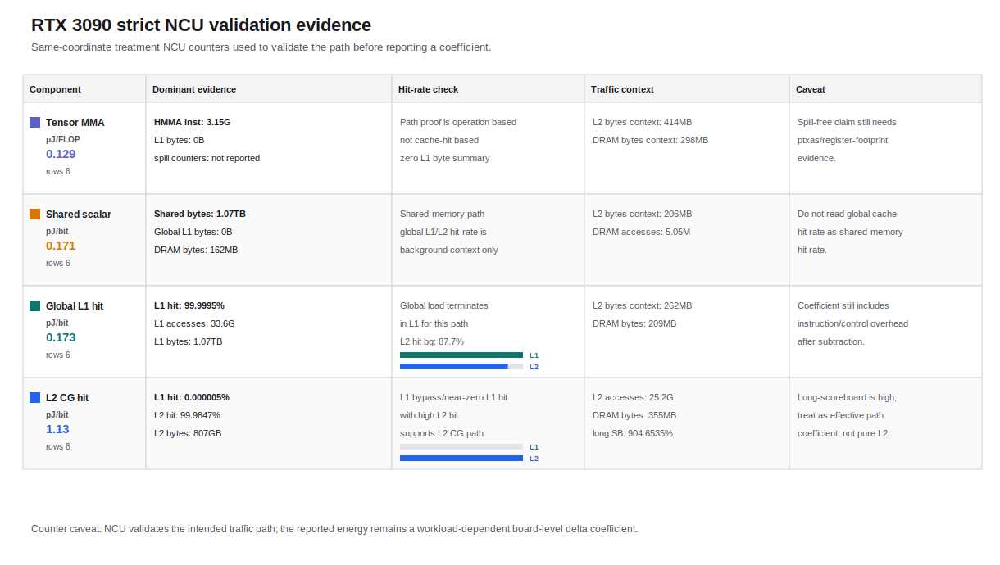

# Strict Scope + Fresh NCU Component Coefficients

이 파일은 reliability audit에서 accepted로 판정된 component medians를 보고용 summary로 묶은 것이다. 새 계수를 다시 fitting하지 않으며, power measurement matrix 기준의 GPU/device total-energy delta와 NCU path validation 증거를 함께 기록한다.

- target profile: `rtx3090`
- interpretation: effective board-level microbenchmark coefficient
- not: pure transistor/silicon-level component energy

## Coefficients

| component | median | unit | CI | rows | NCU rows | denominator | confidence | condition |
|---|---:|---|---|---:|---:|---|---|---|
| Tensor MMA incremental | 0.129215538161 | pJ/FLOP | 0.0841494881509-0.137373405224 | 6 | 8 | logical_or_expected | medium | W_SM=2048 KiB; blocks/SM=16; active_SM=82; RF=8,16; median_elapsed=21.796 s |
| Shared scalar path | 0.170589502631 | pJ/bit | 0.121988496056-0.2029828868 | 6 | 3 | ncu_actual_exact | medium | W_SM=64 KiB; blocks/SM=16; active_SM=82; LR=8; median_elapsed=34.682 s |
| Global L1 hit path | 0.17348298164 | pJ/bit | 0.153332548034-0.194437191288 | 6 | 3 | ncu_actual_exact | medium | W_SM=16 KiB; blocks/SM=16; active_SM=82; LR=4; median_elapsed=33.958 s |
| L2 CG hit path | 1.13107277508 | pJ/bit | 0.860994721155-1.35578490411 | 6 | 3 | ncu_actual_exact | medium | W_SM=64 KiB; blocks/SM=16; active_SM=82; LR=4,8; median_elapsed=33.791 s |

## Report-Ready Figures

## Report-Ready Table

이 표는 백서/발표에 바로 옮길 수 있도록 수치, 단위, 실험 pair, NCU 검증 근거, 해석 주의점을 한 줄에 묶은 것이다.

| component | report value | treatment-control pair | NCU validation evidence | interpretation caveat |
|---|---:|---|---|---|
| Tensor MMA incremental | 0.129215538161 pJ/FLOP | `reg_mma - reg_operand_only` | HMMA_inst=2099200000/3148800000/4198400000; L1_bytes=0; spill_read/write=not_reported/not_reported | Tensor validation uses HMMA instruction evidence and zero L1 bytes in the NCU summary; spill counters are not reported in this summary, so spill-free claims require ptxas/register-footprint evidence. |
| Shared scalar path | 0.170589502631 pJ/bit | `shared_scalar_load_only - clocked_empty` | shared_bytes=1.0748e+12; global_L1_bytes=0; DRAM_bytes=161722000 | Shared path validation uses shared-memory byte/access counters; global L1/L2 hit-rate fields are background context, not the shared hit rate. |
| Global L1 hit path | 0.17348298164 pJ/bit | `global_l1_load_only - clocked_empty` | L1_hit_pct=99.9995; L1_accesses=33587200000; L1_bytes=1.07479e+12; DRAM_bytes=208980000 | Cache hit/access/byte fields are path-relevant for this global-memory candidate. |
| L2 CG hit path | 1.13107277508 pJ/bit | `l2_cg_load_only - clocked_empty` | L1_hit_pct=3e-06/5e-06/7e-06; L2_hit_pct=99.9821/99.98465/99.9872; L2_accesses=16793600000/25190600000/33587600000; L2_bytes=537674000000/806527000000/1.07538e+12; DRAM_bytes=228256000/354716500/481177000 | Cache hit/access/byte fields are path-relevant for this global-memory candidate. |

## NCU Evidence Summary

각 값은 strict energy row와 같은 `mode,W_SM,blocks/SM,active_SM,reuse_factor,load_repeat,store_repeat` 좌표에서 수집한 treatment-path NCU row의 `min/median/max` 요약이다. 단일 값이면 하나만 표시한다. Shared scalar와 Tensor row의 global cache hit-rate counter는 path 판정의 주 증거가 아니라 background context이므로 `path evidence`와 함께 읽어야 한다.

### Path-Relevant Evidence

| component | path evidence | caveat |
|---|---|---|
| Tensor MMA incremental | HMMA_inst=2099200000/3148800000/4198400000; L1_bytes=0; spill_read/write=not_reported/not_reported | Tensor validation uses HMMA instruction evidence and zero L1 bytes in the NCU summary; spill counters are not reported in this summary, so spill-free claims require ptxas/register-footprint evidence. |
| Shared scalar path | shared_bytes=1.0748e+12; global_L1_bytes=0; DRAM_bytes=161722000 | Shared path validation uses shared-memory byte/access counters; global L1/L2 hit-rate fields are background context, not the shared hit rate. |
| Global L1 hit path | L1_hit_pct=99.9995; L1_accesses=33587200000; L1_bytes=1.07479e+12; DRAM_bytes=208980000 | Cache hit/access/byte fields are path-relevant for this global-memory candidate. |
| L2 CG hit path | L1_hit_pct=3e-06/5e-06/7e-06; L2_hit_pct=99.9821/99.98465/99.9872; L2_accesses=16793600000/25190600000/33587600000; L2_bytes=537674000000/806527000000/1.07538e+12; DRAM_bytes=228256000/354716500/481177000 | Cache hit/access/byte fields are path-relevant for this global-memory candidate. |

### Raw Counter Context

| component | coord rows | metric rows | metric modes | L1 hit % | L2 hit % | L1 accesses | L2 accesses | DRAM accesses | shared bytes | L1 bytes | L2 bytes | DRAM bytes | HMMA inst | long scoreboard % |
|---|---:|---:|---|---|---|---|---|---|---|---|---|---|---|---|
| Tensor MMA incremental | 4 | 2 | reg_mma | 35.7274/36.6246/37.5218 | 48.263/64.93855/81.6141 | 0 | 1298800/2110690/2922580 | 4503700/6085430/7667160 | 0 | 0 | 283158000/413706500/544255000 | 210225000/298004500/385784000 | 2099200000/3148800000/4198400000 | 0.005973/0.007161/0.008349 |
| Shared scalar path | 1 | 1 | shared_scalar_load_only | 20.9985 | 126.571 | 0 | 0 | 5053810 | 1.0748e+12 | 0 | 206008000 | 161722000 | 0 | 0.001087 |
| Global L1 hit path | 1 | 1 | global_l1_load_only | 99.9995 | 87.7015 | 33587200000 | 1039240 | 5216810 | 0 | 1.07479e+12 | 262032000 | 208980000 | 0 | 17.444 |
| L2 CG hit path | 2 | 2 | l2_cg_load_only | 3e-06/5e-06/7e-06 | 99.9821/99.98465/99.9872 | 16793600000/25190400000/33587200000 | 16793600000/25190600000/33587600000 | 7107880/10813840/14519800 | 0 | 537395000000/806092500000/1.07479e+12 | 537674000000/806527000000/1.07538e+12 | 228256000/354716500/481177000 | 0 | 866.173/904.6535/943.134 |

## NCU Coordinate Evidence

| component | exact NCU coordinates |
|---|---|
| Tensor MMA incremental | `reg_mma:W2048:B16:SM82:RF16:LR1:SR1;reg_mma:W2048:B16:SM82:RF8:LR1:SR1;reg_operand_only:W2048:B16:SM82:RF16:LR1:SR1;reg_operand_only:W2048:B16:SM82:RF8:LR1:SR1` |
| Shared scalar path | `shared_scalar_load_only:W64:B16:SM82:RF1:LR8:SR1` |
| Global L1 hit path | `global_l1_load_only:W16:B16:SM82:RF1:LR4:SR1` |
| L2 CG hit path | `l2_cg_load_only:W64:B16:SM82:RF1:LR4:SR1;l2_cg_load_only:W64:B16:SM82:RF1:LR8:SR1` |

## Evidence Artifacts

| artifact type | path |
|---|---|
| `matched_summary_artifact` | `results/summary/rtx3090_strict_scope_fresh_ncu_combined_matched_control_summary_20260708.csv` |
| `matched_detail_artifact` | `results/summary/rtx3090_strict_scope_fresh_ncu_combined_matched_control_detail_20260708.csv` |
| `power_api_audit_artifact` | `results/summary/rtx3090_strict_scope_fresh_ncu_combined_power_api_audit_20260708.csv` |
| `power_state_audit_artifact` | `results/summary/rtx3090_strict_scope_tensor_rf8_rf16_power_state_audit_20260708.csv` |
| `power_state_audit_artifact` | `results/summary/rtx3090_strict_scope_shared_lr8_focus_power_state_audit_20260708.csv` |
| `power_state_audit_artifact` | `results/summary/rtx3090_strict_scope_l1_lr4_focus_power_state_audit_20260708.csv` |
| `power_state_audit_artifact` | `results/summary/rtx3090_strict_scope_l2_lr4_lr8_focus_power_state_audit_20260708.csv` |
| `reliability_artifact` | `results/summary/rtx3090_strict_scope_fresh_ncu_component_reliability_audit_20260708.csv` |
| `ncu_acceptance_artifact` | `results/summary/rtx3090_strict_scope_fresh_ncu_combined_acceptance_20260708.csv` |
| `ncu_summary_artifact` | `results/ncu/rtx3090_strict_scope_fresh_ncu_tensor_b16_20260708/ncu_cache_validation_summary.csv` |
| `ncu_summary_artifact` | `results/ncu/rtx3090_strict_scope_fresh_ncu_20260708/ncu_cache_validation_summary.csv` |

## Reporting Note

These values are not direct silicon-level Tensor/L1/L2 circuit energy. They are workload-dependent effective coefficients from board-level energy deltas, matched-control subtraction, and NCU counter validation.
